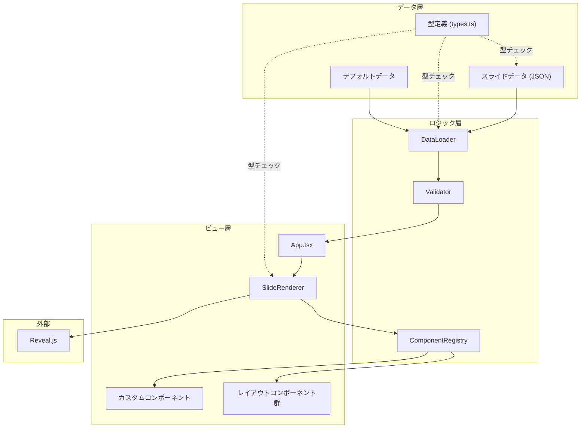

# スライドコンテンツカスタマイズ 技術設計書

**ドキュメント種別:** 技術設計書 (Design Doc)
**SDDフェーズ:** Plan (計画/設計)
**最終更新日:** 2026-07-24
**関連 Spec:** [slide-content-customization_spec.md](./slide-content-customization_spec.md)
**関連 PRD:** [slide-content-customization.md](../requirement/slide-content-customization.md)

---

# 1. 実装ステータス

**ステータス:** 🟢 実装済み

## 1.1. 実装進捗

| モジュール/機能                                     | ステータス  | 備考                                                     |
|----------------------------------------------|--------|--------------------------------------------------------|
| 型定義（types.ts）                                | 🟢 実装済み | スライドデータの型定義（`LogoConfig`, `SlideNotes`, `ValidationError` 等を含む） |
| デフォルトデータ（default-slides-ja/en.json）          | 🟢 実装済み | デモ用スライドをロケール別にJSON化。`getDefaultPresentationData(locale)` で出し分け |
| データローダー（loader.ts）                           | 🟢 実装済み | バリデーション・フォールバック（読み込み自体は main.tsx / localSlideLoader が担当） |
| ノートヘルパー（noteHelpers.ts）                      | 🟢 実装済み | `SlideMeta.notes` の正規化・スピーカーノート／サマリー／音声パス取得              |
| コンポーネントレジストリ（ComponentRegistry.tsx）          | 🟢 実装済み | カスタム／デフォルト登録・解決・owner 単位の破棄                            |
| スライドレンダラー（SlideRenderer.tsx）                 | 🟢 実装済み | データ駆動型レンダリング（`SlideRenderer.Slide` サブコンポーネント）           |
| レイアウトコンポーネント群（layouts/）                      | 🟢 実装済み | Title / Content / Section / Bleed をSlideRendererから活用   |
| テーマ適用（applyTheme.ts）                         | 🟢 実装済み | `applyTheme` / `applyThemeData` / `applyBaseFontSize` / `loadFontSources` / `resetThemeOverrides` |
| App.tsx / main.tsx 統合                        | 🟢 実装済み | データ駆動型への移行完了（ホーム画面・ローカル選択と連携）                          |

---

# 2. 設計目標

1. **後方互換性の完全な維持**: デフォルトデータ使用時に既存のプレゼンテーションと見た目・動作が完全に同一であること（NFR-003,
   B-001, B-002）
2. **データとビューの分離**: スライドコンテンツをJSON構造化データとして分離し、コード変更なしでコンテンツを差し替え可能にする
3. **型安全性**: すべてのスライドデータ構造をTypeScriptの型システムで表現し、コンパイル時に型チェックを行う（T-001）
4. **Reveal.js互換性**: データ駆動で生成されたDOMが `.reveal > .slides > section` 構造を維持する（T-002）
5. **段階的導入**: 既存のスライドコンポーネントを維持しつつ、データ駆動型への移行を段階的に行える設計

---

# 3. 技術スタック

| 領域        | 採用技術                       | 選定理由                                           |
|-----------|----------------------------|------------------------------------------------|
| UI        | React 18 + TypeScript      | 既存プロジェクトの技術スタック。コンポーネント指向でレイアウト種別の拡張が容易（T-001） |
| プレゼンテーション | Reveal.js                  | 既存プロジェクトで使用。DOM構造の互換性を維持する必要あり（T-002）          |
| データフォーマット | JSON                       | PRDで指定。ViteのJSON importとHMRに対応。非技術者にも編集しやすい    |
| バリデーション   | TypeScript型ガード + ランタイムチェック | 外部ライブラリ不要。型安全性とランタイム検証を両立                      |
| ビルドツール    | Vite                       | 既存プロジェクトで使用。JSON importとHMRをネイティブサポート          |
| スタイリング    | グローバルCSS（`global.css`）+ CSS変数 + CSS Modules + MUI `sx` | テーマ切り替えにCSS変数を使用。3層モデル（グローバルCSS / CSS Modules / MUI `sx`）を維持（A-002） |

---

# 4. アーキテクチャ

## 4.1. システム構成図


```mermaid
graph TD
    subgraph "データ層"
        JSON["スライドデータ (JSON)"]
        DefaultData["デフォルトデータ"]
        Types["型定義 (types.ts)"]
    end

    subgraph "ロジック層"
        Loader["DataLoader"]
        Validator["Validator"]
        Registry["ComponentRegistry"]
    end

    subgraph "ビュー層"
        App["App.tsx"]
        Renderer["SlideRenderer"]
        Layouts["レイアウトコンポーネント群"]
        CustomComponents["カスタムコンポーネント"]
    end

    subgraph "外部"
        RevealJS["Reveal.js"]
    end

    JSON --> Loader
    DefaultData --> Loader
    Loader --> Validator
    Validator --> App
    App --> Renderer
    Renderer --> Registry
    Registry --> Layouts
    Registry --> CustomComponents
    Renderer --> RevealJS
    Types -.->|型チェック| JSON
    Types -.->|型チェック| Loader
    Types -.->|型チェック| Renderer
```

## 4.2. モジュール分割

| モジュール名            | 責務                                       | 依存関係                                        | 配置場所                                   |
|-------------------|------------------------------------------|---------------------------------------------|----------------------------------------|
| types             | スライドデータの型定義                              | なし                                          | `src/data/types.ts`                    |
| default-slides    | ロケール別デモ用スライドのデフォルトデータ                    | types                                       | `src/data/default-slides-ja.json` / `default-slides-en.json` |
| loader            | バリデーション、フォールバック、ロケール別デフォルト取得             | types, default-slides                       | `src/data/loader.ts`                   |
| noteHelpers       | `SlideMeta.notes` の正規化・派生値取得             | types                                       | `src/data/noteHelpers.ts`              |
| ComponentRegistry | コンポーネントの登録・解決・上書き・owner 単位の破棄            | React                                       | `src/components/ComponentRegistry.tsx` |
| SlideRenderer     | スライドデータからコンポーネントへの変換（レイアウト種別で分岐）         | types, ComponentRegistry, layouts, 共通コンポーネント | `src/components/SlideRenderer.tsx`     |
| レイアウトコンポーネント群     | 各レイアウトのラッパー（Title/Content/Section/Bleed） | types, React                                | `src/layouts/*.tsx`                    |
| applyTheme        | テーマ（色・フォント・カスタムCSS）のCSS変数適用とリセット          | types                                       | `src/applyTheme.ts`                    |
| App               | プレゼンテーション画面。バリデーション済みデータでReveal.js統合      | loader, noteHelpers, SlideRenderer, Reveal.js | `src/App.tsx`                          |
| main              | エントリーポイント。JSON読込（fetch/ローカル選択）・テーマ適用・画面遷移 | App, addonLoader, applyTheme, localSlideLoader | `src/main.tsx`                         |

## 4.3. ディレクトリ構造

```
src/
├── main.tsx                    # エントリーポイント（JSON読込・テーマ適用・ホーム/プレゼン切替）
├── App.tsx                     # プレゼンテーション画面（データ駆動型）
├── applyTheme.ts               # テーマCSS変数の適用・フォントロード・リセット
├── data/
│   ├── types.ts                # スライドデータの型定義
│   ├── default-slides-ja.json  # デフォルトスライドデータ（日本語）
│   ├── default-slides-en.json  # デフォルトスライドデータ（英語）
│   ├── loader.ts               # バリデーション・フォールバック・ロケール別デフォルト取得
│   ├── noteHelpers.ts          # notes 正規化・派生値取得
│   └── index.ts                # re-export
├── components/
│   ├── ComponentRegistry.tsx   # コンポーネント登録・解決・owner 破棄
│   ├── SlideRenderer.tsx       # スライドレンダラー（レイアウト種別で分岐）
│   ├── registerDefaults.tsx    # デフォルトコンポーネント（TerminalAnimation, Icon:* 等）の登録
│   └── ...                     # 既存の共通コンポーネント（SlideHeading, Timeline 等）
├── layouts/
│   ├── TitleLayout.tsx         # タイトルスライド用レイアウト
│   ├── ContentLayout.tsx       # 本文スライド用レイアウト
│   ├── SectionLayout.tsx       # セクション（まとめ等）用レイアウト
│   ├── BleedLayout.tsx         # 全幅2カラム（ブリード）レイアウト
│   └── index.ts                # re-export
└── styles/
    └── global.css              # テーマCSS変数・レイアウト・Reveal.jsオーバーライド
```

> レイアウトは4つのラッパー（Title/Content/Section/Bleed）で構成し、`two-column` / `custom` は `SlideRenderer` 内の描画分岐で処理する（専用の `TwoColumnLayout` / `CustomLayout` ファイルは存在しない）。既存スライドは完全にデータ駆動化されており、`src/slides/` ディレクトリは存在しない。

---

# 5. データモデル

## 5.1. JSONデータ構造

```json
{
  "meta": {
    "title": "AI-SDD ワークフロー デモ",
    "description": "AI駆動仕様駆動開発のプレゼンテーション",
    "author": "Demo Author",
    "logo": {
      "src": "/logo.png",
      "width": 120,
      "height": 40
    }
  },
  "theme": {
    "colors": {
      "primary": "#667eea",
      "accent": "#764ba2",
      "background": "#0a0a2e",
      "text": "#ffffff"
    },
    "fonts": {
      "heading": "'Noto Sans JP', sans-serif",
      "body": "'Noto Sans JP', sans-serif",
      "code": "'Source Code Pro', monospace",
      "baseFontSize": 24,
      "sources": [
        { "family": "MyFont", "src": "/fonts/MyFont.woff2" },
        { "family": "Fira Code", "url": "https://fonts.googleapis.com/css2?family=Fira+Code:wght@400;700&display=swap" }
      ]
    }
  },
  "slides": [
    {
      "id": "title",
      "layout": "center",
      "content": {
        "title": "AI-SDD",
        "subtitle": "AI駆動 仕様駆動開発"
      },
      "meta": {
        "transition": "fade",
        "notes": {
          "speakerNotes": "冒頭のあいさつ",
          "summary": ["デモの概要"],
          "voice": "voice/title.mp3"
        }
      }
    }
  ]
}
```

## 5.2. レイアウト種別マッピング

構造ベースの命名によるレイアウト種別：

| レイアウト名       | ラッパー                           | 用途                                                      |
|--------------|--------------------------------|---------------------------------------------------------|
| `center`     | TitleLayout / SectionLayout    | タイトル・まとめ。`variant: "section"` で SectionLayout を選択       |
| `content`    | ContentLayout                  | 子要素で描画を判別: `steps` → Timeline, `tiles` → FeatureTileGrid, `component` → カスタム |
| `two-column` | ContentLayout + TwoColumnGrid  | 左右2カラム。`left`/`right` で各カラムの内容を定義                        |
| `bleed`      | BleedLayout                    | 2カラム全幅（端まで広がるレイアウト）                                     |
| `custom`     | なし                             | カスタムコンポーネント参照用                                          |

---

# 6. インターフェース定義

## 6.1. DataLoader インターフェース

```typescript
/**
 * 読み込み済みのスライドデータを検証し、バリデーション失敗または未指定時は
 * defaultData にフォールバックする。
 * JSONファイルの読み込み自体（fetch / ローカルファイル読込）は main.tsx /
 * localSlideLoader の責務であり、本関数は文字列パスを受け取らない。
 * バリデーションエラーは console.error / console.warn に出力する。
 */
function loadPresentationData(
    source: PresentationData | undefined,
    defaultData: PresentationData
): PresentationData {
}

/**
 * ロケールに応じたデフォルトプレゼンテーションデータを返す
 * （ja で始まるロケールは日本語、それ以外は英語）。
 */
function getDefaultPresentationData(locale: string): PresentationData {
}

/**
 * スライドデータのバリデーション。
 * 型ガードとして動作し、不正なデータを検出する。
 */
function validatePresentationData(
    data: unknown
): data is PresentationData {
}

/**
 * バリデーションエラーの詳細を取得する。
 */
function getValidationErrors(
    data: unknown
): ValidationError[] {
}

interface ValidationError {
    path: string;       // エラー箇所のJSONパス（例: "slides[0].content"）
    message: string;    // エラーメッセージ
    expected: string;   // 期待される型・値
    actual: string;     // 実際の型・値
}
```

## 6.2. ComponentRegistry インターフェース

`ComponentRegistry.tsx` はクラスではなく、モジュールスコープの `Map` を共有するシングルトンな関数群として実装されている（`ComponentRegistry` という named export は存在しない）。

```typescript
/** レジストリに登録可能なコンポーネントの型 */
type RegisteredComponent = React.ComponentType<Record<string, unknown>>;

/**
 * デフォルトコンポーネントを登録する（registerDefaults.tsx から使用）。
 */
function registerDefaultComponent(
    name: string,
    component: RegisteredComponent
): void {
}

/**
 * カスタムコンポーネントを名前付きで登録する（デフォルトを上書き）。
 * owner を指定するとそのスコープで登録され、unregisterOwner でまとめて破棄できる。
 * 同名で異なる owner による上書き時は console.warn で警告する。
 */
function registerComponent(
    name: string,
    component: RegisteredComponent,
    owner?: string
): void {
}

/**
 * 名前からコンポーネントを解決する。
 * カスタム → デフォルト → FallbackComponent の優先順で解決し、常に有効な
 * コンポーネントを返す（null は返さない）。
 */
function resolveComponent(
    name: string
): RegisteredComponent {
}

/**
 * 登録済みの全コンポーネント名（デフォルト＋カスタム）をソートして取得する。
 */
function getRegisteredComponents(): string[] {
}

/**
 * 指定した owner に属するカスタム登録のみを削除する（デフォルト登録は温存）。
 */
function unregisterOwner(owner: string): void {
}

/**
 * レジストリ全体をクリアする（主にテスト用）。
 */
function clearRegistry(): void {
}
```

## 6.3. SlideRenderer インターフェース

`SlideRenderer` は `slides` のみを props に取る。コンポーネント解決は `ComponentRegistry` のモジュールシングルトン（`resolveComponent`）を直接参照するため、`registry` prop は持たない。個別スライドは `SlideRenderer.Slide` サブコンポーネントとして描画する。

```typescript
interface SlideRendererProps {
    slides: SlideData[];
}

/**
 * スライドデータ配列を受け取り、Reveal.js互換の<section>要素群をレンダリングする。
 * layout 種別（center / content / two-column / bleed / custom）で描画関数を分岐する。
 */
function SlideRenderer(props: SlideRendererProps): JSX.Element {
}

/** 個別スライドコンポーネント（SlideRenderer の静的プロパティ） */
SlideRenderer.Slide = function SlideRendererSlide(
    props: { slide: SlideData }
): JSX.Element {
}
```

## 6.4. テーマ適用インターフェース（applyTheme.ts）

CSS変数を `document.documentElement.style` に設定してテーマを適用する。プレゼンテーション切替時は `resetThemeOverrides` で前回の上書きを解除してから適用する。

```typescript
/** theme-colors.json 相当の色JSONを取得し CSS 変数に適用する（path 未指定時は /theme-colors.json） */
function applyTheme(path?: string): Promise<void> {
}

/** ThemeData（colors / fonts / customCSS）から CSS 変数・@font-face・<link>・<style> を適用する */
function applyThemeData(themeData: ThemeData): void {
}

/** baseFontSize を基準に各フォントサイズ CSS 変数を比率で設定する */
function applyBaseFontSize(root: HTMLElement, baseFontSize: number): void {
}

/** ローカルフォント（@font-face）・外部フォント（<link>）を重複防止しつつ動的ロードする */
function loadFontSources(sources: FontSource[]): void {
}

/** 直前に適用したテーマ上書き（CSS変数・カスタムCSS・フォント）をすべて解除する */
function resetThemeOverrides(): void {
}
```

## 6.5. ノートヘルパーインターフェース（noteHelpers.ts）

`SlideMeta.notes`（`string | SlideNotes`）を正規化し、発表者ビュー等で使う派生値を取得する。

```typescript
/** notes を正規化された SlideNotes に変換する（文字列は speakerNotes に格納） */
function normalizeNotes(notes: string | SlideNotes | undefined): SlideNotes {
}

/** スライドからスピーカーノートを取得する */
function getSpeakerNotes(slide: SlideData): string | undefined {
}

/** スライドから要点サマリー配列を取得する */
function getSlideSummary(slide: SlideData): string[] {
}

/** スライドから音声ファイルの相対パスを取得する */
function getVoicePath(slide: SlideData): string | undefined {
}
```

## 6.6. ローカルスライド読み込み（別機能）

ローカルファイル選択・`.tgz` パッケージ展開・asset プロトコル解決（`localSlideLoader.ts`、Rust コマンド `allow_asset_dir` / `extract_slide_package`、`@tauri-apps/plugin-dialog` / `plugin-fs` / `plugin-store`）は本機能のスコープ外であり、[package-embedded-addon_design.md](./package-embedded-addon_design.md) 側で定義する。本機能はこれらが返した `PresentationData` を受け取ってレンダリングする関係にある。

---

# 7. 非機能要件実現方針

| 要件                      | 実現方針                                                                                    |
|-------------------------|-----------------------------------------------------------------------------------------|
| NFR-001: HMR即時反映        | ViteのJSON importを使用。JSONファイル変更時にHMRが自動的にモジュールを更新する                                      |
| NFR-002: IntelliSense対応 | TypeScript型定義（`src/data/types.ts`）をエクスポート済み。JSON Schema（`$schema`）による VSCode 補完は**未実装**（§9.2 参照）。現状は型定義を参照して手動編集する |
| NFR-003: 後方互換性          | デフォルトデータとして既存スライドの内容を忠実にJSON化。レイアウトコンポーネントで既存コンポーネントの見た目を再現                             |
| NFR-004: Reveal.js互換    | SlideRendererが各SlideDataに対して `<section>` 要素を生成。data属性（transition等）もmeta情報から設定           |
| NFR-005: 型安全性           | `PresentationData` 型を中心とした型定義。ランタイムバリデーションで型ガードを実装                                      |

---

# 8. テスト戦略

| テストレベル   | 対象                           | カバレッジ目標                   |
|----------|------------------------------|---------------------------|
| 型チェック    | 全TypeScriptファイル              | ビルドエラーゼロ                  |
| ユニットテスト  | loader.ts（バリデーション、フォールバック）   | 主要パス100%                  |
| ユニットテスト  | ComponentRegistry（登録、解決、上書き） | 主要パス100%                  |
| 統合テスト    | SlideRenderer + レイアウト        | デフォルトデータで10枚全スライド正常レンダリング |
| ビジュアルテスト | デフォルトデータでのプレゼン表示             | 既存プレゼンとの差異ゼロ（NFR-003）     |

**テスト環境の注意点:**
- jsdom環境にはIntersectionObserverが存在しないため、`test-setup.ts`でグローバルモックを設定。TerminalAnimationコンポーネントを含むSlideRendererテストで必要

---

# 9. 設計判断

## 9.1. 決定事項

| 決定事項        | 選択肢                              | 決定内容                       | 理由                                               |
|-------------|----------------------------------|----------------------------|--------------------------------------------------|
| データフォーマット   | JSON / YAML / TypeScript Object  | JSON                       | PRDで指定。ViteのHMR対応。非技術者が編集可能。スコープ外にYAML/TOML対応を明記 |
| バリデーション手法   | 外部ライブラリ（zod/ajv）/ TypeScript型ガード | TypeScript型ガード + ランタイムチェック | 外部依存を最小化。プレゼンアプリとしてはランタイム型ガードで十分                 |
| コンポーネント解決方式 | 文字列ベースレジストリ / React.lazy動的import | 文字列ベースレジストリ                | シンプルで理解しやすい。プレゼンアプリの規模では動的importは過剰              |
| テーマ適用方式     | CSS変数 / CSS-in-JS / インラインスタイル    | CSS変数                      | Reveal.jsとの親和性が高い。`global.css` の CSS 変数を `applyTheme` / `applyThemeData` が上書きして対応（A-002準拠）  |
| デフォルトデータ形式  | JSON静的ファイル / TypeScriptオブジェクト    | JSON静的ファイル                 | データとコードの分離原則に合致。実際の利用イメージと一致する                   |
| 既存スライドの移行   | 一括移行 / 段階的移行                     | 完全データ駆動化（一括移行） | ユーザー選択。全10枚のスライドをJSON化し、SlideRendererで統一レンダリング |
| レイアウト実装方式 | 個別レイアウトファイル / SlideRenderer集約 | SlideRenderer集約 | 既存の4レイアウト（Title/Content/Bleed/Section）をSlideRenderer内で活用。レイアウト種別ごとのレンダリングロジックをSlideRenderer.tsxに集約 |
| アイコン解決方式 | コンポーネント直接指定 / 名前ベースレジストリ | 名前ベースレジストリ（Icon:プレフィックス） | JSONから文字列でアイコンを指定可能にするため。registerDefaultsでMUIアイコンを名前登録 |
| TerminalAnimation注入方式 | props直接指定 / ラッパーコンポーネント | ラッパーコンポーネント（registerDefaults.tsx） | TerminalAnimationはlogText propsが必須だが、デフォルトデータからはコンポーネント参照のみでpropsを渡さないため、`?raw`インポートしたlogTextを事前注入するラッパーが必要 |
| HTMLコンテンツ処理方式 | Markdownパーサー / dangerouslySetInnerHTML / カスタムパーサー | dangerouslySetInnerHTML | 既存スライドで使用されている`<strong>`, `<code>`, `<br>`タグをJSON文字列から復元するため。コンテンツはすべてアプリ内部のJSON定義であり外部入力ではないためXSSリスクなし |
| フォントサイズ制御方式 | 固定px値 / CSS変数 + 比率ベース / rem単位 | CSS変数 + 比率ベース（`baseFontSize`） | `baseFontSize` を基準に全サイズを比率で算出し CSS 変数に設定。MUI typography と global.css の両方で CSS 変数を参照することで一元管理。固定px値と同等のデフォルト値を `:root` に設定し後方互換性を維持 |
| フォントソースロード方式 | ビルド時バンドル / ランタイム動的ロード | ランタイム動的ロード（`@font-face` / `<link>` 挿入） | ローカルフォントは `@font-face` スタイル要素を動的追加、外部フォント（Google Fonts等）は `<link>` タグを動的挿入。重複ロード防止機構あり。ビルド時バンドルは設定ファイルだけでフォントを差し替えたいユースケースに不向き |

## 9.2. 未解決の課題

| 課題                                   | 影響度 | 対応方針                                                                | 状況 |
|--------------------------------------|-----|---------------------------------------------------------------------|------|
| 既存デモ用スライドの忠実なJSON化                   | 高   | 各スライドコンポーネントの内容を分析し、レイアウト種別を特定した上でJSON化する                           | ✅ 解決済み。`default-slides-ja.json` / `default-slides-en.json` にJSON化 |
| 複雑なスライド（アニメーション付き）のデータ表現             | 中   | TerminalAnimation等の複雑なコンポーネントはカスタムコンポーネントとして登録し、componentフィールドで参照する | ✅ 解決済み。registerDefaults.tsxでデフォルト登録 |
| SlideMeta対応                          | 低   | Reveal.jsのdata-transition等の属性をsection要素に設定する                         | ✅ 解決済み。全レイアウトが `data-transition` / `data-background-image` / `data-background-color` を設定 |
| JSONスキーマ（NFR-002）による入力補完             | 低   | TypeScript型定義からのJSON Schema（`$schema`）自動生成でVSCode補完を有効化する            | ❌ 未実装（将来課題）。現状は型定義を手動参照して編集 |
| データ検証エラーの画面表示（FR-014 / FR_502）      | 低   | 現状はエラー箇所（JSONパス・期待型・実際の型）を `console.error` に出力し、デフォルトデータへフォールバックするのみ。UI表示や具体的な修正手順の提示は未実装 | 🟡 部分実装。開発コンソール出力のみ |
| 目視確認による後方互換性検証                       | 高   | デフォルトデータでの表示が変更前と一致することを目視／スクリーンショットで確認する                            | 要確認。`npm run dev` / `npm run generate-screenshots` での確認を継続 |

---

# 10. 変更履歴

新しいバージョンを上に記載する（降順）。

## v0.6.0 (2026-07-24)

**変更内容:**

- 実装との整合を取るためドキュメントを更新（実装を真実の源として反映）
- `loadPresentationData` のシグネチャを `(source, defaultData)` に修正。JSON読み込み責務が `main.tsx` / `localSlideLoader` へ移設された実態を反映
- `getDefaultPresentationData(locale)` とロケール別デフォルト（`default-slides-ja/en.json`）を反映
- `ComponentRegistry` のAPI（`RegisteredComponent` 型、owner 引数、`registerDefaultComponent` / `unregisterOwner` / `clearRegistry`、null を返さない解決）を実装に合わせて修正
- `SlideRendererProps` から未実装の `registry?` を削除し、`SlideRenderer.Slide` を記載
- ディレクトリ構造を実態に修正（`TwoColumnLayout` / `CustomLayout` / `src/slides/` の削除、`SectionLayout` / `BleedLayout` の追記、`style.css` → `global.css`）
- `applyTheme` 群・`noteHelpers` 群のインターフェースを追記。ローカル読込（別機能）へのリンク参照を追加
- NFR-002（JSON Schema/`$schema`）未実装、FR-014 部分実装を未解決の課題に正確化。SlideMeta対応を解決済みに更新

## v0.5.0 (2026-01-31)

**変更内容:**

- `FontDefinition` に `baseFontSize?: number` と `sources?: FontSource[]` を追加
- `FontSource` インターフェース（`family`, `src?`, `url?`）を追加
- フォントサイズ制御方式の設計判断を追加（CSS変数 + 比率ベース）
- フォントソースロード方式の設計判断を追加（ランタイム動的ロード）
- JSONデータ構造例に `baseFontSize` と `sources` を追記

## v0.4.0 (2026-01-31)

**変更内容:**

- `PresentationMeta` に `logo?: LogoConfig` フィールドを追加
- `LogoConfig` 型（`src`, `width?`, `height?`）を追加
- JSONデータ構造例に `meta.logo` を追記
- `meta.logo` 未指定時はロゴ非表示とする仕様

## v0.3.0 (2026-01-30)

**変更内容:**

- 設計判断に2項目追加: TerminalAnimation注入方式、HTMLコンテンツ処理方式
- テスト戦略にIntersectionObserverモックの注意点を追記
- task/DEM-001/ の実装ログから設計判断を統合し、タスクログを削除

## v0.2.0 (2026-01-30)

**変更内容:**

- 実装ステータスを🟢実装済みに更新
- 設計判断に3項目追加: レイアウト実装方式、アイコン解決方式、既存スライド移行を完全データ駆動化に変更
- 未解決の課題を更新: JSON化・カスタムコンポーネント登録は解決済み、SlideMeta対応・目視確認を追加

## v0.1.0 (2026-01-30)

**変更内容:**

- 初版作成。スライドコンテンツカスタマイズ機能の技術設計を定義
