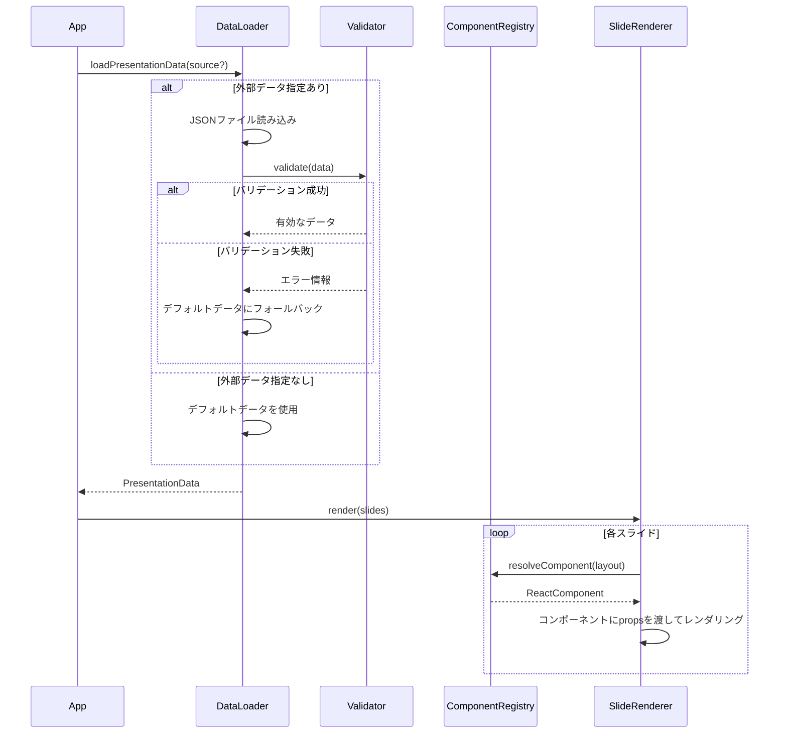
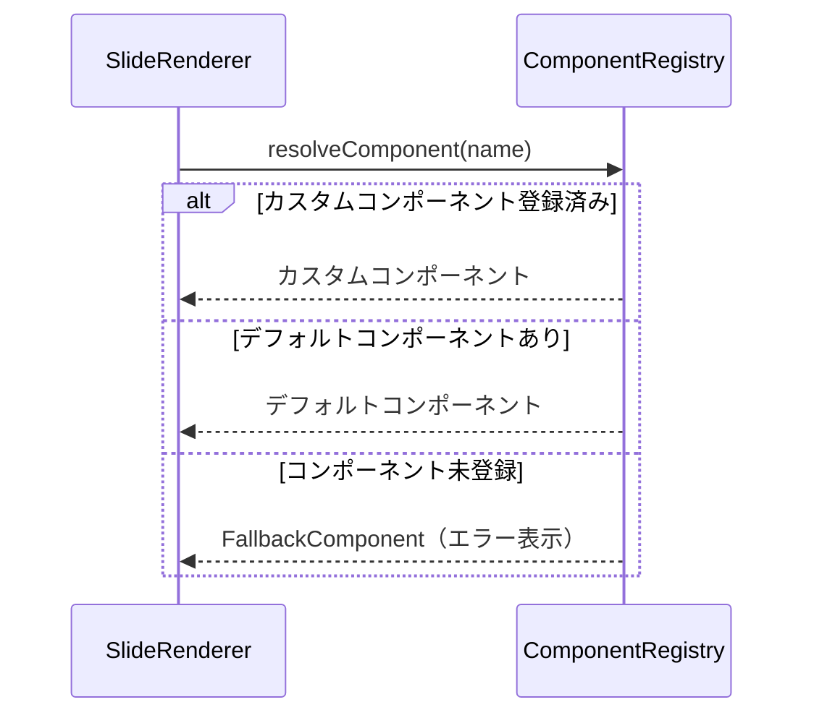

# スライドコンテンツカスタマイズ

**ドキュメント種別:** 抽象仕様書 (Spec)
**SDDフェーズ:** Specify (仕様化)
**最終更新日:** 2026-01-30
**関連 Design Doc:** [slide-content-customization_design.md](./slide-content-customization_design.md)
**関連 PRD:** [slide-content-customization.md](../requirement/slide-content-customization.md)

---

# 1. 背景

現在のプレゼンテーションでは、スライドの内容（テキスト、構成、レイアウト）がReactコンポーネント内にハードコードされている。スライド内容を変更するにはソースコードを直接編集する必要があり、以下の課題がある：

- 開発者以外がプレゼンテーション資料を更新することが困難
- 同じプレゼンテーション構造を異なるテーマや内容で再利用する仕組みが存在しない
- コンテンツ変更のたびにReactコンポーネントのコードを修正する必要がある

# 2. 概要

本機能は、プレゼンテーションの内容をソースコードから分離し、データ駆動で管理できる仕組みを提供する。

**主要な設計原則：**

- **データとビューの分離**: スライドの内容をJSON形式の構造化データとして管理し、レンダリングロジックから分離する
- **拡張可能性**: カスタムReactコンポーネントやレイアウトをプラグイン的に登録し、データから参照できる
- **後方互換性**: 既存の10枚のデモ用スライドをデフォルトテンプレートとして保持し、データ未指定時にそのまま表示する
- **型安全性**: スライドデータの型定義をTypeScriptの型システムで表現し、型安全にデータを扱う

# 3. 要求定義

## 3.1. 機能要件 (Functional Requirements)

| ID     | 要件                                                        | 優先度 | 根拠                     | PRD参照  |
|--------|-----------------------------------------------------------|-----|------------------------|--------|
| FR-001 | JSONフォーマットの構造化データによりスライドのテキスト、構成、メタ情報を定義し、プレゼンテーションに反映できる | 必須  | データ駆動型管理の基盤            | FR_100 |
| FR-002 | スライドの枚数、順序、各スライドに使用するレイアウト種別をJSONで定義できる                   | 必須  | スライド構成の柔軟な変更を可能にする     | FR_101 |
| FR-003 | 各スライドのタイトル、本文、リスト項目、強調テキスト等のテキストコンテンツをJSONで定義できる          | 必須  | 非技術者によるコンテンツ編集を可能にする   | FR_102 |
| FR-004 | 各スライドのアニメーション設定、フラグメント表示順序、スピーカーノート等のメタ情報をJSONで定義できる      | 推奨  | プレゼンテーションの表現力を維持する     | FR_103 |
| FR-005 | 指定されたJSONデータファイルを読み込み、スライドコンテンツとして動的にレンダリングできる            | 必須  | データ駆動型レンダリングの中核機能      | FR_104 |
| FR-006 | カラーパレット、フォント、レイアウトを含むテーマを外部定義し、視覚的デザインを切り替えられる            | 推奨  | プレゼンテーションの再利用性を向上する    | FR_200 |
| FR-007 | 各スライドに適用するレイアウト種別をデータから指定でき、新しいレイアウトを追加登録できる              | 推奨  | レイアウトの柔軟性を提供する         | FR_203 |
| FR-008 | 開発者がカスタムReactコンポーネントを名前付きで登録し、スライドデータから参照して使用できる          | 推奨  | コンポーネントの拡張性を提供する       | FR_301 |
| FR-009 | デフォルトで提供されるスライドコンポーネントをカスタムコンポーネントで上書きできる                 | 任意  | 既存コンポーネントのカスタマイズを可能にする | FR_302 |
| FR-010 | スライドデータからカスタムコンポーネントにpropsを渡せる                            | 推奨  | コンポーネントへのデータ受け渡しを可能にする | FR_303 |
| FR-011 | 現在のスライド内容をJSON形式のデフォルトデータとして提供する                          | 必須  | 後方互換性の確保               | FR_401 |
| FR-012 | 外部データファイルが未指定または読み込み失敗時にデフォルトデータにフォールバックして表示する            | 必須  | 安定的な表示を保証する            | FR_402 |
| FR-013 | JSONスキーマに基づいてスライドデータの構造を検証する                              | 推奨  | データ品質を保証する             | FR_501 |
| FR-014 | データ検証エラー時にエラー箇所と修正方法を含むメッセージを表示する                         | 推奨  | 編集者の利便性を向上する           | FR_502 |

## 3.2. 非機能要件 (Non-Functional Requirements)

| ID      | カテゴリ    | 要件                                             | 目標値                                 | PRD参照   |
|---------|---------|------------------------------------------------|-------------------------------------|---------|
| NFR-001 | パフォーマンス | JSONデータからのスライド生成が開発サーバー起動時に完了し、HMRによる即時反映が行われる | データ変更後1秒以内の反映                       | NFR_100 |
| NFR-002 | 開発体験    | スライドデータフォーマットがJSONスキーマで文書化され、エディタの入力補完が利用可能    | VSCodeでIntelliSense対応               | NFR_101 |
| NFR-003 | 互換性     | デフォルトデータ使用時に既存プレゼンテーションと見た目・動作が完全に同一           | 視覚的差異ゼロ                             | NFR_102 |
| NFR-004 | 互換性     | データ駆動で生成されたスライドがReveal.jsのDOM構造を維持する           | `.reveal > .slides > section` 構造の維持 | NFR_103 |
| NFR-005 | 型安全性    | スライドデータの型定義がTypeScriptの型システムで表現される             | ビルド時型チェック通過                         | NFR_104 |

# 4. API

## 4.1. 公開API一覧

| ディレクトリ          | ファイル名                 | エクスポート                                       | 概要                            |
|-----------------|-----------------------|----------------------------------------------|-------------------------------|
| src/data/       | types.ts              | `SlideData`, `PresentationData`, `ThemeData`, `LogoConfig`, `FontSource` | スライドデータの型定義                   |
| src/data/       | default-slides.json   | (デフォルトエクスポート)                                | デフォルトのスライドデータ                 |
| src/data/       | loader.ts             | `loadPresentationData`                       | スライドデータの読み込みとバリデーション          |
| src/components/ | SlideRenderer.tsx     | `SlideRenderer`                              | スライドデータからReactコンポーネントへのレンダリング |
| src/components/ | ComponentRegistry.tsx | `ComponentRegistry`, `registerComponent`     | カスタムコンポーネントの登録・解決             |

## 4.2. 型定義

```typescript
/** プレゼンテーション全体のデータ */
interface PresentationData {
    meta: PresentationMeta;
    theme?: ThemeData;
    slides: SlideData[];
}

/** プレゼンテーションのメタ情報 */
interface PresentationMeta {
    title: string;
    description?: string;
    author?: string;
    logo?: LogoConfig;
}

/** ロゴ設定 */
interface LogoConfig {
    src: string;
    width?: number;   // デフォルト: 120
    height?: number;  // デフォルト: 40
}

/** 個別スライドのデータ */
interface SlideData {
    id: string;
    layout: string;
    content: SlideContent;
    meta?: SlideMeta;
}

/** スライドのコンテンツ */
interface SlideContent {
    title?: string;
    subtitle?: string;
    body?: string;
    items?: ContentItem[];
    component?: ComponentReference;

    [key: string]: unknown;
}

/** リスト等のコンテンツ項目 */
interface ContentItem {
    text: string;
    emphasis?: boolean;
    fragment?: boolean;
    fragmentIndex?: number;
    items?: ContentItem[];
}

/** カスタムコンポーネントへの参照 */
interface ComponentReference {
    name: string;
    props?: Record<string, unknown>;
}

/** スライドのメタ情報 */
interface SlideMeta {
    transition?: string;
    notes?: string;
    backgroundImage?: string;
    backgroundColor?: string;
}

/** テーマデータ */
interface ThemeData {
    colors?: ColorPalette;
    fonts?: FontDefinition;
    customCSS?: string;
}

/** カラーパレット */
interface ColorPalette {
    primary?: string;
    accent?: string;
    background?: string;
    text?: string;

    [key: string]: string | undefined;
}

/** フォントソース定義 */
interface FontSource {
    family: string;
    /** ローカルフォントファイルパス（@font-face で登録） */
    src?: string;
    /** 外部フォント URL（<link> タグで読み込み） */
    url?: string;
}

/** フォント定義 */
interface FontDefinition {
    heading?: string;
    body?: string;
    code?: string;
    /** 基本フォントサイズ（px）。デフォルト 20px。全サイズをこの値を基準に比率で算出 */
    baseFontSize?: number;
    /** フォントソースの配列 */
    sources?: FontSource[];
}
```

# 5. 用語集

| 用語           | 説明                                         |
|--------------|--------------------------------------------|
| スライドデータ      | プレゼンテーションの内容を定義するJSON形式の構造化データ             |
| レイアウト種別      | スライドの表示形式（title、two-column、tile、timeline等） |
| テーマ          | カラーパレット、フォント定義を含む視覚的スタイルの定義                |
| カスタムコンポーネント  | 開発者が作成し、スライドデータから名前で参照可能なReactコンポーネント      |
| フォールバック      | 外部データが利用不可時にデフォルトデータに切り替わる動作               |
| デフォルトテンプレート  | 現在の10枚のデモ用スライドを再現するデフォルトのスライドデータ           |
| コンポーネントレジストリ | カスタムコンポーネントを名前付きで登録・管理する仕組み                |
| フラグメント       | スライド内のコンテンツ要素を段階的に表示するReveal.jsの機能         |

# 6. 使用例

## 6.1. デフォルトデータでの表示（データ未指定時）

```tsx
import {App} from './App';

// データ未指定時はデフォルトのデモ用スライドが表示される
function Main() {
    return <App/>;
}
```

## 6.2. カスタムスライドデータでの表示

```tsx
import {App} from './App';
import customSlides from './custom-slides.json';

function Main() {
    return <App presentationData={customSlides}/>;
}
```

## 6.3. カスタムコンポーネントの登録と使用

```tsx
import {registerComponent} from './components/ComponentRegistry';

// カスタムコンポーネントを登録
registerComponent('MyChart', MyChartComponent);

// JSONデータからの参照
// { "layout": "custom", "content": { "component": { "name": "MyChart", "props": { "data": [...] } } } }
```

# 7. 振る舞い図

## 7.1. スライドデータ読み込みフロー



## 7.2. コンポーネント解決フロー



# 8. 制約事項

- React + TypeScript + Viteの技術スタックを維持すること（T-001準拠）
- Reveal.jsのDOM構造（`.reveal > .slides > section`）を維持すること（T-002準拠）
- 各スライドは独立したコンポーネントとして動作すること（A-001準拠）
- CSSスタイルは `src/styles/style.css` への集約を基本とすること（A-002準拠）
- デフォルトデータ使用時に既存プレゼンテーションの見た目・動作を一切変更しないこと（B-001, B-002準拠）

---

## PRD参照

- 対応PRD: [slide-content-customization.md](../requirement/slide-content-customization.md)
- カバーする要求: UR_100, FR_100, FR_101, FR_102, FR_103, FR_104, FR_200, FR_201, FR_202, FR_203, FR_204, FR_300,
  FR_301, FR_302, FR_303, FR_400, FR_401, FR_402, FR_500, FR_501, FR_502, NFR_100, NFR_101, NFR_102, NFR_103, NFR_104
