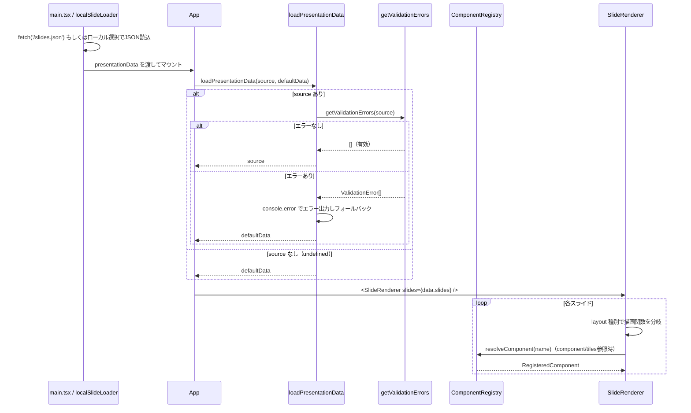
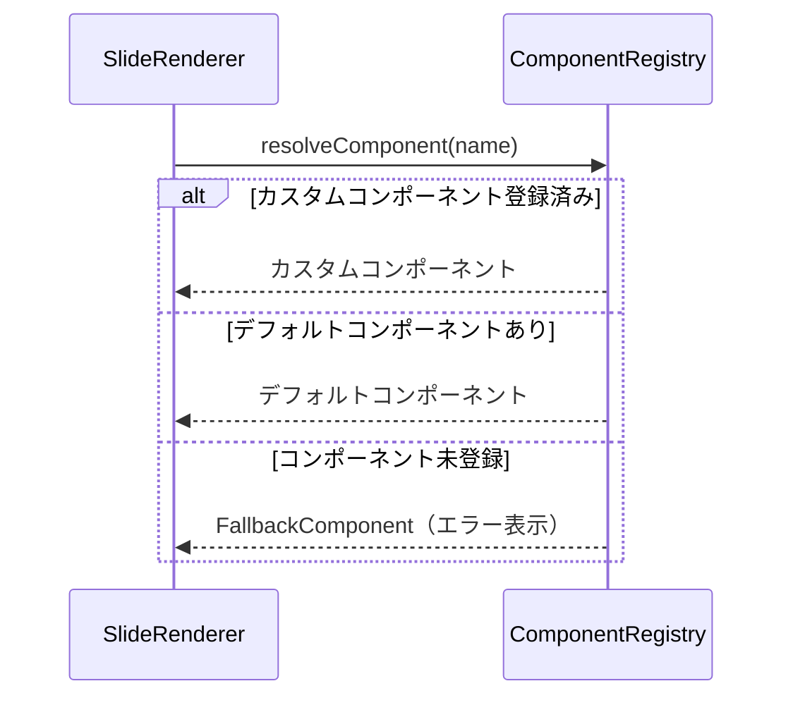

# スライドコンテンツカスタマイズ 抽象仕様書

**ドキュメント種別:** 抽象仕様書 (Spec)
**SDDフェーズ:** Specify (仕様化)
**最終更新日:** 2026-07-24
**関連 Design Doc:** [slide-content-customization_design.md](./slide-content-customization_design.md)
**関連 PRD:** [slide-content-customization.md](../requirement/slide-content-customization.md)

---

# 1. 背景

現在のプレゼンテーションでは、スライドの内容（テキスト、構成、レイアウト）がReactコンポーネント内にハードコードされている。スライド内容を変更するにはソースコードを直接編集する必要があり、以下の課題がある：

- 開発者以外がプレゼンテーション資料を更新することが困難
- 同じプレゼンテーション構造を異なるテーマや内容で再利用する仕組みが存在しない
- コンテンツ変更のたびにReactコンポーネントのコードを修正する必要がある

# 2. 概要

本機能は、プレゼンテーションの内容をソースコードから分離し、データ駆動で管理できる仕組みを提供する。

**主要な設計原則：**

- **データとビューの分離**: スライドの内容をJSON形式の構造化データとして管理し、レンダリングロジックから分離する
- **拡張可能性**: カスタムReactコンポーネントやレイアウトをプラグイン的に登録し、データから参照できる
- **後方互換性**: 既存のデモ用スライドをロケール別のデフォルトテンプレート（`default-slides-ja.json` / `default-slides-en.json`）として保持し、データ未指定時にそのまま表示する
- **型安全性**: スライドデータの型定義をTypeScriptの型システムで表現し、型安全にデータを扱う

# 3. 要求定義

## 3.1. 機能要件 (Functional Requirements)

| ID     | 要件                                                        | 優先度 | 根拠                     | PRD参照  |
|--------|-----------------------------------------------------------|-----|------------------------|--------|
| FR-001 | JSONフォーマットの構造化データによりスライドのテキスト、構成、メタ情報を定義し、プレゼンテーションに反映できる | 必須  | データ駆動型管理の基盤            | FR_100 |
| FR-002 | スライドの枚数、順序、各スライドに使用するレイアウト種別をJSONで定義できる                   | 必須  | スライド構成の柔軟な変更を可能にする     | FR_101 |
| FR-003 | 各スライドのタイトル、本文、リスト項目、強調テキスト等のテキストコンテンツをJSONで定義できる          | 必須  | 非技術者によるコンテンツ編集を可能にする   | FR_102 |
| FR-004 | 各スライドのアニメーション設定、フラグメント表示順序、スピーカーノート等のメタ情報をJSONで定義できる      | 推奨  | プレゼンテーションの表現力を維持する     | FR_103 |
| FR-005 | 指定されたJSONデータファイルを読み込み、スライドコンテンツとして動的にレンダリングできる            | 必須  | データ駆動型レンダリングの中核機能      | FR_104 |
| FR-006 | カラーパレット、フォント、レイアウトを含むテーマを外部定義し、視覚的デザインを切り替えられる            | 推奨  | プレゼンテーションの再利用性を向上する    | FR_200 |
| FR-007 | 各スライドに適用するレイアウト種別をデータから指定でき、新しいレイアウトを追加登録できる              | 推奨  | レイアウトの柔軟性を提供する         | FR_203 |
| FR-008 | 開発者がカスタムReactコンポーネントを名前付きで登録し、スライドデータから参照して使用できる          | 推奨  | コンポーネントの拡張性を提供する       | FR_301 |
| FR-009 | デフォルトで提供されるスライドコンポーネントをカスタムコンポーネントで上書きできる                 | 任意  | 既存コンポーネントのカスタマイズを可能にする | FR_302 |
| FR-010 | スライドデータからカスタムコンポーネントにpropsを渡せる                            | 推奨  | コンポーネントへのデータ受け渡しを可能にする | FR_303 |
| FR-011 | 現在のスライド内容をJSON形式のデフォルトデータとして提供する                          | 必須  | 後方互換性の確保               | FR_401 |
| FR-012 | 外部データファイルが未指定または読み込み失敗時にデフォルトデータにフォールバックして表示する            | 必須  | 安定的な表示を保証する            | FR_402 |
| FR-013 | スライドデータの構造を検証し、必須フィールドの欠落や型の不一致を検出する                       | 推奨  | データ品質を保証する             | FR_501 |
| FR-014 | データ検証エラー時にエラー箇所（JSONパス・期待型・実際の型）を含むメッセージを表示する              | 推奨  | 編集者の利便性を向上する           | FR_502 |
| FR-015 | プライマリカラー、アクセントカラー、背景色、テキスト色等のカラーパレットを外部データで定義できる          | 推奨  | 視覚的デザインの切り替えを可能にする      | FR_201 |
| FR-016 | 見出し用・本文用・コード用フォント、基本フォントサイズ、フォントソースを外部データで定義できる           | 任意  | フォント面のカスタマイズを可能にする      | FR_202 |
| FR-017 | テーマ定義に加えてカスタムCSSを指定し、デフォルトスタイルを上書きできる                      | 任意  | 細部のスタイル調整を可能にする         | FR_204 |

## 3.2. 非機能要件 (Non-Functional Requirements)

| ID      | カテゴリ    | 要件                                             | 目標値                                 | PRD参照   |
|---------|---------|------------------------------------------------|-------------------------------------|---------|
| NFR-001 | パフォーマンス | JSONデータからのスライド生成が開発サーバー起動時に完了し、HMRによる即時反映が行われる | データ変更後1秒以内の反映                       | NFR_100 |
| NFR-002 | 開発体験    | スライドデータフォーマットがJSONスキーマで文書化され、エディタの入力補完が利用可能    | VSCodeでIntelliSense対応               | NFR_101 |
| NFR-003 | 互換性     | デフォルトデータ使用時に既存プレゼンテーションと見た目・動作が完全に同一           | 視覚的差異ゼロ                             | NFR_102 |
| NFR-004 | 互換性     | データ駆動で生成されたスライドがReveal.jsのDOM構造を維持する           | `.reveal > .slides > section` 構造の維持 | NFR_103 |
| NFR-005 | 型安全性    | スライドデータの型定義がTypeScriptの型システムで表現される             | ビルド時型チェック通過                         | NFR_104 |

# 4. API

## 4.1. 公開API一覧

| ディレクトリ          | ファイル名                                     | エクスポート                                                                                                                             | 概要                                 |
|-----------------|-------------------------------------------|------------------------------------------------------------------------------------------------------------------------------------|------------------------------------|
| src/data/       | types.ts                                  | `PresentationData`, `PresentationMeta`, `LogoConfig`, `SlideData`, `SlideContent`, `ContentItem`, `ComponentReference`, `SlideNotes`, `SlideMeta`, `ThemeData`, `ColorPalette`, `FontDefinition`, `FontSource`, `ValidationError` ほか | スライドデータの型定義                        |
| src/data/       | default-slides-ja.json / default-slides-en.json | (デフォルトエクスポート)                                                                                                                       | ロケール別（日本語 / 英語）のデフォルトスライドデータ       |
| src/data/       | loader.ts                                 | `loadPresentationData`, `validatePresentationData`, `getValidationErrors`, `getDefaultPresentationData`                             | スライドデータの読み込み・バリデーション・ロケール別デフォルト取得   |
| src/data/       | noteHelpers.ts                            | `normalizeNotes`, `getSpeakerNotes`, `getSlideSummary`, `getVoicePath`                                                              | `SlideMeta.notes` の正規化・スピーカーノート等の取得 |
| src/components/ | SlideRenderer.tsx                         | `SlideRenderer`（`SlideRenderer.Slide` サブコンポーネントを含む）                                                                                | スライドデータからReactコンポーネントへのレンダリング       |
| src/components/ | ComponentRegistry.tsx                     | `RegisteredComponent`（型）, `registerDefaultComponent`, `registerComponent`, `resolveComponent`, `getRegisteredComponents`, `unregisterOwner`, `clearRegistry` | カスタム／デフォルトコンポーネントの登録・解決・破棄          |
| src/            | applyTheme.ts                             | `applyTheme`, `applyThemeData`, `applyBaseFontSize`, `loadFontSources`, `resetThemeOverrides`                                       | テーマ（色・フォント・カスタムCSS）のCSS変数適用とリセット    |

## 4.2. 型定義

```typescript
/** プレゼンテーション全体のデータ */
interface PresentationData {
    meta: PresentationMeta;
    theme?: ThemeData;
    slides: SlideData[];
}

/** プレゼンテーションのメタ情報 */
interface PresentationMeta {
    title: string;
    description?: string;
    author?: string;
    logo?: LogoConfig;
    /** 色のみを定義した外部テーマJSON（theme-colors.json 相当）へのパス */
    themeColors?: string;
}

/** ロゴ設定 */
interface LogoConfig {
    src: string;
    width?: number;   // デフォルト: 120
    height?: number;  // デフォルト: 40
}

/** 個別スライドのデータ */
interface SlideData {
    id: string;
    layout: string;
    content: SlideContent;
    meta?: SlideMeta;
}

/** スライドのコンテンツ */
interface SlideContent {
    title?: string;
    subtitle?: string;
    body?: string;
    items?: ContentItem[];
    component?: ComponentReference;

    [key: string]: unknown;
}

/** リスト等のコンテンツ項目 */
interface ContentItem {
    text: string;
    emphasis?: boolean;
    fragment?: boolean;
    fragmentIndex?: number;
    items?: ContentItem[];
}

/** カスタムコンポーネントへの参照 */
interface ComponentReference {
    name: string;
    props?: Record<string, unknown>;
    /** ラッパー要素に適用するインラインスタイル */
    style?: Record<string, string | number>;
}

/** スライドのノート情報 */
interface SlideNotes {
    /** スピーカーノート（発表者メモ・台本） */
    speakerNotes?: string;
    /** 要点サマリー（箇条書き用の配列） */
    summary?: string[];
    /** 音声ファイルへの相対パス */
    voice?: string;
}

/** スライドのメタ情報 */
interface SlideMeta {
    transition?: string;
    /** 文字列（スピーカーノートのみ）または SlideNotes オブジェクト */
    notes?: string | SlideNotes;
    backgroundImage?: string;
    backgroundColor?: string;
}

/** テーマデータ */
interface ThemeData {
    colors?: ColorPalette;
    fonts?: FontDefinition;
    customCSS?: string;
}

/** カラーパレット */
interface ColorPalette {
    primary?: string;
    accent?: string;
    background?: string;
    text?: string;

    [key: string]: string | undefined;
}

/** フォントソース定義 */
interface FontSource {
    family: string;
    /** ローカルフォントファイルパス（@font-face で登録） */
    src?: string;
    /** 外部フォント URL（<link> タグで読み込み） */
    url?: string;
}

/** フォント定義 */
interface FontDefinition {
    heading?: string;
    body?: string;
    code?: string;
    /** 基本フォントサイズ（px）。デフォルト 20px。全サイズをこの値を基準に比率で算出 */
    baseFontSize?: number;
    /** フォントソースの配列 */
    sources?: FontSource[];
}

/** バリデーションエラーの詳細 */
interface ValidationError {
    path: string;       // エラー箇所のJSONパス（例: "slides[0].content"）
    message: string;    // エラーメッセージ
    expected: string;   // 期待される型・値
    actual: string;     // 実際の型・値
}
```

> 補足: `SlideContent` はインデックスシグネチャ `[key: string]: unknown` を持ち、レイアウトごとに `variant` / `left` / `right` / `steps` / `tiles` / `commands` 等の任意フィールドを保持できる。`ComponentRegistry` に登録するコンポーネントの型は `RegisteredComponent = ComponentType<Record<string, unknown>>` で表現する。

# 5. 用語集

| 用語               | 説明                                                                                              |
|------------------|-------------------------------------------------------------------------------------------------|
| スライドデータ          | プレゼンテーションの内容を定義するJSON形式の構造化データ                                                                  |
| レイアウト種別          | `SlideData.layout` に指定する構造ベースの表示形式。実装値は `center` / `content` / `two-column` / `bleed` / `custom` の5種類 |
| タイル / タイムライン      | 独立したレイアウト種別ではなく、`content` レイアウト内の `tiles`（FeatureTileGrid）/ `steps`（Timeline）サブ構造として描画される        |
| テーマ              | カラーパレット、フォント定義、カスタムCSSを含む視覚的スタイルの定義                                                             |
| カスタムコンポーネント       | 開発者が作成し、スライドデータから名前で参照可能なReactコンポーネント                                                           |
| フォールバック          | 外部データが利用不可・バリデーション失敗時にデフォルトデータに切り替わる動作                                                         |
| デフォルトテンプレート       | データ未指定時に表示されるロケール別（`default-slides-ja.json` / `default-slides-en.json`）のデモ用スライドデータ              |
| コンポーネントレジストリ（概念） | カスタム／デフォルトコンポーネントを名前付きで登録・解決する仕組み。実体は `ComponentRegistry.tsx` のモジュールスコープ関数群（クラスや `ComponentRegistry` という named export は存在しない） |
| フラグメント           | スライド内のコンテンツ要素を段階的に表示するReveal.jsの機能                                                              |
| owner            | `registerComponent` の第3引数。パッケージ同梱アドオン等のスコープ単位で登録をまとめて破棄（`unregisterOwner`）するための識別子             |

# 6. ユースケース

| アクター     | ユースケース                       | 主なフロー                                                                                     |
|----------|------------------------------|-------------------------------------------------------------------------------------------|
| コンテンツ編集者 | スライド内容をJSONで差し替える            | `slides.json`（または `.tgz` パッケージ）を編集・選択 → アプリが読み込みバリデーション → 反映（不正時はデフォルトへフォールバック）             |
| 開発者      | カスタムコンポーネントを登録して利用する         | `registerComponent(name, component, owner?)` で登録 → JSONの `component.name` から参照             |
| 開発者      | テーマ（色・フォント・カスタムCSS）を切り替える    | `slides.json` の `theme` フィールド、または `meta.themeColors` が指す外部JSONで定義 → `applyThemeData` がCSS変数を適用 |
| システム     | データ未指定時にデフォルトテンプレートを表示する     | `getDefaultPresentationData(locale)` がロケール別デフォルトを返し、`loadPresentationData` 経由で表示            |

# 7. 使用例

## 7.1. デフォルトデータでの表示（データ未指定時）

```tsx
import { App } from './App'

// presentationData 未指定時は loadPresentationData がロケール別デフォルト
// （getDefaultPresentationData(locale)）にフォールバックする。
// App は onGoHome を必須で受け取る（ホーム画面への復帰ハンドラ）。
function Example({ onGoHome }: { onGoHome: () => void }) {
    return <App onGoHome={onGoHome} />
}
```

## 7.2. カスタムスライドデータでの表示

```tsx
import { App } from './App'
import customSlides from './custom-slides.json'

function Example({ onGoHome }: { onGoHome: () => void }) {
    return <App presentationData={customSlides} onGoHome={onGoHome} />
}
```

> 実際の起動フローでは `main.tsx` が `fetch('/slides.json')`（サンプル）またはローカル選択（`localSlideLoader`）でデータを取得し、`App` の `presentationData` prop に渡す。`App` 内では `loadPresentationData(presentationData, defaultData)` でバリデーションとフォールバックを行う。

## 7.3. カスタムコンポーネントの登録と使用

```tsx
import { registerComponent } from './components/ComponentRegistry'

// カスタムコンポーネントを登録（owner は任意。指定すると unregisterOwner でまとめて破棄可能）
registerComponent('MyChart', MyChartComponent)

// JSONデータからの参照
// { "layout": "custom", "content": { "component": { "name": "MyChart", "props": { "data": [] } } } }
```

# 8. 振る舞い図

## 8.1. スライドデータ読み込みフロー

JSONファイルの読み込み（`fetch` / ローカルファイル読込）は `main.tsx` および `localSlideLoader` の責務であり、`loadPresentationData` は「読み込み済みデータ」を受け取ってバリデーションとフォールバックのみを担う。


```mermaid
sequenceDiagram
    participant Main as main.tsx / localSlideLoader
    participant App as App
    participant Loader as loadPresentationData
    participant Validator as getValidationErrors
    participant Registry as ComponentRegistry
    participant Renderer as SlideRenderer
    Main ->> Main: fetch('/slides.json') もしくはローカル選択でJSON読込
    Main ->> App: presentationData を渡してマウント
    App ->> Loader: loadPresentationData(source, defaultData)
    alt source あり
        Loader ->> Validator: getValidationErrors(source)
        alt エラーなし
            Validator -->> Loader: []（有効）
            Loader -->> App: source
        else エラーあり
            Validator -->> Loader: ValidationError[]
            Loader ->> Loader: console.error でエラー出力しフォールバック
            Loader -->> App: defaultData
        end
    else source なし（undefined）
        Loader -->> App: defaultData
    end
    App ->> Renderer: <SlideRenderer slides={data.slides} />
    loop 各スライド
        Renderer ->> Renderer: layout 種別で描画関数を分岐
        Renderer ->> Registry: resolveComponent(name)（component/tiles参照時）
        Registry -->> Renderer: RegisteredComponent
    end
```

## 8.2. コンポーネント解決フロー


```mermaid
sequenceDiagram
    participant Renderer as SlideRenderer
    participant Registry as ComponentRegistry
    Renderer ->> Registry: resolveComponent(name)
    alt カスタムコンポーネント登録済み
        Registry -->> Renderer: カスタムコンポーネント
    else デフォルトコンポーネントあり
        Registry -->> Renderer: デフォルトコンポーネント
    else コンポーネント未登録
        Registry -->> Renderer: FallbackComponent（エラー表示）
    end
```

# 9. 制約事項

- React + TypeScript + Viteの技術スタックを維持すること（T-001準拠）
- Reveal.jsのDOM構造（`.reveal > .slides > section`）を維持すること（T-002準拠）
- 各スライドは独立したコンポーネントとして動作すること（A-001準拠）
- スタイリングは3層モデルを維持すること（A-002準拠）: グローバルCSS（`src/styles/global.css`：テーマCSS変数・レイアウト・Reveal.jsオーバーライド）、CSS Modules（コンポーネント固有スタイル）、MUI `sx` prop（インライン微調整）
- デフォルトデータ使用時に既存プレゼンテーションの見た目・動作を一切変更しないこと（B-001, B-002準拠）

---

## PRD参照

- 対応PRD: [slide-content-customization.md](../requirement/slide-content-customization.md)
- カバーする要求: UR_100, FR_100, FR_101, FR_102, FR_103, FR_104, FR_200, FR_201, FR_202, FR_203, FR_204, FR_300,
  FR_301, FR_302, FR_303, FR_400, FR_401, FR_402, FR_500, FR_501, FR_502, NFR_100, NFR_101, NFR_102, NFR_103, NFR_104
