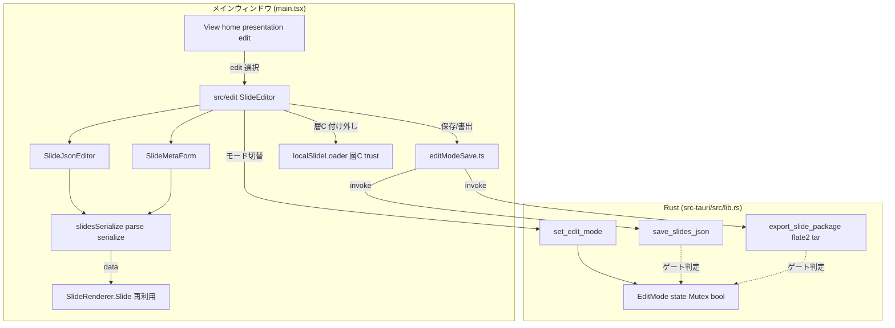

# スライド編集モード（器の作成）

**ドキュメント種別:** 技術設計書 (Design Doc)
**SDDフェーズ:** Plan (計画/設計)
**最終更新日:** 2026-07-24
**関連 Spec:** [slide-edit-mode_spec.md](./slide-edit-mode_spec.md)
**関連 PRD:** [slide-edit-mode.md](../requirement/slide-edit-mode.md)

---

# 1. 実装ステータス

**ステータス:** 🔴 未実装（本設計は計画フェーズの成果物。実装は未着手）

## 1.1. 実装進捗

| モジュール/機能 | ステータス | 備考 |
|----------|--------|------|
| モード切替（`View` に `'edit'`） | 🔴 | FR-001。`main.tsx` の表示分岐に追加 |
| 編集画面（`src/edit/`） | 🔴 | FR-001/002/003。`SlideEditor`/`SlideJsonEditor`/`SlideMetaForm`（新規） |
| ライブプレビュー（`SlideRenderer.Slide` 再利用） | 🔴 | FR-002/NFR-004。差分描画・全再マウントなし |
| 無損失シリアライズ（`slidesSerialize.ts`） | 🔴 | FR-004/NFR-002。パース→再シリアライズの往復保持（新規） |
| 保存前バリデーション | 🔴 | FR-005。`loader.ts` の `getValidationErrors` 再利用 |
| Rust 書き込みコマンド（`save_slides_json`/`export_slide_package`/`set_edit_mode`） | 🔴 | FR-006/007/011。`lib.rs` に新設・編集モード state ゲート |
| `.tgz` 生成（Rust・`flate2`/`tar`） | 🔴 | FR-007/DC-003。`extractAssetPaths` 規則を移植 |
| Addon 付け外し 層C（実行時信頼 UI） | 🔴 | FR-008。`localSlideLoader.ts`/`SettingsWindow` 拡張 |
| Addon 付け外し 層B（export 同梱選択） | 🔴 | FR-009。`export-slides.mjs` の同梱を個別選択化 |
| Addon 付け外し 層A（組み込み entry.ts・dev 限定） | 🔴 | FR-010/DC-004。dev 環境限定 |

---

# 2. 設計目標

1. **編集プレビュー＝本番ビューの保証** — レンダラ一式を再実装せず再利用し、編集結果が本番と一致することを構造的に担保する（DC-001）。
2. **ラウンドトリップの無損失** — GUI で扱えない自由記述（未知キー・HTML・空白・`customCSS`・props・`fragment`）を、編集の往復で一切失わない（FR-004/NFR-002）。これが本 Feature 最大の設計難所。
3. **書き込みの単一境界と編集モードゲート** — fs 書き込みを Rust コマンドの単一チョークポイントに集約し、編集モード state でゲートすることで、発表本番での書き込みを構造的に不可能にする（DC-002/FR-011/NFR-003）。
4. **アセット収集規則の一元化** — `.tgz` export のアセット収集を既存 `extractAssetPaths` と同一規則で実装し、二重管理を避ける（DC-003）。
5. **リグレッションゼロ** — View（発表本番）・「開く」・発表者ビュー・既存パッケージ配布の挙動を変えない（NFR-001）。

---

# 3. 技術スタック

| 領域 | 採用技術 | 選定理由 |
|------|------|------|
| 編集プレビュー | 既存 `SlideRenderer.Slide`（Reveal 非依存の単一スライド描画） | 発表者ビューの `PreviewSlide` が Reveal デッキ外描画の前例。本番と同一レンダラで「見た目が本番と違う」を原理的に防ぐ（DC-001） |
| 編集 UI | JSON テキストエディタ＋確定フィールドのフォーム（React/MUI） | 型未定義の自由記述が多く純粋なフォーム化は破壊リスク大。JSON を土台に確定部のみフォーム化する（FR-002/003・DC-005） |
| 無損失往復 | `JSON.parse`/`JSON.stringify` ベースの明示シリアライザ（`slidesSerialize.ts`） | 未知キーは `[key: string]: unknown` としてそのまま JS オブジェクトに載るため、パース→再シリアライズで保持できる。キー順・インデントを固定し差分を最小化 |
| 保存前検証 | 既存 `loader.ts` の `getValidationErrors`（構造化 `ValidationError`） | D-002（バリデーション駆動）に準拠。既存の検証資産を再利用 |
| 書き込み | Rust コマンド（`std::fs`）＋編集モード state（`tauri::State<Mutex<bool>>`） | 既存 `allow_asset_dir`/`extract_slide_package` と同じく fs 実務を Rust 境界に集約。`plugin-fs` write を JS へ開放しない（DC-002/NFR-003） |
| `.tgz` 生成 | Rust `flate2` + `tar`（依存済み） | `lib.rs` のテストに `tar::Builder`+`GzEncoder` の生成雛形が既存。`extract_slide_package` の展開と対になる |
| ファイル選択・保存先 | `@tauri-apps/plugin-dialog`（`save`/`open`） | 既存の「開く」と同じ機構。`dialog:default` 権限セットが save を含む |
| 永続化 | `@tauri-apps/plugin-store` | 最近使ったパス・アドオン信頼（`addonTrust`）の既存機構を流用（層C） |
| スタイリング | 既存3層モデル（グローバル CSS → CSS Modules → MUI sx prop）・色は `--theme-*` 経由 | 新規 UI（`SlideEditor` 等）も A-002 に従い、色をハードコードせず CSS 変数で参照する |

---

# 4. アーキテクチャ

## 4.1. システム構成図



## 4.2. モジュール分割

| モジュール名 | 責務 | 依存関係 | 配置場所 |
|--------|------|------|------|
| `main.tsx` | `View` に `'edit'` を追加し表示分岐。編集モード開始/終了で `set_edit_mode` を呼ぶ | `SlideEditor`, `editModeSave` | `src/main.tsx`（改修） |
| `SlideEditor` | 編集画面のルート。JSON エディタ・フォーム・ライブプレビュー・保存/書出/付け外しを束ねる | `SlideJsonEditor`, `SlideMetaForm`, `SlideRenderer`, `slidesSerialize`, `editModeSave` | `src/edit/SlideEditor.tsx`（新規） |
| `SlideJsonEditor` | JSON テキスト編集。構文・スキーマ検証を表示 | `slidesSerialize`, `loader` | `src/edit/SlideJsonEditor.tsx`（新規） |
| `SlideMetaForm` | 確定フィールド（`meta`/`theme`/`layout`/`id`）のフォーム編集 | `types` | `src/edit/SlideMetaForm.tsx`（新規） |
| `slidesSerialize` | 無損失パース・再シリアライズ（未知キー・HTML・空白の保持） | `types` | `src/edit/slidesSerialize.ts`（新規） |
| `editModeSave` | Rust 書き込みコマンドの呼び出し口（編集モード時のみ） | `@tauri-apps/api/core`, `plugin-dialog` | `src/editModeSave.ts`（新規） |
| `SlideRenderer.Slide` | 単一スライドの本番同一描画（プレビュー核） | `ComponentRegistry`, レイアウト | `src/components/SlideRenderer.tsx`（**変更なし・再利用**） |
| `loader` | 保存前バリデーション（`getValidationErrors`） | なし | `src/data/loader.ts`（再利用） |
| `localSlideLoader` | 層C: 実行時信頼の個別 on/off（`setAddonTrustDecision`） | `plugin-store` | `src/localSlideLoader.ts`（改修） |
| `SettingsWindow` | 層C の付け外し UI（既存の一律無効化・失効に個別トグルを追加） | `localSlideLoader` | `src/components/SettingsWindow.tsx`（改修） |
| `export-slides` | 層B: 同梱アドオンの個別選択（`extractAssetPaths` は Rust 移植の真実源） | なし | `scripts/export-slides.mjs`（改修） |
| `lib.rs` | `EditMode` state・`set_edit_mode`・`save_slides_json`・`export_slide_package`（`.tgz` 生成） | `flate2`, `tar` | `src-tauri/src/lib.rs`（改修） |

---

# 5. データモデル

`slides.json` のデータ構造（`PresentationData` / `SlideData` / `SlideContent` / `ThemeData`）は既存 `src/data/types.ts` をそのまま用い、**本 Feature で新規スライドデータ型は追加しない**。編集で扱うのは既存構造であり、次の自由記述箇所が無損失往復の対象となる。

```typescript
// 無損失往復の対象（src/data/types.ts の既存構造に潜在する自由記述）
interface SlideContent {
  title?: string
  subtitle?: string       // 文字列内に <strong>/<code>/<br/> 等の HTML を含みうる
  body?: string
  items?: ContentItem[]
  component?: ComponentReference // props/style は Record<string, unknown> で完全自由
  [key: string]: unknown  // ★ left/right/steps/tiles/codeBlock 等はここに載る（型定義なし）
}
interface ContentItem {
  text: string            // HTML・"\n"（→<br/>）・" "（インデント）を含みうる
  emphasis?: boolean
  fragment?: boolean      // レンダラ未消費だが編集で保持する
  fragmentIndex?: number
  items?: ContentItem[]
}
interface ThemeData {
  colors?: ColorPalette   // ColorPalette は [key: string] で任意色キーを許容
  fonts?: FontDefinition
  customCSS?: string      // 完全自由記述
}
```

無損失往復の設計（`slidesSerialize.ts`）:

- **保持の原理**: `JSON.parse` は未知キーも `[key: string]: unknown` の一部として JS オブジェクトに載せる。編集で触っていないキーは `JSON.stringify` でそのまま書き戻る。文字列内の HTML・`\n`・` ` は文字列値として保持される（レンダラ側の `renderHtml`/`renderWithLineBreaks` が解釈するのはあくまで表示時）。
- **差分最小化**: シリアライズ時のキー順・インデント（スペース 2）を固定し、編集していないスライドが不要に差分化しないようにする。
- **フォームとの合流**: `SlideMetaForm` は確定フィールドのみを更新し、同一オブジェクトの未知キーには触れない（部分更新）。JSON エディタとフォームは同一の `PresentationData` を単一の真実源として共有する。

---

# 6. インターフェース定義

```typescript
// src/edit/slidesSerialize.ts（新規）
export function parseSlides(text: string): { data: PresentationData; errors: ValidationError[] }
// JSON 構文エラー時は errors に構造化エラーを積む。未知キーは data にそのまま保持
export function serializeSlides(data: PresentationData): string
// キー順・インデントを固定して差分を最小化

// src/editModeSave.ts（新規）— すべて編集モード時のみ成功（Rust 側でゲート）
export async function enterEditMode(): Promise<void>   // invoke('set_edit_mode', { enabled: true })
export async function exitEditMode(): Promise<void>    // invoke('set_edit_mode', { enabled: false })
export async function saveSlidesJson(path: string, json: string): Promise<void>
export async function exportSlidePackage(json: string, options: ExportOptions): Promise<string>
export interface ExportOptions { outDir: string; includedAddons?: string[] }

// src/localSlideLoader.ts（改修）— 層C: 実行時信頼の個別操作
export async function setAddonTrustDecision(path: string, decision: AddonTrustDecision): Promise<void>
// 既存 resolveAddonTrust/resetAddonTrust/isEmbeddedAddonsDisabled を補完（個別 allow/deny の明示設定）
```

```rust
// src-tauri/src/lib.rs（改修）
struct EditMode(std::sync::Mutex<bool>);

#[tauri::command]
fn set_edit_mode(enabled: bool, state: tauri::State<EditMode>) {
    *state.0.lock().unwrap() = enabled;
}

// 書き込み系は必ず編集モード state を検査してから実行（ゲート）
#[tauri::command]
fn save_slides_json(path: String, json: String, state: tauri::State<EditMode>) -> Result<(), String> {
    if !*state.0.lock().unwrap() { return Err("edit mode disabled".into()); }
    // std::fs::write(path, json)
    Ok(())
}

#[tauri::command]
fn export_slide_package(
    json: String, out_dir: String, included_addons: Vec<String>, state: tauri::State<EditMode>,
) -> Result<String, String> {
    if !*state.0.lock().unwrap() { return Err("edit mode disabled".into()); }
    // 1. extractAssetPaths 相当でアセット収集 → 2. package.json 生成 → 3. flate2+tar で .tgz 生成
    Ok(/* 生成された .tgz パス */ String::new())
}
```

`EditMode` は `tauri::Builder::manage(EditMode(Mutex::new(false)))` で登録し、3 コマンドを `invoke_handler` に追加する（`src-tauri/src/lib.rs` の `generate_handler!`）。

---

# 7. 非機能要件実現方針

| 要件 | 実現方針 |
|------|------|
| NFR-001 リグレッション | `View='edit'` は追加分岐であり `'home'`/`'presentation'` の描画に手を入れない。`SlideRenderer` は再利用（変更なし）。`npm run typecheck`/`npm run test` をゲートにする |
| NFR-002 データ整合性 | `slidesSerialize` の parse→serialize が未知キー・HTML・空白を保持することを単体テストで担保。編集していないフィールドの往復差分ゼロを検証 |
| NFR-003 最小権限 | 書き込みは Rust コマンドのみ。`capabilities/default.json` に `fs:allow-write-*` を追加せず、write を JS へ開放しない。全書き込みコマンドの冒頭で `EditMode` を検査 |
| NFR-004 プレビュー応答性 | プレビューは `SlideRenderer.Slide` を props 更新で差分再描画し、`presentationKey` による App 全再マウント（Reveal 全再初期化）を伴わない。入力停止後おおむね 300ms 以内の反映を目標とする |

---

# 8. テスト戦略

| テストレベル | 対象 | カバレッジ目標 |
|--------|------|---------|
| 単体（Vitest） | `slidesSerialize`: 未知キー・文字列内 HTML・`\n`・` `・`customCSS`・`fragment` の往復保持、キー順・インデント固定 | 分岐網羅（無損失の核心） |
| 単体（Vitest） | 保存前バリデーション: 破損 JSON で保存を止める・正常時は通す | 分岐網羅（FR-005） |
| 単体（Vitest） | 層C 信頼: `setAddonTrustDecision` の allow/deny 個別設定・永続化 | 主要分岐（FR-008） |
| 単体（Rust） | `export_slide_package`: アセット収集規則が `extractAssetPaths` と一致・`.tgz` 展開で `extract_slide_package` と往復 | 正常系（FR-007/DC-003） |
| 単体（Rust） | 編集モードゲート: `set_edit_mode(false)` 時に `save_slides_json`/`export_slide_package` が拒否される | 分岐網羅（FR-011/NFR-003） |
| 結合（手動/デモ） | 編集→ライブプレビュー即時反映／保存→再読込で同一／`.tgz` を「開く」で読める／層B/C 付け外しが反映される | AC 全項目 |
| リグレッション | `npm run typecheck`/`npm run test`、View・「開く」・発表者ビューの既存挙動 | 全通過（NFR-001） |

---

# 9. 設計判断

## 9.1. 決定事項

| 決定事項 | 選択肢 | 決定内容 | 理由 |
|------|-----|------|------|
| 編集 UI 形式 | A:JSON テキスト単体 / B:JSON 土台＋段階フォーム / C:全面フォーム | **B（JSON テキスト土台＋段階フォーム）** | 型未定義の自由記述が多く全面フォーム化は破壊リスク大。JSON＋ライブプレビューを土台に、確定した `meta`/`theme`/`layout`/`id` のみ段階フォーム化（ユーザー確認済み） |
| プレビュー更新 | App 全再マウント（presentationKey++） / 差分描画 | **`SlideRenderer.Slide` の差分描画** | 全再マウントは Reveal 全再初期化を伴い編集に不適。単一スライドを props 更新で差分描画（NFR-004） |
| 書き込みの実現 | A:Rust コマンド境界集約 / B:plugin-fs write を JS 開放 / C:別ウィンドウ capability 分離 | **A（Rust コマンド境界＋編集モード state ゲート）** | 既存 fs 集約パターンに忠実。write を JS へ開放せず攻撃面を増やさない。state を戻せば真に編集時のみ書ける（DC-002/NFR-003・ユーザー確認済み） |
| export 実行場所 | A:Node スクリプト維持 / B:Rust コマンド新設 / C:フロント JS で tar 実装 | **B（Rust コマンド新設）** | Tauri ランタイムに Node の fs/child_process が無い。`flate2`/`tar` は依存済みで `extract_slide_package` と対になる。アセット規則は `extractAssetPaths` を移植（DC-003・ユーザー確認済み） |
| Addon 付け外しの層 | 層C のみ / 層C+B / 層A も含む | **層A+B+C すべて（ただし層A は dev 限定）** | 作る側（同梱選択・組み込み）と使う側（信頼）の両面を器で扱う（ユーザー確認済み）。層A は制約付きで含める（下記） |
| 層A の実行可能性 | 本番でも提供 / dev 限定＋層B へ委譲 | **dev 環境限定（本番は層B へ委譲）** | 組み込み `entry.ts` の増減は `npm run build:addons`（vite）の再ビルドを要し、本番パッケージ済みアプリには npm/vite が無く実行不能。本番配布では実行時ロード可能な層B（パッケージ同梱）で代替（DC-004） |
| プレビューのテーマ適用スコープ | 同一 document で適用 / iframe・別ウィンドウ隔離 | **初期は同一 document・要監視** | `applyTheme*` は `document.documentElement` にグローバル CSS 変数を書き込む非スコープ副作用。View↔Edit の排他は `View` 型で構造的に保証済みだが、Edit 画面内でエディタ chrome UI とライブプレビューが同一 document・同一 CSS 変数スコープを共有するため、プレビュー対象の `theme.customCSS`/`colors` がエディタ chrome にも波及しうる。初期は許容し、波及が問題化すれば隔離を検討（9.2） |
| スライドデータ型 | 新規編集用型を作る / 既存 `types.ts` を流用 | **既存 `types.ts` を流用** | 新規型は暗黙スキーマの二重管理とラウンドトリップ破壊リスクを招く。編集は既存構造の無損失往復に徹する |
| JSON エディタの実装 | A:plain textarea（MUI TextField multiline） / B:構文強調ライブラリ（CodeMirror 等） | **A（plain textarea ＋ 外部エラー表示）** | 構文・スキーマ検証は `parseSlides` の結果を `errors` props で外部表示すれば足り、エディタ自体の高度機能は本 Feature では不要（DC-005 と整合）。将来ライブラリを追加する場合は T-003 のライフサイクル管理（`useEffect` ＋ クリーンアップ）に従う |
| 無損失往復の型安全 | `as any` を多用 / `unknown` 保持＋狭い narrowing | **`unknown` のまま保持し狭い範囲でのみ型ガード** | 自由記述は `[key: string]: unknown` のまま往復させ、`as` の濫用を避ける（T-001）。編集で実際に触るフィールドのみ narrowing する |

## 9.2. 未解決の課題

| 課題 | 影響度 | 対応方針 |
|------|-----|------|
| Edit 画面内でエディタ chrome UI とプレビューが同一 CSS 変数スコープを共有 | 中 | View↔Edit の排他（`View` 型で保証済み）では解決しない別問題。プレビュー対象テーマがエディタ chrome へ波及する場合、プレビューパネルの iframe/別ウィンドウ隔離、または `applyTheme` のスコープ化を実装時に評価 |
| 型未定義フィールドの検証強度 | 中 | 保存前検証は既存 `getValidationErrors`（id/layout/title 等）レベルに留め、`left`/`steps`/`tiles` 等の深い検証は段階導入。無損失往復（FR-004）を優先し、過度な検証で自由記述を弾かない |
| 層A の dev 検出手段 | 低 | dev/本番の判定（`import.meta.env.DEV` 等）で層A UI を出し分ける。ビルド実行は既存 `npm run build:addons` の呼び出し方法を実装時に確定 |
| `.tgz` の `package/` サブディレクトリ規約 | 低 | `extract_slide_package` が `package/` を優先探索する（npm pack 慣習）。export 側も同規約で生成し往復を保証 |

---

# 10. 変更履歴

## v0.1（draft）

**変更内容:**

- 初版作成。Issue #13（Epic #12 配下の器の作成）に基づく技術設計を定義。編集 UI 形式・capability 分離・export 実行場所・Addon 付け外し層の 4 決定（ユーザー確認済み）と、層A の dev 限定制約・プレビュー差分描画・テーマ隔離方針を記録。
