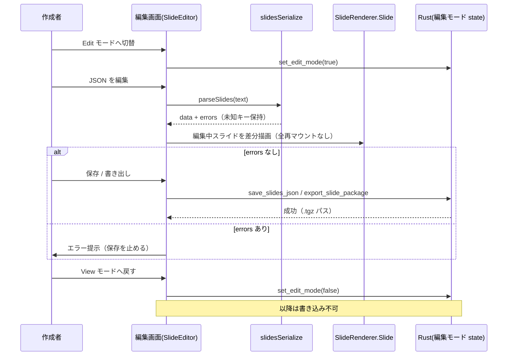

# スライド編集モード（器の作成）

**ドキュメント種別:** 抽象仕様書 (Spec)
**SDDフェーズ:** Specify (仕様化)
**最終更新日:** 2026-07-24
**関連 Design Doc:** [slide-edit-mode_design.md](./slide-edit-mode_design.md)
**関連 PRD:** [slide-edit-mode.md](../requirement/slide-edit-mode.md)

---

# 1. 背景

スライド作成は「`slides.json` を手書き」→「`npm run export:slides` で `.tgz` にパッケージ化」という CLI ベースのフローに依存している。ビューワーは Tauri デスクトップアプリ化済みだが、作成（オーサリング）は依然として npm コマンド頼みで、アプリ単体では完結しない。開いたスライドを**その場で編集して確認する導線もない**。

一方、レンダラ一式（`SlideRenderer` / `ComponentRegistry` / `applyTheme` / レイアウト / Reveal.js）はビューワー側に完備しており、単一スライドを Reveal 外で描画する仕組み（発表者ビューのプレビュー）も存在する。ここに「編集モード」を同梱すれば、**本番と同一レンダラのライブプレビュー**を伴う編集をアプリ内で実現できる。

ただし編集対象の `slides.json` は自由度が高い。`SlideContent` は `[key: string]: unknown` を持ち、本文の主要フィールド（`left` / `right` / `steps` / `tiles` / `codeBlock` 等）は型定義がなくレンダラのキャストが唯一の暗黙スキーマである。文字列内には HTML・改行・インデントが直書きされ、`theme.customCSS` や任意 `component` の props は完全に自由記述である。これらを編集で破壊せず保持する **ラウンドトリップ問題**が最大の設計難所となる。また fs 書き込みが必要になるため、発表本番での誤操作・意図しない書き込みを防ぐ **capability 分離**が要る。

関連する既存仕様: [presentation-foundation_spec.md](./presentation-foundation_spec.md)（レンダラ・Reveal 初期化）、[slide-content-customization_spec.md](./slide-content-customization_spec.md)（レイアウト分岐・コンポーネント解決）、[package-embedded-addon_spec.md](./package-embedded-addon_spec.md)（`.tgz` 同梱・実行時信頼）。本仕様はこれらを上流に持ち、編集モードを新規に定義する。

# 2. 概要

既存ビューワーに **View / Edit のモード**を追加し、Edit 時に「JSON 編集 → ライブプレビュー → ローカル保存 → `.tgz` 書き出し」と「同梱アドオンの参照・付け外し」をアプリ内で完結させる。本仕様は PRD の **UR-001**（編集モードの同梱）と **UR-002**（安全な編集）を満たすことを目的とする。設計原則は以下のとおり。

- **レンダラの再利用**: 編集プレビューは本番と同一の `SlideRenderer` で描画する（**DC-001**）。プレビューはプレゼン全体の再マウント（Reveal 全再初期化）を伴わず、編集中スライドを差分描画する。
- **JSON テキストを土台とした段階的フォーム**: 編集の土台は JSON テキストエディタ＋ライブプレビューとし、型が確定したフィールド（`meta` / `theme` / `layout` / `id`）のみを段階的にフォーム化する。
- **ラウンドトリップ無損失**: 編集器は「パース → 編集 → 再シリアライズ」で、未知キー・文字列内 HTML・意味を持つ空白・`customCSS`・任意 `component` props・`fragment` 制御を破壊せず往復させる（**FR-004**）。
- **保存の安全化**: 保存前にバリデーションし、破損時は既存読込の全体フォールバックへ流さず保存を止める（**FR-005**）。
- **書き込みの Rust コマンド境界集約と編集モードゲート**: fs 書き込みは Rust コマンドに閉じ、編集モード状態でゲートする（**DC-002 / FR-011**）。`plugin-fs` の write をフロントエンドへ開放しない。

**フル WYSIWYG は作らない（DC-005）。アプリ内蔵の Claude 生成はスコープ外（後続 #14）。** 層A（組み込みアドオン付け外し）は再ビルドを要するため dev 環境限定とする（DC-004）。

# 3. 要求定義

## 3.1. 機能要件 (Functional Requirements)

| ID     | 要件                                                                          | 優先度 | 根拠（PRD）      |
|--------|-----------------------------------------------------------------------------|-----|-------------|
| FR-001 | View / Edit のモードを切り替え、編集導線を Edit 時のみ表示する                        | 必須  | FR-001 / UR-001 / UR-002 |
| FR-002 | `slides.json` を編集し、本番と同一 `SlideRenderer` のライブプレビューへ差分反映する      | 必須  | FR-002 / DC-001 |
| FR-003 | 型が確定したフィールド（`meta` / `theme` / `layout` / `id`）をフォームで編集する         | 推奨  | FR-003      |
| FR-004 | 未知キー・文字列内 HTML・意味を持つ空白・`customCSS`・props・`fragment` を無損失で往復する | 必須  | FR-004      |
| FR-005 | 保存前にバリデーションし、破損時は全体フォールバックへ流さず保存を止める                       | 必須  | FR-005      |
| FR-006 | 編集した `slides.json` を Rust コマンド境界でローカル保存する                            | 必須  | FR-006      |
| FR-007 | アセット収集 → パッケージ生成で `.tgz` を書き出し、既存の「開く」で読み込める                    | 必須  | FR-007 / DC-003 |
| FR-008 | 実行時信頼（`addonTrust`）の個別 on/off をアプリ内で操作する（層C）                       | 推奨  | FR-008      |
| FR-009 | `.tgz` export 時に同梱アドオンを個別選択する（層B）                                     | 推奨  | FR-009      |
| FR-010 | 組み込みアドオン `entry.ts` の増減をアプリから操作する（層A・dev 限定）                      | 任意  | FR-010 / DC-004 |
| FR-011 | fs 書き込みを Rust コマンド境界に集約し、編集モード状態でゲートする                          | 必須  | FR-011 / DC-002 |

## 3.2. 非機能要件 (Non-Functional Requirements)

| ID      | カテゴリ   | 優先度 | 要件                                                             | 目標値／根拠（PRD） |
|---------|--------|-----|----------------------------------------------------------------|-------------|
| NFR-001 | 互換性    | 必須  | 既存の表示・「開く」・発表者ビュー・パッケージ配布が従来どおり動作。typecheck/test 通過 | NFR-001     |
| NFR-002 | 信頼性    | 必須  | 編集の往復で情報欠落・意味的差分が生じない（無損失）                             | NFR-002     |
| NFR-003 | セキュリティ | 必須  | 編集モード外では書き込み不可。`plugin-fs` write を JS へ開放しない            | NFR-003     |
| NFR-004 | 性能     | 推奨  | 編集→プレビュー反映が入力停止後おおむね 300ms 以内。Reveal 全再初期化を伴わない                    | NFR-004     |

# 4. API

本仕様で追加・変更する公開インターフェース（実装詳細は Design Doc 参照）。

| ディレクトリ | ファイル名 | エクスポート | 概要 |
|--------|-------|--------|------|
| `src` | `main.tsx` | `View`（型拡張） | `'home'`／`'presentation'` に `'edit'` を追加し、編集モードの表示分岐を持つ（FR-001） |
| `src/edit` | `SlideEditor.tsx` | `<SlideEditor slides onChange onSave onExport />` | 編集画面のルート。JSON エディタ・フォーム・ライブプレビューを束ねる（FR-001/002/003） |
| `src/edit` | `SlideJsonEditor.tsx` | `<SlideJsonEditor value onChange errors />` | JSON テキストエディタ（構文・スキーマ検証つき）（FR-002） |
| `src/edit` | `SlideMetaForm.tsx` | `<SlideMetaForm value onChange />` | 確定フィールド（`meta`/`theme`/`layout`/`id`）のフォーム（FR-003） |
| `src/components` | `SlideRenderer.tsx` | `SlideRenderer.Slide`（再利用） | 単一スライドを Reveal 外で描画するプレビュー核（DC-001・変更なし） |
| `src/edit` | `slidesSerialize.ts` | `parseSlides(text)` / `serializeSlides(data)` | 無損失往復のためのパース・再シリアライズ（未知キー・HTML・空白を保持）（FR-004） |
| `src/data` | `loader.ts` | `getValidationErrors`（再利用） | 保存前バリデーション。破損時は保存を止める（FR-005） |
| `src` | `editModeSave.ts` | `saveSlidesJson(path, json)` / `exportSlidePackage(options)` | Rust コマンドの呼び出し口（編集モード時のみ）（FR-006/007/011） |
| `src-tauri` | `lib.rs` | `save_slides_json`（Rust コマンド） | `slides.json` をローカル保存。編集モード state でゲート（FR-006/011） |
| `src-tauri` | `lib.rs` | `export_slide_package`（Rust コマンド） | アセット収集 → `.tgz` 生成。編集モード state でゲート（FR-007/011/DC-003） |
| `src-tauri` | `lib.rs` | `set_edit_mode`（Rust コマンド） | 編集モード state（`tauri::State<EditMode>`）を切り替える（FR-001/011） |
| `src` | `localSlideLoader.ts` | `setAddonTrustDecision(path, decision)`（新設・層C） | 実行時信頼を個別に許可/拒否する（既存 `resolveAddonTrust`/`resetAddonTrust` を補完）（FR-008） |
| `scripts` | `export-slides.mjs` | `extractAssetPaths`（公開・再利用元） | アセット収集規則の単一真実源。同梱ロジック `bundleAddons`（内部関数）を含め、Rust 実装が規則を移植する（DC-003/FR-009） |

## 4.1. 型定義

```typescript
// main.tsx — 編集モードを表示分岐に追加
type View = 'home' | 'presentation' | 'edit'

// src/edit/slidesSerialize.ts — 無損失往復
// パースは元の未知キー・文字列（HTML/空白を含む）をそのまま JS オブジェクトへ保持し、
// serialize は編集していないフィールドをバイト同値に近い形で書き戻す（キー順・インデント方針を固定）。
export function parseSlides(text: string): { data: PresentationData; errors: ValidationError[] }
export function serializeSlides(data: PresentationData): string

// editModeSave.ts — Rust コマンド呼び出し口（編集モード時のみ有効）
export interface ExportOptions {
  /** 出力先ディレクトリ（dialog で選択） */
  outDir: string
  /** 同梱するアドオン（層B・個別選択）。未指定なら同梱しない */
  includedAddons?: string[]
}
export function saveSlidesJson(path: string, json: string): Promise<void>
export function exportSlidePackage(json: string, options: ExportOptions): Promise<string> // 生成された .tgz パス

// localSlideLoader.ts — 層C: 実行時信頼の個別操作（既存 AddonTrustDecision を利用）
export function setAddonTrustDecision(path: string, decision: AddonTrustDecision): Promise<void>
```

```rust
// src-tauri/src/lib.rs — 書き込み系コマンド（編集モード時のみ成功。内部実装・state ゲート機構は Design Doc §6 参照）
// JS 側は invoke(name, args) で呼び出す。編集モード state による内部ゲートは呼び出し側から不可視。
fn set_edit_mode(enabled: bool)
fn save_slides_json(path: String, json: String) -> Result<(), String>
fn export_slide_package(json: String, out_dir: String, included_addons: Vec<String>) -> Result<String, String>
```

# 5. 用語集

| 用語 | 説明 |
|------|------|
| 編集モード（Edit） | 編集導線を表示し fs 書き込みを有効化するモード。`View` 型の `'edit'` |
| ライブプレビュー | 本番と同一の `SlideRenderer.Slide` で編集結果を差分描画するプレビュー |
| ラウンドトリップ | 「パース → 編集 → 再シリアライズ」の往復。無損失であることが FR-004 の要件 |
| 自由記述フィールド | 型未定義で GUI 構造化しづらい内容（`SlideContent` 未定義キー・文字列内 HTML・`customCSS` 等） |
| 編集モード state | Rust 側で保持する書き込み許可フラグ（`tauri::State<EditMode>`）。書き込みコマンドのゲート |
| 層A / 層B / 層C | アドオン付け外しの対象層。A=組み込み `entry.ts`（要再ビルド・dev 限定）／B=export 同梱選択／C=実行時信頼 |

# 6. 使用例

```tsx
// 編集モードでの JSON 編集 → ライブプレビュー → 保存（概念例）
function EditContainer({ initial }: { initial: PresentationData }) {
  const [text, setText] = useState(serializeSlides(initial))
  const { data, errors } = parseSlides(text) // 無損失パース（未知キーも保持）

  const handleSave = async (path: string) => {
    if (errors.length > 0) return // FR-005: 破損時は保存を止める
    await saveSlidesJson(path, text) // FR-006/011: Rust コマンド境界（編集モードゲート）
  }

  return (
    <>
      <SlideJsonEditor value={text} onChange={setText} errors={errors} />
      {/* DC-001: 本番と同一レンダラで差分プレビュー（全再マウントなし） */}
      {data.slides.map((s) => <SlideRenderer.Slide key={s.id} slide={s} />)}
    </>
  )
}
```

# 7. 振る舞い図

## 7.1. 編集 → 保存 / 書き出しのフロー



# 8. 制約事項

- 編集プレビューは `SlideRenderer` / `ComponentRegistry` / `applyTheme` / レイアウトを再利用し、再実装しない（DC-001）。
- fs 書き込みは Rust コマンド境界に集約し、`plugin-fs` write を JS へ開放しない（DC-002）。
- `.tgz` のアセット収集規則は `export-slides.mjs` の `extractAssetPaths` を単一の真実源とする（DC-003）。
- 層A（組み込みアドオン付け外し）は再ビルドを要するため dev 環境限定とする（DC-004）。
- フル WYSIWYG（ドラッグ配置）は作らない（DC-005）。
- 既存読込の全体フォールバック（1 スライド破損でプレゼン全体を default 差し替え）へ、編集途中の不整合を流し込まない（FR-005）。

---

# 9. PRD 整合性レビュー結果

関連 PRD: [slide-edit-mode.md](../requirement/slide-edit-mode.md)

| チェック項目 | 結果 |
|--------|------|
| 要求カバレッジ（FR） | ✅ PRD の FR-001〜011 をすべて spec の FR-001〜011 に対応付け |
| 要求 ID 参照 | ✅ 各機能要件に PRD の FR/DC/UR ID を「根拠」列で明記 |
| 非機能要件の反映 | ✅ PRD の NFR-001〜004 を spec の NFR-001〜004 に反映 |
| 設計制約の反映 | ✅ DC-001〜005 を制約事項・各 FR で参照 |
| 用語整合性 | ✅ 編集モード／ラウンドトリップ／自由記述／層A・B・C を PRD と統一 |
