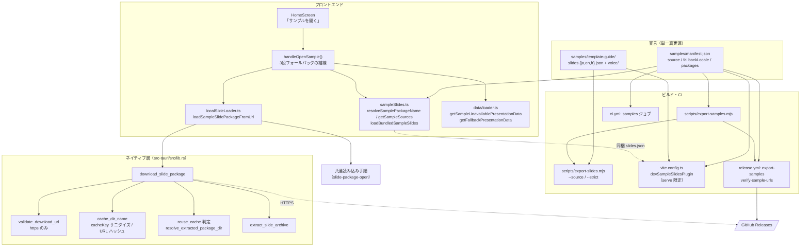

# スライドパッケージの配布と取得

**ドキュメント種別:** 技術設計書 (Design Doc)
**SDDフェーズ:** Plan (計画/設計)
**最終更新日:** 2026-07-27
**関連 Spec:** [slide-package-distribution_spec.md](./slide-package-distribution_spec.md)
**関連 PRD:** [slide-package-distribution.md](../requirement/slide-package-distribution.md)

---

# 1. 実装ステータス

**ステータス:** 🟢 実装済み

本設計書は2つの内容を含む。

- **as-is の文書化**: URL からの取得（[Issue #40](https://github.com/ToshikiImagawa/slide-presentation-app/issues/40)）は実装済みだが `.sdd` に未記載だった。今回サンプル取得の基幹経路になるため、この未文書化分を本書で引き取る
- **本変更の設計**: サンプルの `.spkg` 配布化、キャッシュ再利用、配布パイプライン

## 1.1. 実装進捗

| モジュール/機能 | ステータス | 備考 |
|----------|--------|------|
| HTTPS URL からの取得 | 🟢 | FR_001。`download_slide_package`（`src-tauri/src/lib.rs:216`）＋ `validate_download_url`（`:141`）。https 以外は拒否 |
| キャッシュ展開と基準ディレクトリ | 🟢 | FR_002。`extract_slide_archive`（`:35`）が `app_cache_dir()/slide-packages/<name>` へ展開 |
| 展開結果の検証 | 🟢 | FR_003。`resolve_extracted_package_dir`（`:52`）が `package/` を優先して `slides.json` を探し、無ければ `extract_slide_archive` がエラーを返す |
| キャッシュ再利用 | 🟢 | FR_004。`DownloadOptions.reuse_cache`（`:207`）。判定は FR_003 と同じ `resolve_extracted_package_dir` を共有 |
| 展開先名の決定とサニタイズ | 🟢 | FR_002 / NFR_003。`cache_dir_name`（`:181`）／`url_cache_stem`（`:170`） |
| 呼び出しごとのタイムアウト | 🟢 | FR_005。`DownloadOptions.timeout_secs`（`:204`）を `reqwest` のリクエスト単位タイムアウトへ適用（`:242`） |
| サンプル宣言（単一真実源） | 🟢 | FR_006 / DC_001。`samples/manifest.json` |
| ロケール解決 | 🟢 | FR_007。`resolveSamplePackageName()`（`src/sampleSlides.ts:25`） |
| 取得元リストの決定 | 🟢 | FR_008 / FR_011 / DC_006。`getSampleSources()`（`src/sampleSlides.ts:59`） |
| 同梱スライドの判定 | 🟢 | FR_010。`loadBundledSampleSlides()`（`src/sampleSlides.ts:88`）。content-type と `validatePresentationData` の両方を検証 |
| 3段フォールバックの結線 | 🟢 | FR_008。`handleOpenSample()`（`src/main.tsx:152`） |
| サンプル専用の読み込み | 🟢 | FR_009。`loadSampleSlidePackageFromUrl()`（`src/localSlideLoader.ts:413`）→ `loadAndRecordSlidePackage(..., { record: false, reportError: false })`（`:369`） |
| 保存ダイアログ既定パスの分離 | 🟢 | FR_009。`LoadedSlidePackage.savePath`（`src/localSlideLoader.ts:32`・URL 由来は `undefined`：`:328`） |
| 最小フォールバック（2 種） | 🟢 | FR_014。`getFallbackPresentationData()`（`src/data/loader.ts:7`）／`getSampleUnavailablePresentationData()`（`:26`） |
| 書き出しの `--source` / `--strict` | 🟢 | FR_012。`scripts/export-slides.mjs` |
| サンプル書き出しスクリプト | 🟢 | FR_013。`scripts/export-samples.mjs`・`npm run export:samples` |
| 開発サーバーのサンプル配信 | 🟢 | DC_005。`devSampleSlidesPlugin()`（`vite.config.ts:232`・`apply: 'serve'`） |
| CI の書き出しゲート | 🟢 | NFR_004。`.github/workflows/ci.yml` の `samples` ジョブ |
| リリース時のアセット添付と URL 検証 | 🟢 | FR_013。`.github/workflows/release.yml` の `export-samples` / `verify-sample-urls` ジョブ |
| i18n（取得失敗の通知） | 🟢 | FR_008。`ui.home.sampleUnavailable`（ja / en / fr） |

---

# 2. 設計目標

1. **サンプル取得の失敗を正常系として設計する**: サンプルをネットワーク依存にした以上、「取得できない」は起こる前提である。例外的なエラー処理ではなく、3段フォールバックの最後の分岐として設計に組み込む（NFR_001）。
2. **キャッシュ再利用の安全性を型と契約で担保する**: 「再利用してよい URL」と「してはいけない URL」を呼び出し側が明示する。既定値は常に「再利用しない」にして、指定漏れが古いサンプルの固定化につながらないようにする（DC_003）。
3. **既存の URL 取得経路の挙動を変えない**: オプションはすべて省略可能とし、未指定時に従来の動作になるようにする。既存経路のコードに手を入れない（NFR_006）。
4. **配布サンプルの宣言を1箇所に閉じる**: アプリ・書き出しスクリプト・CI・リリースワークフロー・開発サーバーの5者が同じファイルを読む。ロケール追加で複数箇所を同期させない（DC_001）。
5. **壊れた配布物を作れない構造にする**: 参照アセットの欠損を「警告」から「失敗」へ格上げできるようにし、配布物のビルド経路では必ず失敗させる。CI でも同じ経路を通す（NFR_004）。
6. **開発時の利便性と本番出力の純度を両立させる**: 開発サーバーでサンプルを開けるようにしつつ、本番ビルドの出力にサンプル資産を一切混入させない（NFR_005 / DC_005）。

---

# 3. 技術スタック

| 領域 | 採用技術 | 選定理由 |
|------|------|------|
| HTTP 取得 | `reqwest`（共有クライアント・`OnceLock`） | 既存の生成系（`generation::vertex` の `shared_client`）と同じパターン。`tauri-plugin-http` の事前許可ドメイン方式は「任意 URL を開ける」という要件と相性が悪いため採用せず、Rust 境界に取得を集約する（FR_001） |
| リクエスト単位のタイムアウト | `reqwest::RequestBuilder::timeout` | クライアント既定（300 秒）を維持したまま、経路ごとに短い上限を課せる。クライアントを複数持つ必要がない（FR_005 / NFR_002） |
| 展開 | `flate2` + `tar` | 既存の `.spkg` / 旧 `.tgz` 展開と同一。バイト列は同じ tar+gzip 形式で拡張子に依存しない |
| キャッシュ領域 | `app_cache_dir()/slide-packages/<name>` | ローカルパッケージの展開（`extract_slide_package`）と同じ領域を共有する。OS のキャッシュ削除対象に含まれるため、消えても再取得で復旧できる（FR_002） |
| 展開先名（既定） | `DefaultHasher` による URL ハッシュ | 任意の URL を安全なディレクトリ名に落とすため。**ただし値の安定性は保証されない**ので再利用の前提にはしない（DC_004） |
| 展開先名（再利用時） | 呼び出し側が指定する `cacheKey` | バージョンごとに安定した名前を明示できる。値はサニタイズしてキャッシュ領域外への逸脱を防ぐ（DC_004 / NFR_003） |
| 配布チャネル | GitHub Releases のアセット | バージョン固定 URL（`releases/download/v<version>/<asset>`）と latest URL（`releases/latest/download/<asset>`）の2種の静的 URL が認証なしで使える。追加のホスティングを持たずに済む（FR_013） |
| アプリのバージョン取得 | `@tauri-apps/api/app` の `getVersion()` | `tauri.conf.json` 由来＝**実際に動いているバイナリの版**。`package.json` を import する方式では、フロントエンドのビルド時点の値とバイナリの版がずれ得る（FR_008） |
| アセットのアップロード | `gh release upload --clobber` | `softprops/action-gh-release` は `draft: true` を含めて PATCH するため、公開後に走ると un-draft を巻き戻す。アセット添付だけが目的なら `gh` の方が副作用がない（FR_013） |
| 開発時のサンプル配信 | Vite プラグイン（`apply: 'serve'`） | 開発サーバーのミドルウェアとしてのみ動き、本番ビルドの出力に一切混入しない。`samples/` を真実源のまま参照できる（DC_005 / NFR_005） |
| サンプル宣言 | JSON（`samples/manifest.json`） | JS からも Node からも `bash`（`node -e`）からも読める。アプリ・スクリプト・CI・ワークフローの5者が同じ値を参照できる（DC_001） |

---

# 4. アーキテクチャ

## 4.1. システム構成図

**取得層（下）とサンプル解決層（上）を分離している。** 取得層は「URL を渡されたらキャッシュへ展開して基準ディレクトリを返す」だけを知り、サンプルの存在を知らない。



## 4.2. モジュール分割

| モジュール名 | 責務 | 依存関係 | 配置場所 |
|------|------|------|------|
| サンプル宣言 | 取得元ディレクトリ・フォールバックロケール・ロケール別パッケージの単一真実源 | なし | `samples/manifest.json` |
| サンプル資産 | ロケール別のスライドと参照アセット | なし | `samples/template-guide/` |
| `sampleSlides` | ロケール解決・取得元リストの決定・同梱スライドの判定 | サンプル宣言, `data`（バリデーション）, `@tauri-apps/api/app` | `src/sampleSlides.ts` |
| `localSlideLoader`（サンプル経路） | サンプル専用の読み込み（一覧に記録しない・ダイアログを出さない）と取得オプションの中継 | ネイティブコマンド, 共通読み込み手順 | `src/localSlideLoader.ts` |
| 最小フォールバック | データ不正時・サンプル取得失敗時のスライド生成 | `data/types` | `src/data/loader.ts` |
| 3段フォールバックの結線 | 同梱 → 配布パッケージ → 案内スライドの順序制御とトースト通知 | `sampleSlides`, `localSlideLoader`, `data`, `toast`, `i18n` | `src/main.tsx`（`handleOpenSample`） |
| `download_slide_package` | URL 検証・展開先名の決定・キャッシュ再利用・取得・展開 | `reqwest`, `flate2`, `tar`, `resolve_extracted_package_dir` | `src-tauri/src/lib.rs` |
| `cache_dir_name` / `url_cache_stem` | 展開先ディレクトリ名の決定とサニタイズ | なし（純粋関数） | `src-tauri/src/lib.rs` |
| `resolve_extracted_package_dir` | 展開済みディレクトリから `slides.json` の所在を確定する（キャッシュ再利用の可否判定と展開結果の検証で共有） | なし（純粋関数） | `src-tauri/src/lib.rs` |
| パッケージ書き出し | 基準ディレクトリの指定と厳格モード | Node fs, `npm pack` | `scripts/export-slides.mjs` |
| サンプル書き出し | 宣言の検証・全ロケールの書き出し・Release アセット名へのリネーム | サンプル宣言, パッケージ書き出し | `scripts/export-samples.mjs` |
| 開発サーバー配信 | `samples/` を `/slides.json` と `/voice/*` として配信（開発時のみ） | サンプル宣言, サンプル資産 | `vite.config.ts`（`devSampleSlidesPlugin`） |
| CI ゲート | 書き出しが成立し、宣言どおりのアセットが生成されることの検証 | サンプル宣言, サンプル書き出し | `.github/workflows/ci.yml`（`samples`） |
| リリース公開 | アセット添付と公開後の静的 URL 検証 | サンプル宣言, サンプル書き出し, `gh` | `.github/workflows/release.yml`（`export-samples` / `verify-sample-urls`） |

## 4.3. 層間契約

取得層とサンプル解決層の境界を次のとおり固定する。**取得層はサンプルの存在を知らない。**

```
Rust コマンド:  download_slide_package(url, options?) -> String（基準ディレクトリ）
                options 未指定 = 既定タイムアウト・URL ハッシュの展開先・毎回再取得
TS 関数:        getSampleSources(locale) -> SampleSource[]（優先順・先頭から試す）
                loadSampleSlidePackageFromUrl(url, download?) -> SlidePackageLoadResult
                失敗を例外にせず data: null で返す（呼び出し側が次の候補へ進む）
```

| 項目 | 決定 |
|:---|:---|
| 取得元の順序 | `getSampleSources` の配列順。呼び出し側は順に試し、最初に成功したものを採用する |
| 失敗の表現 | `SlidePackageLoadResult.data === null`。例外を投げない（`for` ループで次候補へ進めるため） |
| キャッシュ再利用の既定 | 未指定＝**再利用しない**。安全側（古い内容の固定化を避ける）を既定にする |
| キャッシュキーの既定 | 未指定＝URL ハッシュ。再利用する経路は必ず明示する（DC_004） |
| タイムアウトの既定 | 未指定＝共有クライアントの 300 秒。サンプル経路は 30 秒を明示する |
| 展開結果 | 基準ディレクトリ（`slides.json` のあるディレクトリ）。以降は共通読み込み手順に渡す |
| 最近開いた一覧 | サンプル経路は記録しない。`recentPackages` は `null`（変更なし） |
| エラー通知 | サンプル経路はダイアログを出さず `console.error` のみ。利用者への提示は3段目のトーストに集約する |

---

# 5. データモデル

## 5.1. サンプル宣言（`samples/manifest.json`）

```jsonc
{
  "source": "samples/template-guide",   // スライドとアセットの基準ディレクトリ
  "fallbackLocale": "en",               // サンプルが無いロケールで使う言語コード
  "packages": [
    { "locale": "ja", "slides": "slides.ja.json", "name": "template-guide-ja" },
    { "locale": "en", "slides": "slides.en.json", "name": "template-guide-en" },
    { "locale": "fr", "slides": "slides.fr.json", "name": "template-guide-fr" }
  ]
}
```

- `name` から Release アセット名 `${name}.spkg` を導出する。**バージョンを含めない**（決定 #2）
- 宣言の整合性（`packages` が空でない・`locale` が重複しない・`fallbackLocale` が `packages` に存在する・宣言された `slides` が実在する）は `scripts/__tests__/export-samples.test.mjs` が検証する。アプリ側（`resolveSamplePackageName`）はこの検証を前提に、`?? packages[0]` を最後の保険としてのみ持つ

## 5.2. 取得オプション（Rust 側）

```rust
#[derive(Debug, Default, serde::Deserialize)]
#[serde(rename_all = "camelCase")]
struct DownloadOptions {
  timeout_secs: Option<u64>,
  reuse_cache: Option<bool>,
  cache_key: Option<String>,
}
```

`Default` を導出し `options.unwrap_or_default()` で受けることで、**呼び出し側が `options` を渡さない既存経路が従来どおりに動く**（NFR_006）。`Option<bool>` を `unwrap_or(false)` で読むため、指定漏れは常に安全側（再利用しない）に倒れる。

## 5.3. 展開先ディレクトリ名の決定

```rust
fn cache_dir_name(url: &str, cache_key: Option<&str>) -> String {
  match cache_key {
    Some(key) => {
      // 英数・ハイフン・アンダースコア・ドット以外を落とす。
      // パス区切りや相対参照が混ざってもキャッシュ領域の外に出ない（NFR_003）
      let sanitized: String = key.chars()
        .filter(|c| c.is_ascii_alphanumeric() || matches!(c, '-' | '_' | '.'))
        .collect();
      if sanitized.is_empty() { url_cache_stem(url) } else { sanitized }
    }
    None => url_cache_stem(url),
  }
}
```

サニタイズ結果が空になった場合は URL ハッシュへ落とす。「キャッシュキーを指定したのにディレクトリ名が空」という状態を作らない。

## 5.4. サンプル取得元リスト

```typescript
// バージョン固定を先に、latest を保険として返す
[
  {
    url: `https://github.com/${REPO}/releases/download/v${version}/${name}.spkg`,
    // 内容が不変なので再利用できる。2 回目以降はオフラインでも開ける
    download: { timeoutSecs: 30, reuseCache: true, cacheKey: `sample-${name}-${version}` },
  },
  {
    url: `https://github.com/${REPO}/releases/latest/download/${name}.spkg`,
    // 指す内容がリリースごとに変わるため再利用しない（DC_003）
    download: { timeoutSecs: 30 },
  },
]
```

`cacheKey` にバージョンを含めるため、**バージョン固定と latest は別の展開先を使う**。同じアセット名（バージョンなし）を参照していても、キャッシュが互いを汚染しない。

---

# 6. インターフェース定義

## 6.1. サンプル解決層

```typescript
/** ロケールに対応するサンプルパッケージ名を宣言から解決する（純粋関数）。
 *  言語コードで照合し、該当がなければ fallbackLocale を使う（FR_007） */
function resolveSamplePackageName(locale: string): string

/** 取得元を優先順に返す（FR_008）。
 *  - VITE_SAMPLE_PACKAGE_URL 指定時はその 1 件のみ（FR_011）
 *  - バージョンを取得できない環境（素のブラウザ）では latest のみ */
function getSampleSources(locale: string): Promise<SampleSource[]>

/** ビルド時同梱の slides.json を読む（FR_010）。
 *  content-type と validatePresentationData の両方が通らなければ null。
 *  VITE_SAMPLE_SOURCE=remote 指定時は常に null（FR_011） */
function loadBundledSampleSlides(): Promise<PresentationData | null>
```

## 6.2. 取得層（Rust）

```rust
/// https のみ許可。options 未指定なら従来の挙動
#[tauri::command]
async fn download_slide_package(
  app: tauri::AppHandle,
  url: String,
  options: Option<DownloadOptions>,
) -> Result<String, String>;

/// 展開済みディレクトリから slides.json の所在を確定する（純粋関数）。
/// npm pack の package/ ネストを優先。見つからなければ None。
/// キャッシュ再利用の可否判定（FR_004）と展開結果の検証（FR_003）で共有する
fn resolve_extracted_package_dir(extract_dir: &Path) -> Option<PathBuf>;
```

## 6.3. 書き出しスクリプト

```bash
node scripts/export-slides.mjs \
  --name <package-name> \
  --slides <slides.json>        # source 配下のファイル名
  [--source <dir>]              # 既定 public。slides とアセットの基準ディレクトリ
  [--version <version>] \
  [--strict] \                  # 参照アセットが1つでも欠けたら非ゼロ終了
  [--addons[=a,b]]

node scripts/export-samples.mjs [--version <version>]
# 宣言の全ロケールを --strict 付きで書き出し、<name>.spkg へリネームする
```

## 6.4. 開発サーバー配信（`apply: 'serve'`）

| リクエスト | 応答 | 条件 |
|:---|:---|:---|
| `/slides.json` | 宣言から `Accept-Language` の言語コードで選んだサンプル | `public/slides.json` が存在しない場合のみ。存在すれば `next()` で既存の配信に譲る |
| `/voice/*` | `samples/<source>/voice/*` | パスが基準ディレクトリの内側にあり、実体が存在する場合のみ |
| いずれも | 配信しない（`next()`） | `VITE_SAMPLE_SOURCE=remote` 指定時、または宣言が存在しない場合 |

`/voice/*` を併せて配信するのは、実行時は `baseDir` 基準で解決される相対参照が、開発時には `baseDir` を持たないためである。

---

# 7. 非機能要件実現方針

| 要件 | 実現方針 |
|------|------|
| NFR_001（オフライン縮退） | (1) バージョン固定 URL に `reuseCache: true` を指定し、2 回目以降はネットワークに触れず開く。(2) すべての候補が失敗しても例外にせず、案内スライド＋トーストで3段目に着地する。(3) ローカルファイル・最近開いた一覧・編集・発表の各経路はネットワークに触れないまま維持する |
| NFR_002（待ち時間の上限） | 各候補に `timeoutSecs: 30` を明示する。共有クライアントの既定は 300 秒だが、その値で 2 候補を直列に試すと最大 600 秒ホーム画面がロックし得る（従来の問題）。30 秒 × 2 候補＝最大 60 秒に抑える |
| NFR_003（キャッシュ領域からの逸脱防止） | `cache_dir_name` が `cacheKey` から英数・`-`・`_`・`.` 以外を除去する。パス区切りや `..` が混ざっても `app_cache_dir()/slide-packages/` の内側に留まる。`cache_dir_name_prefers_cache_key_and_stays_inside_cache_dir` が検証する |
| NFR_004（配布物の完全性） | `--strict` を配布物のビルド経路（`export-samples.mjs`）で常に付ける。CI の `samples` ジョブが通常のプッシュでも同じ経路を通し、宣言どおりのアセットが生成されたことをファイル存在で確認する。公開後は `verify-sample-urls` が実際の静的 URL に `curl -fsSL` で到達性を確認する |
| NFR_005（バンドルへの非混入） | サンプル資産を `public/` ではなく `samples/` に置く（Vite の静的配信対象外）。開発時の配信は `apply: 'serve'` のプラグインに限定し、本番ビルドではプラグインごと動かない |
| NFR_006（リグレッションなし） | Rust 側は `options: Option<DownloadOptions>` を追加のみとし、`unwrap_or_default()` で従来の挙動を維持する。TS 側は `download?` を省略可能引数として追加し、既存の `loadSlidePackageFromUrl` / `pickAndLoadSlidePackage` / `openRecentSlidePackage` の呼び出しを変更しない |
| DC_003（再利用は不変な URL のみ） | `reuseCache` の既定を `false` とし、指定を呼び出し側の明示に限る。`getSampleSources` はバージョン固定 URL にのみ指定し、latest には指定しない。`sampleSlides.test.ts` の「バージョン固定 URL は内容が不変なのでキャッシュを再利用し、latest は再利用しない」が回帰を防ぐ |
| DC_006（テスト可能な配置） | 取得元決定を `main.tsx` から `src/sampleSlides.ts` へ切り出す。`main.tsx` はトップレベルで `createRoot()` を実行するため、テストから import すると DOM 初期化の副作用が走り読み込めない |

---

# 8. テスト戦略

| テストレベル | 対象 | カバレッジ目標 |
|------|------|------|
| JS 単体 | `resolveSamplePackageName`: 言語コードでの照合／サンプルが無いロケールの `fallbackLocale` 適用 | FR_007 の全分岐 |
| JS 単体 | `getSampleSources`: バージョン固定を先頭に latest を保険として返す／固定のみ `reuseCache`／全候補にタイムアウト／バージョン取得不能時は latest のみ／取得元上書き時はその1件のみ | FR_008・FR_011・DC_003・NFR_002 |
| Node 単体 | `validateManifest`: リポジトリの宣言が妥当／宣言された `slides` が実在／`source` 欠落・`packages` 空・`locale` 重複・`fallbackLocale` 不在・`name` 欠落をエラーにする | FR_006・DC_001 |
| Node 単体 | `getAssetName`: アセット名にバージョンを含めない | DC_002 |
| Node 単体 | `parseArgs`: `--source` 未指定時の既定（`public`）／指定時の基準ディレクトリ | FR_012・NFR_006 |
| Rust 単体 | `validate_download_url`: https のみ許可 | FR_001 |
| Rust 単体 | `cache_dir_name`: `cacheKey` を優先しキャッシュ領域の内側に留まる | FR_002・NFR_003・DC_004 |
| Rust 単体 | `url_cache_stem`: 同一 URL で決定的・URL ごとに一意 | FR_002 |
| Rust 単体 | `resolve_extracted_package_dir`: `package/` 優先／`slides.json` 不在の検出（再利用可否判定） | FR_003・FR_004 |
| 手動（実機） | オフラインでの初回（案内スライド）と 2 回目以降（キャッシュ再利用）／`VITE_SAMPLE_SOURCE=remote` でのリモート経路 | NFR_001・FR_011。**CI では検証できない** |
| CI | `npm run export:samples` の成功と、宣言どおりのアセット生成 | NFR_004 |
| CI（リリース後） | 静的ダウンロード URL の到達性 | FR_013・NFR_004 |

> **CI で検証できない範囲**: 実際の GitHub Releases からの取得、オフライン状態の再現、キャッシュの跨ぎ起動での再利用は、ネットワーク状態とアプリの永続化領域に依存するため単体テストでは扱わない。公開後の URL 到達性のみリリースワークフローでゲートし、残りは実機確認とする。

---

# 9. 設計判断

## 9.1. 決定事項

| 決定事項 | 選択肢 | 決定内容 | 理由 |
|------|------|------|------|
| #1 サンプルの所在 | (a) ビルトインを維持<br>(b) `.spkg` として Release から配布<br>(c) 別リポジトリで配布 | **(b)** | 下記「決定 #1」参照 |
| #2 Release アセット名 | (a) `<name>-<version>.spkg`<br>(b) `<name>.spkg`（バージョンなし） | **(b)** | 下記「決定 #2」参照 |
| #3 キャッシュ再利用の許可範囲 | (a) 常に再利用<br>(b) 内容が不変な URL のみ<br>(c) 再利用しない | **(b)** | 下記「決定 #3」参照 |
| #4 展開先ディレクトリ名 | (a) URL ハッシュのみ<br>(b) `cacheKey` を明示できるようにする | **(b)** | 下記「決定 #4」参照 |
| #5 同梱スライドの判定 | (a) 応答の成否のみ<br>(b) content-type とスキーマの両方を検証 | **(b)** | 下記「決定 #5」参照 |
| #6 取得失敗時の提示 | (a) エラーダイアログ<br>(b) トースト＋案内スライド<br>(c) 無反応（ホーム画面のまま） | **(b)** | 下記「決定 #6」参照 |
| #7 取得元決定の配置 | (a) `main.tsx`<br>(b) 独立モジュール（`sampleSlides.ts`） | **(b)** | 下記「決定 #7」参照 |
| #8 開発時のサンプル表示 | (a) `public/` へコピー<br>(b) 開発サーバー限定プラグイン<br>(c) 開発時も常にリモート取得 | **(b)** | 下記「決定 #8」参照 |
| #9 アセットのアップロード手段 | (a) `softprops/action-gh-release`<br>(b) `gh release upload --clobber` | **(b)** | 下記「決定 #9」参照 |
| #10 最小フォールバックの粒度 | (a) 1 つに統合<br>(b) 原因別に 2 つ | **(b)** | 原因が違えば利用者が取るべき行動も違う。データ不正なら `slides.json` の修正、サンプル取得失敗ならネットワークの確認である。文言を共有すると「どちらでもない曖昧な案内」になる。呼び出し元も別で（前者は `loadPresentationData` のフォールバック引数、後者は `handleOpenSample` の3段目）、統合しても共有できるのは「1 枚のスライドを組み立てる」定型部分だけである |
| #11 `--strict` の既定値 | (a) 常に厳格<br>(b) 既定は警告のまま、配布物のビルドでのみ厳格 | **(b)** | 既定を厳格にすると、利用者が自分のスライドを書き出すときにアセットの一部が未用意でも失敗するようになり、既存の使い方を壊す（NFR_006）。壊れたパッケージを防ぎたいのは**配布物**であり、そこは呼び出し側（`export-samples.mjs` と CI）が必ず `--strict` を付ける経路として固定されている |
| #12 バージョンの取得元 | (a) `package.json` を import<br>(b) `getVersion()`（`tauri.conf.json` 由来） | **(b)** | 必要なのは「いま動いているバイナリの版」である。`package.json` の値はフロントエンドをビルドした時点で焼き込まれるため、バイナリの版とずれ得る。ずれるとバージョン固定 URL が存在しないタグを指し、常に latest へ落ちて `reuseCache` の恩恵（オフライン再開）を失う |

### 決定 #1: サンプルを `.spkg` として Release から配布する

**却下した案 (a): ビルトインを維持**

サンプルはアプリの使い方を説明する資料であり、**アプリのコードとは更新頻度が本質的に異なる**。誤字修正や新機能の紹介スライド追加のためにアプリのリリースを待つ構造は、資料としての鮮度を損なう。加えて音声 3.1MB を、サンプルを一度も開かない利用者にも配布物として届けていた。

さらに、ビルトインの構成では**参照の破損に気づく仕組みがなかった**。英語版サンプルが参照する音声には実体がなく、`/demo-log.txt` は配布ビルドに存在しなかった。ビルトインは書き出しを経由しないため、`--strict` のような検証ゲートを通す機会そのものがない。

**却下した案 (c): 別リポジトリで配布**

サンプルの更新をアプリから完全に分離できるが、サンプルはアプリの機能（レイアウト種別・コンポーネント・音声再生）を実演する資料であり、**アプリの機能変更と歩調を合わせる必要がある**。別リポジトリにすると、アプリ側の変更でサンプルが壊れたことを CI で検知できない。同一リポジトリに置いたまま配布物として切り出す (b) なら、CI の `samples` ジョブが「アプリの変更でサンプルの書き出しが壊れていないか」を毎回検証できる。

**採用した案 (b)** では、真実源をリポジトリ内（`samples/`）に保ちつつ、成果物だけを Release アセットとして切り出す。更新はアセットの差し替えで済み、CI は真実源に対して常に検証をかけられる。副産物として、サンプル自身が「`.spkg` として配布されたパッケージを開く」経路のドッグフーディングになる。

### 決定 #2: Release アセット名にバージョンを含めない

**却下した案 (a): `<name>-<version>.spkg`**

`npm pack` の出力名（`<name>-<version>.tgz`）に素直で、リリースのアセット一覧を見たときにどの版か分かる。しかし**アプリがフォールバック先として使う latest URL を組み立てられない**。

latest URL は `https://github.com/<repo>/releases/latest/download/<asset>` という形で、`<asset>` にはアセット名をそのまま書く必要がある。アプリはこの URL を叩く時点で**最新リリースのバージョンを知らない**（知るには API を呼んで最新タグを解決する必要があり、認証やレート制限の考慮が増える）。アセット名にバージョンが含まれていると `<asset>` を確定できず、latest 経路が成立しない。

**採用した案 (b)** では、書き出し（`export-slides.mjs`）は従来どおり `<name>-<version>.spkg` を出力し、`export-samples.mjs` がそれを `<name>.spkg` へリネームしてから添付する。バージョン固定 URL 側は URL のパス部分（`download/v<version>/`）で版が特定できるため、アセット名に版を持たせる必要はない。「どの版のアセットか」はリリースのタグが表す。

### 決定 #3: キャッシュ再利用は内容が不変な URL にのみ許す

**却下した案 (a): 常に再利用**

オフライン耐性が最大化し、実装も単純になる。しかし latest URL は**同じ URL が別の内容を返す**。一度でも取得してしまうと、以後アプリは新しいリリースのサンプルを取りに行かなくなる。サンプルを Release 配布にした最大の目的（更新をアプリのリリースから切り離す）が無効化される。

**却下した案 (c): 再利用しない**

従来の挙動であり、常に最新が得られる。しかしオフラインでは毎回サンプルが開けず、NFR_001 の「一度取得したサンプルは再取得なしで開ける」を満たせない。ネットワークが不安定な環境（発表直前の会場など）でサンプルを開けないのは、アプリの用途と相性が悪い。

**採用した案 (b)** では、`reuseCache` を呼び出し側が明示するオプションにし、**既定を `false`（再利用しない）** とした。指定漏れは「毎回取得する」という安全側に倒れ、古い内容の固定化という戻しにくい不具合を生まない。バージョン固定 URL は内容が不変であることが URL の構造から保証されるため、ここにだけ `true` を指定する。

### 決定 #4: `cacheKey` を明示できるようにする

**却下した案 (a): URL ハッシュのみ**

既存の実装（`url_cache_stem`）は `DefaultHasher` で URL をハッシュし、`url-<hex>` を展開先名にする。任意の URL を安全なディレクトリ名へ落とす目的では十分である。しかし**キャッシュ再利用の前提にはできない**。

`std::collections::hash_map::DefaultHasher` の出力値は、**Rust のバージョン間で同一であることが保証されていない**（標準ライブラリのドキュメントが明示している）。ツールチェーンを更新してアプリをビルドし直すと、同じ URL が別のディレクトリ名になり得る。そうなると「前回取得したキャッシュ」を見つけられず、オフラインでサンプルが開けなくなる。しかも失敗の仕方が「再取得を試みて失敗する」という静かな縮退なので、原因の特定が難しい。

**採用した案 (b)** では、キャッシュを再利用したい経路が `cacheKey`（`sample-<name>-<version>`）を明示する。値は呼び出し側が組み立てるため、ツールチェーンに依存しない。既定（未指定）は従来の URL ハッシュのままで、既存経路の挙動は変わらない（NFR_006）。キャッシュキーは外から与えられる文字列なので、パス区切りを除去してキャッシュ領域外への逸脱を防ぐ（NFR_003）。

### 決定 #5: 同梱スライドは content-type とスキーマの両方で判定する

**却下した案 (a): 応答の成否のみ**

`fetch('/slides.json')` の `res.ok` を見るのが素直である。しかし**開発サーバーでは成立しない**。Vite の開発サーバーは、`accept: */*` のリクエストに対して存在しないパスでも SPA フォールバックとしてアプリ本体の HTML を 200 で返す。つまり同梱が無い状態でも `res.ok === true` になり、続く `res.json()` が HTML のパースで失敗する。

失敗が例外になるだけなら `catch` で「同梱なし」に落とせるが、判定が「例外が飛ぶか」に依存する形になり、応答が偶然 JSON としてパースできる場合（別の JSON を返す設定など）に誤って採用してしまう。

**採用した案 (b)** では、`content-type` に `json` が含まれること（応答の種別）と、`validatePresentationData` が通ること（内容の妥当性）の**両方**を要求する。前者で SPA フォールバックを弾き、後者で「JSON ではあるがスライドデータではない」ものを弾く。後者が失敗した場合は同梱データが壊れていることを意味するため、`console.error` を残してから次の段へ進む。

### 決定 #6: 取得失敗はトースト＋案内スライドで提示する

**却下した案 (a): エラーダイアログ**

既存の URL 入力経路（`loadSlidePackageFromUrl`）はエラーダイアログを出す。利用者が URL を明示的に入力した操作に対しては、失敗の理由を止めて伝えるのが適切である。しかしサンプル経路では**候補を順に試す**ため、途中の候補の失敗までダイアログにするとモーダルが連続する。利用者にとっては「サンプルを開く」という1回の操作なので、内部の試行回数を見せるべきではない。

**却下した案 (c): 無反応**

ボタンを押しても何も起きないのは、利用者から見ると不具合と区別できない。

**採用した案 (b)** では、`loadSampleSlidePackageFromUrl` が `reportError: false` で読み込み（失敗は `console.error` のみ）、3段目で初めて利用者に提示する。提示は2つの手段を併用する。

- **トースト**（`ui.home.sampleUnavailable`）: 何が起きたかを短く伝える。ja / en / fr に追加済み
- **案内スライド**（`getSampleUnavailablePresentationData`）: プレゼンテーション画面へ遷移し、「サンプルはオンラインで配布されている」「ネットワークを確認して再試行してほしい」を本文として残す

トーストだけでは消えた後に情報が残らず、案内スライドだけでは遷移の理由が伝わりにくい。両方を出すことで、A-005（エラー状態でもプレゼンテーションが表示可能であること）を満たしたまま原因を伝えられる。

### 決定 #7: 取得元決定を独立モジュールへ切り出す

**却下した案 (a): `main.tsx` に置く**

取得元の決定は「サンプルを開く」ハンドラの一部であり、当初は `main.tsx` に書かれていた。しかし `main.tsx` は**トップレベルで `createRoot(document.getElementById('root')!)` を実行する**（`src/main.tsx:276`）。テストから import すると DOM の初期化とレンダリングの副作用が走り、モジュールとして読み込めない。

取得元の決定には検証したい分岐が多い（バージョン固定と latest の順序、`reuseCache` を付ける対象、タイムアウトの有無、バージョン取得不能時の縮退、取得元上書き）。これらをテストで固定できないのは、DC_003（再利用は不変な URL のみ）のような**後から静かに壊れると気づけない契約**を守るうえで致命的である。

**採用した案 (b)** では `src/sampleSlides.ts` に切り出した。`main.tsx` に残るのは3段の順序制御（`handleOpenSample`）のみで、URL の組み立てとオプションの決定は純粋な関数として検証できる。

### 決定 #8: 開発時のサンプル配信は開発サーバー限定プラグインで行う

**却下した案 (a): `public/` へコピー**

Vite の静的配信に乗せれば追加の仕組みが不要である。しかし `public/` の内容は**本番ビルドの出力に含まれる**ため、サンプルをバンドルから外すという目的（NFR_005）と直接矛盾する。ビルド前に消す運用にすると、真実源が2箇所（`samples/` と `public/`）になり同期漏れが起きる。

**却下した案 (c): 開発時も常にリモート取得**

本番と同じ経路を通るという一貫性はある。しかし未公開バージョンのローカルビルドではバージョン固定 URL が存在せず、latest のアセットは開発中の変更を含まない。つまり**開発中のサンプルを開発中に確認できない**。素のブラウザ（`npm run dev`・ネイティブ層なし）ではダウンロード自体が使えない。

**採用した案 (b)** では、`apply: 'serve'` のプラグインが開発サーバーのミドルウェアとしてのみ `samples/` を `/slides.json` と `/voice/*` として配信する。本番ビルドではプラグインごと動かないため出力に混入しない。さらに既存の同梱指定を尊重するため、`public/slides.json` が存在する場合は `next()` で譲り、`VITE_SAMPLE_SOURCE=remote` 指定時は配信しない（リモート経路の実機確認を妨げない）。真実源は `samples/` の1箇所に保たれる（DC_001）。

### 決定 #9: アセット添付は `gh release upload --clobber` を使う

**却下した案 (a): `softprops/action-gh-release`**

リリースワークフローの他のジョブ（`release` / `generate-pdf`）が既に使っており、揃えたくなる。しかしこのアクションは**リリースを `draft: true` を含めて PATCH する**。本リポジトリのワークフローは「下書きを作る → 各種アセットを添付する → `publish` ジョブで un-draft する」構成なので、公開後にこのアクションが走ると**un-draft を巻き戻して下書きへ戻してしまう**。

この事故を避けるには、アクションを使うジョブがすべて `publish` より前に完了している必要がある。そこで `publish.needs` に `generate-pdf` と `export-samples` を追加した。それでも**アセット添付だけが目的のジョブに、リリース本文を PATCH する副作用のあるアクションを使う理由はない**。

**採用した案 (b)** では `gh release upload "<tag>" dist-slides/*.spkg --clobber` を使う。アセットの添付だけを行い、リリースの状態（draft / prerelease / 本文）に触れない。`--clobber` により再実行時の「既に存在する」エラーを避け、ワークフローの再実行が安全になる。

## 9.2. 未解決の課題

| 課題 | 影響度 | 対応方針 |
|------|------|------|
| latest 経路ではキャッシュを再利用しないため、バージョン固定アセットが存在しない状態（未公開バージョンのローカルビルド）ではオフラインでサンプルを開けない | 低 | 設計上の意図的な縮退（DC_003）。未公開バージョンは開発者の手元にしか存在せず、開発サーバーの `samples/` 配信で確認できるため実害は小さい |
| フランス語サンプルに音声がない | 低 | 音声の用意（読み上げ収録）は別作業とする。`--strict` は「宣言された参照アセットが実在するか」を見るため、参照自体を持たない fr は失敗しない |
| キャッシュの世代削除を行わない | 低 | `cacheKey` にバージョンを含めるため、アプリを更新すると古い版の展開先が残る。OS のキャッシュ領域に置いているため OS 側の掃除に委ねる。容量が問題になった時点で世代管理を検討する |
| `url_cache_stem` のハッシュ値がツールチェーン更新で変わり得る | 低 | 再利用しない経路（既存の URL 入力）でしか使わないため、名前が変わっても「新しい展開先へ取得し直す」だけで機能影響はない。再利用する経路は `cacheKey` を必須の運用とする（DC_004） |
| 配布パッケージの完全性検証（チェックサム・署名）を行わない | 中 | 本 PRD のスコープ外。配布元の信頼は同梱アドオンの実行時信頼（[package-embedded-addon_design.md](./package-embedded-addon_design.md)）で扱う。将来 Release アセットのチェックサム公開と照合を検討する |
| `verify-sample-urls` は公開後にしか走らない | 低 | 公開前は静的 URL から取得できないため構造的な制約。添付漏れは公開直後に検知され、アセットの再添付で復旧できる（`--clobber` で再実行が安全） |
| 同梱スライドの3用途が同じ入口（`/slides.json`）を共有している | 低 | ビルド時同梱・スクリーンショット fixture・開発サーバー配信が同じパスを使う。互いに上書きしない優先順（`public/slides.json` > 同梱指定 > 開発配信）を実装で保証しているが、用途が増える場合は入口の分離を検討する |

---

# 10. 変更履歴

## v1.0.0 (2026-07-27)

**変更内容:**

- 新規作成。サンプルスライドの `.spkg` 配布化にあわせ、**未文書化だった URL 取得経路（[Issue #40](https://github.com/ToshikiImagawa/slide-presentation-app/issues/40)）の as-is を本書へ引き取った**
- キャッシュ契約を明文化: 展開先名の決定（`cache_dir_name` / `url_cache_stem`）、`cacheKey` のサニタイズ、`resolve_extracted_package_dir` による展開結果の検証と再利用可否判定の共有
- `download_slide_package` に `DownloadOptions`（`timeoutSecs` / `reuseCache` / `cacheKey`）を追加。未指定時は従来の挙動
- サンプル取得の3段フォールバック（同梱 → バージョン固定 → latest → 案内スライド）と、各段の失敗を利用者に突きつけない方針を規定
- 配布パイプライン（`export-samples.mjs` / CI の `samples` ジョブ / リリースの `export-samples`・`verify-sample-urls`）を追加

**移行ガイド:**

```tsx
// ❌ 旧: ビルトインのデモスライドをデフォルトデータとして使う
import { getDefaultPresentationData } from './data'
const defaultData = getDefaultPresentationData(locale)

// ✅ 新: 用途で分けた最小フォールバックを使う
import { getFallbackPresentationData, getSampleUnavailablePresentationData } from './data'
// スライドデータが不正なとき（loadPresentationData のフォールバック先）
const defaultData = getFallbackPresentationData(locale)
// サンプルをどこからも取得できなかったとき（handleOpenSample の3段目）
const unavailable = getSampleUnavailablePresentationData(locale)
```

```bash
# ❌ 旧: 入力元は public/ 固定。参照アセットが欠けても警告だけで続行
node scripts/export-slides.mjs --name my-deck --slides slides.json

# ✅ 新: 基準ディレクトリを指定でき、配布物は欠損で失敗させる
node scripts/export-slides.mjs --name my-deck --slides slides.json --source samples/template-guide --strict
```
