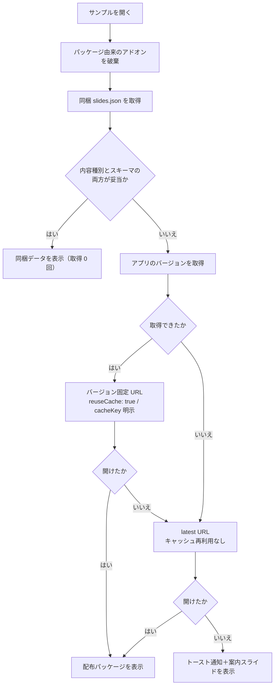
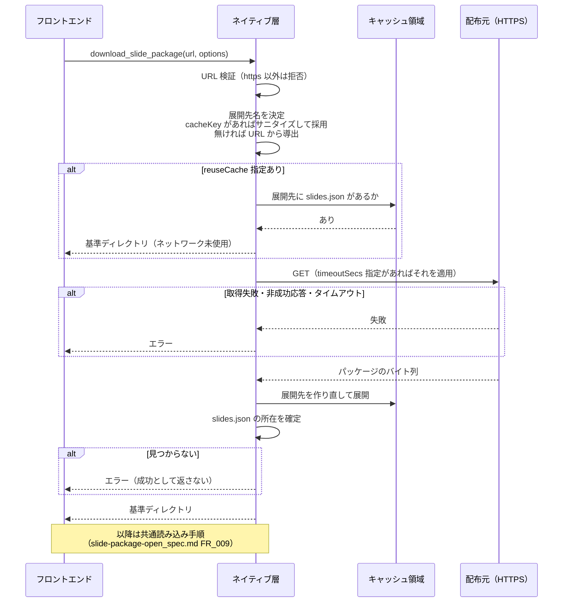
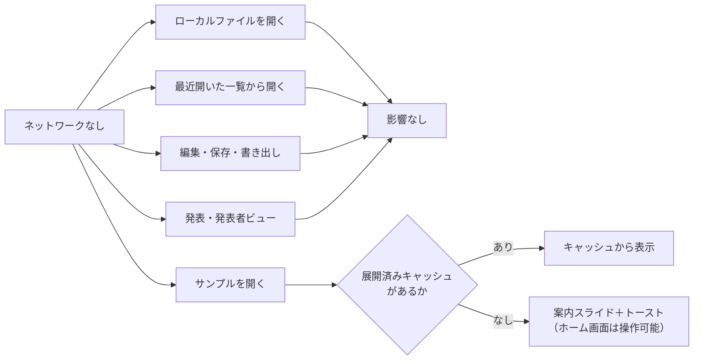
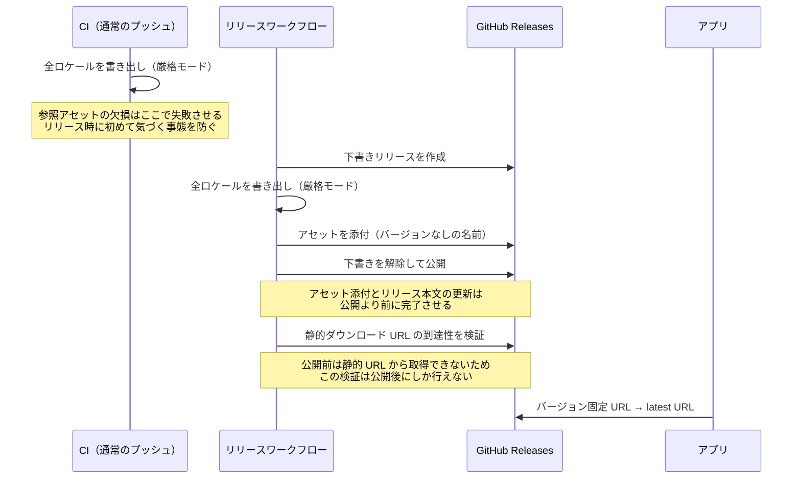

# スライドパッケージの配布と取得

**ドキュメント種別:** 抽象仕様書 (Spec)
**SDDフェーズ:** Specify (仕様化)
**最終更新日:** 2026-07-27
**関連 Design Doc:** [slide-package-distribution_design.md](./slide-package-distribution_design.md)
**関連 PRD:** [slide-package-distribution.md](../requirement/slide-package-distribution.md)

---

# 1. 背景

スライドパッケージを HTTPS URL から取得して開く経路は、実装上すでに存在する（[Issue #40](https://github.com/ToshikiImagawa/slide-presentation-app/issues/40)）。しかし **`.sdd` にはその契約が一切記載されていなかった**。https 限定というスキーム制約、展開先ディレクトリの命名規則、展開結果の扱い、失敗時の縮退といった判断がコードだけに存在し、要求の所有者が不在だった。[slide-package-open_spec.md](./slide-package-open_spec.md) は「URL 入力という入口が存在する」ことを FR_002 として定義するが、**その入口の先で何が起きるか**は所有していない。

ここに、テンプレートガイドのサンプルスライドの配布が加わる。従来サンプルはアプリにビルトインされていた（ロケール別の JSON と音声 3.1MB）。この構成には3つの問題があった。

- **更新がリリースに縛られる**: サンプルはアプリの使い方を説明する資料であり、アプリのコードとは更新頻度が本質的に異なる。誤字修正のためにアプリのリリースを待つ必要があった。
- **常時同梱のコスト**: サンプルを一度も開かない利用者も、音声アセットを配布物として受け取っていた。
- **参照の破損に気づけない**: 英語版サンプルが参照する音声には実体がなく、`/demo-log.txt` は配布ビルドに存在しなかった。書き出しは参照アセットの欠損を警告するだけで続行するため、壊れたパッケージが黙って作られていた。

そこでサンプルを `.spkg` として GitHub Releases から配布し、アプリ本体から外した。この結果、**サンプル表示はネットワークに依存する機能になった**。本仕様の中心的な関心はここにある。ネットワーク依存を許容する代わりに、次を契約として固定する。

- **取得の3段フォールバック**: どこからも取得できないという状態を「異常」ではなく設計上の正常な分岐として扱う
- **キャッシュの再利用条件**: 一度取得したサンプルはオフラインでも開ける。ただし内容が入れ替わりうる URL では再利用しない
- **待ち時間の上限**: ホーム画面が長時間操作不能にならない
- **配布物の完全性**: 参照アセットを欠いたパッケージをリリースへ到達させない

展開後の処理（asset スコープの動的許可・バリデーション・同梱アドオン解決・アセット URL 書き換え・最近開いた一覧への登録）は [slide-package-open_spec.md](./slide-package-open_spec.md) の FR_009（共通読み込み手順）が既に定義しており、本仕様はそれを再実装せず接続する。スライドデータの構造とバリデーションは [slide-content-customization_spec.md](./slide-content-customization_spec.md) が、ロケールの決定は [language-settings_spec.md](./language-settings_spec.md) が所有する。

---

# 2. 概要

本機能は、**スライドパッケージをネットワークから取得してキャッシュする層**と、**その層の上に載る配布サンプルの取得**を定義する。

- **取得層**: HTTPS URL からパッケージを取得し、アプリのキャッシュ領域へ展開して基準ディレクトリを返す。スキームは https に限定する
- **キャッシュ契約**: 展開先ディレクトリ名の決定規則、展開結果の検証、内容が不変な URL に限ったキャッシュ再利用、呼び出しごとのタイムアウト
- **配布サンプル**: 取得元とロケール別パッケージを単一の宣言で管理し、言語コードで照合して解決する。取得は「ビルド時同梱 → 配布パッケージ（バージョン固定 → latest）→ 案内スライド」の3段
- **サンプル読み込みの隔離**: 最近開いた一覧に記録せず、失敗時にエラーダイアログを出さない
- **配布物のビルドと公開**: 参照アセットの欠損を失敗として扱う厳格モードで書き出し、リリースのアセットとして添付し、公開後に静的 URL の到達性を検証する

「なぜキャッシュ再利用を内容が不変な URL に限るのか」「なぜアセット名にバージョンを含めないのか」「なぜ同梱の判定に応答の成否だけでは足りないのか」といった技術判断とその代替案は Design Doc を参照。

## 2.1. 主要ユースケース

| アクター | ユースケース | 概要 | 関連要求 |
|------|------|------|------|
| スライド閲覧者 | URL を入力してパッケージを開く | ホーム画面の URL 入力に HTTPS の URL を入れ、取得・展開して開く | FR_001, FR_002, FR_003 |
| スライド閲覧者 | サンプルを開く（オンライン・初回） | 配布パッケージを取得して表示する。バージョン固定 URL を先に試す | FR_007, FR_008 |
| スライド閲覧者 | サンプルを開く（オンライン・2 回目以降） | 展開済みキャッシュから取得なしで表示する | FR_004, NFR_001 |
| スライド閲覧者 | サンプルを開く（オフライン・キャッシュなし） | 案内スライドとトーストで理由と対処を受け取る。ホーム画面は操作可能なまま | FR_008, FR_014, NFR_001 |
| スライド閲覧者 | サンプルを開く（同梱ビルド） | ネットワークに触れず同梱の `slides.json` から表示する | FR_008, FR_010 |
| フランス語環境の閲覧者 | サンプルを開く | フランス語のサンプルが表示される（用意がないロケールはフォールバックロケール） | FR_007 |
| メンテナ | サンプルを書き出す | 宣言された全ロケールを `.spkg` として書き出す。参照アセットが欠けていれば失敗する | FR_006, FR_012 |
| メンテナ | サンプルを公開する | リリースのアセットとして添付し、公開後に静的 URL の到達性を検証する | FR_013 |
| 開発者 | リモート経路を実機確認する | 同梱を無視し、取得元 URL を上書きしてリモート取得の経路だけを通す | FR_011 |

---

# 3. 要求定義

## 3.1. 機能要件 (Functional Requirements)

| ID | 要件 | 優先度 | 根拠 |
|------|------|------|------|
| FR_001 | HTTPS の URL からスライドパッケージを取得できること。https 以外のスキームは取得前に拒否すること | 必須 | UR_003 |
| FR_002 | 取得したパッケージをアプリのキャッシュ領域へ展開し、`slides.json` のある基準ディレクトリを返すこと。展開先ディレクトリ名は URL 由来の安定した名前、または呼び出し側が指定したキャッシュキーとすること | 必須 | UR_003, NFR_003 |
| FR_003 | 展開結果に `slides.json` が見つからない場合はエラーとし、基準ディレクトリを返さないこと | 必須 | UR_003 |
| FR_004 | 呼び出し側が明示した場合に限り、展開済みキャッシュが利用可能ならネットワークに触れず基準ディレクトリを返すこと。利用可能かの判定は FR_003 と同じ基準で行うこと | 必須 | UR_002, NFR_001 |
| FR_005 | 取得のタイムアウトを呼び出しごとに指定できること。未指定時は従来の既定値で動作すること | 必須 | UR_002, NFR_002, NFR_006 |
| FR_006 | 配布サンプルの取得元ディレクトリ・フォールバックロケール・ロケール別パッケージ（ロケール／スライドファイル名／パッケージ名）を単一の宣言で管理し、アプリ・書き出し・CI・開発サーバーがすべてそれを読むこと | 必須 | UR_001, DC_001 |
| FR_007 | ロケールを言語コード（`ja-JP` → `ja`）で照合してサンプルパッケージを解決すること。該当がなければフォールバックロケールを使うこと | 必須 | UR_001 |
| FR_008 | サンプル取得を「ビルド時同梱 → 配布パッケージ（バージョン固定 → latest）→ 案内スライド」の3段で解決し、先に成功したものを採用すること。バージョンを取得できない環境では latest のみを候補とすること | 必須 | UR_001, UR_002 |
| FR_009 | サンプルの読み込みは最近開いた一覧に記録せず、失敗時にエラーダイアログを出さないこと。URL 由来のパッケージは編集モードの保存ダイアログの既定パスを持たないこと | 必須 | UR_002 |
| FR_010 | ビルド時同梱の `slides.json` は、応答の内容種別とスライドデータとしての妥当性の**両方**を検証してから採用すること。いずれかを満たさなければ「同梱なし」として次の段へ進むこと | 必須 | UR_002, DC_005 |
| FR_011 | サンプルの取得元 URL を上書きできること。また同梱を無視して必ずリモートから取得させる指定ができること | 推奨 | UR_001 |
| FR_012 | パッケージ書き出しでスライドと参照アセットの基準ディレクトリを指定できること。および参照アセットが1つでも欠けていたら失敗させる指定ができること（既定は警告して続行） | 必須 | UR_003, NFR_004, NFR_006 |
| FR_013 | リリース時に宣言された全ロケールのサンプルをアセットとして添付し、アセット名にバージョンを含めないこと。公開後に静的ダウンロード URL の到達性を検証すること | 必須 | UR_001, UR_003, DC_002 |
| FR_014 | 「スライドデータが不正なとき」と「サンプルを取得できなかったとき」で、それぞれ原因に応じた最小フォールバックのスライドを表示すること。いずれもコード内で生成する1枚とし、文言を共有しないこと | 必須 | UR_002 |

## 3.2. 非機能要件 (Non-Functional Requirements)

| ID | カテゴリ | 要件 | 目標値 |
|------|------|------|------|
| NFR_001 | 信頼性・可用性 | ネットワークが使えない状況でもアプリが操作可能であり、一度取得したサンプルは再取得なしで開けること | オフラインでもホーム画面の全操作が可能。キャッシュありなら取得 0 回でサンプル表示 |
| NFR_002 | パフォーマンス | サンプル取得で利用者を待たせる時間に上限を設けること。候補を直列に試す場合も上限が積み上がって実用外にならないこと | 候補1件あたり 30 秒。全候補を試しても既定タイムアウト（300 秒）1 件分を超えない |
| NFR_003 | セキュリティ | 展開先ディレクトリが常にアプリのキャッシュ領域の内側に収まること。キャッシュキーにパス区切り等が含まれても逸脱しないこと | キャッシュ領域外への書き込み 0 件 |
| NFR_004 | 信頼性 | 参照アセットを欠いたパッケージがリリースへ到達しないこと | 欠損は書き出し時点で非ゼロ終了。CI で検知 |
| NFR_005 | 配布サイズ | サンプルのスライドデータと音声アセットが本番ビルドの出力に含まれないこと。開発時の配信機構が本番出力に混入しないこと | 本番出力にサンプル資産 0 件 |
| NFR_006 | 互換性 | 既存の URL 入力経路・ビルド時同梱・ローカル選択・最近開いた一覧・編集モードの保存が従来どおり動作すること。取得オプションは未指定時に従来の挙動を維持すること | `npm run typecheck` / `npm run test` および Rust 単体テストが通る |

---

# 4. API

## 4.1. 公開API一覧

### フロントエンド（サンプル取得）

| ディレクトリ | ファイル名 | エクスポート | 概要 |
|------|------|------|------|
| `src/` | `sampleSlides.ts` | `resolveSamplePackageName(locale)` | サンプル宣言からロケールに対応するパッケージ名を解決する純粋関数（FR_007） |
| `src/` | `sampleSlides.ts` | `getSampleSources(locale)` | 配布サンプルの取得元を優先順に返す。先頭から順に試す（FR_008, FR_011） |
| `src/` | `sampleSlides.ts` | `loadBundledSampleSlides()` | ビルド時同梱の `slides.json` を読む。同梱なし・不正なら `null`（FR_010, FR_011） |
| `src/` | `sampleSlides.ts` | `SampleSource`（型） | 取得元1件（URL と取得オプション） |

### フロントエンド（取得と読み込み）

| ディレクトリ | ファイル名 | エクスポート | 概要 |
|------|------|------|------|
| `src/` | `localSlideLoader.ts` | `loadSlidePackageFromUrl(url)` | URL 入力経路。最近開いた一覧に記録し、失敗時はエラーダイアログを出す（[slide-package-open_spec.md](./slide-package-open_spec.md) FR_002） |
| `src/` | `localSlideLoader.ts` | `loadSampleSlidePackageFromUrl(url, download?)` | サンプル専用。一覧に記録せず、失敗時もダイアログを出さない（FR_009） |
| `src/` | `localSlideLoader.ts` | `SlidePackageDownloadOptions`（型） | 取得オプション（タイムアウト／キャッシュ再利用／キャッシュキー）。ネイティブ層へ中継する（FR_004, FR_005） |
| `src/data/` | `loader.ts` | `getFallbackPresentationData(locale)` | スライドデータが不正なときの最小フォールバック（FR_014） |
| `src/data/` | `loader.ts` | `getSampleUnavailablePresentationData(locale)` | サンプルを取得できなかったときの案内スライド（FR_014） |

### ネイティブコマンド（Rust → フロントエンド）

| コマンド | シグネチャ | 概要 |
|------|------|------|
| `download_slide_package` | `(url: string, options?: DownloadOptions) -> string` | HTTPS URL のパッケージを取得・展開し、基準ディレクトリを返す。`options` 未指定時は従来の挙動（FR_001〜FR_005） |
| `extract_slide_package` | `(packagePath: string) -> string` | ローカルのパッケージを展開し、基準ディレクトリを返す。`slides.json` が見つからなければエラー（FR_003） |

> **`options` を省略可能にしている理由**: 既存の URL 入力経路（`loadSlidePackageFromUrl`）は `options` を渡さない。省略時に「共有クライアントの既定タイムアウト・URL 由来の展開先名・毎回再取得」で動くことが NFR_006 の担保になっている。

### 宣言ファイルとビルドスクリプト

| パス | 種別 | 概要 |
|------|------|------|
| `samples/manifest.json` | 宣言 | 配布サンプルの単一真実源。`source` / `fallbackLocale` / `packages[{locale, slides, name}]`（FR_006, DC_001） |
| `samples/template-guide/slides.{ja,en,fr}.json` | データ | ロケール別のサンプルスライド |
| `samples/template-guide/voice/` | アセット | サンプルの音声（ja / en。fr は音声なし） |
| `scripts/export-slides.mjs` | スクリプト | パッケージ書き出し。`--source <dir>`（既定 `public`）と `--strict` を受け付ける（FR_012） |
| `scripts/export-samples.mjs` | スクリプト | 宣言された全ロケールを書き出し、Release アセット名へリネームする（FR_013） |

## 4.2. 型定義

```typescript
/** 配布サンプルの単一真実源（samples/manifest.json）の論理構造 */
interface SamplesManifest {
  /** スライドとアセットの基準ディレクトリ（プロジェクトルート相対） */
  source: string
  /** サンプルが用意されていないロケールで代わりに使う言語コード */
  fallbackLocale: string
  packages: Array<{
    /** 言語コード（'ja' / 'en' / 'fr'） */
    locale: string
    /** source 配下のスライドファイル名 */
    slides: string
    /** パッケージ名。Release アセット名は `${name}.spkg`（バージョンを含めない） */
    name: string
  }>
}

/** サンプルパッケージの取得元1件。優先順のリストとして返る */
interface SampleSource {
  url: string
  download: SlidePackageDownloadOptions
}

/** 取得オプション。未指定のフィールドは従来の挙動（NFR_006） */
interface SlidePackageDownloadOptions {
  /** このリクエストだけのタイムアウト秒。既定は共有クライアントの 300 秒 */
  timeoutSecs?: number
  /** 展開済みキャッシュがあればネットワークに触れず再利用する。内容が不変な URL にのみ指定する（DC_003） */
  reuseCache?: boolean
  /** 展開先ディレクトリ名。未指定なら URL から導出する（DC_004） */
  cacheKey?: string
}
```

```rust
/// download_slide_package の呼び出しオプション（camelCase で受け取る）。
/// すべて未指定なら従来どおり「共有クライアントのタイムアウト・URL 由来の展開先・毎回再取得」
struct DownloadOptions {
  timeout_secs: Option<u64>,
  reuse_cache: Option<bool>,
  cache_key: Option<String>,
}
```

---

# 5. 用語集

基本用語（スライドパッケージ / 配布サンプル / サンプル宣言 / フォールバックロケール / 基準ディレクトリ / 展開済みキャッシュ / キャッシュキー / バージョン固定 URL / latest URL / 3段フォールバック / 最小フォールバック / 厳格モード）は [slide-package-distribution.md](../requirement/slide-package-distribution.md) の用語集で定義済み。本仕様が新たに導入する用語のみを以下に示す。

| 用語 | 説明 |
|------|------|
| 取得元リスト | `getSampleSources` が返す優先順の `SampleSource` 配列。先頭から順に試し、最初に成功したものを採用する |
| 同梱スライド | ビルド時に `/slides.json` として配信されるスライドデータ。ビルド時同梱の配布形態・スクリーンショット fixture・開発サーバーのサンプル配信の3つが同じ入口を共有する |
| 案内スライド | サンプルをどこからも取得できなかったときに表示する1枚。取得失敗を「異常」ではなく設計上の分岐として扱うための表示 |

---

# 6. 使用例

## 6.1. サンプル取得の3段フォールバック

```tsx
import { getSampleSources, loadBundledSampleSlides } from './sampleSlides'
import { loadSampleSlidePackageFromUrl } from './localSlideLoader'
import { getSampleUnavailablePresentationData } from './data'

// (1) ビルド時同梱の slides.json（同梱ビルド・スクリーンショット fixture・dev の samples 配信）
const bundled = await loadBundledSampleSlides()
if (bundled) {
  await showPresentation(bundled)
  return
}

// (2) 配布パッケージ（バージョン固定 → latest の順）。失敗しても次の候補へ進む
for (const source of await getSampleSources(locale)) {
  if (await applyLoadResult(await loadSampleSlidePackageFromUrl(source.url, source.download))) return
}

// (3) どこからも取得できない（オフライン等）。異常終了ではなく案内スライドを表示する
showToast(t('home.sampleUnavailable'))
await showPresentation(getSampleUnavailablePresentationData(locale))
```

## 6.2. キャッシュを再利用する取得と、しない取得

```tsx
// バージョン固定 URL: 内容が不変なので再利用できる（2 回目以降はオフラインでも開ける）
await loadSampleSlidePackageFromUrl(`https://.../releases/download/v${version}/${name}.spkg`, {
  timeoutSecs: 30,
  reuseCache: true,
  cacheKey: `sample-${name}-${version}`, // 安定した名前を明示する（DC_004）
})

// latest URL: 指す内容がリリースごとに変わるため再利用しない（DC_003）
await loadSampleSlidePackageFromUrl(`https://.../releases/latest/download/${name}.spkg`, {
  timeoutSecs: 30,
})
```

## 6.3. 既存の URL 入力経路（変更なし）

```tsx
import { loadSlidePackageFromUrl } from './localSlideLoader'

// options を渡さないため、従来どおり「既定タイムアウト・URL 由来の展開先・毎回再取得」（NFR_006）
const result = await loadSlidePackageFromUrl('https://example.com/deck.spkg')
```

## 6.4. サンプルの書き出しと公開

```bash
# 宣言された全ロケールを .spkg として書き出す（参照アセットが欠けたら非ゼロ終了）
npm run export:samples

# 内部的には各ロケールについて次を実行する
node scripts/export-slides.mjs \
  --name template-guide-ja --slides slides.ja.json \
  --source samples/template-guide --version 1.2.3 --strict

# 出力を Release アセット名（バージョンなし）へリネームする
# dist-slides/template-guide-ja-1.2.3.spkg → dist-slides/template-guide-ja.spkg
```

---

# 7. 振る舞い図

## 7.1. サンプル取得の3段フォールバック

「どこからも取得できない」は異常系ではなく、**設計上の3段目**である。



> **各段の失敗は利用者に突きつけない（FR_009）**。1段目・2段目の失敗はコンソールに記録するだけで、エラーダイアログを出さない。利用者に提示するのは最終的な結果（表示できたスライド、または案内スライド＋トースト）のみである。

## 7.2. 取得とキャッシュ（ネイティブ層）



## 7.3. オフライン時の縮退（NFR_001）



> **ネットワーク依存はサンプル表示に限定される**。利用者自身の資料（ローカルの `slides.json` / `.spkg`）を開く・編集する・発表するという中核の作業は、本変更の前後でネットワークの有無に一切依存しない。

## 7.4. 配布パイプライン（ビルド → 公開 → 検証）



---

# 8. 制約事項

- 取得のスキームは https のみに限定すること。取得先ドメインの事前許可方式は採用しない（任意 URL を開けることが要件）
- 展開先ディレクトリは常にアプリのキャッシュ領域の内側に収めること。呼び出し側が与えるキャッシュキーはサニタイズすること（NFR_003）
- キャッシュ再利用は内容が不変な URL にのみ指定すること。latest URL のように指す内容が変わりうる経路では毎回取得すること（DC_003）
- URL から機械的に導出する展開先名は処理系のバージョン間で安定と保証されないため、再利用の前提にしてはならない。再利用する経路は安定したキャッシュキーを明示すること（DC_004）
- Release アセット名にバージョンを含めないこと。latest URL を組み立てる時点で最新リリースのバージョンは知り得ない（DC_002）
- 同梱スライドの判定は応答の成否だけでは行えない。開発サーバーは存在しないパスにもアプリ本体の HTML を成功応答として返し得る（FR_010）
- アプリのバージョンを取得できない環境（ネイティブ層のない素のブラウザ）ではバージョン固定 URL を組み立てられないため、latest のみを候補とすること
- 開発時のサンプル配信は開発サーバー限定とし、本番出力に混入させず、既存のビルド時同梱指定（`public/slides.json` および同梱パッケージ指定）を上書きしないこと（DC_005, NFR_005）
- 取得元の決定ロジックは、読み込むだけで副作用が発生しないモジュールに置くこと（DC_006）
- 取得オプションは未指定時に従来の挙動を維持すること（NFR_006）
- 外部から取得したデータのバリデーションは既存の構造化 `ValidationError` を踏襲すること（D-002）
- TypeScript strict mode での型安全性を確保すること（T-001）
- サンプルを取得できない場合もアプリの他の機能は従来どおり使えること（A-005: フォールバックファースト設計）

---

## PRD参照

- 対応 PRD: [slide-package-distribution.md](../requirement/slide-package-distribution.md)
- カバーする要求: UR_001, UR_002, UR_003, FR_001, FR_002, FR_003, FR_004, FR_005, FR_006, FR_007, FR_008, FR_009, FR_010, FR_011, FR_012, FR_013, FR_014, NFR_001, NFR_002, NFR_003, NFR_004, NFR_005, NFR_006, DC_001, DC_002, DC_003, DC_004, DC_005, DC_006
- 上流・関連仕様: [slide-package-open_spec.md](./slide-package-open_spec.md)（入口と共通読み込み手順）、[slide-content-customization_spec.md](./slide-content-customization_spec.md)（スライドデータ構造とフォールバック）、[language-settings_spec.md](./language-settings_spec.md)（ロケール決定）、[package-embedded-addon_spec.md](./package-embedded-addon_spec.md)（パッケージ書き出しと同梱アドオン）
