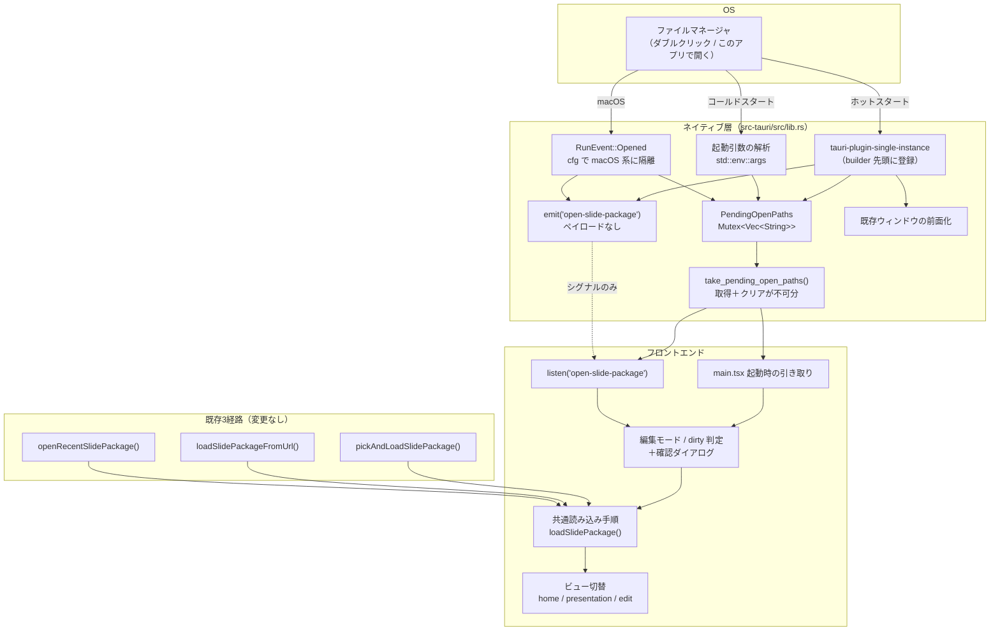

# スライドパッケージを開く経路

**ドキュメント種別:** 技術設計書 (Design Doc)
**SDDフェーズ:** Plan (計画/設計)
**最終更新日:** 2026-07-27
**関連 Spec:** [slide-package-open_spec.md](./slide-package-open_spec.md)
**関連 PRD:** [slide-package-open.md](../requirement/slide-package-open.md)

---

# 1. 実装ステータス

**ステータス:** 🟡 部分実装（既存3経路は実装済み・OS ファイル関連付けは未実装）

本設計書は [Issue #106](https://github.com/ToshikiImagawa/slide-presentation-app/issues/106) にて、**確定済みの設計を先行して文書化**したものである（D-001: 仕様書は実装前に更新されている）。ネイティブ層とフロントエンド層の実装は別 Issue で並行して進行する。両層は本書の「4.3. 層間契約」を唯一の真実源として実装する。

## 1.1. 実装進捗

| モジュール/機能 | ステータス | 備考 |
|----------|--------|------|
| ファイル選択ダイアログ経路 | 🟢 | FR_001。`pickAndLoadSlidePackage()`（`src/localSlideLoader.ts:352`）。フィルタは `SLIDE_PACKAGE_ARCHIVE_EXTENSIONS`（`src/slidePackageArchive.ts:6`）から生成 |
| HTTPS URL 経路 | 🟢 | FR_002。`loadSlidePackageFromUrl()`（`src/localSlideLoader.ts:368`）＋ Rust `download_slide_package`（`src-tauri/src/lib.rs:119`）。https 以外は `validate_download_url`（`:80`）で拒否 |
| 最近開いた一覧経路 | 🟢 | FR_003。`openRecentSlidePackage()`（`src/localSlideLoader.ts:373`）。`LazyStore('slide-package-state.json')` の `recentSlidePackages` キー・上限 8 件 |
| 共通読み込み手順 | 🟢 | FR_009。`loadSlidePackage()`（`src/localSlideLoader.ts:290`）。`allow_asset_dir` を `readTextFile` より先に呼ぶ順序を保持（`:294`） |
| `fileAssociations` 宣言 | 🔴 | FR_004 / FR_010。`src-tauri/tauri.conf.json` の `bundle` に未追加 |
| 保留領域と `take_pending_open_paths` | 🔴 | FR_005。`src-tauri/src/lib.rs` に未実装 |
| `open-slide-package` シグナル | 🔴 | FR_006。未実装 |
| 多重起動抑止（`tauri-plugin-single-instance`） | 🔴 | FR_007。`src-tauri/Cargo.toml` に依存が未追加 |
| `RunEvent::Opened` の購読 | 🔴 | FR_004。現状は `.run(tauri::generate_context!())`（`src-tauri/src/lib.rs:994`）で `RunEvent` を扱っていない |
| Linux MIME 型定義（shared-mime-info XML） | 🔴 | NFR_004。リソース未同梱 |
| 起動時の pending 引き取り | 🔴 | FR_005。`src/main.tsx:220` の並行ロード後に未配線 |
| 編集モード中の確認ダイアログ | 🔴 | FR_008。エディタ内の退出確認（`src/edit/SlideEditor.tsx:224`）は存在するが、外部起因の遷移には未接続 |

---

# 2. 設計目標

1. **入口の追加でフロントエンドの読み込み経路を分岐させない**: OS 経由の要求も、既存3経路と同じ「パス1本を共通読み込み手順に渡す」形に正規化する。フロントエンドは `.spkg` がどこから来たかを知らない。
2. **二重オープンを実装規律ではなく構造で防ぐ**: 「フラグを立てて二度目を無視する」ではなく、**実データの取り出し口を1つに絞り、取得とクリアを不可分にする**ことで排他を成立させる。フロントエンドがフラグ管理を誤っても二重オープンが起きない形にする。
3. **取りこぼしを構造で防ぐ**: OS の要求はフロントエンドの準備状況と無関係に届く。ネイティブ側に保留領域を置き、フロントエンドが「いつ取りに来ても良い」状態にする。
4. **3 OS の実現手段の差をネイティブ層で吸収する**: 起動引数で届くか専用イベントで届くか、MIME 型の登録が別途必要かといった差を、フロントエンドに漏らさない。
5. **既存機能に触らない**: 既存3経路・発表者ビュー・同梱アドオンの実行時信頼・ビルド時同梱の挙動を変えない（NFR_005）。

---

# 3. 技術スタック

| 領域 | 採用技術 | 選定理由 |
|------|------|------|
| 関連付けの宣言 | `tauri.conf.json` の `bundle.fileAssociations` | 1箇所の宣言から macOS の `Info.plist`（`CFBundleDocumentTypes`）・Windows のレジストリ（インストーラ）・Linux の `.desktop`（`MimeType=`）を **Tauri バンドラが生成**する。OS ごとに別ファイルへ拡張子を書き足す二重管理を避けられる（DC_004 / FR_010） |
| 多重起動抑止 | `tauri-plugin-single-instance` | 2つ目のプロセスの `argv` と `cwd` を既存インスタンスのコールバックへ転送し、2つ目を終了させる。Windows / Linux のホットスタート（起動引数経由）を既存ウィンドウへ集約する唯一の実用手段（FR_007 / DC_002） |
| macOS のファイルオープン通知 | `tauri::RunEvent::Opened` | macOS はコールドスタートでもホットスタートでも `argv` ではなく Apple Event でパスを渡す。これを受けるには `.build()` して `run(\|app, event\|)` でイベントループを購読する必要がある（FR_004 / DC_003） |
| 保留領域 | `Mutex<Vec<String>>` を `tauri::Builder::manage()` で共有状態化 | 既存の `EditMode(Mutex<bool>)`（`src-tauri/src/lib.rs:154`）と同じパターン。追加依存なしで、`take` の取得＋クリアを1つのロック内で不可分に行える（DC_001） |
| Linux の MIME 型定義 | shared-mime-info XML をリソース同梱 | Tauri は `.desktop` に `MimeType=` を書くが、**その MIME 型自体の定義（`glob` パターンと拡張子の対応）は生成しない**。`.spkg` は標準の MIME データベースに存在しない独自拡張子のため、XML を同梱して `update-mime-database` に登録させる必要がある（NFR_004 / DC_004） |
| 到着通知 | `tauri::Emitter::emit`（ペイロードなし） | 既存の発表者ビュー（`presenter-view` イベント）と同じ event API を使うが、**意図的にペイロードを持たせない**。理由は 9.1 の決定 #1 |

---

# 4. アーキテクチャ

## 4.1. システム構成図

3つの到着経路がネイティブ層の**保留領域に集約**され、フロントエンドは取り出し口1つだけを見る。この「多対1への収束」が本設計の中心である。



## 4.2. モジュール分割

| モジュール名 | 責務 | 依存関係 | 配置場所 |
|------|------|------|------|
| `fileAssociations` 宣言 | `.spkg` の関連付けを1箇所で宣言し、3 OS 分の登録情報を生成させる | Tauri バンドラ | `src-tauri/tauri.conf.json`（`bundle`） |
| `PendingOpenPaths` | OS 由来のパスを、フロントエンドが取り出すまで保持する共有状態 | `std::sync::Mutex`, `tauri::Manager` | `src-tauri/src/lib.rs` |
| `take_pending_open_paths` | 保留領域の唯一の取り出し口。取得とクリアを1つのロック内で行う | `PendingOpenPaths` | `src-tauri/src/lib.rs` |
| 起動引数の収集 | プロセスの `argv` から `.spkg` パスを抽出して保留領域へ push する | `PendingOpenPaths`, `slidePackageArchive` と同じ拡張子規則 | `src-tauri/src/lib.rs`（`setup` より前・`run` の直前） |
| `RunEvent::Opened` ハンドラ | macOS のファイルオープン通知を保留領域へ push し、シグナルを emit する | `PendingOpenPaths`, `tauri::Emitter` | `src-tauri/src/lib.rs`（`.build()` 後の `run(\|app, event\|)`） |
| 多重起動抑止コールバック | 2つ目のプロセスの `argv` を保留領域へ push し、既存ウィンドウを前面化してシグナルを emit する | `tauri-plugin-single-instance`, `PendingOpenPaths` | `src-tauri/src/lib.rs`（builder 先頭） |
| Linux MIME 型定義 | `.spkg` の MIME 型と glob パターンを OS の MIME データベースへ登録させる | shared-mime-info | `src-tauri/` 配下のリソース（`bundle.linux.deb.files` 等で配置） |
| 起動時の引き取り | 並行ロード完了後に一度だけ取り出し口を叩き、要求があれば開く | `take_pending_open_paths`, 共通読み込み手順 | `src/main.tsx` |
| シグナル購読 | `open-slide-package` を購読し、受信ごとに取り出し口を叩く | `@tauri-apps/api/event`, `take_pending_open_paths` | `src/main.tsx`（`RootContent`） |
| 外部要求ゲート | 編集モード・未保存状態を見て、確認ダイアログの提示と遷移を決める | `RootContent` の `view` / `editSource` state | `src/main.tsx`（`RootContent`） |

## 4.3. 層間契約（並行実装の唯一の真実源）

ネイティブ層とフロントエンド層は別 Issue で並行実装するため、境界を次のとおり固定する。**この2つ以外の境界を追加しない。**

```
Rust コマンド:  take_pending_open_paths() -> Vec<String>
                取得と同時にクリアする take セマンティクス。空配列 = 要求なし
Rust イベント:  emit("open-slide-package")
                ペイロードなしのシグナル
```

| 項目 | 決定 |
|:---|:---|
| 取り出し口 | `take_pending_open_paths` のみ。他のコマンド・イベントから実データを取得しない |
| 戻り値の意味 | 空配列は「開く要求なし」。エラーではない |
| クリアのタイミング | 戻り値を作るのと同じロック内。呼び出し側の ack を待たない |
| シグナルのペイロード | なし。フロントエンドはペイロードを一切読まない |
| シグナルの発火条件 | 保留領域へ push した直後（ホットスタート経路のみ。コールドスタートは push だけで良い） |
| 複数パス | `Vec<String>` を返すが、フロントエンドは当面先頭1件のみを開く（9.2 参照） |
| 呼び出し回数 | フロントエンドは「起動時に1回」＋「シグナル受信ごとに1回」叩く。空配列が返るのは正常系 |

---

# 5. データモデル

```rust
/// OS から届いたパスの保留領域。フロントエンドが take するまで保持する。
/// 既存の EditMode(Mutex<bool>)（src-tauri/src/lib.rs:154）と同じ manage() パターン。
struct PendingOpenPaths(Mutex<Vec<String>>);

/// 唯一の取り出し口。取得とクリアを1つのロック内で不可分に行う（DC_001）。
#[tauri::command]
fn take_pending_open_paths(state: tauri::State<PendingOpenPaths>) -> Vec<String> {
    let mut paths = state.0.lock().unwrap_or_else(|e| e.into_inner());
    std::mem::take(&mut *paths)
}
```

`std::mem::take` により「現在の内容を返す」と「空にする」が同一のロック区間で完了する。ロックを2回取る実装（`clone()` してから `clear()`）にしてはならない。

---

# 6. インターフェース定義

## 6.1. ネイティブ層

```rust
// builder の先頭に登録する（DC_002）。ホットスタートの argv を既存インスタンスへ転送する。
tauri::Builder::default()
    .plugin(tauri_plugin_single_instance::init(|app, argv, _cwd| {
        push_pending_open_paths(app, extract_package_paths(&argv));
        focus_main_window(app);
        let _ = app.emit("open-slide-package", ());   // ペイロードなし
    }))
    .plugin(tauri_plugin_fs::init())
    // ... 既存のプラグイン・manage・invoke_handler・setup はそのまま
    .manage(PendingOpenPaths(Mutex::new(collect_startup_open_paths())))
    .build(tauri::generate_context!())
    .expect("error while building tauri application")
    .run(|app, event| {
        // RunEvent::Opened は macOS / iOS / Android のみ存在するバリアント（DC_003）
        #[cfg(any(target_os = "macos", target_os = "ios", target_os = "android"))]
        if let tauri::RunEvent::Opened { urls } = &event {
            push_pending_open_paths(app, extract_package_paths_from_urls(urls));
            let _ = app.emit("open-slide-package", ());
        }
        let _ = (app, event);
    });
```

## 6.2. フロントエンド層

```typescript
/** 起動時に一度だけ・シグナル受信ごとに呼ぶ。空配列は「要求なし」（正常系） */
function takePendingOpenPaths(): Promise<string[]> {
  return invoke<string[]>('take_pending_open_paths')
}

/** 外部起因の開く要求を、編集状態を見てから共通読み込み手順へ渡す */
function handleExternalOpenRequest(path: string): Promise<void>
```

## 6.3. `tauri.conf.json` の宣言

```jsonc
{
  "bundle": {
    "fileAssociations": [
      {
        "ext": ["spkg"],
        "name": "SlidePackage",
        "description": "Slide Presentation Package",
        "mimeType": "application/x-slide-package",
        "role": "Viewer"
      }
    ]
  }
}
```

この1箇所から、macOS は `Info.plist` の `CFBundleDocumentTypes`、Windows はインストーラのレジストリ登録、Linux は `.desktop` の `MimeType=` が生成される。**Linux の MIME 型定義 XML は生成されない**ため別途同梱する（9.1 の決定 #4）。

---

# 7. 非機能要件実現方針

| 要件 | 実現方針 |
|------|------|
| NFR_001（取りこぼし防止） | ネイティブ側の保留領域が、フロントエンドの準備状況と無関係にパスを保持する。フロントエンドは並行ロード完了後に一度だけ取り出し口を叩けば、購読開始前に届いた要求も観測できる |
| NFR_002（二重オープン防止） | 実データの入手経路を取り出し口1つに限り、取得とクリアを同一ロック区間で行う。2つ目の呼び出しは必ず空配列を得るため、二重に開くことが原理的に起こらない |
| NFR_003（編集内容の保護） | 外部起因の遷移を必ずゲート関数に通し、編集モードかつ未保存のときは確認ダイアログを挟む。既存のエディタ内退出確認（`src/edit/SlideEditor.tsx:224`）と同じ判定基準（`text !== source.rawText`）を再利用する |
| NFR_004（3 OS 同等性） | 到着経路の差（`argv` / `RunEvent::Opened` / 多重起動抑止コールバック）をすべて保留領域へ収束させる。Linux は MIME 型定義 XML の同梱で登録の欠落を補う |
| NFR_005（リグレッションなし） | 既存3経路の関数・共通読み込み手順に手を入れず、外部要求を「パス1本」に正規化して既存経路へ合流させる。既存プラグイン登録・`invoke_handler`・`setup` の内容は変更しない（追加のみ） |
| DC_005（アドオンロード順序の不変） | 外部要求を `loadSlidePackage()`（`src/localSlideLoader.ts:290`）の入力である「パス1本」へ正規化することで実現する。展開 → `allow_asset_dir` → `<script>` 注入の順序はこの関数の内部に閉じており、入口の追加では触れない |
| NFR_006（条件付きコンパイル） | `RunEvent::Opened` の参照箇所を `#[cfg(any(target_os = "macos", target_os = "ios", target_os = "android"))]` で隔離する。他 OS ではバリアント自体が存在しないため、`match` のアームごと消える形にする |

---

# 8. テスト戦略

| テストレベル | 対象 | カバレッジ目標 |
|------|------|------|
| Rust 単体 | `take_pending_open_paths` の take セマンティクス（1回目は内容を返し、2回目は空配列） | NFR_002 の分岐を網羅 |
| Rust 単体 | 起動引数からのパス抽出（`.spkg` のみ拾う・`.tgz` は対象外・引数なし） | 拡張子判定の分岐を網羅 |
| Rust 単体 | 保留領域への push が複数回積み重なること | FR_005 |
| JS 単体 | 外部要求ゲート: 通常時は即開く／編集モード＋未保存時は確認を挟む／拒否時は要求を破棄する | FR_008・NFR_003 の全分岐 |
| JS 単体 | 空配列を受けたときに何もしない（ホーム画面のまま） | FR_005 の正常系 |
| JS 単体 | シグナル受信ごとに取り出し口を叩き、ペイロードを読まないこと | FR_006 |
| 手動（実機） | 3 OS での関連付け登録・コールドスタート・ホットスタート・編集中の要求 | NFR_004。**CI では検証できないため実機確認が必須** |

> **CI で検証できない範囲**: OS へのファイル関連付けはインストーラ経由の登録を伴うため、`npm run test:e2e`（Playwright・ブラウザ）でも Rust 単体テストでも検証できない。3 OS の実機でのインストール後確認を受け入れ条件に含める。

---

# 9. 設計判断

## 9.1. 決定事項

| 決定事項 | 選択肢 | 決定内容 | 理由 |
|------|------|------|------|
| #1 実データの受け渡し方 | (a) イベントの payload にパスを載せる<br>(b) イベントはシグナルにし、`take` を唯一の取り出し口にする<br>(c) フロントエンドから定期ポーリングする | **(b)** | 下記「決定 #1」参照 |
| #2 多重起動抑止の登録位置 | (a) `.setup()` 内で登録（既存 updater と同じ）<br>(b) `builder` の先頭で登録 | **(b)** | 下記「決定 #2」参照 |
| #3 `RunEvent::Opened` の扱い | (a) 全 OS 共通コードとして書く<br>(b) `#[cfg]` で対象 OS に隔離する<br>(c) macOS 専用のモジュールに分離する | **(b)** | 下記「決定 #3」参照 |
| #4 Linux の MIME 登録 | (a) `.desktop` の `MimeType=` だけで足りるとみなす<br>(b) shared-mime-info XML を同梱する | **(b)** | 下記「決定 #4」参照 |
| #5 関連付け宣言の場所 | (a) OS ごとに `Info.plist` / レジストリ / `.desktop` を個別に書く<br>(b) `tauri.conf.json` の `fileAssociations` 1箇所に集約する | **(b)** | 下記「決定 #5」参照 |
| #6 `.tgz` の関連付け | (a) 後方互換として `.tgz` も関連付ける<br>(b) `.spkg` のみ関連付ける | **(b)** | `.tgz` は汎用の tar+gzip 拡張子であり、関連付けるとアーカイバからの関連付けを奪う。開く側の後方互換（既存3経路での読み込み）は維持するため、利用者の不利益はない |

### 決定 #1: イベントをシグナルにし、`take` を唯一の取り出し口にする

**却下した案 (a): イベントの payload にパスを載せる**

一見自然で、既存の発表者ビュー（`presenter-view` イベントは `PresenterViewMessage` を payload で運ぶ）とも揃う。しかし**二重オープンを構造的に防げない**。

アプリの初期化は `src/main.tsx:220` で `Promise.all([loadBuiltinAddons(), loadLocales(), getRecentSlidePackages(), applyTheme()]).then(...)` の完了を待ってから `root.render` する（`:217` で `createRoot` 済み）。つまり **WebView が `listen` を張るまでに、並行ロード4本ぶんの時間がある**。この間に OS の要求が届く可能性は現実的にある（特にコールドスタートでは、要求が届くのはアプリ起動そのものの原因なので必ず先行する）。

したがって「起動時に保留分を pull する」処理はどうしても必要になる。ここで payload にもパスを載せると、実データの入手経路が **「起動時 pull」と「イベント受信」の2本**になる。同じパスが両方から観測され得るため、排他をフロントエンド側のフラグ（処理済みパスの集合など）で持たなければならない。それは実装規律に依存する防御であり、購読解除のタイミング・React の再マウント・複数ウィンドウのいずれかで容易に破れる。

**採用した案 (b)** では、実データの入手経路が `take_pending_open_paths` 1本に潰れる。取得とクリアが同一ロック区間で完了するため、**どちらの経路から叩いても2回目は必ず空配列**になる。排他がフロントエンドの状態管理ではなくネイティブ側で原子的に成立し、フロントエンドは「空だったら何もしない」だけ書けばよい。イベントは「もう一度叩け」という合図に退化する。

**却下した案 (c): 定期ポーリング**

取りこぼしと二重オープンは (b) と同様に防げるが、常時ポーリングのコストを恒常的に払うことになる。到着は稀なイベントであり、シグナルで起こす方が素直である。

### 決定 #2: `tauri-plugin-single-instance` を builder の先頭に登録する

**却下した案 (a): `.setup()` 内で登録**

現状の `src-tauri/src/lib.rs` は、`.setup()`（`:979-993`）の中で `tauri_plugin_log` と `tauri_plugin_updater` を `app.handle().plugin(...)` で追加している。この作法に揃えたくなるが、**多重起動抑止では間に合わない**。

`.setup()` が走る時点で、そのプロセスはすでに「2つ目のインスタンスとして起動を完了しつつある」段階にいる。多重起動抑止は「自分が2つ目だと気づいたら、引数を1つ目へ転送して**即座に終了する**」ことで成立する仕組みであり、ウィンドウ生成やプラグイン初期化が進んだ後では、余分なウィンドウが一瞬でも見えたり、既存インスタンスとの状態競合（`LazyStore('slide-package-state.json')` への同時書き込みなど）が起きる。

**採用した案 (b)** では `tauri::Builder::default()` の直後、既存の `tauri_plugin_fs` / `tauri_plugin_dialog` / `tauri_plugin_store`（`:951-953`）より前に登録する。updater を `.setup()` で足す既存パターンは「起動後に足しても意味が変わらないプラグイン」だから成立していたのであり、多重起動抑止はその性質を持たない。**登録位置の違いは様式の好みではなく、機能要件そのもの**である。

### 決定 #3: `RunEvent::Opened` を `#[cfg]` で隔離する

`tauri::RunEvent::Opened` は `#[cfg(any(target_os = "macos", target_os = "ios", target_os = "android"))]` でガードされた**バリアント**である。つまり Linux / Windows では「マッチしない」のではなく、**そのバリアント自体が enum に存在しない**。

**却下した案 (a): 全 OS 共通コードとして書く**

`match event { RunEvent::Opened { urls } => ... }` を無条件に書くと、Linux / Windows のビルドが「そのようなバリアントはない」というコンパイルエラーで落ちる。実行時に到達しないだけの話ではないため、`cfg` なしでは3 OS ビルドが成立しない（NFR_006）。

**却下した案 (c): macOS 専用モジュールに分離する**

参照箇所が1つのイベントアームだけなので、ファイル分割はコード量に対して過剰である。分離するなら「パスを保留領域へ push する」共通関数を切り出す方が有効で、そちらは (b) でも行う。

**採用した案 (b)** では、`run(|app, event|)` 内のアームだけを `#[cfg(...)]` で囲む。macOS 以外ではアームごと消え、保留領域と取り出し口（全 OS 共通）はそのまま残る。macOS で `argv` 経路が使われないこととの整合も取れる。

### 決定 #4: Linux は shared-mime-info XML を同梱する

Tauri の `fileAssociations` は、Linux 向けに `.desktop` エントリの `MimeType=` 行を生成する。しかし **MIME 型そのものの定義（拡張子 `.spkg` を `application/x-slide-package` に対応づける glob ルール）は生成しない**。

**却下した案 (a): `.desktop` の `MimeType=` だけで足りるとみなす**

標準的な MIME 型（`text/plain` や `application/pdf`）を関連付ける場合はこれで足りる。拡張子から MIME 型への対応は OS の MIME データベースが既に知っているためである。しかし `.spkg` はプロジェクト固有の独自拡張子であり、**どのディストリビューションの MIME データベースにも存在しない**。定義がなければ、ファイルマネージャは `.spkg` を `application/x-slide-package` と判定できず、`MimeType=` の宣言が誰とも結びつかない。結果として「ダブルクリックしても何も起こらない」または「別のアプリが tar+gzip として開く」ことになる。

**採用した案 (b)** では、shared-mime-info 形式の XML（`.spkg` の glob と MIME 型を宣言）をパッケージに同梱し、インストール時に `update-mime-database` へ登録させる。これは `.desktop` の生成を置き換えるものではなく、**その前提を用意する補完**である。DC_004（宣言の単一真実源）とは矛盾しない: 拡張子と MIME 型の値は `fileAssociations` の宣言と一致させ、XML はその値を Linux の要求する形式で表現するだけである。

### 決定 #5: `tauri.conf.json` の `fileAssociations` 1箇所に集約する

**却下した案 (a): OS ごとに個別に書く**

macOS の `Info.plist`（`CFBundleDocumentTypes`）・Windows インストーラのレジストリ登録スクリプト・Linux の `.desktop` を、それぞれ手書きで管理する案。拡張子を1つ増やすたびに3箇所を同期させる必要があり、片方だけ更新した状態が容易に発生する。3 OS の同等性（NFR_004）を人間の注意力で担保する形になる。

**採用した案 (b)** では、`bundle.fileAssociations` の1宣言から3 OS 分の登録情報がバンドラによって生成される。拡張子や MIME 型の値が食い違う余地がなく、DC_004 の「単一の真実源」がビルドプロセスによって強制される。生成物で覆えない Linux の MIME 型定義のみを追加リソースで補い、その値は宣言と一致させる（決定 #4）。

## 9.2. 未解決の課題

| 課題 | 影響度 | 対応方針 |
|------|------|------|
| 関連付けで複数ファイルを選択した場合の扱い | 低 | 契約上は `Vec<String>` を返すが、当面フロントエンドは先頭1件のみを開き、残りは破棄する。複数ウィンドウでの並行表示は PRD のスコープ外。将来「最近開いた一覧へ全件登録する」等の拡張余地を残すため、戻り値の型は `Vec` を維持する |
| 編集モードだが未保存でない場合の確認ダイアログ | 低 | 失うものがないため確認せず遷移する方針とする（7. の NFR_003 の判定基準に従う）。実機検証で違和感があれば「常に確認する」へ変更する |
| macOS で `argv` にもパスが渡る場合の重複 | 低 | `argv` 経路と `RunEvent::Opened` 経路の両方が同じパスを push しても、フロントエンドは先頭1件のみを開くため二重オープンにはならない。ネイティブ側で push 時に重複除去するかは実装時に判断する |
| Windows インストーラ以外（ポータブル実行）での関連付け | 低 | レジストリ登録はインストーラが行うため、インストーラを経由しない配布形態では関連付けが成立しない。既存の配布方式（`npm run tauri:build` のバンドル）を前提とし、対応しない |
| `.spkg` の MIME 型名 | 低 | `application/x-slide-package` を暫定とする。IANA 登録は行わないため `x-` プレフィックスを維持する |
