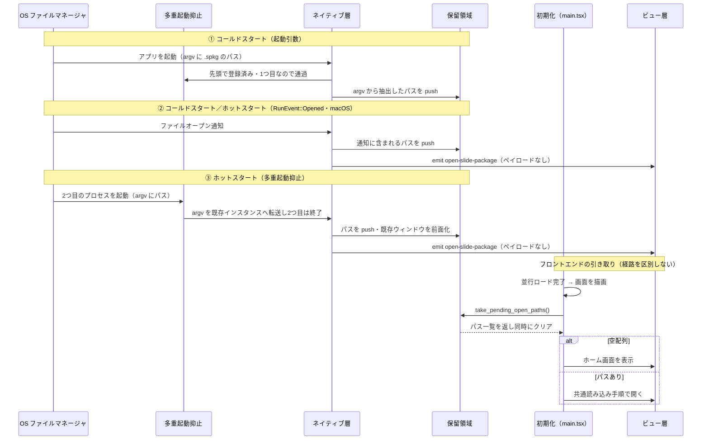
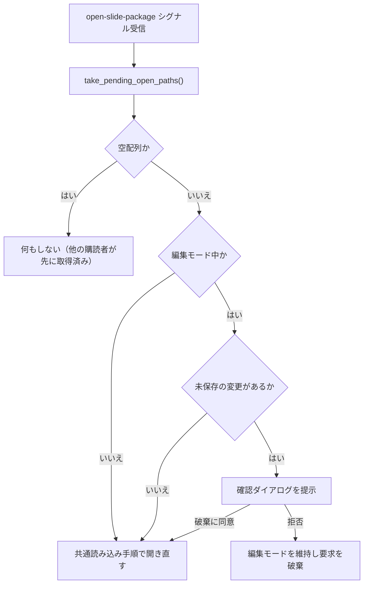
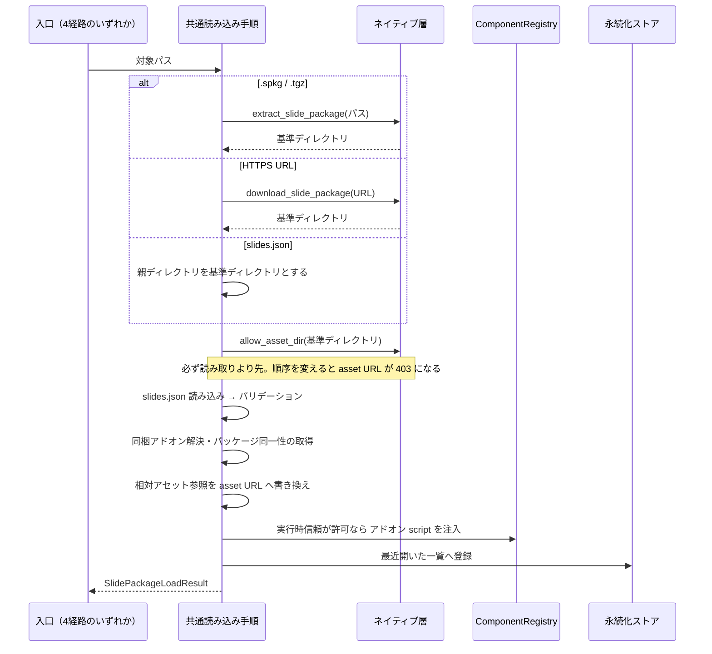

# スライドパッケージを開く経路

**ドキュメント種別:** 抽象仕様書 (Spec)
**SDDフェーズ:** Specify (仕様化)
**最終更新日:** 2026-07-28
**関連 Design Doc:** [slide-package-open_design.md](./slide-package-open_design.md)
**関連 PRD:** [slide-package-open.md](../requirement/slide-package-open.md)

---

# 1. 背景

スライド資料をアプリに読み込ませる入口は、実装上すでに3つある（ホーム画面のファイル選択ボタン / URL 入力 / 最近開いたスライド一覧）。しかしそのいずれも `.sdd` に UR/FR として定義されておらず、[presentation-foundation_spec.md](./presentation-foundation_spec.md) のユースケース表に「ホーム画面からスライド（サンプルまたはローカルパッケージ）を選ぶ」と散文で登場するだけだった。URL 取得経路は `.sdd` に完全に未記載である。

ここに4つ目の入口として **OS のファイル関連付け**（ファイルマネージャで `.spkg` をダブルクリック、または「このアプリで開く」）を追加する。これは配布された `.spkg` を受け取った側の体験を「アプリを起動 → ホーム画面 → ファイルを選ぶ」から「ダブルクリック」へ縮める。

ただし、この入口だけは他の3経路と決定的に性質が違う。**要求の発生元がアプリの外側にあり、到着タイミングをアプリが選べない**。特に次の2つが構造的な難所になる。

- **購読より先に届く**: アプリの初期化は複数の非同期ロードの完了を待ってから画面を描画するため、フロントエンドが「開く要求」を待ち受けられる状態になるまでに無視できない時間がある。この間に OS の要求が届き得る。
- **起動中にも届く**: すでにアプリが動いている状態で別のファイルを開かれた場合、新しいプロセスを起動して別ウィンドウを増やすのではなく、既存ウィンドウで開き直さなければならない。さらに、そのときアプリが**編集モードで未保存の内容を抱えている**可能性がある。

本仕様は、この4経路を1つの Feature として定義し、上記の到着タイミング問題を「取りこぼさない・二重に開かない・編集内容を失わせない」という要件として固定する。開いた後の描画は [presentation-foundation_spec.md](./presentation-foundation_spec.md) が、`.spkg` 展開とアドオンのロード順序は [package-embedded-addon_spec.md](./package-embedded-addon_spec.md) が、編集モードの未保存判定は [slide-edit-mode_spec.md](./slide-edit-mode_spec.md) が既に定義しており、本仕様はそれらを再実装せず上流／下流として接続する。

---

# 2. 概要

本機能は、スライドパッケージを開く**4つの入口**と、入口を問わず通る**共通読み込み手順**を定義する。

- **入口（既存3経路）**: ファイル選択ダイアログ / HTTPS URL / 最近開いた一覧
- **入口（新規）**: OS ファイル関連付け（macOS / Windows / Linux）
- **共通読み込み手順**: パッケージ展開 → asset スコープの動的許可 → `slides.json` のバリデーション → 同梱アドオン解決と実行時信頼判定 → 相対アセットの URL 書き換え → 最近開いた一覧への登録
- **到着タイミングの吸収**: OS から届いたパスを保留領域に蓄積し、**取得と同時にクリアする単一の取り出し口**から受け渡す。起動中の到着通知は実データを含まないシグナルとする
- **多重起動の抑止**: 起動中の要求は新プロセスを立てず、既存ウィンドウを前面化して開き直す
- **編集内容の保護**: 編集モード中の要求は確認ダイアログを挟み、破棄の同意なしに遷移しない

「なぜ通知をシグナルにして実データを取り出し口に限るのか」「なぜ多重起動抑止を最優先で登録するのか」といった技術判断とその代替案は Design Doc を参照。

## 2.1. 主要ユースケース

| アクター | ユースケース | 概要 | 関連要求 |
|------|------|------|------|
| スライド閲覧者 | ファイル選択ダイアログから開く | ホーム画面の「ファイルを開く」から `slides.json` または `.spkg`（旧 `.tgz`）を選ぶ | FR_001, FR_009 |
| スライド閲覧者 | URL から取得して開く | ホーム画面の URL 入力に HTTPS の URL を入れ、パッケージを取得して開く | FR_002, FR_009 |
| スライド閲覧者 | 最近開いた一覧から開く | 永続化された一覧から選び直す。開けなかったエントリは自動的に一覧から消える | FR_003, FR_009 |
| スライド閲覧者 | OS の関連付けから開く（アプリ未起動） | ファイルマネージャで `.spkg` をダブルクリックし、アプリが起動してそのスライドを表示する | FR_004, FR_005, FR_009 |
| スライド閲覧者 | OS の関連付けから開く（アプリ起動中） | 起動中に別の `.spkg` を開き、ウィンドウを増やさず既存ウィンドウで開き直す | FR_004, FR_006, FR_007 |
| スライド作成者 | 編集中に外部から開かれる | 編集モードで未保存の状態のときに要求が届き、破棄可否を確認される | FR_008, NFR_003 |

---

# 3. 要求定義

## 3.1. 機能要件 (Functional Requirements)

| ID | 要件 | 優先度 | 根拠 |
|------|------|------|------|
| FR_001 | ファイル選択ダイアログから `slides.json` または `.spkg`（旧 `.tgz`）を単一選択で開けること。キャンセル時は状態を変えないこと | 必須 | UR_001 |
| FR_002 | HTTPS の URL からパッケージを取得し、アプリのキャッシュへ URL 由来の安定した名前で保存して開けること。HTTPS 以外のスキームは拒否すること（取得とキャッシュの契約は [slide-package-distribution_spec.md](./slide-package-distribution_spec.md) が所有する） | 推奨 | UR_001 |
| FR_003 | 開いたパッケージのパス・タイトル・開いた時刻を上限件数つきで永続化し、一覧から選び直せること。開けなかったエントリは一覧から自動除去すること | 推奨 | UR_001 |
| FR_004 | `.spkg` を OS のファイル関連付けの対象とし、macOS / Windows / Linux のいずれでもダブルクリック・「このアプリで開く」から開けること | 必須 | UR_001 |
| FR_005 | OS から届いたパスを保留領域に蓄積し、**取得と同時にクリアする単一の取り出し口**から受け渡すこと。空の戻り値が「要求なし」を意味すること | 必須 | UR_002, NFR_001, NFR_002 |
| FR_006 | 起動中の到着通知は実データを含まないシグナルとし、受け手は必ず FR_005 の取り出し口から実データを取得すること | 必須 | UR_002, NFR_002 |
| FR_007 | 起動中に関連付け経由の要求が来たとき、新プロセスを起動せず既存ウィンドウを前面化して開き直すこと | 必須 | UR_001 |
| FR_008 | 編集モード中に外部から要求が届いたとき確認ダイアログを提示し、破棄に同意した場合のみ遷移すること。拒否時は編集モードを維持し要求を破棄すること | 必須 | UR_002, NFR_003 |
| FR_009 | 入口を問わず「展開 → asset スコープ許可 → バリデーション → アドオン解決 → アセット URL 書き換え → 最近開いた登録」の共通手順を通ること。この順序を変えないこと | 必須 | UR_001 |
| FR_010 | 関連付けの宣言をアプリ設定の1箇所に集約し、3 OS 分の登録情報をそこから生成すること | 必須 | FR_004, DC_004 |

## 3.2. 非機能要件 (Non-Functional Requirements)

| ID | カテゴリ | 要件 | 目標値 |
|------|------|------|------|
| NFR_001 | 信頼性 | フロントエンドが通知の購読を開始する前に届いた要求も失われないこと | 購読開始後の最初の取得で必ず観測できる（取りこぼし 0 件） |
| NFR_002 | 信頼性 | 同一の要求が「起動時の取得」と「通知受信後の取得」の両方で処理されないこと | 同一パスが二度開かれない（二重オープン 0 件） |
| NFR_003 | 信頼性 | 未保存の編集内容が利用者の同意なく破棄されないこと | 同意なき破棄 0 件 |
| NFR_004 | 互換性 | macOS / Windows / Linux で関連付けの登録と起動要求の受け取りが同等に成立すること | 3 OS すべてで成立。利用者体験の差なし |
| NFR_005 | 互換性 | 既存3経路・サンプル読み込み・発表者ビュー・同梱アドオンの実行時信頼・ビルド時同梱が従来どおり動作すること | `npm run typecheck` / `npm run test` および Rust 単体テストが通る |
| NFR_006 | 設計制約 | OS 依存のファイルオープン通知は対象 OS でのみ型が存在するため、参照を条件付きコンパイルで隔離し全 OS でビルドが通ること（PRD の DC_003 に対応） | 3 OS すべてでビルド成功 |

---

# 4. API

## 4.1. 公開API一覧

### フロントエンド

| ディレクトリ | ファイル名 | エクスポート | 概要 |
|------|------|------|------|
| `src/` | `localSlideLoader.ts` | `pickAndLoadSlidePackage()` | ファイル選択ダイアログを開き、選ばれたパスを共通手順で読み込む（FR_001） |
| `src/` | `localSlideLoader.ts` | `loadSlidePackageFromUrl(url)` | HTTPS URL のパッケージを取得して共通手順で読み込む（FR_002） |
| `src/` | `localSlideLoader.ts` | `openRecentSlidePackage(path)` | 最近開いた一覧のパスを読み込む。失敗時はそのエントリを一覧から除去する（FR_003） |
| `src/` | `localSlideLoader.ts` | `getRecentSlidePackages()` | 永続化された最近開いた一覧を取得する（FR_003） |
| `src/` | `localSlideLoader.ts` | `removeRecentSlidePackage(path)` | 最近開いた一覧から明示的に1件削除する（FR_003） |
| `src/` | `localSlideLoader.ts` | `resolveLocalAssetPaths(value, baseDir)` | `image/` `voice/` `theme/` `font/` の相対参照をローカル asset URL に再帰的に書き換える（FR_009） |
| `src/` | `slidePackageArchive.ts` | `isSlidePackageArchivePath(path)` | パスがパッケージ書庫（`.spkg` / `.tgz`）かを判定する（FR_001, FR_004） |
| `src/` | `slidePackageArchive.ts` | `SLIDE_PACKAGE_ARCHIVE_EXTENSIONS` | 受け付けるパッケージ拡張子の単一真実源（FR_001, FR_004） |

### ネイティブコマンド（Rust → フロントエンド）

| コマンド | シグネチャ | 概要 |
|------|------|------|
| `allow_asset_dir` | `(dir: string) -> void` | 指定ディレクトリ配下に asset プロトコルと fs の読み取りスコープを再帰的に許可する（FR_009 の第2手順） |
| `extract_slide_package` | `(packagePath: string) -> string` | `.spkg` / 旧 `.tgz` をアプリのキャッシュへ展開し、内容の基準ディレクトリを返す（FR_009 の第1手順） |
| `download_slide_package` | `(url: string, options?: DownloadOptions) -> string` | HTTPS URL のパッケージを取得・展開し、基準ディレクトリを返す（FR_002）。`options`（タイムアウト・キャッシュ再利用・キャッシュキー）の契約は [slide-package-distribution_spec.md](./slide-package-distribution_spec.md) が所有する。未指定時は従来の挙動 |
| **`take_pending_open_paths`** | **`() -> string[]`** | **保留領域のパス一覧を返し、同時にクリアする（取得とクリアは不可分）。空配列は「開く要求なし」を意味する。FR_005 の唯一の取り出し口（DC_001）** |

### ネイティブイベント（Rust → フロントエンド）

| イベント名 | ペイロード | 概要 |
|------|------|------|
| **`open-slide-package`** | **なし** | **保留領域に新しいパスが積まれたことだけを知らせるシグナル。受け手は必ず `take_pending_open_paths` を呼んで実データを取得する（FR_006・DC_001）** |

> **`presenter-view` イベントとの違い**: 発表者ビューのイベント（[presenter-view_spec.md](./presenter-view_spec.md)）は `PresenterViewMessage` をペイロードで運ぶ。本イベントがペイロードを持たないのは意図的な非対称であり、その理由（二重オープンの構造的防止）は Design Doc の設計判断に記す。

## 4.2. 型定義

```typescript
/** 共通手順を通過した読み込み結果（既存） */
interface LoadedSlidePackage {
  data: PresentationData
  /** 書換前の元 slides.json テキスト（編集モードの無損失往復の土台） */
  rawText: string
  baseDir: string
  /** 利用者が選択した元パス（.spkg/.tgz または slides.json）。信頼判断の永続化キー */
  sourcePath: string
  /** asset URL 化済みのアドオンバンドル URL */
  addonScripts: string[]
  /** package.json 由来の書き出し用 name/version */
  identity: SlidePackageIdentity
  /** アドオン登録の所有者スコープ（= baseDir） */
  owner: string
}

/** 読み込み結果と最近開いた一覧の更新をまとめて返す（既存） */
interface SlidePackageLoadResult {
  data: LoadedSlidePackage | null
  /** null のときは一覧に変更なし */
  recentPackages: RecentSlidePackageEntry[] | null
}

/** 最近開いた一覧の1件（既存） */
interface RecentSlidePackageEntry {
  path: string
  title: string
  openedAt: number
}
```

```rust
/// 保留領域（新規）。OS から届いたパスをフロントエンドが取り出すまで保持する
struct PendingOpenPaths(Mutex<Vec<String>>);

/// FR_005 の唯一の取り出し口（新規）。取得とクリアが不可分。
/// JS 境界では Ok が resolve・Err が reject（Result にした理由は design の 4.3 が持つ）
#[tauri::command]
fn take_pending_open_paths(state: State<PendingOpenPaths>) -> Result<Vec<String>, String>;
```

---

# 5. 用語集

基本用語（スライドパッケージ / ファイル関連付け / コールドスタート / ホットスタート / 保留領域 / 取り出し口 / シグナル / 多重起動抑止 / 共通読み込み手順）は [slide-package-open.md](../requirement/slide-package-open.md) の用語集で定義済み。本仕様が新たに導入する用語のみを以下に示す。

| 用語 | 説明 |
|------|------|
| take セマンティクス | 「読む」と「消す」を不可分に行う取り出し規約。2つの取得経路の排他がネイティブ側で原子的に成立する |
| 基準ディレクトリ（baseDir） | `slides.json` が置かれたディレクトリ。相対アセット参照の解決基準であり、アドオン登録の所有者スコープでもある |

---

# 6. 使用例

## 6.1. 起動時に保留された要求を引き取る

```tsx
import { invoke } from '@tauri-apps/api/core'

// 初期化の並行ロードが終わった直後に一度だけ取得する。
// 空配列なら「OS 経由の開く要求なし」＝通常のホーム画面表示。
const pending = await invoke<string[]>('take_pending_open_paths')
if (pending.length > 0) {
  // 複数件（macOS の一括オープン）は最後の1件を採用する（単一ウィンドウアプリ）
  await openFromExternalRequest(pending[pending.length - 1])
}
```

## 6.2. 起動中の到着シグナルを購読する

```tsx
import { listen } from '@tauri-apps/api/event'
import { invoke } from '@tauri-apps/api/core'

// ペイロードは読まない（存在しない）。シグナルを受けたら取り出し口を叩くだけ。
const unlisten = await listen('open-slide-package', async () => {
  const paths = await invoke<string[]>('take_pending_open_paths')
  if (paths.length > 0) {
    await openFromExternalRequest(paths[paths.length - 1])
  }
})
```

## 6.3. 既存3経路（変更なし）

```tsx
import { pickAndLoadSlidePackage, loadSlidePackageFromUrl, openRecentSlidePackage } from './localSlideLoader'

// FR_001: ダイアログから選ぶ（キャンセル時は data: null, recentPackages: null）
const picked = await pickAndLoadSlidePackage()

// FR_002: HTTPS URL から取得する
const fromUrl = await loadSlidePackageFromUrl('https://example.com/deck.spkg')

// FR_003: 最近開いた一覧から選び直す（失敗時は該当エントリが除去された一覧が返る）
const fromRecent = await openRecentSlidePackage(entry.path)
```

---

# 7. 振る舞い図

## 7.1. 起動シーケンス（3経路の分岐）

OS から要求が届く経路は3つあり、いずれも**最終的に保留領域へ集約**される。フロントエンドは取り出し口を叩くだけでよく、どの経路で届いたかを知る必要がない。

| 経路 | 発生条件 | 対象 OS |
|:---|:---|:---|
| ① OS 起動引数 | コールドスタート。プロセスの引数として対象パスが渡る | Windows / Linux（macOS でも起こり得る） |
| ② `RunEvent::Opened` | コールドスタート／ホットスタート。専用のファイルオープン通知として届く。**このバリアントは macOS / iOS / Android でのみ存在する** | macOS |
| ③ 多重起動抑止のコールバック | ホットスタート。2つ目のプロセスの起動引数が既存インスタンスへ転送される | Windows / Linux |



> **①②③ のいずれでも、フロントエンドが観測するのは「保留領域の中身」だけである。** ②③ のシグナルは「もう一度取り出し口を叩け」という合図に過ぎず、購読開始前に届いた ① の内容と混ざっても、取り出し口が取得と同時にクリアするため二重に処理されない（NFR_001 / NFR_002）。

## 7.2. ホットスタート時の遷移判定



## 7.3. 共通読み込み手順（入口を問わず同一）



---

# 8. 制約事項

- OS 依存のファイルオープン通知（`RunEvent::Opened`）は macOS / iOS / Android でのみ存在するバリアントであり、他 OS ではその型自体が存在しない。参照を条件付きコンパイルで隔離すること（NFR_006）
- 多重起動抑止の仕組みは、他のプラグイン・状態・コマンド登録より先に登録すること。初期化フェーズ内での登録では二重起動の判定に間に合わない
- Linux ではデスクトップエントリの MIME 型宣言だけでは関連付けが成立せず、MIME 型そのものの定義を別途同梱する必要がある
- 保留領域からの取り出し口は1つに限り、取得とクリアを不可分に行うこと。到着通知に実データを載せないこと
- `allow_asset_dir` → 読み取り → アドオン注入の順序を変えないこと（[package-embedded-addon_spec.md](./package-embedded-addon_spec.md)）
- 旧 `.tgz` は開く側の後方互換として維持するが、OS 関連付けの対象にはしない（汎用の tar+gzip 拡張子を奪わない）
- 外部から取得したデータのバリデーションは既存の構造化 `ValidationError` を踏襲すること（D-002）
- TypeScript strict mode での型安全性を確保すること（T-001）
- 関連付け経由で開けなかった場合も、ホーム画面からの既存経路で従来どおり開けること（A-005: フォールバックファースト設計）

---

## PRD参照

- 対応 PRD: [slide-package-open.md](../requirement/slide-package-open.md)
- カバーする要求: UR_001, UR_002, FR_001, FR_002, FR_003, FR_004, FR_005, FR_006, FR_007, FR_008, FR_009, NFR_001, NFR_002, NFR_003, NFR_004, NFR_005, DC_001, DC_002, DC_003, DC_004, DC_005
