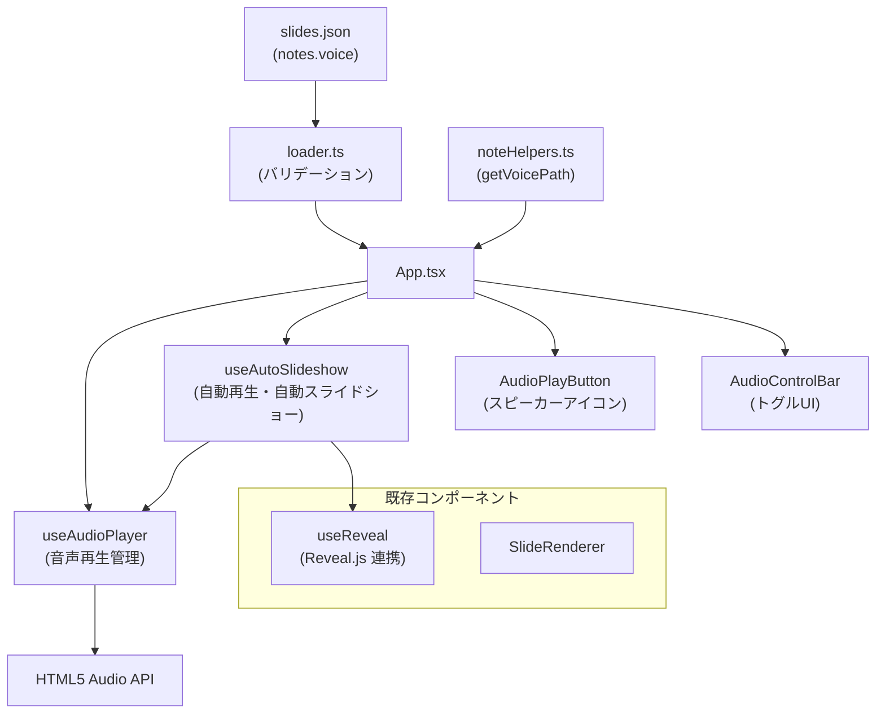

# スピーカーノート音声再生（Speaker Note Audio）

**ドキュメント種別:** 技術設計書 (Design Doc)
**SDDフェーズ:** Plan (計画/設計)
**最終更新日:** 2026-02-01
**関連 Spec:** [speaker-note-audio_spec.md](./speaker-note-audio_spec.md)
**関連 PRD:** [speaker-note-audio.md](../requirement/speaker-note-audio.md)

---

# 1. 実装ステータス

**ステータス:** 🟢 実装完了

## 1.1. 実装進捗

| モジュール/機能 | ステータス | 備考 |
|----------|----------|------|
| SlideNotes 型拡張（voice フィールド） | 🟢 | types.ts に voice を追加 |
| noteHelpers 拡張（getVoicePath） | 🟢 | noteHelpers.ts に追加 |
| バリデーション拡張 | 🟢 | loader.ts の voice フィールドバリデーション |
| useAudioPlayer フック | 🟢 | 音声再生・停止・状態管理 |
| useAutoSlideshow フック | 🟢 | 自動再生・自動スライドショー管理 |
| AudioPlayButton コンポーネント | 🟢 | SVGアイコン + CSS Modules |
| AudioControlBar コンポーネント | 🟢 | トグルUI + aria-pressed |
| App.tsx 統合 | 🟢 | フック接続とUI配置 |

---

# 2. 設計目標

1. **データ駆動型アーキテクチャの維持**: voice フィールドを既存の notes オブジェクトに追加し、slides.json のデータ構造を自然に拡張する（A-003 準拠）
2. **既存コードへの影響最小化**: 既存の SlideNotes 型・noteHelpers・SlideRenderer に対して後方互換性を保つ。voice フィールドはオプショナルであり、既存データは変更なしで動作する
3. **フォールバックファースト**: 音声ファイル未定義・読み込み失敗時にもプレゼンテーション表示に影響を与えない（A-005 準拠）
4. **リソースのクリーンアップ**: Audio オブジェクトのライフサイクルを useEffect で管理し、スライド遷移時・アンマウント時に確実にリソースを解放する（T-003 準拠）
5. **コンポーネント分離**: 音声再生ロジック（フック）とUI（コンポーネント）を分離し、テスタビリティと再利用性を確保する（A-001 準拠）

---

# 3. 技術スタック

| 領域 | 採用技術 | 選定理由 |
|------|------|------|
| 音声再生 | HTML5 Audio API | ブラウザ標準API。外部ライブラリ不要でシンプル。再生・停止・ended イベントが利用可能 |
| 状態管理 | React useState / useRef | 既存パターンに従う。音声再生状態はローカルステートで管理可能 |
| ライフサイクル | React useEffect | T-003 準拠。Audio オブジェクトの生成・破棄を管理 |
| アイコン | MUI Icons（VolumeUp, VolumeOff 等） | 既存プロジェクトで MUI を使用済み。ComponentRegistry 経由で登録 |
| スタイリング | CSS 変数 + MUI sx prop | A-002 準拠。簡易なボタンスタイルは sx prop で十分 |
| スライド遷移 | Reveal.js API（`Reveal.next()`） | 既存の useReveal フック経由。T-002 準拠 |

---

# 4. アーキテクチャ

## 4.1. システム構成図



## 4.2. モジュール分割

| モジュール名 | 責務 | 依存関係 | 配置場所 |
|--------|------|------|------|
| `SlideNotes` 型拡張 | notes に voice フィールドを追加 | なし | `src/data/types.ts` |
| `getVoicePath()` | スライドから voice パスを抽出 | `types.ts`, `noteHelpers.ts` | `src/data/noteHelpers.ts` |
| バリデーション拡張 | voice フィールドの型検証 | `loader.ts` | `src/data/loader.ts` |
| `useAudioPlayer` | Audio オブジェクトの生成・再生・停止・状態管理・クリーンアップ | HTML5 Audio API | `src/hooks/useAudioPlayer.ts` |
| `useAutoSlideshow` | 自動再生・自動スライドショーの状態管理とイベント連携 | `useAudioPlayer`, Reveal.js API | `src/hooks/useAutoSlideshow.ts` |
| `AudioPlayButton` | スピーカーアイコンUI（再生/停止トグル） | MUI Icons | `src/components/AudioPlayButton.tsx` |
| `AudioControlBar` | 自動再生・自動スライドショーのトグルUI | MUI Switch/IconButton | `src/components/AudioControlBar.tsx` |

---

# 5. データモデル

```typescript
/** SlideNotes 型の拡張（既存フィールドはそのまま維持） */
interface SlideNotes {
  speakerNotes?: string
  summary?: string[]
  voice?: string  // 音声ファイルへの相対パス（例: "/audio/intro.mp3"）
}

/** 音声再生状態 */
type AudioPlaybackState = 'idle' | 'playing' | 'paused'
```

---

# 6. インターフェース定義

```typescript
/** useAudioPlayer フック */
function useAudioPlayer(): {
    playbackState: AudioPlaybackState
    play: (src: string) => void
    stop: () => void
    isPlaying: boolean
    onEnded: (callback: () => void) => void
  } {
}

/** useAutoSlideshow フック */
function useAutoSlideshow(options: {
  slides: SlideData[]
  currentIndex: number
  audioPlayer: UseAudioPlayerReturn
  revealNext: () => void
}): {
  autoPlay: boolean
  setAutoPlay: (enabled: boolean) => void
  autoSlideshow: boolean
  setAutoSlideshow: (enabled: boolean) => void
} {
}

/** noteHelpers 追加関数 */
function getVoicePath(slide: SlideData): string | undefined {
}
```

---

# 7. 非機能要件実現方針

| 要件 | 実現方針 |
|------|------|
| 音声再生のレスポンス | Audio オブジェクトの preload は行わない（オンデマンドロード）。再生開始までの遅延はブラウザ依存 |
| リソース管理 | useEffect のクリーンアップで audio.pause() と audio.src = '' を実行し、リソースを解放 |
| フォールバック | audio.onerror ハンドラで再生失敗時にスピーカーアイコンを無効化し、onEndedRef コールバックを呼び出す。これにより useAutoSlideshow がタイマーフォールバック（FR_AST_001）に切り替わり、自動スライドショーの進行が停止しない。プレゼン表示は継続 |
| 後方互換性 | voice フィールドはオプショナル。既存の notes データ（string 型含む）はそのまま動作 |
| ブラウザ互換性 | HTML5 Audio API はモダンブラウザで標準サポート。追加ポリフィル不要 |

---

# 8. テスト戦略

| テストレベル | 対象 | カバレッジ目標 |
|--------|------|---------|
| ユニットテスト | `getVoicePath()`, `normalizeNotes()` 拡張 | voice あり/なし/string型 notes のすべてのパターン |
| ユニットテスト | `useAudioPlayer` フック | play/stop/ended/error の状態遷移。error 時に onEndedRef コールバックが呼ばれること |
| ユニットテスト | `useAutoSlideshow` フック | autoPlay ON/OFF × autoSlideshow ON/OFF の組み合わせ |
| ユニットテスト | バリデーション拡張 | voice フィールドの型検証（string/undefined/不正値） |
| コンポーネントテスト | `AudioPlayButton` | voice あり/なし時の表示・クリック動作 |
| コンポーネントテスト | `AudioControlBar` | トグル操作・状態反映 |

---

# 9. 設計判断

## 9.1. 決定事項

| 決定事項 | 選択肢 | 決定内容 | 理由 |
|------|-----|------|------|
| 音声再生API | HTML5 Audio API / Web Audio API / Howler.js | HTML5 Audio API | 再生・停止・ended イベントのみ必要。外部ライブラリ追加は不要。シンプルさを優先（意思決定フレームワーク #3） |
| voice フィールドの配置 | `meta.notes.voice` / `meta.voice` / `content.voice` | `meta.notes.voice` | 既存の notes オブジェクトの自然な拡張。speakerNotes・summary と同じ階層で一貫性がある |
| スピーカーアイコンの配置 | スライド内オーバーレイ / スライド下部固定 / コントロールバー | スライド内オーバーレイ | スライドのコンテンツに近い位置で直感的。B-001（視覚的品質）を損なわない控えめなデザイン |
| 自動再生/自動スライドショーUI | 別パネル / フローティングコントロールバー / 設定モーダル | フローティングコントロールバー | 常時アクセス可能で操作が直感的。PresenterViewButton と同様のフローティングUI |
| Audio オブジェクト管理 | 毎回 new Audio() / シングルトン再利用 | シングルトン再利用（useRef） | スライド遷移ごとに Audio オブジェクトを作り直すとリソースリーク。useRef で1つの Audio を再利用し src を切り替え |
| Reveal.js との連携 | useReveal 拡張 / 別フックから Reveal API 直接呼出 / コールバック経由 | コールバック経由（useReveal の onSlideChanged + Reveal.next()） | 既存の useReveal インターフェースを変更せず、App.tsx でコールバック接続。A-001（コンポーネント分離）準拠 |
| 自動再生のブラウザ制限対応 | ユーザー操作なしで再生試行 / ユーザー操作後に有効化 | ユーザー操作後に有効化 | ブラウザの autoplay policy により、ユーザーインタラクションなしの再生はブロックされる。自動再生ONは「ユーザーがトグルをONにする」操作を起点とする |

## 9.2. 未解決の課題

| 課題 | 影響度 | 対応方針 |
|------|-----|------|
| ブラウザの autoplay policy | 中 | play() の Promise rejection をキャッチし、ユーザーに再操作を促すフォールバックUIを表示 |
| 音声ファイルのプリロード戦略 | 低 | 初期実装ではプリロードなし。パフォーマンス問題が発生した場合に次スライドの音声をプリロードする最適化を検討 |

---

# 10. 変更履歴

## v1.0.0 (2026-02-01)

**初版作成:**

- スピーカーノート音声再生機能の技術設計を定義
- HTML5 Audio API によるシンプルな音声再生アーキテクチャ
- 自動再生・自動スライドショーのフック設計
- 既存 notes オブジェクトへの voice フィールド拡張
