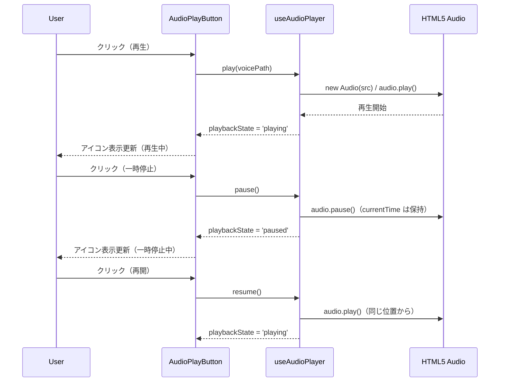
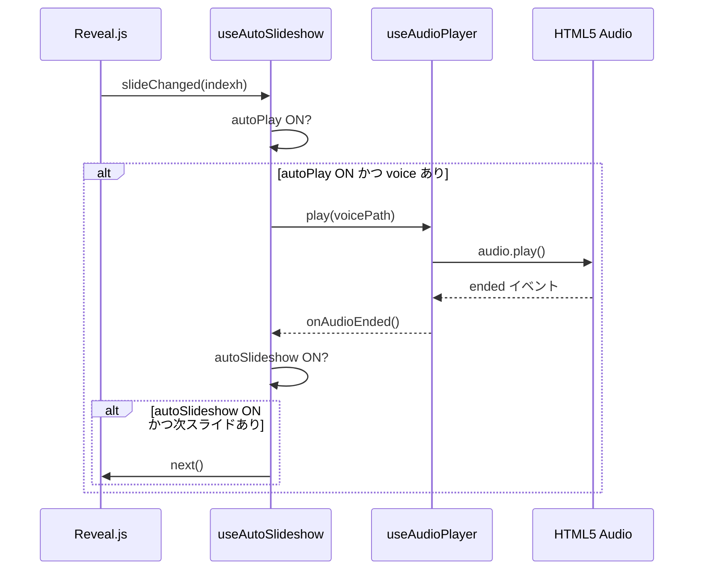
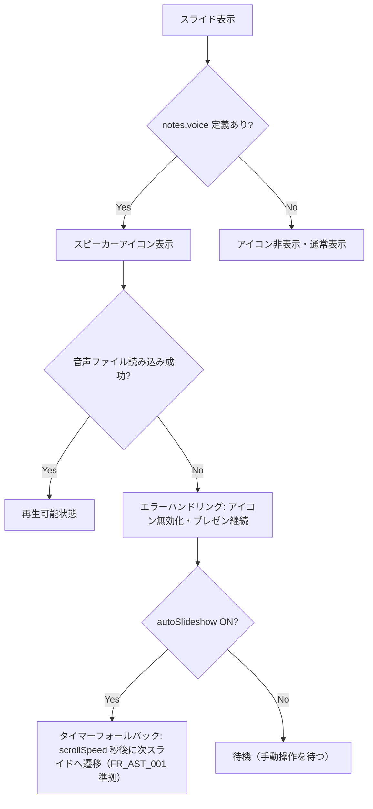

# スピーカーノート音声再生（Speaker Note Audio）

**ドキュメント種別:** 抽象仕様書 (Spec)
**SDDフェーズ:** Specify (仕様化)
**最終更新日:** 2026-07-29
**関連 Design Doc:** [speaker-note-audio_design.md](./speaker-note-audio_design.md)
**関連 PRD:** [speaker-note-audio.md](../requirement/speaker-note-audio.md)

---

# 1. 背景

プレゼンテーション実行時、スライドに紐づく音声解説を再生することで、発表者の口頭説明を補完・代替できる。特に、自習用途やハンズフリーでのプレゼンテーション進行において、音声ファイルの自動再生と自動スライド遷移は有用である。

既存の presenter-view 機能で notes フィールド（`speakerNotes`, `summary`）がサポートされているため、これを拡張して `voice` フィールドを追加し、データ駆動型アーキテクチャ（A-003）に沿った形で音声再生機能を提供する。

# 2. 概要

スライドの notes オブジェクトに `voice` フィールドとして音声ファイルパスを指定すると、そのスライドにスピーカーアイコンが表示される。ユーザーはアイコンをクリックして音声を手動再生でき、再生中に再度クリックすると一時停止、一時停止中に再度クリックすると同じ位置から再開する（play ⇄ pause ⇄ resume の単一ボタントグル）。

さらに、自動再生モードをONにするとスライド表示時に自動で音声が再生され、自動スライドショーモードをONにすると音声終了時に次のスライドへ自動遷移する。これにより、ハンズフリーでのプレゼンテーション進行を実現する。

voice フィールドが未定義のスライドではスピーカーアイコンは非表示となり、プレゼンテーションの表示に影響を与えない（A-005 準拠）。

# 3. 要求定義

## 3.1. 機能要件 (Functional Requirements)

| ID | 要件 | 優先度 | PRD参照 |
|--------|------|-----|------|
| FR-001 | notes.voice が定義されたスライドでスピーカーアイコンをクリックすると音声が再生される | 必須 | FR_SNA_001 |
| FR-002 | 再生中の音声をクリック操作で一時停止し、同じ位置から再開できる | 必須 | FR_SNA_002 |
| FR-003 | 自動再生ON時、スライド表示時に notes.voice の音声を自動再生する | 必須 | FR_SNA_003 |
| FR-004 | 自動再生のON/OFFをUIで切り替えられる（デフォルト: OFF） | 推奨 | FR_SNA_004 |
| FR-005 | 自動スライドショーON時、音声終了時に次スライドへ自動遷移する | 必須 | FR_SNA_005 |
| FR-006 | 自動スライドショーのON/OFFをUIで切り替えられる（デフォルト: OFF） | 推奨 | FR_SNA_006 |
| FR-007 | slides.json の notes オブジェクトに voice フィールドで音声ファイルパスを定義できる | 必須 | FR_SNA_007 |
| FR-008 | voice フィールドが定義されたスライドにのみスピーカーアイコンを表示する | 推奨 | FR_SNA_008 |
| FR-009 | スピーカーアイコンは再生状態（未再生/再生中）を視覚的にフィードバックする | 推奨 | FR_SNA_001 |

# 4. API

## 4.1. 公開API一覧

| ディレクトリ | ファイル名 | エクスポート | 概要 |
|--------|-------|--------|------|
| `src/data/` | `types.ts` | `SlideNotes` (型拡張) | notes に voice フィールドを追加 |
| `src/data/` | `noteHelpers.ts` | `getVoicePath()` | スライドから音声ファイルパスを抽出 |
| `src/hooks/` | `useAudioPlayer.ts` | `useAudioPlayer()` | 音声再生・一時停止・再開・停止・状態管理フック |
| `src/hooks/` | `useAutoSlideshow.ts` | `useAutoSlideshow()` | 自動再生・自動スライドショー管理フック |
| `src/components/` | `AudioPlayButton.tsx` | `AudioPlayButton` | スピーカーアイコン（再生/一時停止/再開ボタン）コンポーネント |
| `src/components/` | `AudioControlBar.tsx` | `AudioControlBar` | 自動再生・自動スライドショーのトグルUIコンポーネント |

## 4.2. 型定義

```typescript
/** SlideNotes の拡張（既存フィールドに voice を追加） */
interface SlideNotes {
  speakerNotes?: string
  summary?: string[]
  voice?: string  // 音声ファイルへの相対パス
}

/** 音声再生の状態 */
type AudioPlaybackState = 'idle' | 'playing' | 'paused'

/** useAudioPlayer の戻り値 */
interface UseAudioPlayerReturn {
  playbackState: AudioPlaybackState
  play: (src: string) => void
  pause: () => void // 現在位置を保持したまま一時停止する
  resume: () => void // 一時停止した位置から再生を再開する
  toggle: (src: string) => void // playbackState に応じて play/pause/resume のいずれかを呼ぶ（play ⇄ pause ⇄ resume トグル）
  stop: () => void
  isPlaying: boolean
  hasError: boolean // 音声読み込みに失敗した場合 true
  onEndedRef: React.MutableRefObject<(() => void) | null> // 音声終了時に呼び出すコールバックを保持する ref
  currentTime: number // 現在の再生位置（秒）
  duration: number // 音声の総時間（秒）
}

/** useAutoSlideshow の戻り値。scrollSpeed は controlled（Root の useScrollSpeed が所有）のため戻り値には含まない */
interface UseAutoSlideshowReturn {
  autoPlay: boolean
  setAutoPlay: (enabled: boolean) => void
  autoSlideshow: boolean
  setAutoSlideshow: (enabled: boolean) => void
  timerDuration: number | null // タイマーがアクティブな場合の総時間（秒）。非アクティブ時は null
}

/** AudioPlayButton のプロパティ */
interface AudioPlayButtonProps {
  playbackState: AudioPlaybackState
  hasError?: boolean // 音声読み込み失敗時はボタンを無効化しエラー表示にする
  onToggle: () => void // クリック時に play ⇄ pause ⇄ resume をトグルする
}

/** AudioControlBar のプロパティ */
interface AudioControlBarProps {
  autoPlay: boolean
  onAutoPlayChange: (enabled: boolean) => void
  autoSlideshow: boolean
  onAutoSlideshowChange: (enabled: boolean) => void
  progress?: number // 進行率（0.0〜1.0）
  progressVisible?: boolean // プログレスリングの表示/非表示
  animationDuration?: number // CSS アニメーションで 0→100% を補間する duration（秒）
  progressResetKey?: string | number // 変更するとプログレスアニメーションをリセットする key
}
```

# 5. 用語集

| 用語 | 説明 |
|------|------|
| voice フィールド | slides.json の notes オブジェクト内で音声ファイルパスを指定するプロパティ |
| スピーカーアイコン | 音声再生可能なスライドに表示されるボタンUI。play ⇄ pause ⇄ resume のトグル操作を行う |
| 自動再生 | スライド表示時に自動で notes.voice の音声を再生開始する機能 |
| 自動スライドショー | 音声再生終了時に自動で次のスライドへ遷移する機能 |
| AudioPlaybackState | 音声の再生状態を表す型（idle / playing / paused） |

# 6. 使用例

## 6.1. slides.json での voice フィールド定義

```json
{
  "slides": [
    {
      "id": "introduction",
      "layout": "center",
      "content": { "title": "はじめに" },
      "meta": {
        "notes": {
          "speakerNotes": "このスライドでは概要を説明します",
          "summary": ["概要の説明", "目的の共有"],
          "voice": "/audio/introduction.mp3"
        }
      }
    },
    {
      "id": "details",
      "layout": "content",
      "content": { "title": "詳細" },
      "meta": {
        "notes": {
          "speakerNotes": "詳細な説明です"
        }
      }
    }
  ]
}
```

上記の例で、`introduction` スライドにはスピーカーアイコンが表示され、`details` スライドには voice が未定義のため表示されない。

## 6.2. コンポーネント使用例

```tsx
import { AudioPlayButton } from './components/AudioPlayButton'
import { useAudioPlayer } from './hooks/useAudioPlayer'

function SlideAudioControl({ voicePath }: { voicePath: string }) {
  const { playbackState, hasError, toggle } = useAudioPlayer()

  const handleToggle = () => toggle(voicePath)

  return <AudioPlayButton playbackState={playbackState} hasError={hasError} onToggle={handleToggle} />
}
```

# 7. 振る舞い図

## 7.1. 手動再生フロー（play ⇄ pause ⇄ resume）


```mermaid
sequenceDiagram
    participant User
    participant AudioPlayButton
    participant useAudioPlayer
    participant HTMLAudio as HTML5 Audio

    User ->> AudioPlayButton: クリック（再生）
    AudioPlayButton ->> useAudioPlayer: play(voicePath)
    useAudioPlayer ->> HTMLAudio: new Audio(src) / audio.play()
    HTMLAudio -->> useAudioPlayer: 再生開始
    useAudioPlayer -->> AudioPlayButton: playbackState = 'playing'
    AudioPlayButton -->> User: アイコン表示更新（再生中）

    User ->> AudioPlayButton: クリック（一時停止）
    AudioPlayButton ->> useAudioPlayer: pause()
    useAudioPlayer ->> HTMLAudio: audio.pause()（currentTime は保持）
    useAudioPlayer -->> AudioPlayButton: playbackState = 'paused'
    AudioPlayButton -->> User: アイコン表示更新（一時停止中）

    User ->> AudioPlayButton: クリック（再開）
    AudioPlayButton ->> useAudioPlayer: resume()
    useAudioPlayer ->> HTMLAudio: audio.play()（同じ位置から）
    useAudioPlayer -->> AudioPlayButton: playbackState = 'playing'
```

## 7.2. 自動再生 + 自動スライドショーフロー


```mermaid
sequenceDiagram
    participant Reveal as Reveal.js
    participant useAutoSlideshow
    participant useAudioPlayer
    participant HTMLAudio as HTML5 Audio

    Reveal ->> useAutoSlideshow: slideChanged(indexh)
    useAutoSlideshow ->> useAutoSlideshow: autoPlay ON?

    alt autoPlay ON かつ voice あり
        useAutoSlideshow ->> useAudioPlayer: play(voicePath)
        useAudioPlayer ->> HTMLAudio: audio.play()
        HTMLAudio -->> useAudioPlayer: ended イベント
        useAudioPlayer -->> useAutoSlideshow: onAudioEnded()
        useAutoSlideshow ->> useAutoSlideshow: autoSlideshow ON?
        alt autoSlideshow ON かつ次スライドあり
            useAutoSlideshow ->> Reveal: next()
        end
    end
```

## 7.3. フォールバック動作


```mermaid
flowchart TD
    A[スライド表示] --> B{notes.voice 定義あり?}
    B -- Yes --> C[スピーカーアイコン表示]
    B -- No --> D["アイコン非表示・通常表示"]
    C --> E{音声ファイル読み込み成功?}
    E -- Yes --> F[再生可能状態]
    E -- No --> G["エラーハンドリング: アイコン無効化・プレゼン継続"]
    G --> H{autoSlideshow ON?}
    H -- Yes --> I["タイマーフォールバック: scrollSpeed 秒後に次スライドへ遷移（FR_AST_001 準拠）"]
    H -- No --> J["待機（手動操作を待つ）"]
```

音声ファイルの読み込みに失敗した場合、自動スライドショー動作中であればタイマーベース自動スクロール（FR_AST_001）にフォールバックし、自動進行が停止しないようにする。

# 8. 制約事項

- 音声ファイルパスはすべて slides.json のデータで管理する（A-003 準拠）
- voice 未定義のスライドではエラーなくフォールバックする（A-005 準拠）
- 音声オブジェクトのライフサイクルは useEffect で管理し、クリーンアップ時にリソースを解放する（T-003 準拠）
- slides.json の voice フィールドはバリデーションを実施する（D-002 準拠）
- スタイリングは3層モデルに従い、テーマカラーは CSS変数経由で参照する（A-002 準拠）
- 音声再生UI（スピーカーアイコン・自動再生コントロールバー・進捗リング）はプレゼンテーションの視覚的品質と伝達力を損なわない、控えめなデザイン・配置とする（B-001 準拠）

---

## PRD参照

- 対応PRD: [speaker-note-audio.md](../requirement/speaker-note-audio.md)
- カバーする要求: UR_SNA_001, FR_SNA_001, FR_SNA_002, FR_SNA_003, FR_SNA_004, FR_SNA_005, FR_SNA_006, FR_SNA_007, FR_SNA_008, DC_SNA_001, DC_SNA_002, DC_SNA_003
