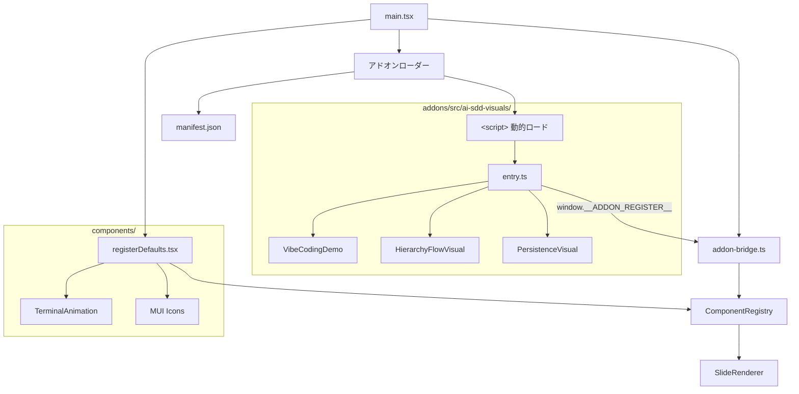

# ビジュアルコンポーネントのアドオン化

**ドキュメント種別:** 技術設計書 (Design Doc)
**SDDフェーズ:** Plan (計画/設計)
**最終更新日:** 2026-01-30
**関連 Spec:** [visual-addon_spec.md](./visual-addon_spec.md)
**関連 PRD:** [visual-addon.md](../requirement/visual-addon.md)

---

# 1. 実装ステータス

**ステータス:** 🟢 実装完了

## 1.1. 実装進捗

| モジュール/機能                                  | ステータス | 備考 |
|----------------------------------------------|----------|------|
| `addons/src/ai-sdd-visuals/entry.ts`         | 🟢       | アドオン登録エントリポイント（各アドオン内に配置） |
| `addons/vite.config.ts`                      | 🟢       | IIFE ビルド設定（自動検出方式） |
| ビジュアルファイル移動（`addons/src/ai-sdd-visuals/`）  | 🟢       | 3コンポーネント + CSS Modules + icons.tsx |
| `src/addon-bridge.ts`                        | 🟢       | グローバル登録インターフェース |
| `src/main.tsx` アドオンローダー                    | 🟢       | manifest fetch + スクリプト動的ロード |
| `src/components/registerDefaults.tsx` 修正     | 🟢       | ビジュアル3つの登録を削除 |
| `vite.config.ts` dev/prod アドオン配信設定          | 🟢       | alias + copyAddonsPlugin |
| `src/visuals/` 削除                            | 🟢       |      |

---

# 2. 設計目標

1. **本体との完全分離**: ビジュアルコンポーネントを `src/` 外の `addons/` に配置し、独立した IIFE バンドルとしてビルドする
2. **既存動作の維持**: ComponentRegistry の仕組みを変更せず、表示・動作に影響を与えない（DC-001, DC-002）
3. **宣言的管理**: アドオンの有効/無効を manifest.json で宣言的に管理し、ホストアプリのソースコード変更を不要にする（FR-003）
4. **動的ロード**: ランタイムでのスクリプト動的ロードにより、ビルド時の静的結合を排除する

---

# 3. 技術スタック

| 領域               | 採用技術                    | 選定理由                                         |
|-------------------|--------------------------|------------------------------------------------|
| アドオンビルド         | Vite（IIFE ライブラリモード）    | プロジェクト既存のビルドツールを活用。IIFE 形式で独立バンドル生成          |
| コンポーネント登録       | ComponentRegistry        | 既存の仕組みを活用し、変更を最小化（DC-001）                   |
| スタイル             | CSS Modules（JS インライン化） | 各ビジュアルが CSS Modules を使用。ビルド時に JS バンドルにインライン化  |
| ランタイムロード        | `<script>` タグ動的挿入       | 外部依存なしの最もシンプルなスクリプトロード方式                    |
| React 共有         | window グローバル経由          | ホストアプリの React インスタンスをアドオンが共有（バンドル重複回避）      |

---

# 4. アーキテクチャ

## 4.1. システム構成図



## 4.2. モジュール分割

| モジュール名                  | 責務                                           | 依存関係                               | 配置場所                               |
|--------------------------|----------------------------------------------|-------------------------------------|---------------------------------------|
| `addon-bridge.ts`        | グローバル登録関数のセットアップ、React インスタンス公開             | ComponentRegistry, React             | `src/addon-bridge.ts`                 |
| `main.tsx`（ローダー部分）     | manifest.json の fetch とアドオンスクリプト動的ロード        | addon-bridge.ts                      | `src/main.tsx`                        |
| `entry.ts`               | アドオンのコンポーネントを `__ADDON_REGISTER__` 経由で登録     | 各ビジュアルコンポーネント, window グローバル         | `addons/src/ai-sdd-visuals/entry.ts`  |
| `vite.config.ts`         | アドオンの IIFE ビルド設定、自動検出、CSS インライン化、manifest 生成 | Vite                                 | `addons/vite.config.ts`               |
| ビジュアルコンポーネント（3つ）       | 各ビジュアルの描画ロジック                               | React, CSS Modules                   | `addons/src/ai-sdd-visuals/`          |

## 4.3. ディレクトリ構成

```
project-root/
├── addons/                                  # アドオンディレクトリ（src/ 外）
│   ├── vite.config.ts                       # アドオンビルド設定（自動検出方式）
│   ├── src/                                 # アドオンコンテンツ（git 管理外）
│   │   └── ai-sdd-visuals/                  # プレゼン固有ビジュアル
│   │       ├── entry.ts                     # 登録エントリポイント（規約: 各アドオンに必須）
│   │       ├── icons.tsx                    # SVG アイコンユーティリティ
│   │       ├── VibeCodingDemo.tsx
│   │       ├── VibeCodingDemo.module.css
│   │       ├── HierarchyFlowVisual.tsx
│   │       ├── HierarchyFlowVisual.module.css
│   │       ├── PersistenceVisual.tsx
│   │       └── PersistenceVisual.module.css
│   └── dist/                                # ビルド出力（git 管理外）
│       ├── addons.iife.js
│       └── manifest.json
├── src/
│   ├── addon-bridge.ts                      # グローバル登録インターフェース
│   ├── main.tsx                             # エントリポイント（アドオンローダー含む）
│   └── components/
│       ├── ComponentRegistry.tsx             # 変更なし
│       └── registerDefaults.tsx              # ビジュアル3つの登録を削除
└── vite.config.ts                           # dev: alias, prod: copyAddonsPlugin
```

---

# 5. データモデル

## 5.1. manifest.json

```typescript
type AddonManifest = {
  addons: Array<{
    name: string    // アドオン名
    bundle: string  // バンドルファイルのパス
  }>
}
```

## 5.2. グローバルインターフェース

```typescript
declare global {
  interface Window {
    __ADDON_REGISTER__?: (
      addonName: string,
      components: Array<{ name: string; component: React.ComponentType<Record<string, unknown>> }>
    ) => void
    React?: typeof React
    ReactJSXRuntime?: typeof ReactJSXRuntime
  }
}
```

---

# 6. インターフェース定義

## 6.1. addon-bridge.ts（ホスト側）

```typescript
// src/addon-bridge.ts
import React from 'react'
import * as ReactJSXRuntime from 'react/jsx-runtime'
import { registerComponent, type RegisteredComponent } from './components/ComponentRegistry'

// アドオン IIFE が参照するグローバル変数を公開
window.React = React
window.ReactJSXRuntime = ReactJSXRuntime

// アドオン登録コールバックを定義
window.__ADDON_REGISTER__ = (
  _addonName: string,
  components: Array<{ name: string; component: RegisteredComponent }>
) => {
  for (const { name, component } of components) {
    registerComponent(name, component)
  }
}
```

## 6.2. entry.ts（アドオン側）

```typescript
// addons/src/ai-sdd-visuals/entry.ts
import { VibeCodingDemo } from './VibeCodingDemo'
import { HierarchyFlowVisual } from './HierarchyFlowVisual'
import { PersistenceVisual } from './PersistenceVisual'

const register = window.__ADDON_REGISTER__
if (register) {
  register('ai-sdd-visuals', [
    { name: 'VibeCodingDemo', component: VibeCodingDemo },
    { name: 'HierarchyFlowVisual', component: HierarchyFlowVisual },
    { name: 'PersistenceVisual', component: PersistenceVisual },
  ])
}
```

---

# 7. 非機能要件実現方針

| 要件                     | 実現方針                                          |
|------------------------|------------------------------------------------|
| 型安全性（T-001）           | アドオンソースは tsconfig.json の `include` に含め、型チェック対象。vite.config.ts は `exclude` |
| 表示互換性（DC-002）        | CSS Modules をビルド時に JS にインライン化。ランタイムで `<style>` タグとして注入 |
| ビルド互換性                | `npm run build:addons` で独立ビルド。メインビルドの前に実行される  |
| ビルドサイズ（NFR-001）      | React を external 指定しバンドルに含めない。CSS インライン化で追加ファイルなし |
| 開発者体験（NFR-002）        | manifest.json のエントリ追加/削除のみでアドオン管理。ホストアプリのソースコード変更不要 |
| dev server 対応          | `resolve.alias` で `/addons` を `addons/.../dist/` にマッピング |
| prod ビルド対応            | `copyAddonsPlugin` で `addons/.../dist/` を `dist/addons/` にコピー |

---

# 8. テスト戦略

| テストレベル | 対象                           | カバレッジ目標 |
|-----------|------------------------------|----------|
| 型チェック    | `npx tsc --noEmit`           | エラー 0件   |
| ユニットテスト | `npx vitest run`（既存34件）       | 全件パス    |
| アドオンビルド | `npm run build:addons`       | エラー 0件、dist/ に出力 |
| ビルド      | `npm run build`              | エラー 0件、dist/addons/ にコピー |
| 表示確認    | ブラウザでの目視確認                   | 既存と同一    |

---

# 9. 設計判断

## 9.1. 決定事項

| 決定事項                   | 選択肢                                                    | 決定内容                                  | 理由                                                         |
|------------------------|--------------------------------------------------------|--------------------------------------|------------------------------------------------------------|
| アドオン配置場所              | (A) `src/addons/` (B) ルートレベル `addons/`                  | (B) ルートレベル `addons/`                  | ホストアプリの `src/` から完全に分離し、独立したビルドプロセスを明確化するため             |
| バンドル形式                | (A) ESM (B) IIFE (C) UMD                                | (B) IIFE                              | `<script>` タグでの動的ロードに最適。即時実行で登録が完了する                     |
| アドオン登録方式              | (A) static import (B) dynamic import (C) window グローバルコールバック | (C) window グローバルコールバック               | IIFE バンドルとの親和性が高い。React の共有も window 経由で自然に実現             |
| 有効/無効管理方式             | (A) import 追加/削除 (B) manifest.json (C) 環境変数             | (B) manifest.json                     | ホストアプリのソースコード変更不要。宣言的で拡張性が高い                           |
| CSS 管理方針              | (A) 外部 CSS ファイル (B) JS インライン化                           | (B) JS インライン化                         | IIFE バンドルの自己完結性を確保。追加のファイル配信設定が不要                       |
| React 共有方式            | (A) バンドルに含める (B) window グローバル経由                          | (B) window グローバル経由                    | React の重複を避け、ホストアプリとの状態共有を保証                             |
| dev server 配信方式       | (A) proxy (B) resolve alias                              | (B) resolve alias                     | 設定がシンプルで、Vite のモジュール解決と統合的に動作する                         |
| prod ビルド配信方式          | (A) public/ にコピー (B) カスタムプラグインで dist/ にコピー               | (B) カスタムプラグイン（copyAddonsPlugin）      | アドオンの dist/ をそのまま配信ディレクトリにコピー。public/ への依存を排除           |

---

# 10. 変更履歴

## v3.0.0 (2026-01-30)

**変更内容:**

- `addons/` 構成を再編: ビルド基盤（`vite.config.ts`）とコンテンツ（`src/`）を分離
- `addons/src/*/entry.ts` 自動検出方式に変更。手動のエントリファイル管理を不要化
- `addons/src/` を gitignore 対象に変更（プラグインコンテンツとして外部配置）
- バンドルファイル名を `ai-sdd-visuals.iife.js` から `addons.iife.js` に変更（特定アドオン名に依存しない）
- `addons/entry.ts` を廃止し、各アドオンディレクトリ内の `entry.ts` に移動

## v2.0.0 (2026-01-30)

**変更内容:**

- 設計を全面改訂: 静的 import 方式から動的 IIFE バンドル方式に移行
- アドオン配置を `src/addons/` からルートレベル `addons/` に変更
- manifest.json による宣言的アドオン管理を導入
- `window.__ADDON_REGISTER__` グローバルコールバックによる動的登録方式を導入
- `addon-bridge.ts` によるホスト/アドオン間の接続インターフェースを追加
- CSS インライン化による自己完結型バンドルを実現
- dev server / prod ビルドの配信設定を追加

## v1.1.0 (2026-01-30)

**変更内容:**

- 非機能要件実現方針に NFR-001（ビルドサイズ）、NFR-002（開発者体験）を追加

## v1.0.0 (2026-01-30)

**変更内容:**

- 初版作成
- ビジュアルコンポーネントのアドオン化設計を定義（静的 import 方式）
