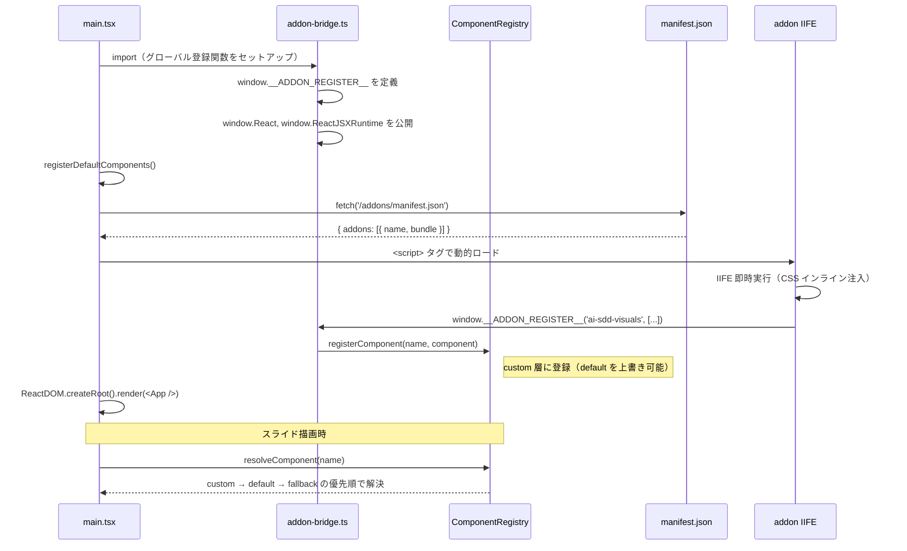

# ビジュアルコンポーネントのアドオン化

**ドキュメント種別:** 抽象仕様書 (Spec)
**SDDフェーズ:** Specify (仕様化)
**最終更新日:** 2026-01-30
**関連 Design Doc:** [visual-addon_design.md](./visual-addon_design.md)
**関連 PRD:** [visual-addon.md](../requirement/visual-addon.md)

---

# 1. 背景

プレゼンテーションアプリケーションでは、ビジュアルコンポーネント（VibeCodingDemo, HierarchyFlowVisual, PersistenceVisual）が
`src/visuals/` に配置され、`registerDefaults.tsx` でデフォルトコンポーネントとして登録されていた。これらのビジュアルは
AI-SDD デモ用の特化コンポーネントであり、プレゼンテーション本体の汎用コンポーネントとは性質が異なるが、同じ登録経路で管理されていた。

本体コードとビジュアルの結合を解消し、独立した IIFE バンドルとしてアドオン化することで、拡張性と保守性を向上させる。

# 2. 概要

ビジュアルコンポーネントを「アドオン」という単位でグループ化し、独立した IIFE バンドルとしてビルドする。アドオンはホストアプリの `src/` ディレクトリ外（`addons/`）に配置され、独自のビルド設定を持つ。

ホストアプリは起動時に `manifest.json` を fetch し、記載されたアドオンバンドルを動的にスクリプトロードする。アドオンは `window.__ADDON_REGISTER__` グローバルコールバックを通じて ComponentRegistry の custom 側にコンポーネントを登録する。

アドオンの有効/無効は、manifest.json のエントリの追加/削除で管理する。

# 3. 要求定義

## 3.1. 機能要件 (Functional Requirements)

| ID     | 要件                                       | 優先度 | 根拠                                                       | PRD参照  |
|--------|------------------------------------------|-----|----------------------------------------------------------|--------|
| FR-001 | アドオンを独立した IIFE バンドルとしてビルドする               | 必須  | ホストアプリとの完全な分離を実現し、独立した開発・ビルドを可能にするため                   | FR-001 |
| FR-002 | アドオンのコンポーネントは registerComponent で登録する      | 必須  | 既存の ComponentRegistry を活用し、本体コードの変更を最小化して互換性を維持するため      | FR-002 |
| FR-003 | manifest.json のエントリ追加/削除で有効/無効を管理する        | 必須  | 宣言的な設定でアドオン管理を実現し、ホストアプリのソースコード変更を不要にするため              | FR-003 |
| FR-004 | 既存3ビジュアルを addons/ 配下に移動し独立バンドルとして再構成する    | 必須  | AI-SDD デモ用の特化ビジュアルを本体の汎用コンポーネントから分離し、独立管理を実現するため         | FR-004 |

## 3.2. 非機能要件 (Non-Functional Requirements)

| ID      | 要件                                          | 優先度 | 根拠                                    | PRD参照   |
|---------|---------------------------------------------|-----|---------------------------------------|---------|
| NFR-001 | アドオン化によるビルドサイズの増加は最小限に抑える                   | 推奨  | ファイル分割による overhead 以上の増加は不要           | NFR-001 |
| NFR-002 | アドオンの追加・削除は manifest.json の変更のみで完結する         | 必須  | ホストアプリのソースコード修正なしにアドオンを管理できるようにするため | NFR-002 |

## 3.3. 設計制約

| ID     | 制約                           | 根拠         | PRD参照  |
|--------|------------------------------|------------|--------|
| DC-001 | ComponentRegistry の仕組みを変更しない | 既存機能の互換性維持 | DC-001 |
| DC-002 | プレゼンテーションの表示・動作に変更がないこと      | ビジネス価値の維持  | DC-002 |

# 4. API

## 4.1. ホストアプリ側

| ディレクトリ | ファイル名                | エクスポート / 役割                     | 概要                                        |
|--------|----------------------|-----------------------------------|-------------------------------------------|
| `src`  | `addon-bridge.ts`    | `window.__ADDON_REGISTER__` セットアップ | アドオンがコンポーネントを登録するためのグローバルインターフェース         |
| `src`  | `main.tsx`           | アドオンローダー                          | manifest.json の fetch とアドオンスクリプトの動的ロード     |

## 4.2. アドオン側

| ディレクトリ                  | ファイル名           | 役割                | 概要                             |
|-------------------------|-----------------|-------------------|--------------------------------|
| `addons/src/ai-sdd-visuals` | `entry.ts`  | 登録エントリポイント         | `window.__ADDON_REGISTER__` を呼びコンポーネントを登録 |
| `addons`                    | `vite.config.ts`| ビルド設定（自動検出方式）   | `src/*/entry.ts` 自動検出、IIFE バンドル生成、CSS インライン化、manifest 生成 |
| `addons/dist`               | `manifest.json` | アドオンメタデータ        | 有効アドオン一覧とバンドルパス                 |
| `addons/src/ai-sdd-visuals` | `*.tsx`         | ビジュアルコンポーネント     | プレゼン固有のビジュアル（3コンポーネント + icons）  |

## 4.3. グローバルインターフェース

```typescript
declare global {
  interface Window {
    /** アドオンがコンポーネントを登録するためのコールバック */
    __ADDON_REGISTER__?: (
      addonName: string,
      components: Array<{ name: string; component: React.ComponentType<Record<string, unknown>> }>
    ) => void

    /** アドオンが共有する React インスタンス */
    React?: typeof React
    ReactJSXRuntime?: typeof ReactJSXRuntime
  }
}
```

## 4.4. manifest.json スキーマ

```typescript
type AddonManifest = {
  addons: Array<{
    name: string    // アドオン名
    bundle: string  // バンドルファイルのパス（例: "/addons/addons.iife.js"）
  }>
}
```

# 5. 用語集

| 用語                     | 説明                                                               |
|------------------------|------------------------------------------------------------------|
| アドオン（Addon）            | プレゼンテーション本体から独立した IIFE バンドルとしてパッケージされたコンポーネント群      |
| IIFE バンドル              | 即時実行関数式形式の JavaScript バンドル。ロード時に即座に実行される                   |
| manifest.json          | 有効なアドオンの一覧とバンドルパスを定義する設定ファイル                          |
| addon-bridge           | ホストアプリ側のグローバル登録インターフェース（`src/addon-bridge.ts`）          |
| `__ADDON_REGISTER__`   | アドオンがコンポーネントを登録するための `window` 上のグローバルコールバック関数           |
| ComponentRegistry      | コンポーネント名から実コンポーネントを解決するレジストリ機構                        |

# 6. 使用例

```typescript
// アドオンエントリポイント（addons/src/ai-sdd-visuals/entry.ts）
import { VibeCodingDemo } from './VibeCodingDemo'
import { HierarchyFlowVisual } from './HierarchyFlowVisual'
import { PersistenceVisual } from './PersistenceVisual'

const register = window.__ADDON_REGISTER__
if (register) {
  register('ai-sdd-visuals', [
    { name: 'VibeCodingDemo', component: VibeCodingDemo },
    { name: 'HierarchyFlowVisual', component: HierarchyFlowVisual },
    { name: 'PersistenceVisual', component: PersistenceVisual },
  ])
}
```

// manifest.json（addons/dist/manifest.json）
```json
{
  "addons": [
    {
      "name": "ai-sdd-visuals",
      "bundle": "/addons/addons.iife.js"
    }
  ]
}
```

```typescript
// ホストアプリ側のアドオンロード（src/main.tsx）
async function loadAddons(): Promise<void> {
  const res = await fetch('/addons/manifest.json')
  const manifest: AddonManifest = await res.json()
  await Promise.all(manifest.addons.map((addon) => loadAddonScript(addon.bundle)))
}
```

# 7. 振る舞い図



# 8. 制約事項

- 既存の ComponentRegistry の API（registerDefaultComponent, registerComponent, resolveComponent）を変更しない（A-001）
- TypeScript strict mode に準拠する（T-001）
- Reveal.js の DOM 構造との互換性を維持する（T-002）
- プレゼンテーションの表示品質に影響を与えない（B-001）
- アドオンは React を external 指定とし、ホストアプリの React インスタンスを共有する

---

## PRD参照

- 対応PRD: [visual-addon.md](../requirement/visual-addon.md)
- カバーする要求: UR-001, FR-001, FR-002, FR-003, FR-004, DC-001, DC-002
