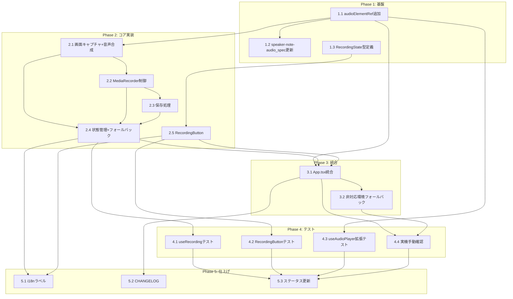

# プレゼンテーション録画（Presentation Recording）タスク分解

## メタ情報

| 項目 | 内容 |
|:---|:---|
| 機能名 | presentation-recording |
| チケット番号 | #381 |
| 技術設計書 | `.sdd/specification/presentation-recording_design.md` |
| 作成日 | 2026-08-24 |

## タスク一覧

### Phase 1: 基盤

| #   | タスク | 説明 | 完了条件 | 依存 |
|:----|:-------|:-------|:-------|:----|
| 1.1 | `useAudioPlayer` に `audioElementRef` を追加する | `src/hooks/useAudioPlayer.ts` の `UseAudioPlayerReturn` に `audioElementRef: React.RefObject<HTMLAudioElement \| null>` を追加し、内部で保持する `audioRef` をそのまま公開する。既存の再生・一時停止・再開・自動再生の動作は変更しない | 既存の `useAudioPlayer` テストが全て合格し、`audioElementRef.current` が実際の再生に使われる `HTMLAudioElement` と同一インスタンスであることを検証するテストが追加され合格する | - |
| 1.2 | `speaker-note-audio_spec.md` の `UseAudioPlayerReturn` 定義を更新する | [presentation-recording_design.md](../../specification/presentation-recording_design.md) 6章の指示に従い、`speaker-note-audio_spec.md` の該当インターフェース定義に `audioElementRef` フィールドを追記する（D-001準拠のドキュメント同期） | `speaker-note-audio_spec.md` の `UseAudioPlayerReturn` に `audioElementRef` が明記されている | 1.1 |
| 1.3 | `RecordingState` 型・`RecordingButtonProps` の雛形を定義する | `src/hooks/useRecording.ts` に `RecordingState`（`'idle' \| 'recording' \| 'saving' \| 'error'`）を定義してexportする。`src/components/RecordingButton.tsx` はこの型をimportし `RecordingButtonProps` を定義する（ロジックは未実装のまま型のみ） | `npm run typecheck` が通る | - |

### Phase 2: コア実装

| #   | タスク | 説明 | 完了条件 | 依存 |
|:----|:-------|:-------|:-------|:----|
| 2.1 | 画面キャプチャと音声合成を実装する | `useRecording` 内部で `navigator.mediaDevices.getDisplayMedia({ video: true, audio: false })` を呼び出す。成功時、`audioElementRef.current` から `AudioContext.createMediaElementSource()` → `createMediaStreamDestination()` で音声ストリームを生成し、画面キャプチャの映像トラックと合成した `MediaStream` を作る。`AudioContext`/`MediaElementAudioSourceNode` はシングルトンとして遅延生成し再利用する。音声ソースは録画用ストリームとスピーカー出力（`audioContext.destination`）の両方に接続する（design.md 9.1準拠） | `getDisplayMedia`/`AudioContext` をモックしたユニットテストで、合成後の `MediaStream` に映像・音声トラックが1本ずつ含まれることを検証できる | 1.1 |
| 2.2 | `MediaRecorder` による録画開始・停止を実装する | 合成済み `MediaStream` を `MediaRecorder` に渡し、`ondataavailable`（timeslice 1000ms）でチャンクを `Blob[]` に退避する。`start()` で録画開始、`stop()` で `MediaRecorder.stop()` と全トラックの `stop()` を呼び、`onstop` でチャンクを結合した `Blob` を生成する | `MediaRecorder` をモックしたユニットテストで、start→recording、stop→Blob生成の流れを検証できる | 2.1 |
| 2.3 | 録画停止後の保存処理を実装する | 結合済み `Blob` を `Uint8Array` に変換し、`@tauri-apps/plugin-dialog` の `save()` で保存先を取得後、`@tauri-apps/plugin-fs` の `writeFile()` で書き出す（`pdfExport.ts` と同様のパターン）。保存先選択がキャンセルされた場合は記録済みデータを破棄し `state` を `'idle'` に戻す | `save`/`writeFile` をモックしたユニットテストで、保存成功時・キャンセル時それぞれの状態遷移を検証できる | 2.2 |
| 2.4 | `useRecording` の状態管理とフォールバックを実装する | `state`（idle/recording/saving/error）を管理する。①共有選択キャンセル時（`getDisplayMedia` のreject）は `idle` を維持、②画面トラックの `onended`（OS側の共有停止操作）検知時は録画を安全に終了して保存フローに進む、③`getDisplayMedia`/`MediaRecorder` 非対応環境を検出する。全リソース（`MediaRecorder`、各 `MediaStreamTrack`、`AudioContext`）は `useEffect` のクリーンアップで解放する（T-003準拠） | FR-PR-008（キャンセル時フォールバック）・FR-PR-009（中断/エラー時フォールバック）に対応するユニットテストが全て合格する | 2.1, 2.2, 2.3 |
| 2.5 | `RecordingButton` コンポーネントを実装する | `state` に応じたSVGアイコン・スタイル（idle/recording/saving/error）を表示するトグルボタンを実装する。既存の `AudioPlayButton`/`PdfExportButton` と同様にCSS Modules + インラインSVGで構成し、`ComponentRegistry` を経由しない（A-004準拠） | コンポーネントテストで各状態の表示・クリック時の `onToggle` 呼び出しを検証できる | 1.3 |

### Phase 3: 統合

| #   | タスク | 説明 | 完了条件 | 依存 |
|:----|:-------|:-------|:-------|:----|
| 3.1 | `App.tsx` にレコーディング機能を統合する | `useAudioPlayer` の `audioElementRef` を `useRecording` に渡し、ツールバーの `PdfExportButton` の隣に `RecordingButton` を配置する。`state` に応じて `start`/`stop` を呼び分けるハンドラを接続する | 実機（macOS）でツールバーにボタンが表示され、クリックで共有選択ダイアログが開くことを確認できる | 1.1, 2.4, 2.5 |
| 3.2 | 非対応環境でのフォールバック表示を統合する | `navigator.mediaDevices?.getDisplayMedia`/`window.MediaRecorder` が存在しない場合、`RecordingButton` を無効化する（NFR-PR-002, A-005準拠） | 該当APIが存在しない環境を模したテストで、ボタンが無効化されることを確認できる | 3.1 |

### Phase 4: テスト

| #   | タスク | 説明 | 完了条件 | 依存 |
|:----|:-------|:-------|:-------|:----|
| 4.1 | `useRecording` のユニットテストを網羅する | start/stop/共有選択キャンセル/共有停止/エラーの全状態遷移、アンマウント時のリソース解放をカバーする | `npm run test` が該当テストを含めて全て合格する | 2.4 |
| 4.2 | `RecordingButton` のコンポーネントテストを追加する | idle/recording/saving/error各状態の表示とクリック動作を検証する | `npm run test` が合格する | 2.5 |
| 4.3 | `useAudioPlayer` 拡張のテストを追加する | `audioElementRef` が内部の `HTMLAudioElement` と同一であることを検証するテストケースを既存テストファイルに追加する | `npm run test` が合格する | 1.1 |
| 4.4 | 実機（macOS）での手動確認を行う | 画面録画権限の許可フロー、実際の録画→保存→動画ファイル再生確認、自動再生・自動スライドショーとの併用確認（FR-PR-004）を手動で行う | `presentation-recording_design.md` 8章の手動確認項目が全て確認済みになる | 3.1, 3.2 |

### Phase 5: 仕上げ

| #   | タスク | 説明 | 完了条件 | 依存 |
|:----|:-------|:-------|:-------|:----|
| 5.1 | i18nラベルを追加する | `assets/locales/*.json`（ja/en/fr）に録画ボタンのラベル・title（idle/recording/saving/error各状態、権限エラー時のトースト文言）を追加し、`RecordingButton`/`useRecording` から `useTranslation`/`useToast` 経由で参照する | 全ロケールファイルにキーが揃い、UIに反映される | 2.4, 2.5 |
| 5.2 | CHANGELOGへ反映する | `CHANGELOG.md`/`CHANGELOG.ja.md` に機能追加を記載する（README/スクリーンショット反映はリリース準備時に別途行うため対象外） | CHANGELOGへの記載が完了する | 3.1 |
| 5.3 | PRD/spec/design のステータスを更新する | 実装完了後、`presentation-recording.md`/`_spec.md`/`_design.md` の記述内容と実装が一致していることを確認し、`status: approved`（designは `impl-status: implemented` も）に更新する | 3ドキュメントの `status`（および `impl-status`）が実装完了状態に更新されている | 4.1, 4.2, 4.3, 4.4 |

## 依存関係図



## 実装の注意事項

- `createMediaElementSource()` は同一 `HTMLAudioElement` に対して一度しか呼び出せない。`AudioContext`/`MediaElementAudioSourceNode` は録画のたび生成し直さず、シングルトンとして再利用すること（design.md 9.1参照）
- 音声ソースをスピーカー出力にも接続し忘れると、録画開始によって通常のvoice再生が無音化する。実装後は必ずスピーカーから音声が聞こえることを実機で確認する
- Tauri capabilities（`dialog:default` / `fs:allow-write-file`）は既存のPDF書き出し機能で許可済みのため、`src-tauri/capabilities/` の変更は不要
- `RecordingButton`・録画中インジケータはスライドコンテンツではないため `ComponentRegistry` に登録しない（A-004準拠）
- macOSの画面録画権限は実機の「システム設定 > プライバシーとセキュリティ > 画面録画」での許可が必要。CI（Linux headless）では検証できないため、4.4は手動確認タスクとして分離している

## 参照ドキュメント

- 要求仕様書: `.sdd/requirement/presentation-recording.md`
- 抽象仕様書: `.sdd/specification/presentation-recording_spec.md`
- 技術設計書: `.sdd/specification/presentation-recording_design.md`
- 関連PRD: `.sdd/requirement/speaker-note-audio.md`

## 推奨する手動検証

- [ ] タスクの粒度が適切か（1タスク = 数時間〜1日程度）を確認
- [ ] 依存関係図が論理的に正しいか確認
- [ ] 要求カバレッジ表で漏れがないことを確認
- [ ] Phase分類が適切か確認

## 検証コマンド

```bash
# 関連する設計書との整合性を確認
/check-spec presentation-recording

# 仕様の不明点がないか確認
/clarify presentation-recording

# チェックリストを生成して品質基準を明確化
/checklist presentation-recording 381
```

## 要求カバレッジ

| 要求ID | 要求内容 | 対応タスク |
|:---|:---|:---|
| FR-PR-001 | ツールバーにレコーディングボタンを表示する | 2.5, 3.1 |
| FR-PR-002 | 共有選択→録画開始 | 2.1, 2.4, 3.1 |
| FR-PR-003 | voice再生音を音声トラックに含める | 2.1 |
| FR-PR-004 | 自動再生・自動スライドショーとの併用 | 3.1, 4.4 |
| FR-PR-005 | 録画中インジケータの表示 | 2.5 |
| FR-PR-006 | 録画の停止 | 2.2, 2.4 |
| FR-PR-007 | 録画ファイルの保存 | 2.3 |
| FR-PR-008 | 共有選択キャンセル時のフォールバック | 2.4, 4.1 |
| FR-PR-009 | 録画中断・エラー時のフォールバック | 2.4, 4.1 |
| NFR-PR-001 | macOS画面録画権限の案内 | 2.4, 5.1, 4.4 |
| NFR-PR-002 | 動作環境の互換性 | 3.2 |
| NFR-PR-003 | 録画中のパフォーマンス | 2.2, 4.4 |
| DC-PR-001 | 失敗時もプレゼンテーション表示を継続 | 2.4 |
| DC-PR-002 | 録画リソースのライフサイクル管理 | 2.4 |
| DC-PR-003 | 録画UIはアプリのクロムUI（ComponentRegistry対象外） | 2.5, 3.1 |
