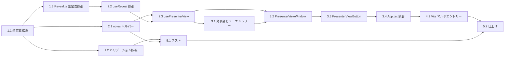

# DEM-003: 発表者ビュー（Presenter View）タスク分解

**機能名:** presenter-view
**チケット番号:** DEM-003
**関連 Design Doc:** [presenter-view_design.md](../../specification/presenter-view_design.md)
**関連 Spec:** [presenter-view_spec.md](../../specification/presenter-view_spec.md)
**関連 PRD:** [presenter-view.md](../../requirement/presenter-view.md)

---

## 依存関係図

---

## 1. 基盤タスク

### 1.1. SlideNotes 型定義と SlideMeta.notes 型拡張

**カテゴリ:** 基盤
**対象ファイル:** `src/data/types.ts`

**作業内容:**

- [ ] `SlideNotes` インターフェースを追加（`speakerNotes?: string`, `summary?: string[]`）
- [ ] `SlideMeta.notes` の型を `string | SlideNotes` に拡張
- [ ] `PresenterViewMessage` 型を追加（BroadcastChannel メッセージ型）
- [ ] `PresenterSlideState` インターフェースを追加

**完了条件:**

- `npm run typecheck` が成功する
- 既存のコードが型エラーなくコンパイルされる（後方互換性の維持）

---

### 1.2. notes フィールドのバリデーション拡張

**カテゴリ:** 基盤
**対象ファイル:** `src/data/loader.ts`
**依存:** 1.1

**作業内容:**

- [ ] `validatePresentationData()` / `getValidationErrors()` に notes フィールドのバリデーションを追加
- [ ] notes が `string`、`SlideNotes` オブジェクト、`undefined` のいずれかであることを検証
- [ ] 不正な notes 値の場合はバリデーションエラーを報告（ただしフォールバックで処理）

**完了条件:**

- notes フィールドが `string`、`SlideNotes`、`undefined` の場合にバリデーション通過
- 不正値の場合にエラーが `ValidationError[]` に含まれる
- 既存のバリデーションテストが通る

---

### 1.3. Reveal.js 型定義の拡張

**カテゴリ:** 基盤
**対象ファイル:** `src/reveal.d.ts`

**作業内容:**

- [ ] `Reveal` クラスに `on(event: string, callback: Function): void` メソッドの型を追加
- [ ] `Reveal` クラスに `off(event: string, callback: Function): void` メソッドの型を追加
- [ ] `Reveal` クラスに `getIndices(): { h: number; v: number }` メソッドの型を追加

**完了条件:**

- `npm run typecheck` が成功する

---

## 2. コアタスク

### 2.1. notes ヘルパー関数の実装

**カテゴリ:** コア
**対象ファイル:** `src/data/noteHelpers.ts`（新規）
**依存:** 1.1

**作業内容:**

- [ ] `normalizeNotes(notes: string | SlideNotes | undefined): SlideNotes` 関数を実装
  - `string` → `{ speakerNotes: string, summary: [] }`
  - `SlideNotes` → そのまま返す
  - `undefined` → `{ speakerNotes: undefined, summary: [] }`
- [ ] `getSpeakerNotes(slide: SlideData): string | undefined` 関数を実装
- [ ] `getSlideSummary(slide: SlideData): string[]` 関数を実装

**完了条件:**

- string、SlideNotes、undefined の各パターンで正しく変換される
- 既存の `SlideMeta.notes: string` データが正しく処理される

---

### 2.2. useReveal フックの拡張

**カテゴリ:** コア
**対象ファイル:** `src/hooks/useReveal.ts`
**依存:** 1.3

**作業内容:**

- [ ] `UseRevealOptions` インターフェースを追加（`onSlideChanged` コールバック）
- [ ] 戻り値を `UseRevealReturn` オブジェクト（`deckRef`, `getCurrentSlide`）に変更
- [ ] `deck.on('slidechanged', ...)` でスライド変更イベントを検知し、コールバックを呼び出す
- [ ] クリーンアップで `deck.off('slidechanged', ...)` を呼び出す
- [ ] 既存の `useReveal()` の呼び出し箇所（App.tsx）との後方互換性を維持

**完了条件:**

- 引数なしで呼び出した場合、既存と同じ動作（後方互換性）
- `onSlideChanged` コールバックがスライド遷移時に呼ばれる
- クリーンアップでイベントリスナーが解除される
- `npm run typecheck` が成功する

---

### 2.3. usePresenterView フックの実装

**カテゴリ:** コア
**対象ファイル:** `src/hooks/usePresenterView.ts`（新規）
**依存:** 2.1, 2.2

**作業内容:**

- [ ] `BroadcastChannel('presenter-view')` によるウィンドウ間通信の確立
- [ ] `openPresenterView()` — `window.open()` で発表者ビューウィンドウを開く
- [ ] スライド変更時に `slideChanged` メッセージを BroadcastChannel で送信
- [ ] `presenterViewReady` / `presenterViewClosed` メッセージの受信処理
- [ ] `isOpen` 状態の管理
- [ ] `useEffect` クリーンアップで BroadcastChannel を閉じる
- [ ] ポップアップブロック時のフォールバック（`window.open()` が `null` を返す場合）

**完了条件:**

- 発表者ビューウィンドウが開ける
- スライド変更時にメッセージが送信される
- ウィンドウクローズ時にリソースがクリーンアップされる
- ポップアップブロック時にエラーにならない

---

## 3. 統合タスク

### 3.1. 発表者ビューエントリーポイントの作成

**カテゴリ:** 統合
**対象ファイル:** `public/presenter-view.html`（新規）、`src/presenterViewEntry.tsx`（新規）
**依存:** 2.3

**作業内容:**

- [ ] `public/presenter-view.html` — 発表者ビュー用の HTML テンプレートを作成
- [ ] `src/presenterViewEntry.tsx` — React エントリーポイントを作成
  - BroadcastChannel からメッセージを受信
  - 受信したスライド状態を PresenterViewWindow に渡す
  - テーマの適用（`applyTheme`, `applyThemeData`）

**完了条件:**

- `/presenter-view.html` にアクセスして React アプリが起動する
- BroadcastChannel メッセージを受信できる

---

### 3.2. PresenterViewWindow コンポーネントの実装

**カテゴリ:** 統合
**対象ファイル:** `src/components/PresenterViewWindow.tsx`（新規）、`src/components/PresenterViewWindow.module.css`（新規）
**依存:** 2.3, 3.1

**作業内容:**

- [ ] スピーカーノート表示パネル — `normalizeNotes()` でノートを取得して表示
- [ ] 次スライドプレビューパネル — 次のスライドを SlideRenderer で縮小レンダリング
- [ ] 要点サマリーパネル — `getSlideSummary()` で箇条書きを表示
- [ ] 最終スライド時の「最後のスライドです」表示
- [ ] ノート未定義時のフォールバック（空欄表示）
- [ ] CSS Modules によるレイアウト（3パネル構成）
- [ ] CSS変数（`--theme-*`）によるテーマ対応

**完了条件:**

- 3つのパネル（ノート、プレビュー、サマリー）が表示される
- ノート未定義時に空欄が表示される（エラーなし）
- 最終スライド時に適切なメッセージが表示される

---

### 3.3. PresenterViewButton コンポーネントの実装

**カテゴリ:** 統合
**対象ファイル:** `src/components/PresenterViewButton.tsx`（新規）
**依存:** 3.2

**作業内容:**

- [ ] 発表者ビューを開くボタンUI
- [ ] `usePresenterView` フックを使用
- [ ] 発表者ビューが既に開いている場合はボタンを無効化
- [ ] ComponentRegistry への登録

**完了条件:**

- ボタンクリックで発表者ビューが開く
- 発表者ビュー表示中はボタンが無効化される

---

### 3.4. App.tsx への統合

**カテゴリ:** 統合
**対象ファイル:** `src/App.tsx`
**依存:** 3.3

**作業内容:**

- [ ] `useReveal` の呼び出しを拡張版に更新（`onSlideChanged` コールバックの接続）
- [ ] `PresenterViewButton` をプレゼンテーション画面に配置
- [ ] `usePresenterView` フックの接続

**完了条件:**

- 既存のプレゼンテーション表示が正常に動作する
- 発表者ビューボタンが表示される
- スライド操作時に発表者ビューが同期する

---

## 4. ビルド設定タスク

### 4.1. Vite マルチエントリーポイント設定

**カテゴリ:** 基盤
**対象ファイル:** `vite.config.ts`
**依存:** 3.4

**作業内容:**

- [ ] `build.rollupOptions.input` に `presenter-view.html` を追加
- [ ] 開発サーバーで `/presenter-view.html` にアクセス可能にする

**完了条件:**

- `npm run dev` で `/presenter-view.html` にアクセス可能
- `npm run build` で `dist/presenter-view.html` が生成される
- 既存のメインエントリーポイントに影響がない

---

## 5. テスト・仕上げタスク

### 5.1. ユニットテストの作成

**カテゴリ:** テスト
**対象ファイル:** `src/data/__tests__/noteHelpers.test.ts`（新規）、`src/data/__tests__/loader.test.ts`（拡張）
**依存:** 1.2, 2.1

**作業内容:**

- [ ] `normalizeNotes` のテスト — string, SlideNotes, undefined の各パターン
- [ ] `getSpeakerNotes` のテスト — ノートあり/なしのスライドデータ
- [ ] `getSlideSummary` のテスト — サマリーあり/なしのスライドデータ
- [ ] バリデーション拡張のテスト — notes フィールドの各パターン

**完了条件:**

- `npm run test` が全件パスする
- notes 関連のユニットテストカバレッジ

---

### 5.2. 動作確認と design doc 更新

**カテゴリ:** 仕上げ
**依存:** 4.1, 5.1

**作業内容:**

- [ ] `npm run dev` でメインプレゼンテーション → 発表者ビュー起動 → スライド同期の一連フローを確認
- [ ] `npm run build` でビルド成功を確認
- [ ] `npm run typecheck` でエラーなしを確認
- [ ] `presenter-view_design.md` の実装ステータスを更新

**完了条件:**

- 全コマンド（dev, build, typecheck, test）が成功する
- 発表者ビューの一連フローが正常に動作する

---

## 要求カバレッジ

| 要求ID | 要求内容 | 対応タスク |
|:---|:---|:---|
| FR-PV-001 | 発表者がUI操作により別ウィンドウで発表者ビューを開ける | 2.3, 3.3, 3.4 |
| FR-PV-002 | メインウィンドウでのスライド遷移が発表者ビューにリアルタイムで同期される | 2.2, 2.3, 3.1, 3.4 |
| FR-PV-003 | 現在のスライドに紐づくスピーカーノートが発表者ビューに表示される | 2.1, 3.2 |
| FR-PV-004 | 次のスライドのプレビューが発表者ビューに表示される | 3.2 |
| FR-PV-005 | 現在のスライドの要点サマリーが箇条書きで表示される | 2.1, 3.2 |
| FR-PV-006 | スピーカーノートデータが slides.json の notes フィールドとして定義できる | 1.1, 1.2, 2.1 |
| DC-PV-001 | データ駆動型スライドアーキテクチャ（A-003）に準拠 | 1.1, 2.1 |
| DC-PV-002 | ノート未定義時のフォールバック（A-005）に準拠 | 2.1, 3.2, 5.1 |
| FR-008 (spec) | 発表者ビューウィンドウを閉じてもメインプレゼンテーションに影響しない | 2.3 |
| FR-009 (spec) | 最終スライドでは次スライドプレビューに「最後のスライドです」と表示する | 3.2 |

**カバレッジ: 100% (10/10)**
