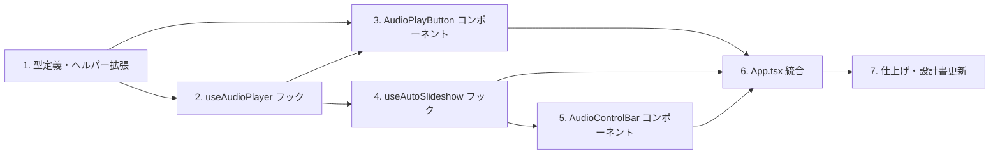

# DEM-004: スピーカーノート音声再生（Speaker Note Audio）

**関連 Design Doc:** [speaker-note-audio_design.md](../../specification/speaker-note-audio_design.md)
**関連 Spec:** [speaker-note-audio_spec.md](../../specification/speaker-note-audio_spec.md)
**関連 PRD:** [speaker-note-audio.md](../../requirement/speaker-note-audio.md)

---

## 依存関係図

---

## 1. 基盤: 型定義・ヘルパー・バリデーション拡張

### 1.1. SlideNotes 型に voice フィールドを追加

- [x] `src/data/types.ts` の `SlideNotes` に `voice?: string` を追加
- [x] `AudioPlaybackState` 型を `src/data/types.ts` に追加（`'idle' | 'playing' | 'paused'`）

**対象ファイル:** `src/data/types.ts`

**完了条件:**
- `SlideNotes` 型に `voice?: string` が存在する
- `AudioPlaybackState` 型がエクスポートされている
- `npm run typecheck` が通る

### 1.2. noteHelpers に getVoicePath を追加

- [x] `src/data/noteHelpers.ts` に `getVoicePath(slide: SlideData): string | undefined` を追加
- [x] `normalizeNotes()` が voice フィールドを保持するよう拡張

**対象ファイル:** `src/data/noteHelpers.ts`

**完了条件:**
- `getVoicePath()` が voice 定義ありスライドでパスを返す
- `getVoicePath()` が voice 未定義スライドで `undefined` を返す
- `getVoicePath()` が string 型 notes のスライドで `undefined` を返す
- `npm run typecheck` が通る

### 1.3. バリデーションに voice フィールドの検証を追加

- [x] `src/data/loader.ts` の `validateSlideNotes()` に voice フィールドの型チェックを追加（string | undefined）

**対象ファイル:** `src/data/loader.ts`

**完了条件:**
- voice が string の場合はエラーなし
- voice が undefined の場合はエラーなし
- voice が string 以外の場合はバリデーションエラーが追加される
- `npm run typecheck` が通る

### 1.4. 基盤タスクのテスト

- [x] `getVoicePath()` のユニットテスト（voice あり/なし/string 型 notes/undefined notes）
- [x] `normalizeNotes()` の voice フィールド対応テスト
- [x] `validateSlideNotes()` の voice バリデーションテスト

**対象ファイル:** テストファイル（既存テストファイルに追加または新規作成）

**完了条件:**
- すべてのテストケースが通る
- `npm run test` が通る

---

## 2. コア: useAudioPlayer フック

### 2.1. useAudioPlayer フック実装

- [x] `src/hooks/useAudioPlayer.ts` を新規作成
- [x] `useRef` で Audio オブジェクトをシングルトン管理
- [x] `play(src: string)`: Audio.src を設定して再生開始
- [x] `stop()`: 再生停止、src リセット
- [x] `playbackState` を useState で管理（idle / playing / paused）
- [x] `isPlaying` を playbackState から導出
- [x] Audio の `ended` イベントで playbackState を idle に戻す
- [x] Audio の `error` イベントでエラーハンドリング（playbackState を idle に戻す）
- [x] `useEffect` クリーンアップで audio.pause() と src リセット

**対象ファイル:** `src/hooks/useAudioPlayer.ts`

**完了条件:**
- play() で Audio.play() が呼ばれ playbackState が 'playing' になる
- stop() で Audio.pause() が呼ばれ playbackState が 'idle' に戻る
- ended イベントで playbackState が 'idle' に戻る
- error イベントで playbackState が 'idle' に戻る
- アンマウント時にクリーンアップが実行される
- `npm run typecheck` が通る

### 2.2. useAudioPlayer テスト

- [x] play/stop の状態遷移テスト
- [x] ended イベントの状態遷移テスト
- [x] error イベントのフォールバックテスト
- [x] クリーンアップテスト

**対象ファイル:** テストファイル

**完了条件:**
- すべてのテストケースが通る
- `npm run test` が通る

---

## 3. コア: AudioPlayButton コンポーネント

### 3.1. AudioPlayButton 実装

- [x] `src/components/AudioPlayButton.tsx` を新規作成
- [x] MUI Icons（VolumeUp / VolumeOff）を使用したスピーカーアイコン
- [x] playbackState に応じたアイコン切り替え（idle → VolumeUp, playing → animated VolumeUp）
- [x] クリックで onPlay / onStop をトグル呼び出し
- [x] スタイリングは MUI sx prop で CSS 変数参照（A-002 準拠）
- [x] スライドの表示を妨げない控えめなデザイン（右下にオーバーレイ等）

**対象ファイル:** `src/components/AudioPlayButton.tsx`

**完了条件:**
- voice ありスライドでアイコンが表示される
- クリックで onPlay / onStop が呼ばれる
- playbackState に応じてアイコンが切り替わる
- `npm run typecheck` が通る

### 3.2. AudioPlayButton テスト

- [x] アイコンの表示・非表示テスト
- [x] クリックイベントテスト
- [x] playbackState によるアイコン切り替えテスト

**対象ファイル:** テストファイル

**完了条件:**
- すべてのテストケースが通る
- `npm run test` が通る

---

## 4. コア: useAutoSlideshow フック

### 4.1. useAutoSlideshow フック実装

- [x] `src/hooks/useAutoSlideshow.ts` を新規作成
- [x] `autoPlay` 状態（useState, デフォルト: false）
- [x] `autoSlideshow` 状態（useState, デフォルト: false）
- [x] スライド変更時（currentIndex 変更時）に autoPlay ON かつ voice ありなら自動再生
- [x] 音声終了時に autoSlideshow ON かつ次スライドありなら Reveal.next() 呼び出し
- [x] 最終スライドでは自動遷移しない

**対象ファイル:** `src/hooks/useAutoSlideshow.ts`

**完了条件:**
- autoPlay ON + voice ありスライドで play() が呼ばれる
- autoPlay ON + voice なしスライドで play() が呼ばれない
- autoSlideshow ON + 音声終了時に next が呼ばれる
- 最終スライドでは next が呼ばれない
- `npm run typecheck` が通る

### 4.2. useAutoSlideshow テスト

- [x] autoPlay ON/OFF × voice あり/なし の組み合わせテスト
- [x] autoSlideshow ON/OFF × 音声終了 × 最終スライド有無 の組み合わせテスト

**対象ファイル:** テストファイル

**完了条件:**
- すべてのテストケースが通る
- `npm run test` が通る

---

## 5. コア: AudioControlBar コンポーネント

### 5.1. AudioControlBar 実装

- [x] `src/components/AudioControlBar.tsx` を新規作成
- [x] 自動再生 ON/OFF トグル（MUI IconButton/Switch）
- [x] 自動スライドショー ON/OFF トグル（MUI IconButton/Switch）
- [x] フローティングコントロールバーとして配置（PresenterViewButton と同様のフローティングUI）
- [x] スタイリングは MUI sx prop で CSS 変数参照

**対象ファイル:** `src/components/AudioControlBar.tsx`

**完了条件:**
- 自動再生トグルの ON/OFF が切り替わる
- 自動スライドショートグルの ON/OFF が切り替わる
- コールバックが正しく呼ばれる
- `npm run typecheck` が通る

### 5.2. AudioControlBar テスト

- [x] トグル操作テスト
- [x] コールバック呼び出しテスト

**対象ファイル:** テストファイル

**完了条件:**
- すべてのテストケースが通る
- `npm run test` が通る

---

## 6. 統合: App.tsx への組み込み

### 6.1. App.tsx にフックとコンポーネントを統合

- [x] `useAudioPlayer` フックを App に追加
- [x] `useAutoSlideshow` フックを App に追加（slides, currentIndex, audioPlayer, revealNext を接続）
- [x] `handleSlideChanged` で currentIndex を useAutoSlideshow に伝達
- [x] 現在のスライドの voice パスを `getVoicePath()` で取得
- [x] voice あり時に `AudioPlayButton` を表示
- [x] `AudioControlBar` をフローティングUIとして配置
- [x] Reveal.js の `next()` 呼び出し手段を useAutoSlideshow に提供

**対象ファイル:** `src/App.tsx`

**完了条件:**
- voice ありスライドでスピーカーアイコンが表示される
- voice なしスライドではアイコンが非表示
- アイコンクリックで音声が再生・停止される
- 自動再生 ON でスライド遷移時に音声が自動再生される
- 自動スライドショー ON で音声終了時に次スライドへ遷移する
- `npm run typecheck` が通る
- `npm run test` が通る
- `npm run build` が通る

---

## 7. 仕上げ: 設計書更新

### 7.1. 設計書の実装ステータス更新

- [x] `speaker-note-audio_design.md` の実装ステータスを 🟢 に更新
- [x] 各モジュールの進捗を 🟢 に更新
- [x] 実装中に発生した設計判断があれば設計判断セクションに追記

**対象ファイル:** `.sdd/specification/speaker-note-audio_design.md`

**完了条件:**
- 全モジュールが 🟢 実装済み
- 設計書が実装と整合している

---

## 要求カバレッジ

| 要求ID | 要求内容 | 対応タスク |
|:--------|:-------|:---------|
| FR_SNA_001 | 手動音声再生（スピーカーアイコンクリック） | 2.1, 3.1, 6.1 |
| FR_SNA_002 | 音声停止 | 2.1, 3.1, 6.1 |
| FR_SNA_003 | 自動再生 | 4.1, 6.1 |
| FR_SNA_004 | 自動再生ON/OFF切り替え | 4.1, 5.1, 6.1 |
| FR_SNA_005 | 自動スライドショー | 4.1, 6.1 |
| FR_SNA_006 | 自動スライドショーON/OFF切り替え | 4.1, 5.1, 6.1 |
| FR_SNA_007 | slides.json の voice フィールド定義 | 1.1, 1.2, 1.3 |
| FR_SNA_008 | スピーカーアイコン条件付き表示 | 3.1, 6.1 |
| DC_SNA_001 | データ駆動型音声管理 | 1.1, 1.2 |
| DC_SNA_002 | voice 未定義時のフォールバック | 1.2, 3.1, 6.1 |
| DC_SNA_003 | 音声ライフサイクル管理 | 2.1 |

**カバレッジ: 100% (11/11)**
