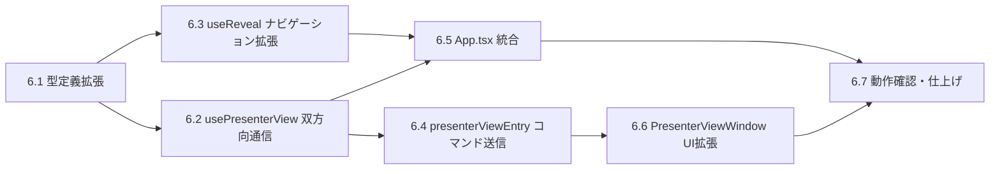

# DEM-006: 発表者ビュー 双方向同期・操作制御機能 タスク分解

**機能名:** presenter-view（双方向同期・操作制御の追加実装）
**チケット番号:** DEM-006
**関連 Design Doc:** [presenter-view_design.md](../../specification/presenter-view_design.md)
**関連 Spec:** [presenter-view_spec.md](../../specification/presenter-view_spec.md)
**関連 PRD:** [presenter-view.md](../../requirement/presenter-view.md)
**前提タスク:** DEM-003（基本実装完了済み）

---

## 依存関係図



---

## 6.1. PresenterControlState 型と PresenterViewMessage 拡張

**カテゴリ:** 基盤
**対象ファイル:** `src/data/types.ts`
**対応要求:** DC-PV-003

**作業内容:**

- [x] `PresenterControlState` インターフェースを追加
  ```typescript
  interface PresenterControlState {
    isPlaying: boolean
    autoPlay: boolean
    autoSlideshow: boolean
    hasVoice: boolean
  }
  ```
- [x] `PresenterViewMessage` 型に新しいメッセージタイプを追加
  - `{ type: 'controlStateChanged'; payload: PresenterControlState }` （メイン→発表者ビュー）
  - `{ type: 'navigate'; payload: { direction: 'prev' | 'next' } }` （発表者ビュー→メイン）
  - `{ type: 'audioToggle' }` （発表者ビュー→メイン）
  - `{ type: 'autoPlayToggle' }` （発表者ビュー→メイン）
  - `{ type: 'autoSlideshowToggle' }` （発表者ビュー→メイン）
- [x] `PresenterSlideState` に `previousSlide: SlideData | null` フィールドを追加

**完了条件:**

- `npm run typecheck` が成功する
- 既存のコードが型エラーなくコンパイルされる

---

## 6.2. usePresenterView フックの双方向通信拡張

**カテゴリ:** コア
**対象ファイル:** `src/hooks/usePresenterView.ts`
**依存:** 6.1
**対応要求:** FR-PV-002, FR-PV-008, FR-PV-009, FR-PV-010, FR-PV-011, DC-PV-003

**作業内容:**

- [x] `UsePresenterViewOptions` にコマンド受信コールバックを追加
  - `onNavigate?: (direction: 'prev' | 'next') => void`
  - `onAudioToggle?: () => void`
  - `onAutoPlayToggle?: () => void`
  - `onAutoSlideshowToggle?: () => void`
- [x] `UsePresenterViewReturn` に `sendControlState` メソッドを追加
  - `sendControlState: (state: PresenterControlState) => void`
- [x] BroadcastChannel の `onmessage` ハンドラを拡張し、発表者ビューからのコマンドメッセージを受信
  - `navigate` → `onNavigate` コールバック呼び出し
  - `audioToggle` → `onAudioToggle` コールバック呼び出し
  - `autoPlayToggle` → `onAutoPlayToggle` コールバック呼び出し
  - `autoSlideshowToggle` → `onAutoSlideshowToggle` コールバック呼び出し
- [x] `presenterViewReady` 受信時に現在の制御状態を送信する初期同期処理を追加
- [x] コールバックを `useRef` で保持し、stale closure を回避

**完了条件:**

- 発表者ビューからのコマンドメッセージが適切なコールバックに伝達される
- `sendControlState` で制御状態メッセージが送信される
- `presenterViewReady` 受信時に制御状態が送信される
- `npm run typecheck` が成功する

---

## 6.3. useReveal フックのナビゲーション拡張

**カテゴリ:** コア
**対象ファイル:** `src/hooks/useReveal.ts`
**依存:** 6.1
**対応要求:** FR-PV-008

**作業内容:**

- [x] `UseRevealReturn` に `goToNext()` メソッドを追加
  - `deck.next()` を呼び出してスライドを次に進める
- [x] `UseRevealReturn` に `goToPrev()` メソッドを追加
  - `deck.prev()` を呼び出してスライドを前に戻す
- [x] `deck` がまだ初期化されていない場合のガード処理

**完了条件:**

- `goToNext()` で次のスライドに遷移する
- `goToPrev()` で前のスライドに戻る
- deck 未初期化時にエラーにならない
- `npm run typecheck` が成功する

---

## 6.4. presenterViewEntry のコマンド送信対応

**カテゴリ:** 統合
**対象ファイル:** `src/presenterViewEntry.tsx`
**依存:** 6.2
**対応要求:** FR-PV-008, FR-PV-009, FR-PV-010, FR-PV-011

**作業内容:**

- [x] BroadcastChannel からの `controlStateChanged` メッセージ受信を追加
- [x] 受信した `PresenterControlState` を state として管理
- [x] `PresenterViewWindow` にコマンド送信用のコールバック props を渡す
  - `onNavigate`: `navigate` メッセージを BroadcastChannel に送信
  - `onAudioToggle`: `audioToggle` メッセージを送信
  - `onAutoPlayToggle`: `autoPlayToggle` メッセージを送信
  - `onAutoSlideshowToggle`: `autoSlideshowToggle` メッセージを送信
- [x] `controlState` props を `PresenterViewWindow` に渡す

**完了条件:**

- 発表者ビューウィンドウからの操作がメインウィンドウに伝達される
- 制御状態がメインウィンドウから受信・表示される
- `npm run typecheck` が成功する

---

## 6.5. App.tsx への双方向同期統合

**カテゴリ:** 統合
**対象ファイル:** `src/App.tsx`（または `src/main.tsx`）
**依存:** 6.2, 6.3
**対応要求:** FR-PV-002, FR-PV-008, FR-PV-009, FR-PV-010, FR-PV-011

**作業内容:**

- [x] `usePresenterView` の呼び出しにコマンド受信コールバックを接続
  - `onNavigate`: `useReveal` の `goToNext()` / `goToPrev()` を呼び出す
  - `onAudioToggle`: 音声再生/停止を切り替える（`useAudioPlayer` 連携）
  - `onAutoPlayToggle`: 自動音声再生を切り替える（`useAutoSlideshow` 連携）
  - `onAutoSlideshowToggle`: 自動スライドショーを切り替える（`useAutoSlideshow` 連携）
- [x] 音声・制御状態が変更されたタイミングで `sendControlState` を呼び出す
  - 音声再生状態（`isPlaying`）の変更時
  - 自動音声再生（`autoPlay`）の変更時
  - 自動スライドショー（`autoSlideshow`）の変更時
  - スライド変更時（`hasVoice` が変わる可能性）

**完了条件:**

- 発表者ビューからのスライド移動がメインウィンドウに反映される
- 発表者ビューからの音声制御がメインウィンドウに反映される
- メインウィンドウの制御状態変更が発表者ビューに同期される
- `npm run typecheck` が成功する

---

## 6.6. PresenterViewWindow UI拡張

**カテゴリ:** 統合
**対象ファイル:** `src/components/PresenterViewWindow.tsx`, `src/components/PresenterViewWindow.module.css`
**依存:** 6.4
**対応要求:** FR-PV-007, FR-PV-008, FR-PV-009, FR-PV-010, FR-PV-011

**作業内容:**

- [x] **前スライドプレビュー**の追加
  - 前スライドを `PreviewSlide` で縮小表示
  - 最初のスライドでは「最初のスライドです」メッセージを表示
- [x] **レイアウト変更**: 3パネルから以下の構成に変更
  - 上部: スライド進捗（`N / total`）+ ナビゲーションボタン + 音声制御ボタン群
  - 左上: 前スライドプレビュー
  - 右上: 次スライドプレビュー
  - 左下: スピーカーノート
  - 右下: 要点サマリー
- [x] **ナビゲーションボタン**の追加
  - 前へボタン（左矢印アイコン）→ `onNavigate('prev')` を呼び出す
  - 次へボタン（右矢印アイコン）→ `onNavigate('next')` を呼び出す
  - 最初/最終スライド時のボタン無効化
- [x] **音声再生ボタン**の追加
  - 再生/停止切り替えアイコンボタン → `onAudioToggle()` を呼び出す
  - `controlState.isPlaying` に基づいてアイコン切り替え
  - `controlState.hasVoice` が `false` の場合はボタン無効化
- [x] **自動音声再生ボタン**の追加
  - ON/OFFトグルアイコンボタン → `onAutoPlayToggle()` を呼び出す
  - `controlState.autoPlay` に基づいてアイコン状態を表示
- [x] **自動スライドショーボタン**の追加
  - ON/OFFトグルアイコンボタン → `onAutoSlideshowToggle()` を呼び出す
  - `controlState.autoSlideshow` に基づいてアイコン状態を表示
- [x] **キーボード操作**の追加
  - `ArrowRight` / `Space`: `onNavigate('next')` を呼び出す
  - `ArrowLeft`: `onNavigate('prev')` を呼び出す
  - `keydown` イベントリスナーの登録と `useEffect` でのクリーンアップ
  - `preventDefault()` でブラウザデフォルト動作を抑制
- [x] CSS Modules のレイアウト更新

**完了条件:**

- 前スライドプレビューが表示される
- 最初のスライドで「最初のスライドです」が表示される
- ナビゲーションボタンでスライド移動コマンドが送信される
- キーボード操作（矢印キー、Space）でスライド移動コマンドが送信される
- 音声制御ボタンが制御状態に基づいて正しく表示される
- 各ボタンクリックで対応するコマンドが送信される
- `npm run typecheck` が成功する

---

## 6.7. 動作確認・仕上げ

**カテゴリ:** 仕上げ
**依存:** 6.5, 6.6
**対応要求:** 全要求の最終検証

**作業内容:**

- [ ] `npm run dev` で一連の双方向同期フローを確認
  - メインウィンドウ → 発表者ビューのスライド同期
  - メインウィンドウ → 発表者ビューの制御状態同期
  - 発表者ビュー → メインウィンドウのスライド移動
  - 発表者ビュー → メインウィンドウの音声制御
- [ ] 発表者ビューのキーボード操作を確認
- [ ] 前スライドプレビューの表示を確認（最初・中間・最終スライド）
- [x] `npm run build` でビルド成功を確認
- [x] `npm run typecheck` でエラーなしを確認
- [x] `npm run test` でテスト全件パスを確認
- [x] `presenter-view_design.md` の実装ステータスを更新（🔴→🟢）

**完了条件:**

- 全コマンド（dev, build, typecheck, test）が成功する
- 双方向同期の一連フローが正常に動作する
- 設計書の実装ステータスが更新されている

---

## 要求カバレッジ

| 要求ID | 要求内容 | 対応タスク |
|:---|:---|:---|
| FR-PV-002 | メインウィンドウと発表者ビューの双方向同期 | 6.2, 6.4, 6.5 |
| FR-PV-007 | 前のスライドのプレビューが発表者ビューに表示される | 6.6 |
| FR-PV-008 | スライドの前後移動（アイコンボタン＋キーボード操作） | 6.3, 6.4, 6.5, 6.6 |
| FR-PV-009 | 音声再生/停止の操作 | 6.2, 6.4, 6.5, 6.6 |
| FR-PV-010 | 自動音声再生のON/OFF切り替え | 6.2, 6.4, 6.5, 6.6 |
| FR-PV-011 | 自動スライドショーのON/OFF切り替え | 6.2, 6.4, 6.5, 6.6 |
| DC-PV-003 | 双方向同期の設計制約 | 6.1, 6.2, 6.4 |

**カバレッジ: 100% (7/7 未実装要求)**
