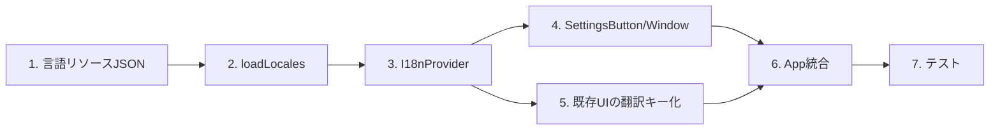

# DEM-007: 言語設定機能 タスクリスト

**関連 Design Doc:** [language-settings_design.md](../../specification/language-settings_design.md)
**関連 Spec:** [language-settings_spec.md](../../specification/language-settings_spec.md)
**関連 PRD:** [language-settings.md](../../requirement/language-settings.md)

---

## タスク依存関係

---

## 1. 基盤タスク

### 1.1. 言語リソースJSONファイルの作成

**カテゴリ:** 基盤
**対応要求:** FR-LANG-008, FR-LANG-009

**作業内容:**

- [ ] `public/assets/locales/en-US.json` を作成（フォールバック兼用）
- [ ] `public/assets/locales/ja-JP.json` を作成
- [ ] 以下のUIテキストキーを定義:
  - `settings.title` — 設定ウィンドウタイトル
  - `settings.language` — 言語設定ラベル
  - `settings.close` — 閉じるボタン
  - `presenterView.open` — 発表者ビューボタン
  - `audio.play` / `audio.stop` — 音声再生ボタン
  - `audio.autoPlay` — 自動再生トグル
  - `slideshow.auto` — 自動スライドショートグル

**完了条件:**

- en-US.json と ja-JP.json が `public/assets/locales/` に配置されている
- 両ファイルが同一のキー構造を持つ
- JSON として valid である

---

### 1.2. i18n型定義の作成

**カテゴリ:** 基盤
**対応要求:** FR-LANG-008

**作業内容:**

- [ ] `src/i18n/types.ts` を作成
- [ ] `LocaleResource` インターフェースを定義
- [ ] `I18nContextValue` インターフェースを定義
- [ ] `LocaleValidationResult` インターフェースを定義

**完了条件:**

- 型定義ファイルが作成されている
- `npm run typecheck` が通る

---

## 2. コアタスク

### 2.1. 言語リソースローダー（loadLocales）の実装

**カテゴリ:** コア
**依存:** 1.1, 1.2
**対応要求:** FR-LANG-008, FR-LANG-006

**作業内容:**

- [ ] `src/i18n/loader.ts` を作成
- [ ] `loadLocales()` 関数を実装:
  - `public/assets/locales/` 配下のJSONファイルをfetchで取得
  - 構造バリデーション（D-002準拠）: `languageCode`, `languageName`, `ui` の必須フィールドチェック
  - 欠落キーをen-USリソースから補完
  - バリデーションエラーはコンソール警告、アプリ動作は継続
  - `LocaleResource[]` を返却
- [ ] ロケールマニフェスト（利用可能な言語の一覧）の取得方法を実装
  - Viteの `import.meta.glob` またはマニフェストJSONファイルで言語一覧を管理

**完了条件:**

- `loadLocales()` が正しい形式の `LocaleResource[]` を返す
- 不正なJSONに対してフォールバック（en-US）が適用される
- バリデーションエラーがコンソールに警告出力される
- テスト: `src/i18n/__tests__/loader.test.ts`

---

### 2.2. I18nProvider / useI18n / useTranslation の実装

**カテゴリ:** コア
**依存:** 1.2
**対応要求:** FR-LANG-004, FR-LANG-005, FR-LANG-006, FR-LANG-007, NFR-LANG-001

**作業内容:**

- [ ] `src/i18n/i18nProvider.tsx` を作成
- [ ] React Context を作成（`I18nContext`）
- [ ] `I18nProvider` コンポーネントを実装:
  - props: `locales: LocaleResource[]`, `children`
  - 初期言語の決定ロジック:
    1. localStorage (`slide-app-locale`) に保存済みの言語があればそれを使用
    2. なければ `navigator.language` からブラウザ言語を検出
    3. サポート言語に一致すればそれを使用（完全一致 → プレフィックス一致の順）
    4. 一致なければ `en-US` をフォールバック
  - `setLocale()`: 言語切り替え + localStorage保存
- [ ] `useI18n` フックを実装: Context値をそのまま返す
- [ ] `useTranslation` フックを実装: `{ t }` を返す
- [ ] `t(key, fallback?)` 翻訳関数を実装:
  - ドット記法でネストされたキーを解決（例: `'settings.title'`）
  - キーが見つからない場合: en-USリソースからフォールバック
  - en-USにもない場合: `fallback` 引数またはキー文字列を返す
- [ ] `src/i18n/index.ts` エクスポートファイルを作成

**完了条件:**

- `I18nProvider` でラップしたコンポーネントから `useI18n`/`useTranslation` が使用可能
- `setLocale()` で言語切り替え + localStorage保存が動作する
- ブラウザ言語検出が正しく動作する
- `t()` がドット記法でキーを解決できる
- テスト: `src/i18n/__tests__/i18nProvider.test.tsx`

---

## 3. UIタスク

### 3.1. SettingsButton コンポーネントの実装

**カテゴリ:** コア
**依存:** なし
**対応要求:** FR-LANG-001

**作業内容:**

- [ ] `src/components/SettingsButton.tsx` を作成
- [ ] スライド左上にオーバーレイ配置する設定ボタン（MUI IconButton + Settings アイコン）
- [ ] クリック時のコールバック prop (`onClick`)
- [ ] CSS: `position: fixed`, `top`, `left`, `z-index` でスライドの上に配置
- [ ] スタイル: CSS変数（`--theme-*`）を使用（A-002準拠）
- [ ] Reveal.jsのスライド操作を妨げないよう `pointer-events` を適切に設定

**完了条件:**

- ボタンがスライド左上に固定表示される
- クリックでコールバックが発火する
- Reveal.jsのキーボード操作・スワイプ操作を妨げない
- 色値のハードコードがない

---

### 3.2. SettingsWindow コンポーネントの実装

**カテゴリ:** コア
**依存:** 2.2
**対応要求:** FR-LANG-002, FR-LANG-003, FR-LANG-004, FR-LANG-010

**作業内容:**

- [ ] `src/components/SettingsWindow.tsx` を作成
- [ ] MUI Dialog を使用したモーダルウィンドウ
- [ ] props: `open: boolean`, `onClose: () => void`
- [ ] 言語選択UI:
  - MUI Select を使用したプルダウン
  - `useI18n()` から `locale`, `locales`, `setLocale` を取得
  - プルダウンの選択肢に `languageName` を表示
  - 選択変更時に `setLocale()` を呼び出し
- [ ] ウィンドウタイトル・ラベルは `useTranslation()` の `t()` で翻訳
- [ ] 将来の設定項目追加を考慮した構造（セクション分けなど）
- [ ] CSS変数（`--theme-*`）を使用したスタイリング

**完了条件:**

- 設定ウィンドウがモーダルとして表示される
- ウィンドウ外クリックまたは閉じるボタンで閉じられる
- プルダウンにサポート言語が表示される
- 言語選択でUIテキストが即座に切り替わる
- テスト: `src/components/__tests__/SettingsWindow.test.tsx`

---

## 4. 統合タスク

### 4.1. App.tsx への統合

**カテゴリ:** 統合
**依存:** 2.1, 2.2, 3.1, 3.2
**対応要求:** UR-LANG-001, FR-LANG-001, FR-LANG-002

**作業内容:**

- [ ] `main.tsx` を修正:
  - `loadLocales()` を `loadAddons()` と並行して呼び出し
  - `<I18nProvider locales={locales}>` で `<App>` をラップ
- [ ] `App.tsx` を修正:
  - `SettingsButton` を追加（左上固定）
  - `SettingsWindow` を追加（開閉状態を `useState` で管理）
  - 設定ウィンドウのオープン時に `Reveal.configure({ keyboard: false })` でキーボード無効化
  - クローズ時に `Reveal.configure({ keyboard: true })` で復元

**完了条件:**

- アプリ起動時に言語リソースが読み込まれる
- 設定ボタンがスライド左上に表示される
- 設定ボタンクリックで設定ウィンドウが開く
- 設定ウィンドウ内で言語切り替えが動作する
- 設定ウィンドウ表示中にReveal.jsのキーボード操作が無効化される
- 設定ウィンドウ非表示時にキーボード操作が復元される

---

### 4.2. 既存UIテキストの翻訳キー化

**カテゴリ:** 統合
**依存:** 2.2
**対応要求:** FR-LANG-004

**作業内容:**

- [ ] `PresenterViewButton.tsx` のボタンラベル/ツールチップを `t()` で翻訳
- [ ] `AudioPlayButton.tsx` のボタンラベル/ツールチップを `t()` で翻訳
- [ ] `AudioControlBar.tsx` のラベルを `t()` で翻訳
- [ ] その他ハードコードされたUIテキストを洗い出し、翻訳キーに置き換え
- [ ] 対応する翻訳キーを en-US.json / ja-JP.json に追加

**完了条件:**

- ハードコードされたUIテキストが翻訳キーに置き換えられている
- 言語切り替えで全UIテキストが正しく切り替わる

---

## 5. テストタスク

### 5.1. ユニットテストの作成

**カテゴリ:** テスト
**依存:** 2.1, 2.2

**作業内容:**

- [ ] `src/i18n/__tests__/loader.test.ts`:
  - 正常なJSONの読み込みテスト
  - 不正なJSON（必須フィールド欠落）のバリデーションテスト
  - 欠落キーのフォールバック補完テスト
  - 読み込み失敗時のエラーハンドリングテスト
- [ ] `src/i18n/__tests__/i18nProvider.test.tsx`:
  - `t()` のドット記法キー解決テスト
  - `t()` のフォールバックテスト（キー欠落時）
  - `setLocale()` による言語切り替えテスト
  - localStorage 保存・復元テスト
  - ブラウザ言語検出テスト（完全一致、プレフィックス一致、一致なし）

**完了条件:**

- 全テストが `npm run test` で通る
- 主要パスがカバーされている

---

## 6. 仕上げタスク

### 6.1. 設計書の実装ステータス更新

**カテゴリ:** 仕上げ
**依存:** 4.1, 4.2, 5.1

**作業内容:**

- [ ] `language-settings_design.md` の実装ステータスを 🟢 に更新
- [ ] 各モジュールのステータスを更新
- [ ] 実装中に発生した設計判断があれば design doc に追記

**完了条件:**

- 設計書の実装ステータスが最新状態を反映している

---

## 要求カバレッジ

| 要求ID | 要求内容 | 対応タスク |
|:---|:---|:---|
| UR-LANG-001 | UI言語設定 | 4.1 |
| FR-LANG-001 | 設定ボタン表示 | 3.1, 4.1 |
| FR-LANG-002 | 設定ウィンドウ表示 | 3.2, 4.1 |
| FR-LANG-003 | 言語選択UI（プルダウン） | 3.2 |
| FR-LANG-004 | 言語切り替え即時反映 | 2.2, 3.2, 4.2 |
| FR-LANG-005 | ブラウザ言語自動検出 | 2.2 |
| FR-LANG-006 | フォールバック言語 | 2.1, 2.2 |
| FR-LANG-007 | 言語設定の永続化 | 2.2 |
| FR-LANG-008 | 言語リソースの自動読み込み | 1.1, 2.1 |
| FR-LANG-009 | 最低限のサポート言語 | 1.1 |
| FR-LANG-010 | 設定ウィンドウの拡張性 | 3.2 |
| NFR-LANG-001 | 言語切り替えの応答性（500ms以内） | 2.2, 5.1 |

**カバレッジ: 100% (12/12)**
