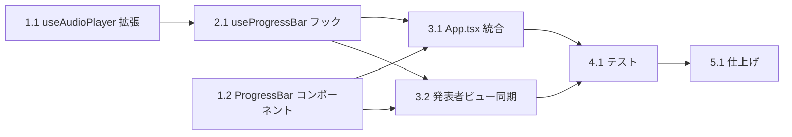

# DEM-009: 自動スクロールプログレスバー タスクリスト

**機能名:** auto-scroll-progress-bar
**関連 Design Doc:** [auto-scroll-progress-bar_design.md](../../specification/auto-scroll-progress-bar_design.md)
**関連 Spec:** [auto-scroll-progress-bar_spec.md](../../specification/auto-scroll-progress-bar_spec.md)
**関連 PRD:** [auto-scroll-progress-bar.md](../../requirement/auto-scroll-progress-bar.md)

---

## 依存関係図



---

## 1. 基盤タスク

### 1.1. useAudioPlayer に currentTime/duration を追加

**カテゴリ:** 基盤
**対象ファイル:** `src/hooks/useAudioPlayer.ts`
**依存:** なし

**作業内容:**

- [x] `UseAudioPlayerReturn` インターフェースに `currentTime: number` と `duration: number` を追加
- [x] `useAudioPlayer` フック内に `currentTime`、`duration` の state を追加
- [x] `useEffect` 内で HTMLAudioElement の `timeupdate` イベントリスナーを登録し、`currentTime` と `duration` を更新
- [x] `loadedmetadata` イベントで `duration` の初期値を設定
- [x] クリーンアップ関数で `timeupdate`、`loadedmetadata` リスナーを解除
- [x] `stop()` 呼び出し時に `currentTime` を 0、`duration` を 0 にリセット

**完了条件:**

- `useAudioPlayer` が `currentTime` と `duration` を戻り値として返す
- 音声再生中に `currentTime` がリアルタイムに更新される
- コンポーネントアンマウント時にイベントリスナーが解除される
- `npm run typecheck` が通る

---

### 1.2. ProgressBar コンポーネント作成

**カテゴリ:** 基盤
**対象ファイル:** `src/components/ProgressBar.tsx`, `src/components/ProgressBar.module.css`
**依存:** なし

**作業内容:**

- [x] `ProgressBarProps` 型を定義（`progress: number`, `visible: boolean`）
- [x] `ProgressBar` コンポーネントを実装
  - `visible` が `false` の場合は `null` を返す
  - `progress`（0.0〜1.0）を `width` のパーセンテージに変換
- [x] `ProgressBar.module.css` を作成
  - コンテナ: `position: relative; width: 100%; height: 3px`
  - バー: `height: 100%; background: var(--theme-primary); transition: width 0.3s ease`
  - 非表示時: `opacity: 0; transition: opacity 0.2s`

**完了条件:**

- `ProgressBar` コンポーネントが `progress` に応じた幅でバーを表示する
- `visible=false` で非表示になる
- 色が CSS変数 `var(--theme-primary)` を使用している（ハードコードなし）
- `npm run typecheck` が通る

---

## 2. コアタスク

### 2.1. useProgressBar フック作成

**カテゴリ:** コア
**対象ファイル:** `src/hooks/useProgressBar.ts`
**依存:** 1.1（useAudioPlayer の currentTime/duration）

**作業内容:**

- [x] 型定義を作成: `ProgressSource`, `AudioProgress`, `TimerProgress`, `UseProgressBarOptions`, `UseProgressBarReturn`
- [x] `useProgressBar` フックを実装
  - `autoSlideshow` が `false` → `{ progress: 0, source: 'none', visible: false }`
  - `hasVoice` が `true` かつ `audioProgress` が有効 → `source: 'audio'`, `progress = currentTime / duration`
  - `hasVoice` が `false` かつ `timerProgress` が有効 → `source: 'timer'`, `progress = elapsed / total`
  - それ以外 → `{ progress: 0, source: 'none', visible: false }`
- [x] `progress` を 0.0〜1.0 の範囲にクランプ
- [x] `duration` や `total` が 0 の場合のゼロ除算を防止

**完了条件:**

- 音声モード: `audioProgress` から正しい進行率を算出する
- タイマーモード: `timerProgress` から正しい進行率を算出する
- `autoSlideshow=false` で `visible=false` を返す
- ゼロ除算が発生しない
- `npm run typecheck` が通る

---

## 3. 統合タスク

### 3.1. App.tsx へのプログレスバー統合

**カテゴリ:** 統合
**対象ファイル:** `src/App.tsx`, `src/components/SlideRenderer.tsx`
**依存:** 1.2, 2.1

**作業内容:**

- [x] `App.tsx` で `useProgressBar` フックを呼び出す
  - `autoSlideshow`: `useAutoSlideshow` の戻り値から取得
  - `hasVoice`: 現在のスライドに音声ファイルがあるか（`getVoicePath` で判定）
  - `audioProgress`: `useAudioPlayer` の `currentTime`/`duration` から構築
  - `timerProgress`: `null`（auto-scroll-timer 実装時に接続）
- [x] `ProgressBar` を `position: fixed; bottom: 0` でスライド下部に固定配置
  - レイアウトコンポーネントへの変更を最小限にするため、App.tsx から直接配置

**完了条件:**

- 自動スライドショーON + 音声再生中にスライド下部にプログレスバーが表示される
- 音声の進行に合わせてバーが左から右に伸びる
- 自動スライドショーOFFでプログレスバーが非表示
- スライド切替時にプログレスバーが 0% にリセットされる
- 既存の機能（音声再生、自動スライドショー、ナビゲーション）が正常に動作する

---

### 3.2. 発表者ビューへのプログレスバー同期

**カテゴリ:** 統合
**対象ファイル:** `src/data/types.ts`, `src/hooks/usePresenterView.ts`, `src/components/PresenterViewWindow.tsx`, `src/presenterViewEntry.tsx`
**依存:** 1.2, 2.1

**作業内容:**

- [x] `src/data/types.ts`: `PresenterViewMessage` に `progressChanged` メッセージ型を追加
  ``` typescript
  | { type: 'progressChanged'; payload: { progress: number; visible: boolean } }
  ```
- [x] `src/hooks/usePresenterView.ts`:
  - `UsePresenterViewReturn` に `sendProgressState` メソッドを追加
  - `sendProgressState(progress: number, visible: boolean)` を実装（BroadcastChannel 経由で送信）
- [x] `src/App.tsx`: `useProgressBar` の戻り値が変化したら `sendProgressState` を呼び出す `useEffect` を追加
- [x] `src/presenterViewEntry.tsx`（または発表者ビュー側のメッセージ受信部）:
  - `progressChanged` メッセージを受信して state に反映
- [x] `src/components/PresenterViewWindow.tsx`:
  - `progress`/`visible` を props として受け取る
  - コントロールバー（`controlBar`）の直下に `ProgressBar` コンポーネントを配置

**完了条件:**

- メインウィンドウでプログレスバーが更新されると、発表者ビューも同じ進行率を表示する
- 発表者ビューのプログレスバーがコントロールバー直下に表示される
- 自動スライドショーOFFで発表者ビューのプログレスバーも非表示になる
- 発表者ビューが未開の場合にエラーが発生しない

---

## 4. テストタスク

### 4.1. ユニットテスト作成

**カテゴリ:** テスト
**対象ファイル:** `src/hooks/__tests__/useProgressBar.test.ts`, `src/components/__tests__/ProgressBar.test.tsx`, `src/hooks/__tests__/useAudioPlayer.test.ts`
**依存:** 3.1, 3.2

**作業内容:**

- [x] `useProgressBar` テスト
  - `autoSlideshow=false` → `visible=false`, `progress=0`
  - `autoSlideshow=true`, `hasVoice=true`, `audioProgress={currentTime:15, duration:30}` → `progress=0.5`, `source='audio'`, `visible=true`
  - `autoSlideshow=true`, `hasVoice=false`, `timerProgress={elapsed:10, total:20}` → `progress=0.5`, `source='timer'`, `visible=true`
  - `audioProgress={currentTime:0, duration:0}` → ゼロ除算なし、`progress=0`
  - `timerProgress=null`, `hasVoice=false` → `visible=false`
- [x] `ProgressBar` テスト
  - `visible=true`, `progress=0.5` → バーが 50% 幅で表示
  - `visible=false` → コンポーネントが null を返す（DOM に存在しない）
  - `progress=0` → バーが 0% 幅
  - `progress=1` → バーが 100% 幅
- [x] `useAudioPlayer` 拡張テスト
  - 音声再生中に `currentTime` と `duration` が更新される
  - `stop()` 後に `currentTime=0`, `duration=0`

**完了条件:**

- すべてのテストが `npm run test` で通る
- 主要なブランチ（audio/timer/none/off）がカバーされている
- エッジケース（ゼロ除算、null 入力）がテストされている

---

## 5. 仕上げタスク

### 5.1. design doc の実装ステータス更新

**カテゴリ:** 仕上げ
**対象ファイル:** `.sdd/specification/auto-scroll-progress-bar_design.md`
**依存:** 4.1

**作業内容:**

- [x] 実装ステータスを 🔴 未実装 → 🟢 実装済み に更新
- [x] 各モジュールの実装進捗を更新
- [x] 実装中に発生した設計判断があれば設計判断セクションに追記

**完了条件:**

- design doc の実装ステータスが実際の状態と一致している

---

## 要求カバレッジ

| 要求ID | 要求内容 | 対応タスク |
|:-------|:---------|:----------|
| UR_ASPB_001 | 自動スクロールの進行状況をプログレスバーで可視化 | 2.1, 3.1 |
| FR_ASPB_001 | 音声ファイル再生中に再生進行をプログレスバーで可視化 | 1.1, 2.1, 3.1 |
| FR_ASPB_002 | タイマーベース自動スクロール中にタイマー進行を可視化 | 2.1（インターフェースのみ。タイマー実装は auto-scroll-timer で対応） |
| FR_ASPB_003 | プログレスバーがスライドの下部に表示 | 1.2, 3.1 |
| FR_ASPB_004 | プログレスバーが左端から右端へ滑らかに伸びる | 1.2 |
| FR_ASPB_005 | 自動スライドショーOFF時にプログレスバーを非表示 | 2.1, 3.1 |
| FR_ASPB_006 | スライド切替時にプログレスバーを0%にリセット | 2.1, 3.1 |
| FR_ASPB_007 | 発表者ビューのコントロールバー下部にプログレスバーを表示 | 3.2 |
| DC_ASPB_001 | CSS変数（--theme-*）によるテーマ準拠スタイリング | 1.2 |
| DC_ASPB_002 | スライドコンテンツを妨げない配置 | 1.2, 3.1 |
| DC_ASPB_003 | useEffect でライフサイクル管理 | 1.1, 2.1 |
