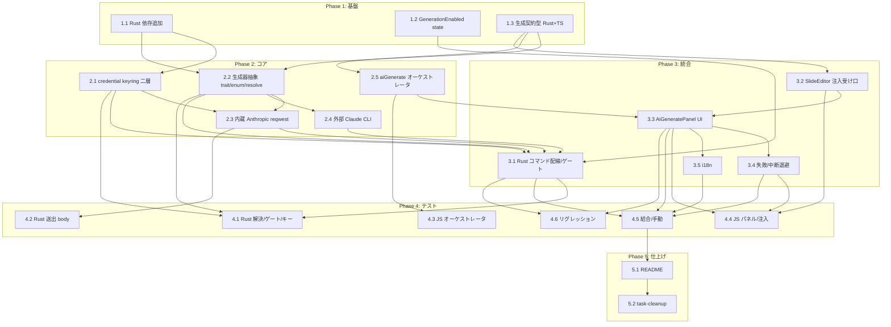

# AI スライド生成機能（内蔵生成） タスク分解

## メタ情報

| 項目 | 内容 |
|:---|:---|
| 機能名 | ai-slide-generation |
| チケット番号 | #14（Epic #12 配下・器 #13 の上に構築） |
| 技術設計書 | `.sdd/specification/ai-slide-generation_design.md` |
| 抽象仕様書 | `.sdd/specification/ai-slide-generation_spec.md` |
| 作成日 | 2026-07-25 |

> **追補（2026-07-25・要件変更反映）**: 内蔵生成の接続先を **Anthropic 直（x-api-key・keyring）→ Vertex AI（GCP ADC）** へ置換した（利用者要件が Vertex／DeNA・GCP 文脈。design §9.1「内蔵の接続先」を (B) へ改訂・§10 v0.4）。以下の各タスク行は当初計画（Anthropic 直）の記述だが、実装は次のとおり読み替える:
> - 1.1: `keyring`/`secrecy` は**撤去**、`tokio` に `fs`/`sync` を追加。
> - 2.1 `credential.rs`（keyring 二層）→ **`vertex_config.rs`**（project/region/model を plugin-store 平文保存）＋ **`generation/gcp_auth.rs`**（ADC トークン取得・55 分キャッシュ）。
> - 2.3 `anthropic.rs`（`x-api-key`）→ **`vertex.rs`**（Vertex rawPredict・`Authorization: Bearer`（ADC）・body `anthropic_version`・model は URL 側・`global` ホスト分岐）。
> - 3.1 コマンド: `set/delete/has_api_key` → **`set/clear/get_vertex_config`・`get_vertex_status`・`gcloud_login`**。ワイヤー値 `'builtin-anthropic'`→`'builtin-vertex'`。
> - 4.1/4.5: 「API キー」→「Vertex 設定（project/region/model）＋GCP ログイン」、「キー非露出」→「トークン非露出」と読み替える。
> - 全ゲート green（`cargo test` 45・clippy・fmt / `npm run typecheck`・`test` 265・format・build）。

## タスク一覧

### Phase 1: 基盤

| #   | タスク | 説明 | 完了条件 | 依存 |
|:----|:-----|:----|:------|:----|
| 1.1 | Rust 依存の追加 | `src-tauri/Cargo.toml` に `reqwest`（`rustls-tls`/`json`/`stream`。現状 transitive のみ→直接依存化）・`keyring` v3（`apple-native`/`windows-native`/`sync-secret-service`）・`secrecy`・`async-trait`・`tokio`（`reqwest` 実行用の必要 feature）を追加 | `cargo build` 通過。追加クレットが解決される（技術スタック §3） | - |
| 1.2 | Rust `GenerationEnabled` state ＋ `set_generation_enabled` | `lib.rs` に `GenerationEnabled(Mutex<bool>)`（既定 false）・`GenerationBusy(Mutex<bool>)` を `manage` 登録し、`set_generation_enabled(enabled)`（冒頭で `EditMode` 検査＝編集モード必須）を新設。`generate_handler!` へ追加。#13 `EditMode` パターンを拡張 | 生成有効フラグの on/off が編集モード時のみ Rust 側で保持される。`cargo build`/typecheck 通過（FR-009・DC-003） | - |
| 1.3 | 生成契約型の定義（Rust ＋ TS） | Rust `generation/mod.rs` に `GenerateRequest`（`#[serde(rename_all="camelCase")]`・`prompt`/`kind`/`base_slides`/`repair_feedback`）・`SlideGeneratorKind`（`#[serde(rename_all="kebab-case")]`）を、TS `src/aiGenerate.ts` に `GeneratorKind`/`GenerateRequest`/`GenerateOutcome`/`GenerateResult`/`GenerateProgress`/`ApiKeyStatus` を定義。Rust⇔TS のワイヤーフォーマットを serde 属性で一致させる | 両言語の契約型が一致し、`tsc`/`cargo build` 通過（FR-002・データモデル §5・§9.1 serde 決定） | - |

### Phase 2: コア実装（生成器・キー保管・検証ループ）

| #   | タスク | 説明 | 完了条件 | 依存 |
|:----|:-----|:----|:------|:----|
| 2.1 | `credential.rs`（keyring 二層保管） | `src-tauri/src/credential.rs` に `set_api_key`/`delete_api_key`/`has_api_key`/`load_api_key`(crate 内部限定) を実装。秘密本体は keyring、メタデータ（`configured`/`last_updated`）は plugin-store に並置。`has_api_key` は keyring 非アクセスでメタデータのみ返す。fail-closed（平文フォールバック禁止）・`SecretString`・マスク | キー保管→存在確認→削除が往復し、生値を返さず、`has_api_key` が keyring に触れない（FR-006・NFR-003・§9.1 二層構造） | 1.1 |
| 2.2 | `generation/mod.rs`（生成器抽象） | `SlideGenerator` trait（`async fn generate(&req, &cancel) -> Result<String, GenerateError>`）・閉じた `SlideGeneratorKind` enum・`resolve_generator_kind`（dev override→設定 provider→既定の純関数）・`create_generator` factory（解決済み `Box<dyn SlideGenerator>` を返す）・テスト用 `MockGenerator` を実装。ticketvc `llm_backend.rs` パターン | 内蔵/外部を同一契約で差し替えられ、`resolve_generator_kind` が分岐解決する。`cargo build` 通過（FR-002・§9.1 閉じた enum） | 1.1, 1.3 |
| 2.3 | `generation/anthropic.rs`（内蔵・reqwest） | `AnthropicGenerator` を実装。`POST https://api.anthropic.com/v1/messages`、`x-api-key`（`load_api_key` から）＋`anthropic-version: 2023-06-01`＋`content-type`。既定モデル `claude-opus-4-8`（定数→設定上書き）。**送出 body 構築を純関数に集約**（プロンプト・スキーマ/テンプレート・`base_slides` のみ／キー・任意ファイルを混入させない）。`with_retry`（429/529 指数バックオフ）・エラーボディ切詰め・応答タイムアウト 120 秒 | 内蔵生成が候補 1 件を返し、リトライ・タイムアウト・エラー整形が効く。`cargo build` 通過（FR-003・NFR-004・NFR-005） | 2.1, 2.2 |
| 2.4 | `generation/claude_cli.rs`（外部・CLI） | `ClaudeCodeGenerator` を実装。`claude --print --output-format json --strict-mcp-config` を一時 cwd で spawn、タイムアウト安全弁・`is_error` 判定・結果 JSON 受領。ticketvc `claude_cli/llm_client.rs` 流用 | 外部 CLI 経由で候補 1 件を返し、未検出/失敗を分類できる。`cargo build` 通過（FR-002 外部） | 2.2 |
| 2.5 | `aiGenerate.ts`（invoke ラッパ＋オーケストレータ） | `generateSlides`（`generate_slides` を上限 N=3 回呼び、`parseSlides`/`getValidationErrors` で検証→不正なら検証エラー要約を `repairFeedback` に載せ再試行→`GenerateResult` 組立、`onProgress` を試行/フェーズ単位で通知）・`cancelGenerate`・`setApiKey`/`deleteApiKey`/`getApiKeyStatus`・`setGenerationEnabled` を実装。検証は JS の単一真実源に一元化 | JS 駆動の自動修正ループで `succeeded`/`exhausted`/`cancelled`/`failed` を組み立てられる。`tsc` 通過（FR-005・FR-010・NFR-005・§9.1 JS 駆動ループ） | 1.3 |

### Phase 3: 統合（Rust コマンド配線・器への注入・生成パネル）

| #   | タスク | 説明 | 完了条件 | 依存 |
|:----|:-----|:----|:------|:----|
| 3.1 | Rust 生成/キー管理コマンド配線 | `lib.rs` に `generate_slides`（冒頭で「編集モード かつ 生成有効」を検査→`GenerationBusy` で同時実行 1 件→`resolve_generator_kind`＋`create_generator`→候補 1 件返す・`AtomicBool` cancel トークン）・`cancel_generation`（in-flight の HTTP abort／child kill）・`set_api_key`/`delete_api_key`/`has_api_key`（編集モード必須。`has_api_key` は状態のみ）を新設し `generate_handler!` へ登録 | 非有効時はコマンド拒否、有効時のみ keyring/network に到達。同時実行 1 件・中断が効く。`cargo build`/typecheck 通過（FR-003・FR-009・FR-010・NFR-003・DC-002/DC-003/DC-004） | 1.2, 2.1, 2.2, 2.3, 2.4 |
| 3.2 | `SlideEditor` に生成結果の注入受け口 | `src/edit/SlideEditor.tsx` に、生成結果 `slides.json` を単一真実源 `text` へ流し込む受け口（`applyGeneratedSlides(json)` 等・全体置換）を追加。現状 `text` は useState 初期化のみのため外部注入経路を新設。器のプレビュー・保存・書き出しは再利用（DC-001） | 生成結果が器の `text` に全体置換で載り、ライブプレビューへ反映される。`tsc` 通過（FR-004・DC-005・NFR-002） | 1.3 |
| 3.3 | `AiGeneratePanel.tsx`（生成パネル UI） | `src/edit/AiGeneratePanel.tsx` を新規作成し `SlideEditor` に統合。プロンプト入力・方式選択（内蔵/外部）・事前ゲート（`getApiKeyStatus().configured`／外部は `claude --version` 終了コード 0＋PATH 解決で判定・未検出は無効化）・進捗表示・中断・方式別の課金/オンライン依存注意書き。色は `--theme-*`／editorUiTheme に載せる | 生成パネルからプロンプト生成でき、前提未充足時は導線が無効化される。`tsc` 通過（FR-001・FR-007・FR-010・DC-006・A-002） | 2.5, 3.2 |
| 3.4 | 失敗・中断時の安全退避 | `failed`/`cancelled`/オフライン時は `AiGeneratePanel` の `onError` から器の手動編集へ退避し、既存データを保持。破損した生成結果を既存読込の全体フォールバックへ流さない | 失敗/中断で器の現状が壊れず手動編集に戻れる。`tsc` 通過（FR-008・D-002） | 3.3 |
| 3.5 | i18n（`aiGenerate.*`） | 生成 UI 文言（プロンプト・方式選択・事前ゲート・進捗・中断・エラー）と方式別注意書き（`aiGenerate.billingNoticeBuiltin`／`.billingNoticeExternal`。i18n `t()` が 2 階層までのため平坦キー）を ja/en/fr に追加 | 3 ロケールで文言が解決され欠落しない（PRD §5.2・DC-006 の周知） | 3.3 |

### Phase 4: テスト

| #   | タスク | 説明 | 完了条件 | 依存 |
|:----|:-----|:----|:------|:----|
| 4.1 | Rust 単体: 解決・ゲート・キー保管 | `resolve_generator_kind`（env/設定/既定の分岐網羅）、ゲート（編集モード・生成有効の true/false で許可/拒否を直接検証）、`credential`（保管→存在確認→削除・fail-closed・マスク・`has_api_key` が keyring 非アクセス） | 分岐網羅で green。`cargo test`/`clippy -D warnings`/`fmt --check` 通過（FR-002・FR-006・FR-009・NFR-003） | 2.1, 2.2, 3.1 |
| 4.2 | Rust 単体: 送出 body 機密最小化 | 送出 body 構築純関数のテスト。プロンプト・スキーマ/テンプレート・`base_slides` のみが含まれ、キー本体・禁止情報・任意ローカルファイルが混入しないことを検証 | 分岐網羅で green（NFR-004） | 2.3 |
| 4.3 | JS 単体: オーケストレータ | `aiGenerate.generateSlides` を Mock invoke で検証。`succeeded`/`exhausted`/`cancelled`/`failed` の各 outcome、自動修正ループの再投入、上限 N=3 到達で最良候補退避、`onProgress` 通知 | 主要分岐で green。`npm run test` 通過（FR-005・NFR-005） | 2.5 |
| 4.4 | JS 単体: パネル・注入 | `AiGeneratePanel` の事前ゲート（キー未設定で生成無効）、`SlideEditor` への流し込み（全体置換）、進捗/中断ハンドリング、失敗/中断の退避 | 主要分岐で green。`npm run test`/`format:check` 通過（FR-001・FR-004・FR-007・FR-008・FR-010） | 3.2, 3.3, 3.4 |
| 4.5 | 結合・手動デモ検証（実機・macOS） | 実 API キーでの内蔵生成疎通／外部 CLI 検出・生成／キーが WebView・ログに出ないこと／capability ゲート（生成無効時にコマンド拒否）／失敗・中断で器の手動編集へ退避、を実機で確認 | 全 AC を満たす（FR-008・NFR-003・NFR-004・手動検証） | 3.1, 3.3, 3.4, 3.5 |
| 4.6 | リグレッション確認 | `npm run typecheck`/`npm run test`/`npm run format:check`・`cargo test`/`clippy -D warnings`/`fmt --check` 通過。View・「開く」・発表者ビュー・編集モード・パッケージ配布が従来どおり動作 | 全通過・既存挙動不変（NFR-001） | 3.1, 3.3 |

### Phase 5: 仕上げ

| #   | タスク | 説明 | 完了条件 | 依存 |
|:----|:-----|:----|:------|:----|
| 5.1 | ドキュメント整備 | README（英日）に内蔵生成の使い方・API キー設定/削除・方式切替（内蔵/外部）・課金/オンライン依存の注意を追記。必要ならスクリーンショット更新 | 記載が追加される | 4.5 |
| 5.2 | task-cleanup | 実装で確定した設計判断（注入方式 A/B の最終決定・ストリーミング採否・タイムアウト/N の実測見直し・外部 CLI 検出 UX）を `_design.md` §9 に反映し `impl-status` を更新してから `task/` を整理 | design に統合済み（`impl-status` 更新） | 4.x, 5.1 |

## 依存関係図



## 実装の注意事項

- **ネットワーク・秘密情報は Rust 境界の単一チョークポイント**: HTTP 通信（reqwest）と API キー保管（keyring）を `generation`／`credential` に閉じ、`fetch` 権限・キー生値を JS へ開放しない。全生成/キー操作コマンドの冒頭で「編集モード かつ 生成有効」を検査する（DC-002・DC-003・NFR-003・FR-009）。
- **検証の単一真実源は JS**: 自動修正ループは `aiGenerate.ts` が駆動し、Rust `generate_slides` は候補 1 件を返すのみ。検証は既存 `getValidationErrors` を再利用し Rust に複製しない（D-002・§9.1 JS 駆動ループ）。
- **器は完全再利用**: プレビュー・保存・書き出し・無損失往復は #13 の器（`SlideEditor`／`slidesSerialize`／Rust 書き込みコマンド）をそのまま使い再実装しない（DC-001・NFR-002）。生成結果は `text` へ全体置換で流し込む（DC-005）。
- **永続化分離**: 生成器は保存せず候補を返すのみ。公開 `slides.json` への反映は検証と利用者の明示確定（器経由）を経る。誤生成の無自覚な保存を構造的に防ぐ（DC-004）。
- **機密最小化は純関数で担保**: Anthropic へ送る body はプロンプト・スキーマ/テンプレート・（編集起点時の）`base_slides` のみで構築する純関数に集約し、単体テストで混入がないことを検証する。キーはヘッダ付与時のみ `SecretString` から取り出す（NFR-004）。
- **コスト境界**: 内蔵タイムアウト 120 秒・自動修正上限 N=3 を暫定確定値として実装し、実測で見直す。`with_retry` は 429/529 のみ（無制限リトライを避ける）（NFR-005）。
- **serde ワイヤーフォーマット**: Rust struct は camelCase、enum は kebab-case を `#[serde(rename_all)]` で明示。属性漏れは実行時に TS 契約とずれ `tsc` で検出できないため要注意（§9.1）。
- **色のハードコード禁止**: 生成パネルの色・フォントは `--theme-*` 経由で参照し editorUiTheme に載せる（A-002・DC-006）。
- **過剰設計の回避**: 参照実装 ticketvc の 4 層 DI/RxJS/MVVM は移植せず、Rust 側の抽象・境界パターンのみ流用する（CONSTITUTION「シンプルさ」）。

## 参照ドキュメント

- 抽象仕様書: `.sdd/specification/ai-slide-generation_spec.md`
- 技術設計書: `.sdd/specification/ai-slide-generation_design.md`
- 要求仕様書: `.sdd/requirement/ai-slide-generation.md`
- 上流（器）: `.sdd/specification/slide-edit-mode_design.md`（#13）
- 参照実装（姉妹アプリ）: ticketvc-jira-management-app(NexusBoard) の `ai_tool` feature（Rust 側の Anthropic/LLM 連携・keyring 保管）

## 要求カバレッジ

| 要求 ID | 内容 | 対応タスク |
|:------|:----|:--------|
| FR-001 | 生成パネルでプロンプト入力・実行 | 3.3, 4.4 |
| FR-002 | 差し込み可能な共通生成インターフェース（内蔵/外部切替） | 1.3, 2.2, 2.4, 4.1 |
| FR-003 | 内蔵生成（Rust 境界から Anthropic Messages API） | 2.3, 3.1 |
| FR-004 | 生成結果を器の単一真実源へ流し込み（全体置換） | 3.2, 4.4 |
| FR-005 | 取り込み検証＋自動修正ループ（上限で最良候補退避） | 2.5, 4.3 |
| FR-006 | API キーの keyring 保管・更新・削除・生値非開放 | 2.1, 3.1, 4.1 |
| FR-007 | 事前ゲート（キー未設定・外部 CLI 未検出で無効化） | 3.3, 4.4 |
| FR-008 | 失敗・オフライン・中断時の器の手動編集へ安全退避 | 3.4, 4.4, 4.5 |
| FR-009 | 編集モード かつ 生成有効の Rust ゲート | 1.2, 3.1, 4.1 |
| FR-010 | 進捗通知・中断・同時実行 1 件 | 2.5, 3.1, 3.3, 4.3, 4.4 |
| NFR-001 | リグレッションなし（互換性） | 4.6 |
| NFR-002 | 無損失取り込み（器の再利用） | 3.2, 4.4 |
| NFR-003 | 最小権限（Rust 境界集約・fetch/秘密を JS へ開放しない） | 2.1, 3.1, 4.1, 4.5 |
| NFR-004 | 機密最小化（送出内容の限定） | 2.3, 4.2, 4.5 |
| NFR-005 | コスト境界（タイムアウト・自動修正上限 N） | 2.3, 2.5, 4.3 |

**カバレッジ判定**: PRD/spec の全 FR-001〜010・NFR-001〜005 がいずれかのタスクに対応済み。未対応要求なし。設計制約は各タスクの説明・完了条件・注意事項で参照する:

- DC-001（器の再利用）: 3.2 の完了条件・注意事項で担保
- DC-002（ネットワーク/秘密の Rust 境界集約）: 2.1・2.3・3.1
- DC-003（生成ゲート）: 1.2・3.1・4.1
- DC-004（永続化分離・候補のみ返す）: 3.1・注意事項
- DC-005（全体置換）: 3.2
- DC-006（テーマ変数）: 3.3・3.5

UR-001（内蔵生成の提供）は FR-001〜005 群、UR-002（capability 分離による安全な生成）は FR-006〜009・NFR-003 群のタスクで実現する。

## 推奨する手動検証

- [ ] タスクの粒度が適切か（1タスク = 数時間〜1日程度）を確認
- [ ] 依存関係図が論理的に正しいか確認
- [ ] 要求カバレッジ表で漏れがないことを確認
- [ ] Phase 分類が適切か確認
- [ ] 機密最小化（NFR-004）のテストが送出内容の全類型（キー混入・任意ファイル混入）を網羅するか確認
- [ ] capability ゲート（FR-009）が編集モード・生成有効の true/false 双方で検証されるか確認

## 検証コマンド

```bash
# 関連する設計書との整合性を確認
/check-spec ai-slide-generation

# 仕様の不明点がないか確認
/clarify ai-slide-generation

# チェックリストを生成して品質基準を明確化
/checklist ai-slide-generation #14
```
