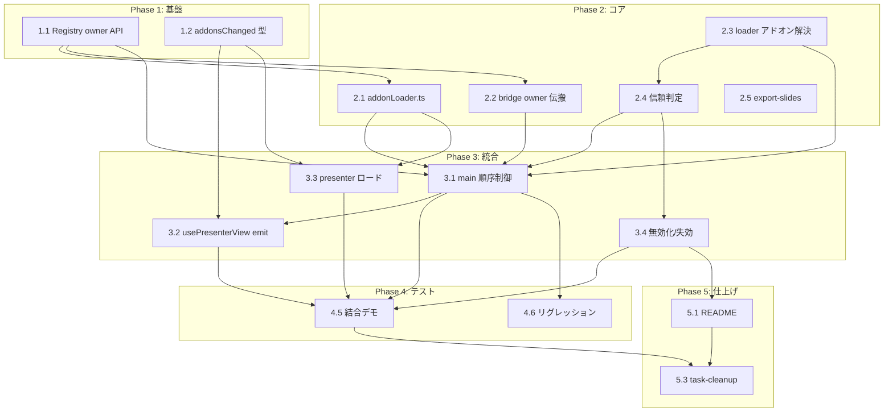

# パッケージ同梱アドオンのランタイムロード タスク分解

## メタ情報

| 項目 | 内容 |
|:---|:---|
| 機能名 | package-embedded-addon |
| チケット番号 | （未指定） |
| 技術設計書 | `.sdd/specification/package-embedded-addon_design.md` |
| 作成日 | 2026-07-22 |

## タスク一覧

### Phase 1: 基盤

| #   | タスク | 説明 | 完了条件 | 依存 |
|:----|:-----|:----|:------|:----|
| 1.1 | ComponentRegistry の owner API 追加 | `registerComponent(name, component, owner?)` に owner を記録する `customOwners` を追加、`unregisterOwner(owner)` を新設（該当 owner の custom 登録のみ削除・default 温存）、同名別 owner 登録時に `console.warn`。`resolveComponent`/`clearRegistry` は不変 | owner 引数省略時は従来と同一挙動。`unregisterOwner` が default を消さない。typecheck 通過（FR-002 / DC-001） | - |
| 1.2 | PresenterViewMessage に addonsChanged 追加 | `src/data/types.ts` の `PresenterViewMessage` union に `{ type: 'addonsChanged'; payload: { owner: string; scripts: string[] } }` を追加 | 型が追加され typecheck 通過。既存メンバーに影響なし（FR-006） | - |

### Phase 2: コア実装

| #   | タスク | 説明 | 完了条件 | 依存 |
|:----|:-----|:----|:------|:----|
| 2.1 | addonLoader.ts 新規作成 | `main.tsx`/`presenterViewEntry.tsx` の重複 `loadAddonScript`/`loadAddons` を集約。`loadAddonScripts(scripts, owner)`（`injectedScripts` Set で二重注入防止・`onload` を await）と `loadBuiltinAddons()`（従来の `/addons/manifest.json` ロード）を提供 | 同一 src の再ロードで `<script>` が増えない。両エントリから利用可能（FR-001 / FR-004） | 1.1 |
| 2.2 | addon-bridge に owner 伝搬追加 | `setCurrentAddonOwner(owner?)` を追加し、`window.__ADDON_REGISTER__` が現在の owner を `registerComponent` の第3引数へ渡すよう変更 | 登録コンポーネントに owner が伝搬。owner 未設定時は従来どおり（FR-002） | 1.1 |
| 2.3 | localSlideLoader のアドオン解決 | `allow_asset_dir` 完了後に `${baseDir}/addons/manifest.json` を読み、宣言バンドルを `convertFileSrc` で asset URL 化する `resolvePackageAddons` を追加。`LoadedSlidePackage` に `addonScripts`/`owner`(=baseDir) を追加。manifest 不在時は空配列 | パッケージから `addonScripts`/`owner` が返る。manifest なしでも従来どおり開ける（FR-005 / FR-010） | - |
| 2.4 | 同梱アドオンの信頼判定 | `isAddonAllowed(path, hasAddons)` を追加。「設定の一律無効化 → path 単位の永続化判断（既存ストア `slide-package-state.json` のキー `addonTrust`） → 未判断は確認ダイアログ（plugin-dialog・**既定拒否**）」の順で可否を返し、判断を永続化。ロード対象は `baseDir/addons/` 配下に限定 | 初回は確認ダイアログ表示・既定拒否。許可/拒否が path 単位で永続化され再確認されない（FR-008 / FR-010・NFR-001） | 2.3 |
| 2.5 | export-slides の --addons 対応 | `scripts/export-slides.mjs` に `--addons` フラグを追加。`addons/dist` の `addons.iife.js`/`manifest.json` を `outDir/addons/` へコピー、manifest の bundle を `/addons/…`（絶対）→ パッケージ相対へ書換、`files` に `addons` を追加。`package.json` の `export:slides` に `build:addons` 前段を追加 | `--addons` 付きで `.tgz` に `addons/` が同梱され、manifest bundle が相対パスになる（FR-007） | - |

### Phase 3: 統合

| #   | タスク | 説明 | 完了条件 | 依存 |
|:----|:-----|:----|:------|:----|
| 3.1 | main.tsx の切替順序制御 | `showPresentation` 前に「(1) 旧 owner を `unregisterOwner` → (2) `setCurrentAddonOwner` + `loadAddonScripts` を `await` → (3) `setPresentationData`/`setPresentationKey` で再マウント」を実施。`handleBrowse`/`handleOpenRecent` で `owner`/`addonScripts` を受領。`handleGoHome`/`handleOpenSample` で旧 owner を unregister。起動時は `loadBuiltinAddons()` を分離保持 | 許可時のみアドオンをロードし描画前に登録完了。ホーム復帰・サンプル表示で custom 登録がクリアされる（FR-003・NFR-003） | 1.1, 2.1, 2.2, 2.3, 2.4 |
| 3.2 | usePresenterView の emit 追加 | パッケージ切替時と `presenterViewReady` 受信時に `addonsChanged`(owner, scripts) を emit する `sendAddonsChanged` を追加し、最新アドオンを保持して遅延生成された発表者ビューにも届ける | 発表者ビュー生成タイミングに依らず最新アドオンが伝搬される（FR-006） | 1.2, 3.1 |
| 3.3 | presenterViewEntry のロード・登録 | 受信した `addonsChanged` を slides 描画**前**に `loadAddonScripts` でロード・登録し、切替時は旧 owner を `unregisterOwner`。既存の起動時 `loadAddons` は `loadBuiltinAddons` に置換 | 発表者ビューで同梱コンポーネントが解決され `Component not found` にならない（FR-006） | 1.1, 1.2, 2.1 |
| 3.4 | グローバル無効化・失効の導線 | 既存 `src/components/SettingsWindow.tsx` に「同梱アドオンを常に無効化する」トグルを追加（ON 時は確認なしでロードしない）。許可済み path（ストアキー `addonTrust`）をまとめて失効（リセット）できる導線を追加 | 一律無効化で確認ダイアログも出ない。許可済み判断を失効できる（FR-009） | 2.4 |

### Phase 4: テスト

| #   | タスク | 説明 | 完了条件 | 依存 |
|:----|:-----|:----|:------|:----|
| 4.1 | ComponentRegistry 単体テスト | owner 付き登録、`unregisterOwner` が custom のみ削除・default 温存、同名別 owner 警告、owner 省略時の後方互換を検証 | 分岐網羅で green（NFR-003） | 1.1 |
| 4.2 | addonLoader 単体テスト | 同一 src の二重注入なし、`onload` 待機を検証（現行アドオンは CSS 非出力のため `<style>` 冪等は対象外） | 主要分岐で green（FR-004） | 2.1 |
| 4.3 | 信頼判定 単体テスト | 一律無効／許可済み／拒否済み／未判断（既定拒否）の各分岐を検証 | 分岐網羅で green（FR-008 / FR-009） | 2.4 |
| 4.4 | export-slides 単体テスト | manifest bundle の相対パス書換、`files` への `addons` 追加、`--addons` 無指定時の非同梱を検証 | 正常系で green（FR-007） | 2.5 |
| 4.5 | 結合・手動デモ検証 | A→B→A 切替で残留・混線なし／同一パッケージ再オープンで二重注入なし／発表者ビューで解決／拒否時もスライドは開ける／ホーム復帰で custom クリア、を実機で確認 | Epic #6/#7 の AC を全て満たす（NFR-003） | 3.1, 3.2, 3.3, 3.4 |
| 4.6 | リグレッション確認 | `npm run typecheck` / `npm run test` 通過。既存のビルド時同梱（`public/slides.json`・`VITE_SLIDE_PACKAGE`）と起動時 `/addons/manifest.json` ロードが従来どおり動作 | 全通過・既存挙動不変（NFR-002） | 3.1, 3.2, 3.3 |

### Phase 5: 仕上げ

| #   | タスク | 説明 | 完了条件 | 依存 |
|:----|:-----|:----|:------|:----|
| 5.1 | ドキュメント整備 | README／パッケージ配布ドキュメントに「信頼できる発行元のパッケージのみ開くこと」「同梱アドオンは無効化できること」を明記 | 記載が追加される（NFR-001 / FR-007） | 3.4 |
| 5.2 | (任意) lib.rs 検証テスト追加 | `extract_tgz` が `addons/` を含めて展開し `allow_asset_dir` 再帰許可がスコープに含めることを Rust テストで裏取り | テスト green（本体変更なし） | 2.5 |
| 5.3 | task-cleanup | 実装で確定した設計判断（設定 UI の実装、Windows 検証結果等）を `_design.md` に反映してから task/ を整理 | design に統合済み | 4.x, 5.1 |

## 依存関係図

## 実装の注意事項

- **順序制約を厳守**: 「`.tgz` 展開 → `allow_asset_dir` → `<script>` 注入 → 再マウント」。`customComponents` は React 状態ではないため、描画前に登録が完了している必要がある（DC-004 / FR-003）。
- **解決順は不変**: `resolveComponent` の custom → default → fallback には手を入れない。owner 管理は追加 API のみ（DC-001）。
- **後方互換**: `registerComponent` の owner は任意引数。既存の呼び出し（`registerDefaults` 等）と起動時 `loadBuiltinAddons` の挙動を変えない（NFR-002）。
- **セキュリティは既定拒否**: 未判断のパッケージはアドオンを実行しない。拒否・失敗時も fallback でスライドは開ける（NFR-001 / A-005）。
- **Rust は変更不要**: `src-tauri/src/lib.rs` は再帰スコープと `package/` 展開で成立（5.2 は任意の裏取りテストのみ）。

## 参照ドキュメント

- 抽象仕様書: `.sdd/specification/package-embedded-addon_spec.md`
- 技術設計書: `.sdd/specification/package-embedded-addon_design.md`
- 要求仕様書: `.sdd/requirement/package-embedded-addon.md`

## 要求カバレッジ

| 要求 ID | 内容 | 対応タスク |
|:------|:----|:--------|
| FR-001 | ランタイムロード（script 注入） | 2.1, 3.1 |
| FR-002 | owner スコープ登録・アンロード | 1.1, 2.2 |
| FR-003 | 切替順序制御 | 3.1 |
| FR-004 | ローダ冪等化 | 2.1, 4.2 |
| FR-005 | パッケージからのアドオン解決 | 2.3 |
| FR-006 | 発表者ビュー伝搬 | 1.2, 3.2, 3.3 |
| FR-007 | パッケージング（export-slides） | 2.5, 4.4, 5.1 |
| FR-008 | 初回確認・既定拒否・永続化 | 2.4, 4.3 |
| FR-009 | 一律無効化・失効 | 3.4, 4.3 |
| FR-010 | ロード対象の限定 | 2.3, 2.4 |
| NFR-001 | セキュリティ（RCE 緩和） | 2.4, 5.1 |
| NFR-002 | リグレッションなし | 4.6 |
| NFR-003 | 切替の堅牢性 | 1.1, 3.1, 4.1, 4.5 |
| NFR-004 | 実機互換性（macOS 済/Windows 追跡） | 4.5 |

**カバレッジ判定**: PRD/spec の全 FR-001〜010・NFR-001〜004 がいずれかのタスクに対応済み。未対応要求なし。

## 推奨する手動検証

- [ ] タスクの粒度が適切か（1タスク = 数時間〜1日程度）を確認
- [ ] 依存関係図が論理的に正しいか確認
- [ ] 要求カバレッジ表で漏れがないことを確認
- [ ] Phase 分類が適切か確認
