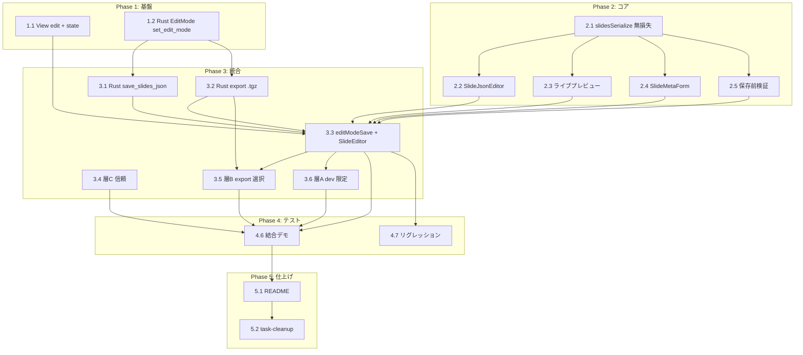

# スライド編集モード（器の作成） タスク分解

## メタ情報

| 項目 | 内容 |
|:---|:---|
| 機能名 | slide-edit-mode |
| チケット番号 | #13（Epic #12 配下） |
| 技術設計書 | `.sdd/specification/slide-edit-mode_design.md` |
| 作成日 | 2026-07-24 |

## タスク一覧

### Phase 1: 基盤

| #   | タスク | 説明 | 完了条件 | 依存 |
|:----|:-----|:----|:------|:----|
| 1.1 | View に `'edit'` を追加・編集モード state | `src/main.tsx` の `View` 型に `'edit'` を追加し、表示分岐を追加。編集モードの開始/終了で後述の `enterEditMode`/`exitEditMode` を呼ぶ。編集導線は `'edit'` 時のみ表示 | `'edit'` で編集画面、`'home'`/`'presentation'` は従来どおり。typecheck 通過（FR-001） | - |
| 1.2 | Rust `EditMode` state と `set_edit_mode` | `src-tauri/src/lib.rs` に `EditMode(Mutex<bool>)` を `manage` 登録し、`set_edit_mode(enabled)` を新設。`invoke_handler`（`generate_handler!`）へ追加 | 編集モードの on/off が Rust 側で保持される。typecheck/`cargo build` 通過（FR-011） | - |

### Phase 2: コア実装（編集・プレビュー・無損失往復）

| #   | タスク | 説明 | 完了条件 | 依存 |
|:----|:-----|:----|:------|:----|
| 2.1 | `slidesSerialize.ts` 新規作成 | `src/edit/slidesSerialize.ts` に `parseSlides(text)`/`serializeSlides(data)` を実装。未知キー（`left`/`right`/`steps`/`tiles`/`codeBlock` 等）・文字列内 HTML・意味を持つ空白（`\n`・` `）・`customCSS`・`component` props・`fragment` を無損失で往復。キー順・インデント（スペース2）を固定 | 編集していないフィールドが往復で変化しない。JSON 構文エラーは構造化エラーで返す（FR-004・NFR-002） | - |
| 2.2 | `SlideJsonEditor` 新規作成 | `src/edit/SlideJsonEditor.tsx` に JSON テキストエディタを実装。`parseSlides` で構文・スキーマ検証し、エラーを表示。編集内容を親へ通知 | JSON を編集でき、構文エラーが可視化される（FR-002） | 2.1 |
| 2.3 | `SlideRenderer.Slide` でライブプレビュー | 編集中データを `SlideRenderer.Slide` に渡して差分描画するプレビュー領域を実装（`PresenterViewWindow` の `PreviewSlide` を参考に 1280x720 基準スケール）。`presentationKey` による App 全再マウントは用いない | 編集がプレビューへ即時反映され、Reveal 全再初期化が起きない（FR-002・NFR-004・DC-001） | 2.1 |
| 2.4 | `SlideMetaForm` 新規作成 | `src/edit/SlideMetaForm.tsx` に確定フィールド（`meta`/`theme`/`layout`/`id`）のフォームを実装。同一 `PresentationData` を単一の真実源とし、未知キーには触れない部分更新 | 確定フィールドをフォーム編集でき、自由記述フィールドが保持される（FR-003・FR-004） | 2.1 |
| 2.5 | 保存前バリデーション | 既存 `src/data/loader.ts` の `getValidationErrors` を再利用し、保存前に検証。破損時は保存を止めエラー提示。既存読込の全体フォールバックへ流さない | 破損 JSON で保存が止まり、正常時は通る（FR-005） | 2.1 |

### Phase 3: 統合（保存・書き出し・アドオン付け外し）

| #   | タスク | 説明 | 完了条件 | 依存 |
|:----|:-----|:----|:------|:----|
| 3.1 | Rust `save_slides_json` | `lib.rs` に `save_slides_json(path, json)` を新設。冒頭で `EditMode` を検査し、無効時は `Err` を返す（ゲート）。有効時のみ `std::fs::write` | 編集モード時のみ保存が成功し、無効時は拒否される（FR-006・FR-011・NFR-003） | 1.2 |
| 3.2 | Rust `export_slide_package`（`.tgz` 生成） | `lib.rs` に `export_slide_package(json, out_dir, included_addons)` を新設。`EditMode` ゲート後、`export-slides.mjs` の `extractAssetPaths` 相当でアセット収集 → `package.json` 生成 → `flate2`+`tar` で `.tgz` 生成（`package/` サブディレクトリ規約）。生成パスを返す | `.tgz` が生成され、`extract_slide_package` で往復展開できる（FR-007・FR-011・DC-003） | 1.2 |
| 3.3 | `editModeSave.ts` と `SlideEditor` 束ね | `src/editModeSave.ts` に `enterEditMode`/`exitEditMode`/`saveSlidesJson`/`exportSlidePackage`（`invoke` + `plugin-dialog` の保存先選択）を実装。`src/edit/SlideEditor.tsx` で JSON エディタ・フォーム・プレビュー・保存/書出/付け外しを束ねる | 編集画面から保存・書き出しが実行でき、モード切替で state が同期する（FR-001・FR-006・FR-007） | 1.1, 2.2, 2.3, 2.4, 2.5, 3.1, 3.2 |
| 3.4 | 層C: 実行時信頼の個別付け外し | `src/localSlideLoader.ts` に `setAddonTrustDecision(path, decision)` を追加し、`src/components/SettingsWindow.tsx` に個別 allow/deny UI を追加（既存の一律無効化・失効を補完） | アドオン単位で信頼を allow/deny でき、永続化される（FR-008） | - |
| 3.5 | 層B: export 同梱アドオンの個別選択 | `scripts/export-slides.mjs` の `--addons`（all-or-nothing）を個別選択できる粒度へ拡張し、`export_slide_package` の `included_addons` と接続。同梱アドオン一覧を編集 UI に提示 | 同梱するアドオンを個別選択して `.tgz` に含められる（FR-009） | 3.2, 3.3 |
| 3.6 | 層A: 組み込み `entry.ts` の増減（dev 限定） | dev 環境（`import.meta.env.DEV` 等で判定）でのみ、組み込みアドオン `addons/src/{name}/entry.ts` の追加/削除 UI を提示。再ビルド（`npm run build:addons`）が必要である旨を明示。本番配布では非表示 | dev で組み込みアドオンを増減でき、本番では UI が出ない（FR-010・DC-004） | 3.3 |

### Phase 4: テスト

| #   | タスク | 説明 | 完了条件 | 依存 |
|:----|:-----|:----|:------|:----|
| 4.1 | `slidesSerialize` 単体テスト | 未知キー・文字列内 HTML・`\n`・` `・`customCSS`・`component` props・`fragment` の往復保持、キー順・インデント固定、編集フィールドのみ変化を検証 | 分岐網羅で green（FR-004・NFR-002） | 2.1 |
| 4.2 | 保存前バリデーション単体テスト | 破損 JSON で保存中止・正常時は通過、全体フォールバックへ流さないことを検証 | 分岐網羅で green（FR-005） | 2.5 |
| 4.3 | Rust 編集モードゲート単体テスト | `set_edit_mode(false)` 時に `save_slides_json`/`export_slide_package` が拒否され、`true` 時に成功することを検証 | 分岐網羅で green（FR-011・NFR-003） | 3.1, 3.2 |
| 4.4 | Rust export/展開往復単体テスト | `export_slide_package` が生成した `.tgz` を `extract_slide_package` で展開して往復一致、アセット収集が `extractAssetPaths` 規則と一致することを検証 | 正常系で green（FR-007・DC-003） | 3.2 |
| 4.5 | 層C 信頼 単体テスト | `setAddonTrustDecision` の allow/deny 個別設定と永続化・失効との整合を検証 | 主要分岐で green（FR-008） | 3.4 |
| 4.6 | 結合・手動デモ検証 | 編集→ライブプレビュー即時反映／保存→再読込で同一／`.tgz` を「開く」で読める／層B・C 付け外しが反映される／dev で層A、を実機で確認 | 全 AC を満たす | 3.3, 3.4, 3.5, 3.6 |
| 4.7 | リグレッション確認 | `npm run typecheck`/`npm run test` 通過。View・「開く」・発表者ビュー・既存パッケージ配布が従来どおり動作 | 全通過・既存挙動不変（NFR-001） | 3.3 |

### Phase 5: 仕上げ

| #   | タスク | 説明 | 完了条件 | 依存 |
|:----|:-----|:----|:------|:----|
| 5.1 | ドキュメント整備 | README（英日）に編集モード・ローカル保存・`.tgz` 書き出し・アドオン付け外しの手順を追記。必要ならスクリーンショット更新 | 記載が追加される | 4.6 |
| 5.2 | task-cleanup | 実装で確定した設計判断（テーマ隔離の最終判断・層A の dev 検出手段・検証強度）を `_design.md` に反映してから `task/` を整理 | design に統合済み（`impl-status` 更新） | 4.x, 5.1 |

## 依存関係図

## 実装の注意事項

- **ラウンドトリップ無損失が最優先**: 編集器は「パース → 編集 → 再シリアライズ」で未知キー・文字列内 HTML・意味を持つ空白を黙って捨ててはならない。過度な検証・正規化で自由記述を壊さない（FR-004・NFR-002）。
- **レンダラは再利用**: プレビューは `SlideRenderer.Slide` を再利用し、レイアウト分岐・`ComponentRegistry` 解決・`applyTheme` を再実装しない（DC-001）。
- **書き込みは Rust 境界＋編集モードゲート**: fs write を `plugin-fs` から JS へ開放せず、全書き込みコマンドの冒頭で `EditMode` を検査する（DC-002・FR-011・NFR-003）。
- **アセット規則は単一真実源**: `.tgz` の `extractAssetPaths` 相当を Rust に移植する際、`export-slides.mjs` の規則を真実源として二重管理しない（DC-003）。
- **層A は dev 限定**: 組み込み `entry.ts` の増減は再ビルドを要するため本番配布では出さない。本番は層B（パッケージ同梱）で代替（DC-004）。
- **プレビュー更新は差分描画**: `presentationKey` による App 全再マウント（Reveal 全再初期化）に載せない（NFR-004）。

## 参照ドキュメント

- 抽象仕様書: `.sdd/specification/slide-edit-mode_spec.md`
- 技術設計書: `.sdd/specification/slide-edit-mode_design.md`
- 要求仕様書: `.sdd/requirement/slide-edit-mode.md`

## 要求カバレッジ

| 要求 ID | 内容 | 対応タスク |
|:------|:----|:--------|
| FR-001 | View/Edit モード切替 | 1.1, 3.3 |
| FR-002 | JSON 編集＋ライブプレビュー | 2.2, 2.3 |
| FR-003 | 確定フィールドのフォーム編集 | 2.4 |
| FR-004 | ラウンドトリップ無損失 | 2.1, 4.1 |
| FR-005 | 保存前バリデーション | 2.5, 4.2 |
| FR-006 | slides.json ローカル保存 | 3.1, 3.3 |
| FR-007 | `.tgz` 書き出し | 3.2, 4.4 |
| FR-008 | 層C 実行時信頼の付け外し | 3.4, 4.5 |
| FR-009 | 層B export 同梱選択 | 3.5 |
| FR-010 | 層A 組み込み付け外し（dev 限定） | 3.6 |
| FR-011 | capability 分離（編集モードゲート） | 1.2, 3.1, 3.2, 4.3 |
| NFR-001 | リグレッションなし | 4.7 |
| NFR-002 | データ整合性（無損失） | 2.1, 4.1 |
| NFR-003 | 最小権限（capability） | 3.1, 3.2, 4.3 |
| NFR-004 | プレビュー応答性 | 2.3 |

**カバレッジ判定**: PRD/spec の全 FR-001〜011・NFR-001〜004 がいずれかのタスクに対応済み。未対応要求なし。設計制約は DC-001〜004 を各タスクの注意事項・完了条件で参照。DC-005（フル WYSIWYG を作らない＝非構築制約）はタスクを持たず、PRD/spec のスコープ外方針として担保する。

## 推奨する手動検証

- [ ] タスクの粒度が適切か（1タスク = 数時間〜1日程度）を確認
- [ ] 依存関係図が論理的に正しいか確認
- [ ] 要求カバレッジ表で漏れがないことを確認
- [ ] Phase 分類が適切か確認
- [ ] ラウンドトリップ無損失（FR-004）のテストが自由記述の全類型を網羅するか確認
