# Slide Presentation App

[English](README.md) | **日本語**

React + Reveal.js で構築し、Tauri でローカルデスクトップアプリとしてパッケージ化したスライドプレゼンテーションツールです。
スライドの内容とテーマを JSON ファイルで定義し、ネイティブウィンドウでプレゼンテーションとして表示します。

## Slide Presentation App とは

Slide Presentation App は、純粋なデータ駆動型アプローチを採用したプレゼンテーションの作成・表示ツールです。コードや
ドラッグ＆ドロップのエディタで手作業でスライドを組み立てる代わりに、スライドの内容・レイアウト・テーマ・スピーカー
ノート・音声ナレーションまでを 1 つの JSON ファイルで定義します。

フォーマットが構造化され明確に定義されているため、AI モデルは簡単なプロンプトから完全なプレゼンテーションを生成したり、
個々のスライドを正確に修正したり、いくつかの設定フィールドを調整するだけでデッキ全体のスタイルを変更したりできます。
これにより、複雑な UI フレームワークやコンポーネント階層を理解しなくても AI が初稿を生成し、人間が仕上げるという
AI 支援ワークフローに特に適しています。

ローカライズも簡単です。スライド JSON を翻訳するだけで、同じレイアウトとビジュアルがどの言語でも再現されます。翻訳した
スピーカーノートを AI 生成の音声合成と組み合わせれば、組み込みの自動再生・自動スライドショー機能が、手作業を一切挟まず
に多言語プレゼンテーションを完全自動で進行します。翻訳済みのデッキはスライドパッケージとして配布でき、チーム間で簡単に
共有できます。

内部的には React と Reveal.js の上に構築されており、滑らかなトランジション、スピーカーノート付きの発表者ビュー、
キーボードナビゲーション、カスタムコンポーネントのためのプラグインシステムを提供します。データ駆動型アプローチの
シンプルさと自動化の利点を備えた、洗練されたプレゼンテーションツールです。

## スクリーンショット

|                                                                |                                                            |
|:--------------------------------------------------------------:|:----------------------------------------------------------:|
|                          **ホーム**                            |                     **プレゼンテーション**                 |
|       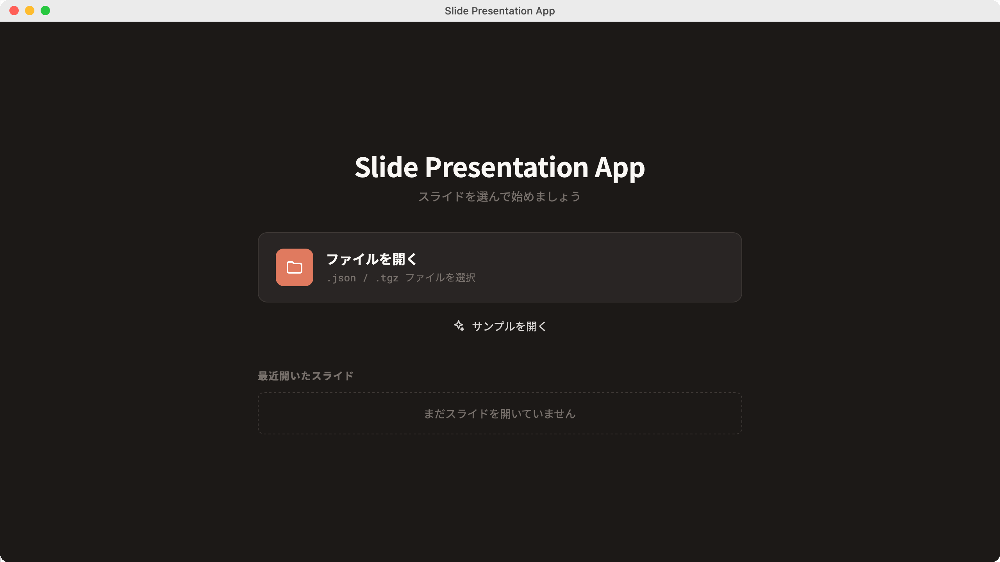         | 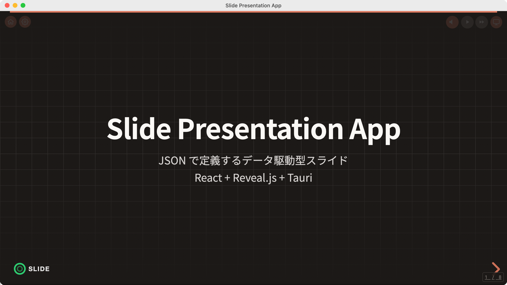 |
|                       **発表者ビュー**                         |                          **設定**                          |
| 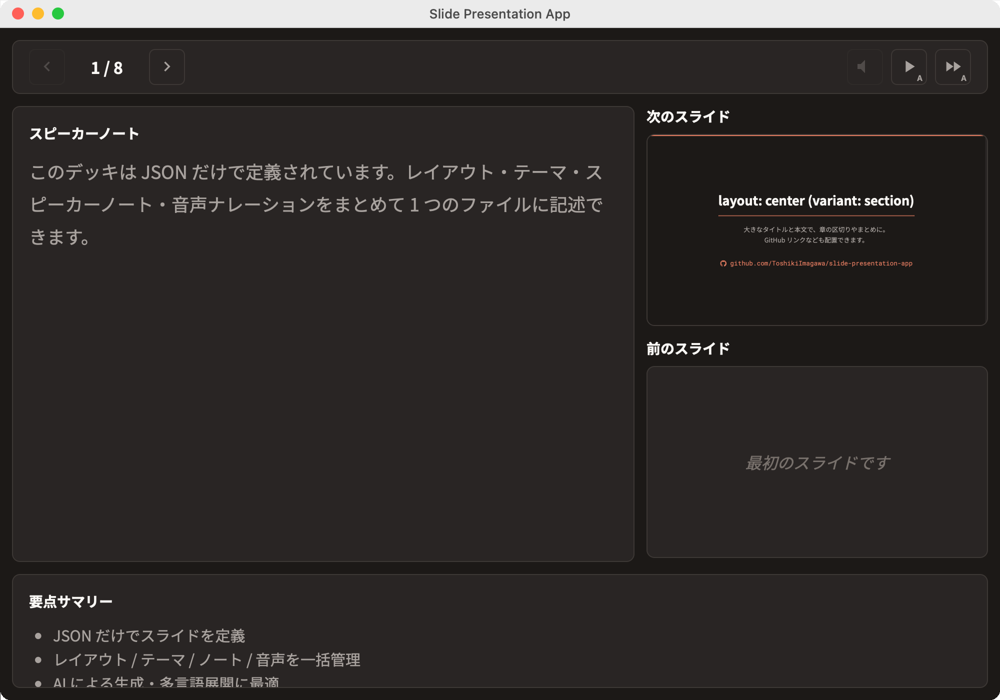   |         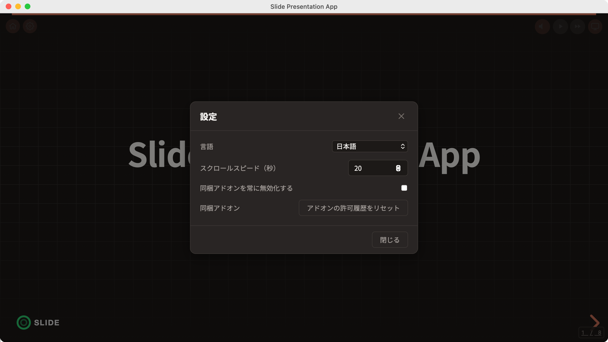     |

> これらの画像は自動生成されます。[スクリーンショットと E2E](#スクリーンショットと-e2e) を参照してください。

## セットアップ

```bash
npm install
```

アプリの実行には Tauri のための Rust ツールチェーン（`cargo`/`rustc`）が必要です。未導入の場合は
[Tauri の前提条件ガイド](https://v2.tauri.app/start/prerequisites/) を参照してください。

## コマンド

| コマンド                        | 説明                                                                          |
|--------------------------------|-------------------------------------------------------------------------------|
| `npm run tauri:dev`            | デスクトップアプリ起動（Tauri + アドオンビルド + Vite HMR）                    |
| `npm run tauri:build`          | デスクトップアプリのバンドルをビルド                                          |
| `npm run dev`                  | フロントエンドのみ開発サーバー起動（アドオンビルド + Vite HMR）               |
| `npm run build`                | フロントエンドのみプロダクションビルド（アドオンビルド + `dist/` に出力）      |
| `npm run build:addons`         | アドオンのみビルド                                                            |
| `npm run preview`              | ビルド済みファイルのプレビュー                                                |
| `npm run format`               | Prettier でコード整形（`src/**/*.{ts,tsx,css}`）                              |
| `npm run typecheck`            | TypeScript 型チェック                                                         |
| `npm run test`                 | テスト実行（Vitest）                                                          |
| `npm run test:watch`           | テスト監視モード                                                              |
| `npm run export:slides`        | スライド内容を npm パッケージ（.tgz）としてエクスポート                        |
| `npm run format:check`         | Prettier の整形チェック（書き換えなし。CI 用）                                |
| `npm run generate-icons`       | `resources/icon.svg` から `src-tauri/icons/` を再生成（macOS 専用）           |
| `npm run generate-screenshots` | Playwright WebKit で README 用スクリーンショットを撮影（macOS 専用・e2e スモーク兼用） |
| `npm run screenshots:compare`  | 実アプリ画像とモック画像を比較（pixelmatch）                                  |
| `npm run generate-docs`        | `README.md` / `CHANGELOG.md` を PDF 化（`docs/` に出力）                      |

## ホーム画面

起動すると、まず何を表示するかを選ぶホーム画面が開きます。

| アクション            | 説明                                                                          |
|-----------------------|-------------------------------------------------------------------------------|
| **ファイルを開く**    | ディスクから `slides.json` または `.tgz` スライドパッケージを選択             |
| **サンプルを開く**    | 同梱のサンプルデッキを読み込む（`slides.json` が同梱されていない場合は組み込みのテンプレートガイド） |
| **最近開いたスライド**| 最近使ったパッケージを再度開く。一覧は起動をまたいで永続化されます            |

プレゼンテーション中は、左上ツールバーの **ホーム** ボタンでこの画面に戻れます。

## ローカルのスライドパッケージを開く

ビルド時に同梱したスライド内容（後述の [スライドパッケージ](#スライドパッケージ) を参照）に加えて、ホーム画面の
**ファイルを開く** ボタンから、いつでもディスク上の `slides.json` ファイルや、`npm run export:slides` で生成した `.tgz`
スライドパッケージを選択できます。`.tgz` パッケージは、まずアプリのキャッシュディレクトリに展開されます。スライド
データ内の `image/`・`voice/`・`theme/`・`font/` の相対参照は、その内容が置かれているフォルダを基準に解決されます。
アプリは最後に開いたファイルを記憶し、次回起動時に自動的に再読み込みします。

## スライドを定義する

スライドの内容をカスタマイズするには `public/slides.json` を作成します。
このファイルが存在しない場合は、組み込みのテンプレートガイドが表示されます。

### 基本構造

```json
{
  "meta": {
    "title": "Presentation Title",
    "description": "Description",
    "author": "Author",
    "logo": {
      "src": "/my-logo.png",
      "width": 150,
      "height": 50
    }
  },
  "slides": [
    {
      "id": "slide-1",
      "layout": "center",
      "content": {
        "title": "Title Slide",
        "subtitle": "Subtitle"
      }
    }
  ]
}
```

### ロゴ設定

`meta.logo` フィールドでプレゼンテーションのロゴをカスタマイズします。

| フィールド | 型     | 既定値      | 説明                   |
|-----------|--------|-------------|------------------------|
| `src`     | string | `/logo.png` | ロゴ画像へのパス       |
| `width`   | number | `120`       | ロゴの幅（px）         |
| `height`  | number | `40`        | ロゴの高さ（px）       |

`meta.logo` を省略するとロゴは表示されません。`width` と `height` を省略すると、それぞれ既定値の `120` と `40` が使われ
ます。ロゴは全スライドの左下に表示されます。

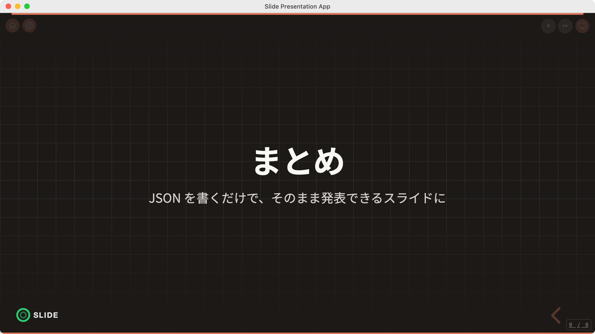

### レイアウト

各スライドの `layout` フィールドで使用するレイアウトが決まります。

| layout       | 用途                    | 主なフィールド                               |
|--------------|-------------------------|----------------------------------------------|
| `center`     | 表紙 / タイトル / まとめ | `title`, `subtitle`, `variant`               |
| `content`    | 内容表示                | `title`, `steps[]` / `tiles[]` / `component` |
| `two-column` | 2カラムレイアウト       | `title`, `left`, `right`                     |
| `bleed`      | 全幅2カラム             | `title`, `commands[]`, `component`           |
| `custom`     | カスタムコンポーネント  | `component`                                  |

`center` レイアウトは `variant` フィールドで表示を切り替えます。

| variant     | 説明                                                          |
|-------------|---------------------------------------------------------------|
| (未指定)    | TitleLayout（タイトルとサブタイトルを表示）                   |
| `"section"` | SectionLayout（まとめ表示。`body`・`qrCode` などを使用）      |

`content` レイアウトは子要素のフィールドに基づいて描画を切り替えます。

| フィールド  | 描画されるもの   |
|-------------|------------------|
| `steps`     | Timeline         |
| `tiles`     | FeatureTileGrid  |
| `component` | カスタムコンポーネント |

#### レイアウト例

|                                                                     |                                                                     |
| :-----------------------------------------------------------------: | :-----------------------------------------------------------------: |
|                   `content` — Timeline (`steps`)                    |              `content` — FeatureTileGrid (`tiles`)                  |
| 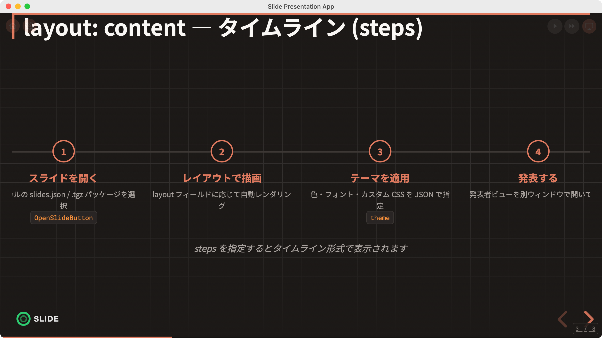 | 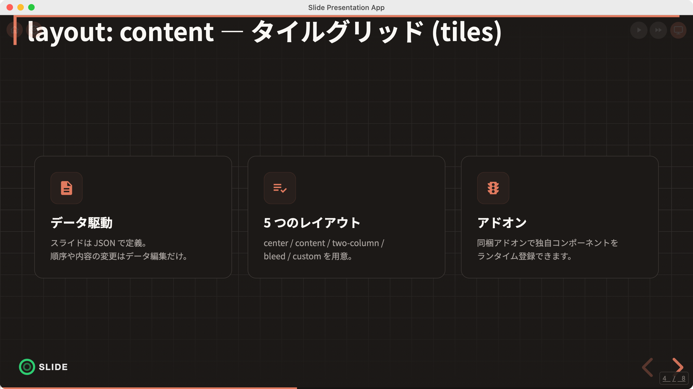 |
|                            `two-column`                             |                  `center`（`variant: "section"`）                  |
|    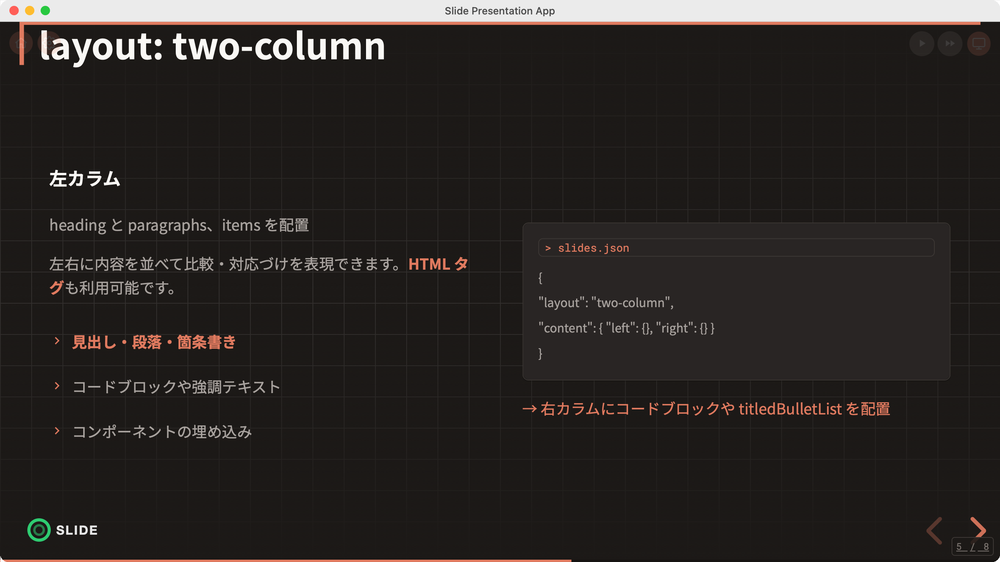    |     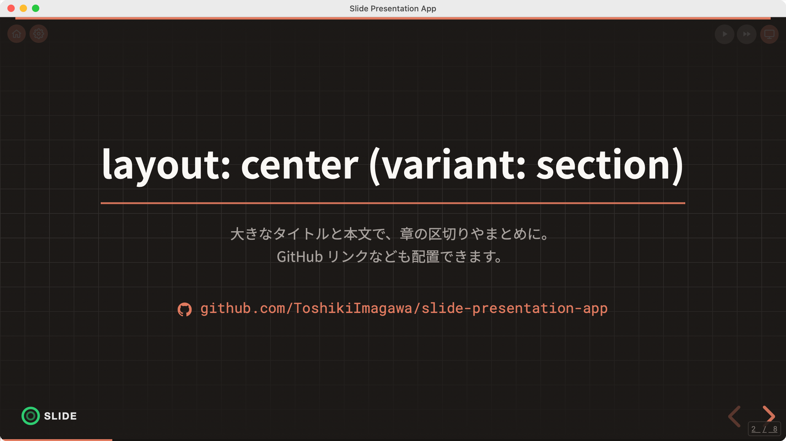  |
|               `bleed` — 全幅2カラム                                 |              `custom` — 全画面コンポーネント                       |
|          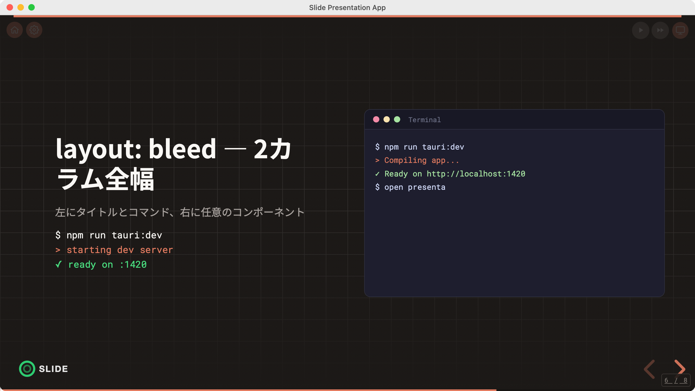        |         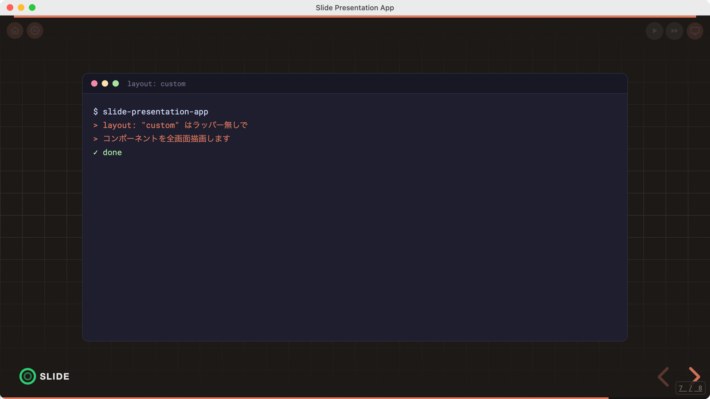       |

> `center` の表紙 / タイトルレイアウトは上部の [スクリーンショット](#スクリーンショット) セクションに掲載しています。

### two-column レイアウトの詳細

`left` / `right` フィールドには以下を指定できます。

```json
{
  "heading": "Heading",
  "headingDescription": "Supplementary text for the heading",
  "paragraphs": [
    "Paragraph text (HTML tags supported)"
  ],
  "items": [
    {
      "text": "Item name",
      "description": "Description",
      "emphasis": true
    }
  ],
  "codeBlock": {
    "header": "> Header",
    "items": [
      "Line 1",
      "Line 2"
    ]
  },
  "component": {
    "name": "ComponentName",
    "props": {}
  }
}
```

### スライドメタ

各スライドに任意の `meta` フィールドを追加して、トランジションや背景を制御できます。

```json
{
  "id": "slide-1",
  "layout": "center",
  "content": {
    "title": "Title"
  },
  "meta": {
    "transition": "fade",
    "backgroundColor": "#1a1a2e",
    "backgroundImage": "url(/background.jpg)",
    "notes": "Speaker notes (string format)"
  }
}
```

### スピーカーノート

`meta.notes` フィールドでスピーカーノートを定義します。文字列形式とオブジェクト形式の 2 種類がサポートされています。

**文字列形式（シンプル）:**

```json
{
  "meta": {
    "notes": "Write your speaker notes here"
  }
}
```

**オブジェクト形式（スピーカーノート + 要点サマリー + 音声）:**

```json
{
  "meta": {
    "notes": {
      "speakerNotes": "Write your speaker notes and script here",
      "summary": [
        "Point 1: Key takeaway of this slide",
        "Point 2: What to convey to the audience"
      ],
      "voice": "/voice/slide-01.wav"
    }
  }
}
```

| フィールド     | 型       | 説明                                       |
|----------------|----------|--------------------------------------------|
| `speakerNotes` | string   | スピーカーノート / 台本                    |
| `summary`      | string[] | 要点サマリー（箇条書き）                   |
| `voice`        | string   | 音声ファイルへのパス（`public/` 基準）     |

`notes` を持たないスライドは、発表者ビューでノートパネルが空で表示されます。

### コンポーネント参照

登録済みのコンポーネントをスライド内で使用します。

```json
{
  "component": {
    "name": "TerminalAnimation",
    "props": {
      "logTextUrl": "/demo-log.txt"
    }
  }
}
```

組み込みコンポーネントの例: `TerminalAnimation`, `CodeBlockPanel`, `BulletList`, `Timeline` など。

## テーマ

テーマは 2 つの方法でカスタマイズできます。

### 方法 1: slides.json で定義する

`slides.json` に `theme` フィールドを追加します。

```json
{
  "meta": {
    "title": "..."
  },
  "theme": {
    "colors": {
      "primary": "#6c63ff",
      "background": "#0a0a1a",
      "text": "#e0e0e0"
    },
    "fonts": {
      "heading": "'Noto Sans JP', sans-serif",
      "body": "'Noto Sans JP', sans-serif",
      "code": "'Fira Code', monospace",
      "baseFontSize": 24,
      "sources": [
        {
          "family": "MyFont",
          "src": "/fonts/MyFont.woff2"
        },
        {
          "family": "Fira Code",
          "url": "https://fonts.googleapis.com/css2?family=Fira+Code:wght@400;700&display=swap"
        }
      ]
    },
    "customCSS": ".reveal h1 { text-shadow: none; }"
  },
  "slides": []
}
```

#### フォント設定の詳細

`theme.fonts` には以下のフィールドを指定できます。

| フィールド     | 型           | 既定値                                | 説明                                                            |
|----------------|--------------|---------------------------------------|-----------------------------------------------------------------|
| `heading`      | string       | `'Noto Sans JP', 'Inter', sans-serif` | 見出しフォント                                                  |
| `body`         | string       | `'Noto Sans JP', 'Inter', sans-serif` | 本文フォント                                                    |
| `code`         | string       | `'Roboto Mono', monospace`            | コードブロックのフォント                                        |
| `baseFontSize` | number       | `20`                                  | 基本フォントサイズ（px）。全フォントサイズが比率で自動スケール  |
| `sources`      | FontSource[] | —                                     | フォントソースの配列                                            |

`baseFontSize` を変更すると、H1 から Body2 までのすべてのフォントサイズが基準値からの比率で自動計算されます。

`sources` でローカルフォントや外部フォントを読み込みます。

```json
{
  "sources": [
    {
      "family": "MyFont",
      "src": "/fonts/MyFont.woff2"
    },
    {
      "family": "Fira Code",
      "url": "https://fonts.googleapis.com/css2?family=Fira+Code:wght@400;700&display=swap"
    }
  ]
}
```

| フィールド | 型     | 説明                                                                    |
|-----------|--------|-------------------------------------------------------------------------|
| `family`  | string | フォント名                                                              |
| `src`     | string | ローカルフォントファイルへのパス（`@font-face` で登録）                  |
| `url`     | string | 外部フォント URL（`<link>` タグで読み込み。Google Fonts に対応）         |

### 方法 2: theme-colors.json で色のみ上書きする

`public/theme-colors.json` を作成すると、色設定のみを上書きできます。
既定の `/theme-colors.json` の代わりに、`meta.themeColors` フィールドでカスタムパスを指定することもできます。

```json
{
  "meta": {
    "title": "Presentation Title",
    "themeColors": "/theme/custom-colors.json"
  }
}
```

```json
{
  "primary": "#6c63ff",
  "background": "#0a0a1a",
  "backgroundAlt": "#12122a",
  "backgroundGrid": "#1a1a3e",
  "textHeading": "#ffffff",
  "textBody": "#c8c8d0",
  "textSubtitle": "#a0a0b0",
  "textMuted": "#808090",
  "border": "#2a2a4a",
  "borderLight": "#1e1e3a",
  "codeText": "#e0e0e0",
  "success": "#4caf50"
}
```

## 国際化 (i18n)

UI の表示言語を切り替えます。初期言語はブラウザ設定から自動検出され、設定ウィンドウから手動で変更できます。選択した
言語は `localStorage` に保存され、セッションをまたいで維持されます。

### 対応言語

| 言語コード | 言語     |
|-----------|----------|
| `en-US`   | 英語     |
| `ja-JP`   | 日本語   |
| `fr-FR`   | フランス語 |

### 設定ウィンドウ

右上の歯車アイコン（設定ボタン）をクリックすると設定ウィンドウが開き、言語を選択できます。同じ言語設定が発表者ビューに
も適用されます。

### 言語リソースの構造

言語リソースは `assets/locales/` ディレクトリに配置されています。

```
assets/locales/
├── manifest.json    # 読み込むファイルの一覧
├── en-US.json       # 英語リソース
├── ja-JP.json       # 日本語リソース
└── fr-FR.json       # フランス語リソース
```

`manifest.json` で読み込む言語ファイルを指定します。

```json
{
  "locales": [
    "en-US.json",
    "ja-JP.json",
    "fr-FR.json"
  ]
}
```

各言語リソースは以下の構造を持ちます。

```json
{
  "languageCode": "en-US",
  "languageName": "English",
  "ui": {
    "settings": {
      "title": "Settings",
      "language": "Language",
      "close": "Close",
      "open": "Settings"
    },
    "presenterView": {
      "open": "Presenter View",
      "navPrev": "Previous slide (←)",
      "navNext": "Next slide (→ / Space)",
      "notesTitle": "Speaker Notes",
      "nextSlide": "Next Slide",
      "previousSlide": "Previous Slide"
    },
    "audio": {
      "play": "Play audio",
      "stop": "Stop audio"
    }
  }
}
```

`ui` 内のキーは最大 2 階層のネスト（`section.key`）に対応します。

## 発表者ビュー

プレゼンテーション画面の右上にある「発表者ビュー」ボタンをクリックすると、別ウィンドウで発表者ビューが開きます。発表者
ビューの UI ラベルは、国際化セクションで説明した言語設定に従います。


### パネルレイアウト

発表者ビューは以下のエリアで構成されます。

**コントロールバー（上部）:**

| 位置 | コントロール                     | 説明                                                    |
|------|----------------------------------|---------------------------------------------------------|
| 左   | 前へ / 進捗 / 次へ               | スライドナビゲーションと現在位置（例: `3 / 10`）        |
| 右   | 再生 / 自動再生 / 自動スライドショー | 音声コントロール（音声再生セクションを参照）           |

**メインエリア（中央）:**

```
┌──────────────────┬──────────────────┐
│                  │ 次のスライド     │
│ スピーカーノート │ プレビュー       │
│                  ├──────────────────┤
│                  │ 前のスライド     │
│                  │ プレビュー       │
└──────────────────┴──────────────────┘
```

| パネル           | 内容                                                       |
|------------------|------------------------------------------------------------|
| スピーカーノート | 現在のスライドの `speakerNotes`（発表者メモ）              |
| 次のスライド     | 次のスライドのサムネイルプレビュー                        |
| 前のスライド     | 前のスライドのサムネイルプレビュー                        |
| 要点サマリー     | 現在のスライドの `summary`（箇条書き。下部に表示）        |

最初のスライドでは前のスライドプレビューに境界メッセージ（例:「最初のスライドです」）が表示され、最後のスライドでは
次のスライドプレビューに境界メッセージ（例:「最後のスライドです」）が表示されます。これらのメッセージは言語設定に応じて
翻訳されます。

### 双方向同期

メインウィンドウと発表者ビューは Tauri イベント（`@tauri-apps/api/event`、イベント名 `presenter-view`）で双方向に同期
します。発表者ビューは別のネイティブ Tauri ウィンドウとして動作します。

- メインウィンドウでスライドを移動すると、発表者ビューがリアルタイムに更新される
- 発表者ビューでのスライド移動や音声操作が、メインウィンドウに反映される

### キーボードナビゲーション

発表者ビューでは以下のキーボードショートカットが利用できます。

| キー                        | 動作           |
|-----------------------------|----------------|
| `←`（左矢印）               | 前のスライド   |
| `→`（右矢印）/ `Space`      | 次のスライド   |

## 音声再生

`meta.notes.voice` フィールドに音声ファイルのパスを指定すると、スライドごとの音声再生を有効にできます。音声ファイルは
`public/` 配下に配置します（例: `public/voice/slide-01.wav`）。

### ツールバー

`voice` が定義されたスライドでは、右上のツールバーに以下のボタンが表示されます。

| ボタン           | アイコン | 機能                                                    |
|------------------|----------|---------------------------------------------------------|
| 再生 / 停止      | スピーカー | 現在のスライドの音声を手動で再生 / 停止                |
| 自動再生         | ▶        | スライド遷移時の音声自動再生を ON / OFF               |
| 自動スライドショー | ▶▶       | 音声終了時に次スライドへ自動送りするのを ON / OFF     |

ツールバーは既定では低い不透明度で表示され、ホバーすると完全に表示されます。同じコントロールは発表者ビューのコント
ロールバーからも利用できます。

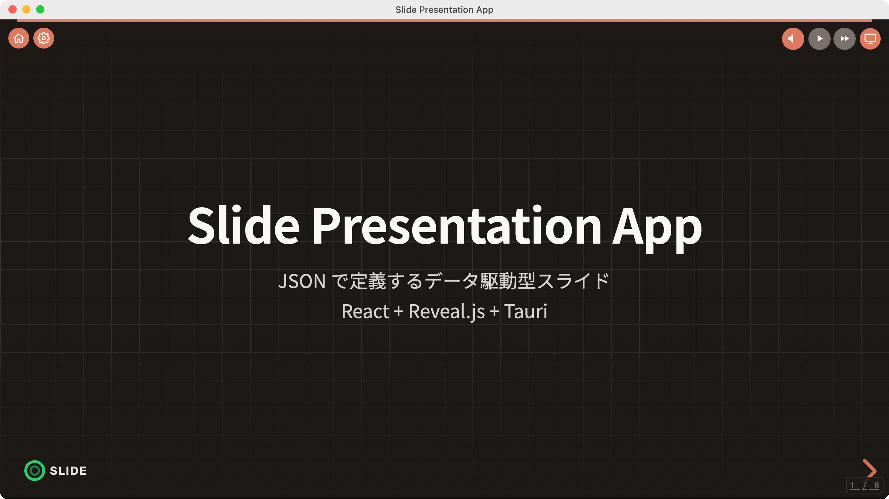

### 手動再生

スピーカーアイコンをクリックすると現在のスライドの音声が再生されます。もう一度クリックすると停止します。`voice` が定義
されていないスライドではアイコンは表示されません。

### 自動再生

自動再生ボタン（▶）が ON のとき、`voice` が定義された各スライドに移動するたびに音声が自動的に再生されます。

### 自動スライドショー

自動スライドショーボタン（▶▶）が ON のとき、音声の再生が終わると自動的に次のスライドへ進みます。最後のスライドでは
自動送りしません。自動再生と組み合わせると、全スライドを通した完全自動のプレゼンテーションが可能になります。

## アドオンの追加

カスタムコンポーネントをアドオンとして追加し、スライド内で使用します。

### 1. アドオンディレクトリを作成する

```
addons/src/{addon-name}/
├── entry.ts         # コンポーネントの登録
└── MyComponent.tsx  # コンポーネントの実装
```

### 2. コンポーネントを実装する

```tsx
// addons/src/my-addon/MyComponent.tsx
const React = window.React;

export function MyComponent({ message }: { message: string }) {
  return React.createElement('div', null, message);
}
```

### 3. エントリファイルでコンポーネントを登録する

```ts
// addons/src/my-addon/entry.ts
import { MyComponent } from './MyComponent';

window.__ADDON_REGISTER__('my-addon', [
  { name: 'MyComponent', component: MyComponent },
]);
```

### 4. ビルドする

```bash
npm run build:addons
```

### 5. スライドで使用する

```json
{
  "id": "custom-slide",
  "layout": "custom",
  "content": {
    "component": {
      "name": "MyComponent",
      "props": {
        "message": "Hello!"
      }
    }
  }
}
```

## 静的アセット

`public/` ディレクトリに配置したファイルは、ビルド後にルートパスからアクセスできます。

| ファイル                              | URL                             |
|---------------------------------------|---------------------------------|
| `public/slides.json`                  | `/slides.json`                  |
| `public/theme-colors.json`            | `/theme-colors.json`            |
| `public/images/logo.png`              | `/images/logo.png`              |
| `public/voice/slide-01.wav`           | `/voice/slide-01.wav`           |
| `public/assets/locales/manifest.json` | `/assets/locales/manifest.json` |
| `public/assets/locales/en-US.json`    | `/assets/locales/en-US.json`    |

## スライドパッケージ

スライド内容（slides.json + 画像・音声・テーマ・フォントなど）を npm パッケージとしてエクスポート・配布します。

### エクスポート（パッケージ作成）

```bash
npm run export:slides -- --name my-presentation --slides slides.json
```

| オプション  | 必須 | 説明                                                    |
|-------------|:----:|---------------------------------------------------------|
| `--name`    | はい | パッケージ名（`@slides/{name}` として生成）             |
| `--slides`  | はい | `public/` 配下のスライド JSON ファイル名                |
| `--version` |      | バージョン（既定: `1.0.0`）                             |
| `--addons`  |      | ビルド済みアドオン（`addons/dist`）をパッケージに同梱   |

これにより `dist-slides/` に `.tgz` ファイルが生成されます。slides.json で参照されるアセットパス（`image/`・`voice/`・
`theme/`・`font/`）は自動検出されパッケージに含まれます。`--addons` を指定すると、ビルド済みアドオンが `addons/` 配下に
同梱され、パッケージを開いた後に動的に読み込まれます（Tauri ランタイムのみ。下記参照）。

### 同梱アドオン（ランタイムロード）

`.tgz` をデスクトップアプリで開くと、その `addons/` ディレクトリに同梱されたアドオンがランタイムで読み込まれ、
`{ "component": { "name": ... } }` から解決できるようになります。アドオンはパッケージ（owner）単位でスコープ管理される
ため、パッケージを切り替えると前のパッケージのアドオンがアンロードされ、名前の衝突を防ぎます。

> ⚠️ **セキュリティ: 信頼できる発行元のパッケージのみを開いてください。**
> 同梱アドオンは、**アプリと同じ権限**（サンドボックスなし）で動作する JavaScript です。悪意のあるパッケージはアプリが
> 公開するあらゆる機能に到達し得ます。そのため:
>
> - アドオンを含むパッケージを初めて開くと、確認ダイアログが表示されます。**アドオンは既定で無効**であり、明示的に有効
>   化した場合のみ読み込まれます。選択（許可 / 拒否）はパッケージ単位で記憶されます。
> - 拒否してもスライドは通常どおり開き、未解決のコンポーネントはプレースホルダにフォールバックします。
> - **設定 →「同梱アドオンを常に無効化する」** で同梱アドオンを完全に無効化でき、**「アドオンの許可履歴をリセット」** で
>   記憶された許可 / 拒否の判断をすべてリセットできます。
>
> パッケージの `addons/manifest.json` で宣言され、かつ `addons/` 配下にあるアドオンのみが読み込まれます。

### インポート（パッケージの使用）

`VITE_SLIDE_PACKAGE` 環境変数でスライドパッケージを指定します。ローカルパスと npm パッケージの両方に対応しています。

#### ローカルパスで使用する（npm install 不要）

`.env.local` に `.tgz` ファイルまたは展開済みディレクトリのパスを指定します。

```bash
# .tgz を直接指定
VITE_SLIDE_PACKAGE=./dist-slides/slides-my-presentation-1.0.0.tgz

# 展開済みディレクトリを指定
VITE_SLIDE_PACKAGE=./dist-slides/my-presentation
```

#### npm パッケージとして使用する

```bash
# .tgz をインストール
npm install ./dist-slides/slides-my-presentation-1.0.0.tgz

# .env.local にパッケージ名を指定
VITE_SLIDE_PACKAGE=@slides/my-presentation
```

#### `VITE_SLIDE_PACKAGE` の値リファレンス

| 値                            | 挙動                                                    |
|-------------------------------|---------------------------------------------------------|
| `./dist-slides/xxx-1.0.0.tgz` | .tgz を自動展開してローカルで使用（npm install 不要）   |
| `./dist-slides/xxx/`          | 展開済みディレクトリから直接読み込み（npm install 不要）|
| `@slides/xxx`                 | npm パッケージから読み込み                              |
| (未指定)                      | `@slides/*` パッケージを自動検出                        |

### 挙動

- `public/` に同名ファイルが存在する場合は `public/` のファイルが優先される（パッケージはフォールバック）
- `npm run build` 時、パッケージのアセットは `dist/` にコピーされる（既存ファイルは上書きしない）

## スクリーンショットと E2E

この README のスクリーンショットは、エンドツーエンドのスモークテストも兼ねる Playwright（WebKit）スクリプトで生成
されます。

```bash
npm run generate-screenshots            # 全シナリオを撮影
npm run generate-screenshots -- home    # 単一シナリオを撮影
```

- `vite --mode screenshot` でアプリを起動し、Tauri IPC 層をインメモリのモック（`src/__screenshot__/`）に差し替えて、
  素のブラウザで UI を起動します。ブラウザのロケールに応じて、ロケール別の fixture デッキ
  （`scripts/screenshot/fixtures/slides.{en,ja}.json`）が `/slides.json` として配信されます。
- 全シナリオ（`home`・`presentation`・`toolbar`・`settings`・`presenter-view`・`layout-*` ギャラリー・`logo`）を両方の
  ロケールで撮影し、macOS ウィンドウ枠を合成します。英語のショットは `resources/screenshots/en/`、日本語は
  `resources/screenshots/ja/` に出力されます。いずれかのシナリオの待受が失敗すると非ゼロ終了するため、e2e スモークを
  兼ねます。
- **macOS 専用**（日本語フォントと WebKit の描画が Linux とは異なるため）。CI では `.github/workflows/screenshots.yml`
  （手動 dispatch）の macOS ランナーで実行し、`resources/screenshots/` の差分をコミットします。
- **アサーション付き E2E**: `npm run test:e2e` は Playwright Test スイート（`e2e/*.spec.ts`）を実行します。撮影と同じ
  screenshot モードのサーバー・IPC モック・fixture を再利用しつつ、`en` / `ja` 両ロケールで明示的な `expect()` 検証を
  行います。ピクセルではなく DOM テキストを検証するため、CI では Linux 上でヘッドレス実行します
  （`.github/workflows/ci.yml`）。詳細は [`e2e/README.md`](e2e/README.md)。
- 実 Tauri WebView 上での受け入れテスト（WebdriverIO + `tauri-driver`）の任意の雛形が `e2e/` にあります。

## ライセンス

MIT
