# Slide Presentation App

[English](README.md) | **日本語**


React + Reveal.js で構築し、Tauri でローカルデスクトップアプリとしてパッケージ化したスライドプレゼンテーションツールです。
スライドの内容とテーマを JSON ファイルで定義し、ネイティブウィンドウでプレゼンテーションとして表示します。

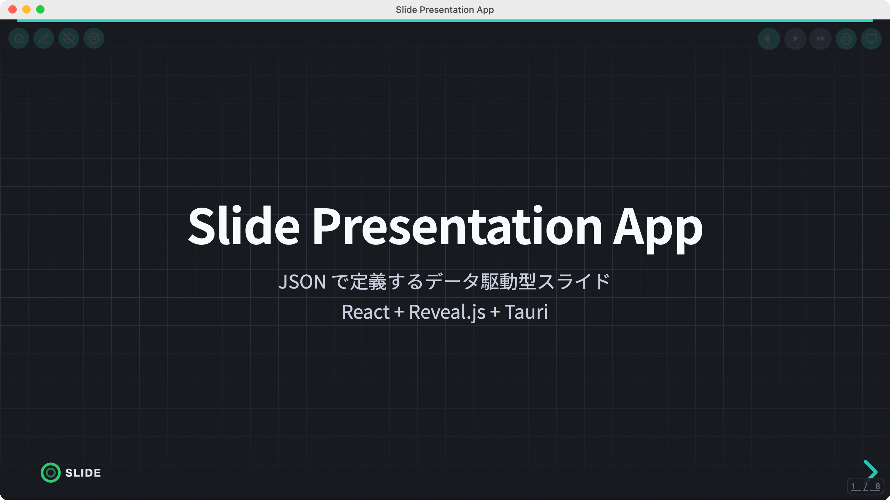

## Slide Presentation App とは

Slide Presentation App は、純粋なデータ駆動型アプローチを採用したプレゼンテーションの作成・表示ツールです。コードや
ドラッグ＆ドロップのエディタで手作業でスライドを組み立てる代わりに、スライドの内容・レイアウト・テーマ・スピーカー
ノート・音声ナレーションまでを 1 つの JSON ファイルで定義します。

フォーマットが構造化され明確に定義されているため、AI モデルは簡単なプロンプトから完全なプレゼンテーションを生成したり、
個々のスライドを正確に修正したり、いくつかの設定フィールドを調整するだけでデッキ全体のスタイルを変更したりできます。
これにより、複雑な UI フレームワークやコンポーネント階層を理解しなくても AI が初稿を生成し、人間が仕上げるという
AI 支援ワークフローに特に適しています。

ローカライズも簡単です。スライド JSON を翻訳するだけで、同じレイアウトとビジュアルがどの言語でも再現されます。翻訳した
スピーカーノートを AI 生成の音声合成と組み合わせれば、組み込みの自動再生・自動スライドショー機能が、手作業を一切挟まず
に多言語プレゼンテーションを完全自動で進行します。翻訳済みのデッキはスライドパッケージとして配布でき、チーム間で簡単に
共有できます。

内部的には React と Reveal.js の上に構築されており、滑らかなトランジション、スピーカーノート付きの発表者ビュー、
キーボードナビゲーション、カスタムコンポーネントのためのプラグインシステムを提供します。データ駆動型アプローチの
シンプルさと自動化の利点を備えた、洗練されたプレゼンテーションツールです。

## ダウンロード / インストール

タグ付きリリースごとのビルド済みインストーラは
[GitHub Releases](https://github.com/ToshikiImagawa/slide-presentation-app/releases) ページで配布しています。

| OS      | ファイル                            |
|---------|-------------------------------------|
| macOS   | `.dmg`                              |
| Windows | `.exe`（NSIS インストーラ）または `.msi` |
| Linux   | `.AppImage` / `.deb` / `.rpm`       |

最新リリースから自分の OS に対応するファイルをダウンロードして実行してください。

### macOS の Gatekeeper 警告について

本アプリは自己署名のみで Apple の公証(notarization)を受けていません。macOS Sequoia (15) 以降では、Finder で
アプリを右クリックして開く Gatekeeper 回避手順が廃止されたため、ダウンロードした `.dmg` そのもの（中のアプリ
ではなく dmg 自体）が Gatekeeper にブロックされ、「Apple はマルウェアが含まれていないことを検証できませんで
した」という警告が表示されます。これは初回だけでなく、**新しいバージョンをダウンロードするたびに**発生します。

開くには、**システム設定 → プライバシーとセキュリティ** を開き、ブロックされた項目の横にある「このまま開く」
をクリックし、表示されるダイアログで確認してください。もしくは、コマンドラインで quarantine 属性を削除する
こともできます。

```bash
xattr -d com.apple.quarantine ~/Downloads/Slide.Presentation.App_*.dmg
```

インストール後もアプリ本体がブロックされる場合（dmg からコピーする際に quarantine 属性が伝播することが
あります）は、以下も実行してください。

```bash
xattr -dr com.apple.quarantine "/Applications/Slide Presentation App.app"
```

> `curl` でダウンロードしたファイルには quarantine 属性が付与されないため、この警告はブラウザでダウンロード
> した場合にのみ発生します。

### キーチェーンとパスワードについて

本アプリは OS のキーチェーンやセキュアストレージを一切使用しません。ローカルに永続化する情報は「最後に開いたスライド
ファイルのパス」のみで、`tauri-plugin-store` と `tauri-plugin-fs` によりアプリのデータディレクトリに平文の JSON として
保存されます。インストールや起動のたびにキーチェーンのパスワードを求められることはありません。上記の Gatekeeper への
対応が必要になる唯一の場面です。

### 更新方法について

本アプリは現状、アプリ内で更新を自動チェックする機能を搭載していません。
[Releases](https://github.com/ToshikiImagawa/slide-presentation-app/releases) から最新のインストーラをダウンロードし、
既存のアプリに上書きインストールしてください。

## ホーム画面

起動すると、まず何を表示するかを選ぶホーム画面が開きます。

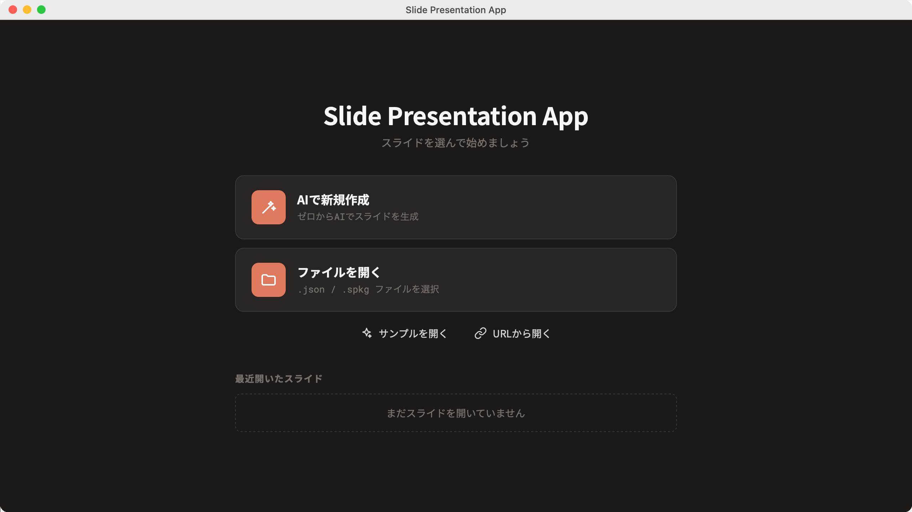

| アクション                      | 説明                                                                          |
|---------------------------------|-------------------------------------------------------------------------------|
| **AIで新規作成**                | AI でゼロからスライドを生成し、そのまま [編集モード](#編集モード) で仕上げます（[AI 生成](#ai-生成) の事前設定が必要です） |
| **ファイルを開く**              | ディスクから `slides.json` または `.spkg` スライドパッケージを選択（旧 `.tgz` も開けます） |
| **URL から開く**                | HTTPS で `.spkg` スライドパッケージを取得して開く（ダウンロードはローカルにキャッシュされます） |
| **サンプルを開く**              | 配布サンプル（テンプレートガイド）を開く。GitHub Releases から取得し、2 回目以降はキャッシュから開けます（後述の [配布サンプル](#配布サンプル)） |
| **最近開いたスライド**          | 最近使ったパッケージを再度開く。一覧は起動をまたいで永続化されます            |
| **`.spkg` をダブルクリック**    | OS のファイルマネージャから直接パッケージを開く。先にアプリを起動しておく必要はありません |

プレゼンテーション中は、左上ツールバーの **ホーム** ボタンでこの画面に戻れます。

## ローカルのスライドパッケージを開く

ビルド時に同梱したスライド内容（後述の [スライドパッケージ](#スライドパッケージ) を参照）に加えて、ホーム画面の
**ファイルを開く** ボタンから、いつでもディスク上の `slides.json` ファイルや、`npm run export:slides` で生成した `.spkg`
スライドパッケージ（旧バージョンで書き出した `.tgz` も開けます）を選択できます。`.spkg`/`.tgz` パッケージは、まずアプリのキャッシュディレクトリに展開されます。スライド
データ内の `image/`・`voice/`・`theme/`・`font/` の相対参照は、その内容が置かれているフォルダを基準に解決されます。
アプリは最後に開いたファイルを記憶し、次回起動時に自動的に再読み込みします。

### OS から `.spkg` を開く

`.spkg` ファイルは **macOS・Windows・Linux** でアプリに関連付けられます。Finder / エクスプローラ / ファイルマネージャで
ダブルクリックする（または右クリックしてこのアプリで開く）だけで、先にアプリを起動しなくても開けます。上で説明した
挙動はそのまま同じように効きます。パッケージはキャッシュディレクトリに展開され、`image/`・`voice/`・`theme/`・`font/`
の相対参照も同じ規則で解決され、同梱アドオンも同じ信頼確認を通り、最後に開いたファイルとして記録されるので次回起動時に
自動で再読み込みされます。

- アプリが **起動していない** 場合は、そのまま起動してホーム画面を経由せずプレゼンテーションを表示します。
- アプリが **すでに起動している** 場合は、既存のウィンドウで開き直します（ウィンドウは増えません）。
- **編集モードで未保存の変更がある** 場合は、先に確認ダイアログを表示するので、内容が黙って破棄されることはありません。

関連付けの対象は `.spkg` のみです。旧 `.tgz` パッケージはホーム画面からは引き続き開けますが、OS には登録しません
（`.tgz` は汎用の tar+gzip 拡張子で、アーカイバの関連付けを奪わないためです）。

## 配布サンプル

ホーム画面の **サンプルを開く** で表示されるテンプレートガイドは、アプリに同梱されていません。GitHub Releases の
アセット（`.spkg` パッケージ）として配布し、アプリが取得します。サンプルの更新をアプリのリリースから切り離し、
音声などのアセットをアプリのバンドルに常時同梱せずに済むようにするためです。

取得元は次の順に試します。

| 順 | 取得元 | 備考 |
|---|---|---|
| 1 | ビルド時に同梱された `slides.json` | `VITE_SLIDE_PACKAGE` で同梱した場合や、開発サーバー起動時（`samples/` を配信します） |
| 2 | `releases/download/v{バージョン}/template-guide-{ロケール}.spkg` | 動作中のアプリのバージョンに対応するサンプル。内容が変わらないため展開結果をキャッシュし、**2 回目以降はオフラインでも開けます** |
| 3 | `releases/latest/download/template-guide-{ロケール}.spkg` | 2 が存在しない場合（タグ未公開のローカルビルド等）の保険 |

どこからも取得できない場合は、ネットワーク接続を促す 1 枚のスライドを表示します（アプリの起動自体には影響しません。
サンプルはボタンを押したときだけ取得します）。

サンプルは `ja` / `en` / `fr` を用意しています。対応するサンプルが無い言語では英語版を使います。ロケールとパッケージ名の
対応は `samples/manifest.json` が単一の真実源で、アプリとビルドの双方がこれを読みます。ロケールを追加するときは
`samples/template-guide/slides.{ロケール}.json` を置いて `packages` に 1 行足すだけです。

### 独自のサンプルに差し替える

| 環境変数 | 効果 |
|---|---|
| `VITE_SAMPLE_PACKAGE_URL` | 取得元 URL を上書きします（https のみ）。未公開バージョンでの確認や、独自サンプルの配布に使います |
| `VITE_SAMPLE_SOURCE=remote` | 同梱 `slides.json` を無視し、必ずリモートから取得します（リモート経路の動作確認用） |

## 編集モード

閲覧だけでなく、アプリ内でスライドの編集とパッケージ化ができます。左上ツールバーの **編集** ボタン（**ホーム** の隣）で
閲覧モードから編集モードに切り替わり、**編集を終了** でプレゼンテーションに戻ります。

編集画面は、上段にメタ情報フォームとプレビュー、下段に全幅の `slides.json` エディタを配置します。

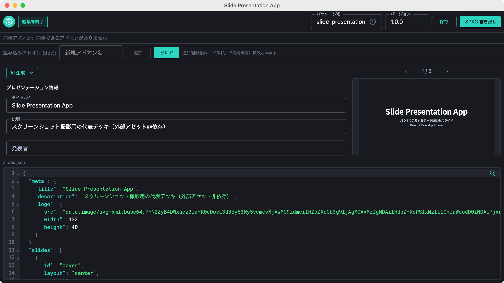

上のスクリーンショットには **組み込みアドオン (dev)** パネルが写っていますが、これは開発ビルドのみで表示されます（配布ビルドには出ません）。

- **フォーム** — 型が確定したフィールド（タイトル・説明・発表者・テーマ色・カスタム CSS）を編集します。部分更新なので、
  未知フィールドや自由記述はそのまま保持されます。
- **`slides.json` エディタ** — 生の JSON を直接編集します。行番号・JSON のシンタックスハイライト・検索 / 置換
  （`Ctrl`/`Cmd` + `F`）に対応します。フォームと JSON エディタは単一の真実源を共有します。
- **ライブプレビュー** — 本番と同一のレンダラで描画します（再実装ではありません）。テーマ編集は即座に反映されます。
  JSON に構文・スキーマエラーがある間はプレビューを非表示にし、エラーを直すまで保存・書き出しを無効化します。

### 保存と書き出し

| アクション        | 説明                                                                                                            |
|-------------------|-----------------------------------------------------------------------------------------------------------------|
| **保存**          | 編集した `slides.json` を選択した場所に書き出します（相対アセットパスはそのまま保持）                            |
| **.spkg 書き出し** | `.spkg` パッケージを生成します（名前 / バージョンはツールバーの入力欄から）。参照アセットを同梱し、**ファイルを開く** と往復できます |

ファイル書き込みは編集モードが有効な間だけ、かつ Rust 境界で実行されます。Web 層にはファイル書き込み権限を一切
渡しません（最小権限）。

### アドオンの付け外し

パッケージ同梱のアドオンは実行コードを含むため、アドオンの制御を 3 層に分離しています。

| 層               | 場所                                                                                    | 制御内容                                                                                                                    |
|------------------|-----------------------------------------------------------------------------------------|-----------------------------------------------------------------------------------------------------------------------------|
| **実行時の信頼** | 開いた時の確認ダイアログ＋**設定 → アドオンの個別許可**                                  | パッケージ同梱アドオンの読み込みをパッケージ単位で許可 / 拒否（既定は拒否）。**同梱アドオンを常に無効化** のグローバル設定が優先されます |
| **書き出し時の選択** | 編集モードの **同梱アドオン** チェックボックス（および `npm run export:slides --addons a,b`） | `.spkg` 書き出し時に同梱するアドオンを選択します。候補はパッケージのアドオンと dev の組み込みアドオンの和集合で、候補が無くても一覧は消えず「同梱できるアドオンがありません」を表示します |
| **組み込みの増減** | 編集モードの **組み込みアドオン (dev)** パネル（開発ビルドのみ）                          | `addons/src/<名前>/entry.ts` を生成 / 削除します（削除は確認ダイアログあり・完全削除で git 管理外のため取り消せません）。追加/削除後はパネルの **ビルド** ボタン（`npm run build:addons` を実行）で再ビルドすると、同梱候補に反映されます |

### AI 生成

編集モードの **AI 生成** パネルで、プロンプトからスライド（`slides.json`）を生成できます。生成結果は**差分確認ダイアログ**で
承認したときだけ器の単一真実源へ流し込まれ、そのままプレビュー・手動編集・保存・書き出しに繋がります。生成方式は 2 つから選べます。

| 方式                       | 前提                                                       | 課金 / オンライン依存                                                             |
|----------------------------|------------------------------------------------------------|----------------------------------------------------------------------------------|
| **内蔵（Vertex AI）**      | Vertex AI を有効化した GCP プロジェクト（project/region/model を設定）＋`gcloud auth application-default login` | オンライン接続が必要で、GCP プロジェクトの利用量に応じて課金されます              |
| **外部（Claude Code CLI）**| ローカルに `claude` コマンドがインストール済み             | お使いの Claude の契約・利用条件に従います（別途 API キーは不要）                 |

- **GCP 設定 / ログイン** — 内蔵方式のパネルで GCP の **プロジェクト ID / リージョン / モデル** を入力して **設定を保存** し、
  初回のみ **GCP ログイン**（`gcloud auth application-default login`）で ADC を作成します。アクセストークンは ADC から
  Rust 境界で取得（55 分キャッシュ）し、Web 層へは一切渡しません。ネットワーク通信もトークンの取り扱いもすべて Rust 境界に閉じています（最小権限）。
- **事前ゲート** — 内蔵は Vertex 設定が未完了のとき、外部は `claude` 未検出時に生成ボタンを無効化し、設定導線を示します。
- **自動修正ループ** — 生成結果を取り込み時に検証し、不正なら検証エラーを添えて最大 3 回まで再生成します。上限に達した
  場合は検証エラーが最も少ない候補を反映し、手動修正に繋げます。
- **差分確認と整形** — 生成結果は即時適用せず、現在の内容との構造差分（追加/変更/削除スライドとメタ変更）をダイアログで
  プレビューし、**適用する** / **キャンセル** を選べます（キャンセルは器に一切触れません）。適用時は JSON を 2 スペースに整形します。
- **進捗と中断** — 生成中は進捗を表示し、**中断** で実行中の生成を止められます。失敗・中断・オフライン時は器の内容を
  壊さず、手動編集に安全に戻れます。

生成・GCP 設定/ログイン・ネットワークは編集モード かつ 生成有効時のみ有効化されます（閲覧・発表本番では到達しません）。

## スライドを定義する

スライドの内容をカスタマイズするには `public/slides.json` を作成します。
このファイルが存在しない場合は、**サンプルを開く** で [配布サンプル](#配布サンプル)（テンプレートガイド）を取得して表示します。

### 基本構造

```json
{
  "meta": {
    "title": "Presentation Title",
    "description": "Description",
    "author": "Author",
    "logo": {
      "src": "/my-logo.png",
      "width": 150,
      "height": 50
    }
  },
  "slides": [
    {
      "id": "slide-1",
      "layout": "center",
      "content": {
        "title": "Title Slide",
        "subtitle": "Subtitle"
      }
    }
  ]
}
```

### ロゴ設定

`meta.logo` フィールドでプレゼンテーションのロゴをカスタマイズします。

| フィールド | 型     | 既定値      | 説明                   |
|-----------|--------|-------------|------------------------|
| `src`     | string | `/logo.png` | ロゴ画像へのパス       |
| `width`   | number | `120`       | ロゴの幅（px）         |
| `height`  | number | `40`        | ロゴの高さ（px）       |

`meta.logo` を省略するとロゴは表示されません。`width` と `height` を省略すると、それぞれ既定値の `120` と `40` が使われ
ます。ロゴは全スライドの左下に表示されます。

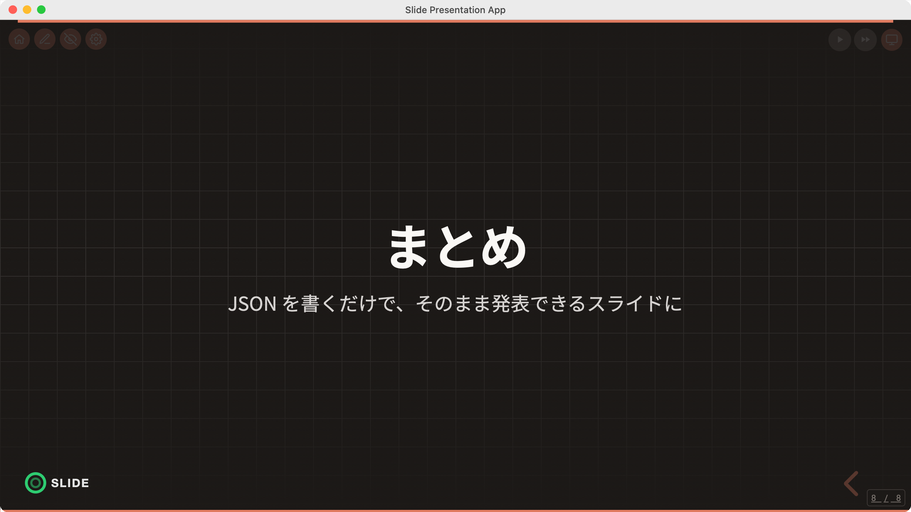

### レイアウト

各スライドの `layout` フィールドで使用するレイアウトが決まります。

| layout       | 用途                    | 主なフィールド                               |
|--------------|-------------------------|----------------------------------------------|
| `center`     | 表紙 / タイトル / まとめ | `title`, `subtitle`, `variant`               |
| `content`    | 内容表示                | `title`, `steps[]` / `tiles[]` / `component` |
| `two-column` | 2カラムレイアウト       | `title`, `left`, `right`                     |
| `bleed`      | 全幅2カラム             | `title`, `commands[]`, `component`           |
| `custom`     | カスタムコンポーネント  | `component`                                  |

`center` レイアウトは `variant` フィールドで表示を切り替えます。

| variant     | 説明                                                          |
|-------------|---------------------------------------------------------------|
| (未指定)    | TitleLayout（タイトルとサブタイトルを表示）                   |
| `"section"` | SectionLayout（まとめ表示。`body`・`qrCode` などを使用）      |

`content` レイアウトは子要素のフィールドに基づいて描画を切り替えます。

| フィールド  | 描画されるもの   |
|-------------|------------------|
| `steps`     | Timeline         |
| `tiles`     | FeatureTileGrid  |
| `component` | カスタムコンポーネント |

#### レイアウト例

|                                                                     |                                                                     |
| :-----------------------------------------------------------------: | :-----------------------------------------------------------------: |
|                   `content` — Timeline (`steps`)                    |              `content` — FeatureTileGrid (`tiles`)                  |
| 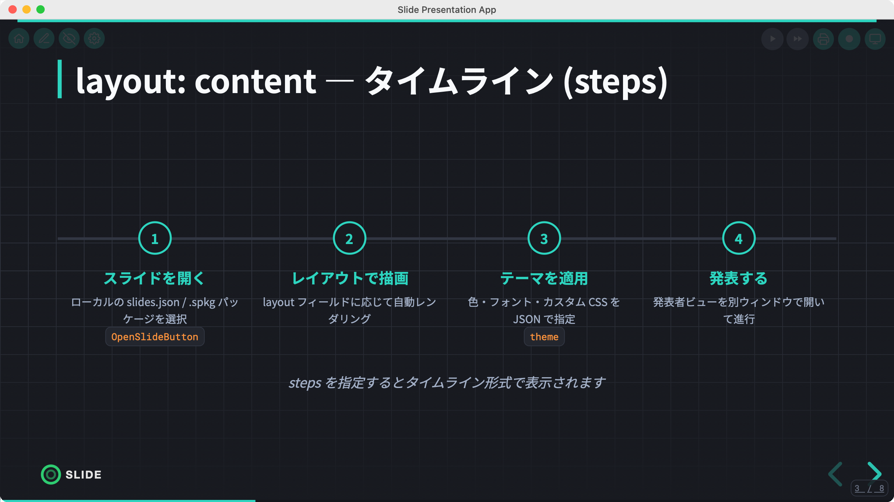 | 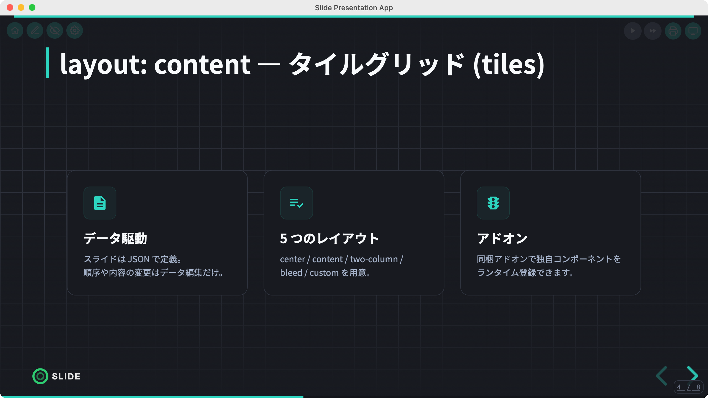 |
|                            `two-column`                             |                  `center`（`variant: "section"`）                  |
|    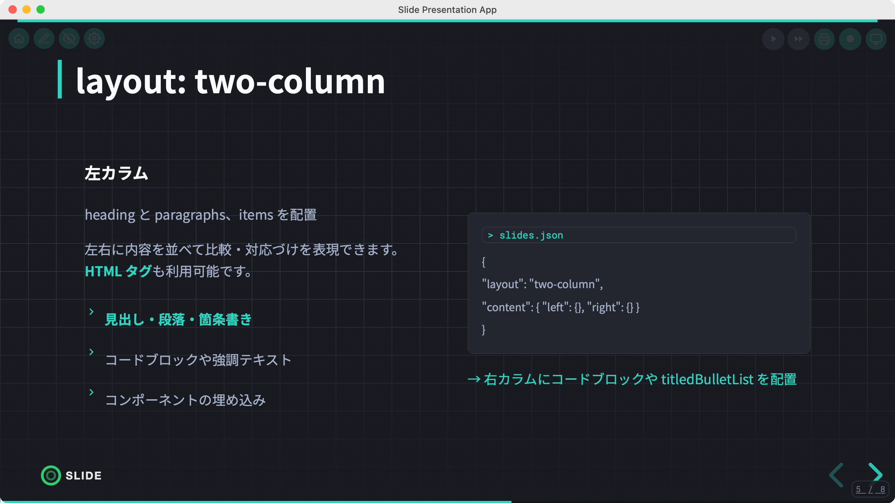    |     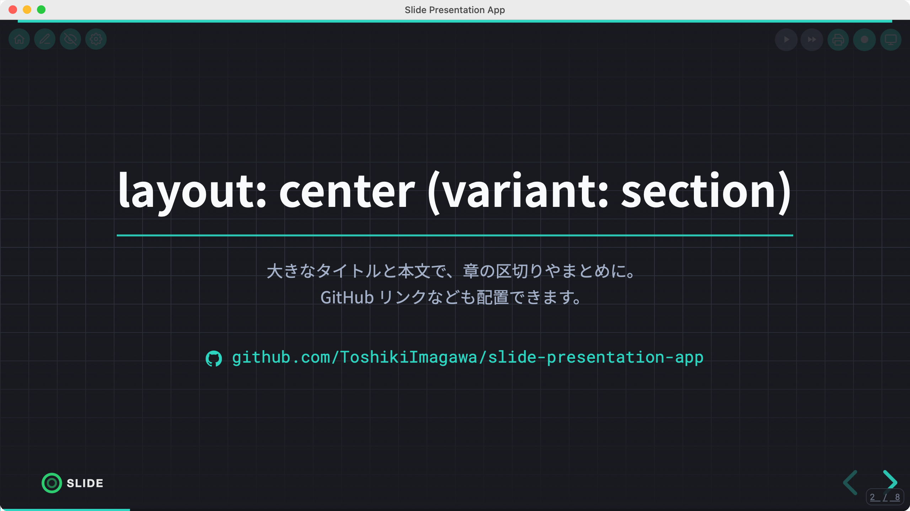  |
|               `bleed` — 全幅2カラム                                 |              `custom` — 全画面コンポーネント                       |
|          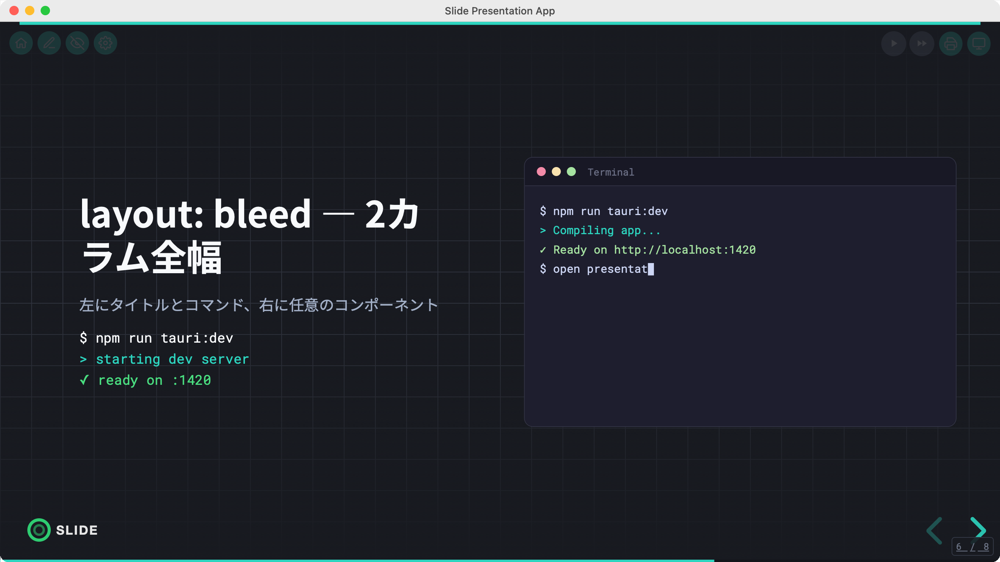        |         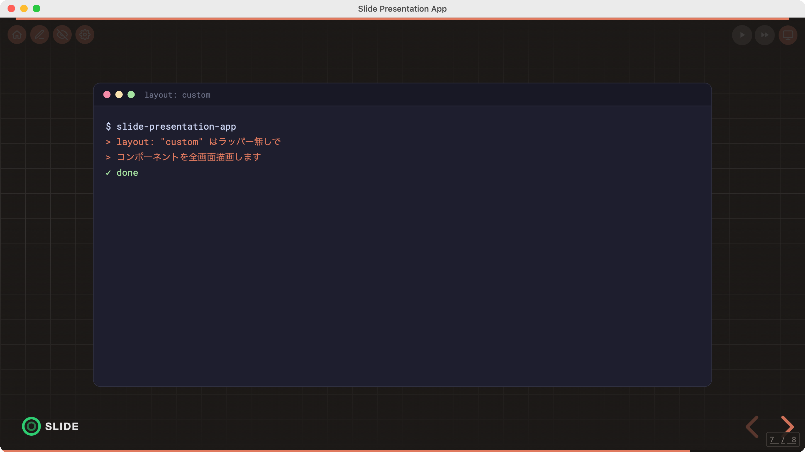       |

> `center` の表紙 / タイトルレイアウトは、この README 冒頭のヒーロー画像がその例です。

### two-column レイアウトの詳細

`left` / `right` フィールドには以下を指定できます。

```json
{
  "heading": "Heading",
  "headingDescription": "Supplementary text for the heading",
  "paragraphs": [
    "Paragraph text (HTML tags supported)"
  ],
  "items": [
    {
      "text": "Item name",
      "description": "Description",
      "emphasis": true
    }
  ],
  "codeBlock": {
    "header": "> Header",
    "items": [
      "Line 1",
      "Line 2"
    ]
  },
  "component": {
    "name": "ComponentName",
    "props": {}
  }
}
```

### スライドメタ

各スライドに任意の `meta` フィールドを追加して、トランジションや背景を制御できます。

```json
{
  "id": "slide-1",
  "layout": "center",
  "content": {
    "title": "Title"
  },
  "meta": {
    "transition": "fade",
    "backgroundColor": "#1a1a2e",
    "backgroundImage": "url(/background.jpg)",
    "notes": "Speaker notes (string format)"
  }
}
```

### スピーカーノート

`meta.notes` フィールドでスピーカーノートを定義します。文字列形式とオブジェクト形式の 2 種類がサポートされています。

**文字列形式（シンプル）:**

```json
{
  "meta": {
    "notes": "Write your speaker notes here"
  }
}
```

**オブジェクト形式（スピーカーノート + 要点サマリー + 音声）:**

```json
{
  "meta": {
    "notes": {
      "speakerNotes": "Write your speaker notes and script here",
      "summary": [
        "Point 1: Key takeaway of this slide",
        "Point 2: What to convey to the audience"
      ],
      "voice": "/voice/slide-01.wav"
    }
  }
}
```

| フィールド     | 型       | 説明                                       |
|----------------|----------|--------------------------------------------|
| `speakerNotes` | string   | スピーカーノート / 台本                    |
| `summary`      | string[] | 要点サマリー（箇条書き）                   |
| `voice`        | string   | 音声ファイルへのパス（`public/` 基準）     |

`notes` を持たないスライドは、発表者ビューでノートパネルが空で表示されます。

### コンポーネント参照

登録済みのコンポーネントをスライド内で使用します。

```json
{
  "component": {
    "name": "TerminalAnimation",
    "props": {
      "logTextUrl": "/demo-log.txt"
    }
  }
}
```

組み込みコンポーネントの例: `TerminalAnimation`, `CodeBlockPanel`, `BulletList`, `Timeline` など。

## テーマ

テーマは 2 つの方法でカスタマイズできます。

### 方法 1: slides.json で定義する

`slides.json` に `theme` フィールドを追加します。

```json
{
  "meta": {
    "title": "..."
  },
  "theme": {
    "colors": {
      "primary": "#6c63ff",
      "background": "#0a0a1a",
      "text": "#e0e0e0"
    },
    "fonts": {
      "heading": "'Noto Sans JP', sans-serif",
      "body": "'Noto Sans JP', sans-serif",
      "code": "'Fira Code', monospace",
      "baseFontSize": 24,
      "sources": [
        {
          "family": "MyFont",
          "src": "/fonts/MyFont.woff2"
        },
        {
          "family": "Fira Code",
          "url": "https://fonts.googleapis.com/css2?family=Fira+Code:wght@400;700&display=swap"
        }
      ]
    },
    "customCSS": ".reveal h1 { text-shadow: none; }"
  },
  "slides": []
}
```

#### フォント設定の詳細

`theme.fonts` には以下のフィールドを指定できます。

| フィールド     | 型           | 既定値                                | 説明                                                            |
|----------------|--------------|---------------------------------------|-----------------------------------------------------------------|
| `heading`      | string       | `'Noto Sans JP', 'Inter', sans-serif` | 見出しフォント                                                  |
| `body`         | string       | `'Noto Sans JP', 'Inter', sans-serif` | 本文フォント                                                    |
| `code`         | string       | `'Roboto Mono', monospace`            | コードブロックのフォント                                        |
| `baseFontSize` | number       | `20`                                  | 基本フォントサイズ（px）。全フォントサイズが比率で自動スケール  |
| `sources`      | FontSource[] | —                                     | フォントソースの配列                                            |

`baseFontSize` を変更すると、H1 から Body2 までのすべてのフォントサイズが基準値からの比率で自動計算されます。

`sources` でローカルフォントや外部フォントを読み込みます。

```json
{
  "sources": [
    {
      "family": "MyFont",
      "src": "/fonts/MyFont.woff2"
    },
    {
      "family": "Fira Code",
      "url": "https://fonts.googleapis.com/css2?family=Fira+Code:wght@400;700&display=swap"
    }
  ]
}
```

| フィールド | 型     | 説明                                                                    |
|-----------|--------|-------------------------------------------------------------------------|
| `family`  | string | フォント名                                                              |
| `src`     | string | ローカルフォントファイルへのパス（`@font-face` で登録）                  |
| `url`     | string | 外部フォント URL（`<link>` タグで読み込み。Google Fonts に対応）         |

### 方法 2: theme-colors.json で色のみ上書きする

`public/theme-colors.json` を作成すると、色設定のみを上書きできます。
既定の `/theme-colors.json` の代わりに、`meta.themeColors` フィールドでカスタムパスを指定することもできます。

```json
{
  "meta": {
    "title": "Presentation Title",
    "themeColors": "/theme/custom-colors.json"
  }
}
```

```json
{
  "primary": "#6c63ff",
  "background": "#0a0a1a",
  "backgroundAlt": "#12122a",
  "backgroundGrid": "#1a1a3e",
  "textHeading": "#ffffff",
  "textBody": "#c8c8d0",
  "textSubtitle": "#a0a0b0",
  "textMuted": "#808090",
  "border": "#2a2a4a",
  "borderLight": "#1e1e3a",
  "codeText": "#e0e0e0",
  "success": "#4caf50"
}
```

## 国際化 (i18n)

UI の表示言語を切り替えます。初期言語はブラウザ設定から自動検出され、設定ウィンドウから手動で変更できます。選択した
言語は `localStorage` に保存され、セッションをまたいで維持されます。

### 対応言語

| 言語コード | 言語     |
|-----------|----------|
| `en-US`   | 英語     |
| `ja-JP`   | 日本語   |
| `fr-FR`   | フランス語 |

### 設定ウィンドウ

左上の歯車アイコン（設定ボタン）をクリックすると設定ウィンドウが開き、言語を選択できます。ホーム画面とプレゼンテーション
画面の双方から開けるため、初回起動直後にスライドを開かずに言語を切り替えられます。同じ言語設定が発表者ビューにも
適用されます。

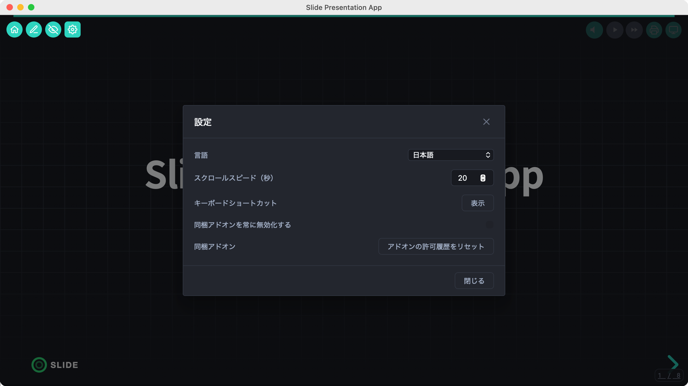

設定ウィンドウでは言語のほかに、自動スライドショーのスクロールスピード（秒）、キーボードショートカット一覧の表示、
同梱アドオンの扱い（**同梱アドオンを常に無効化する** と **アドオンの許可履歴をリセット**）を操作できます。
スクロールスピード（秒）はプレゼンテーション中のみ有効な設定なので、ホーム画面から設定を開いたときは表示されません。

### 言語リソースの構造

言語リソースは `assets/locales/` ディレクトリに配置されています。

```
assets/locales/
├── manifest.json    # 読み込むファイルの一覧
├── en-US.json       # 英語リソース
├── ja-JP.json       # 日本語リソース
└── fr-FR.json       # フランス語リソース
```

`manifest.json` で読み込む言語ファイルを指定します。

```json
{
  "locales": [
    "en-US.json",
    "ja-JP.json",
    "fr-FR.json"
  ]
}
```

各言語リソースは以下の構造を持ちます。

```json
{
  "languageCode": "en-US",
  "languageName": "English",
  "ui": {
    "settings": {
      "title": "Settings",
      "language": "Language",
      "close": "Close",
      "open": "Settings"
    },
    "presenterView": {
      "open": "Presenter View",
      "navPrev": "Previous slide (←)",
      "navNext": "Next slide (→ / Space)",
      "notesTitle": "Speaker Notes",
      "nextSlide": "Next Slide",
      "previousSlide": "Previous Slide"
    },
    "audio": {
      "play": "Play audio",
      "stop": "Stop audio"
    }
  }
}
```

`ui` 内のキーは最大 2 階層のネスト（`section.key`）に対応します。

## 発表者ビュー

プレゼンテーション画面の右上にある「発表者ビュー」ボタンをクリックすると、別ウィンドウで発表者ビューが開きます。発表者
ビューの UI ラベルは、国際化セクションで説明した言語設定に従います。

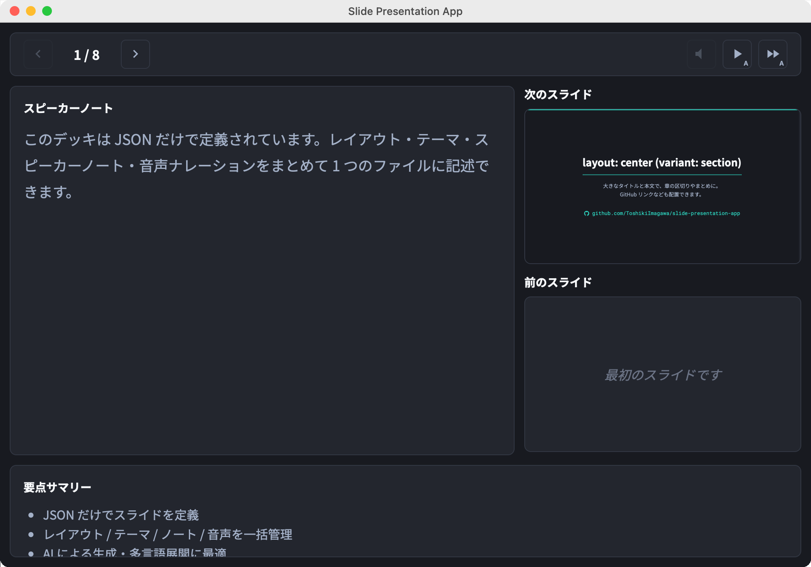

### パネルレイアウト

発表者ビューは以下のエリアで構成されます。

**コントロールバー（上部）:**

| 位置 | コントロール                     | 説明                                                    |
|------|----------------------------------|---------------------------------------------------------|
| 左   | 前へ / 進捗 / 次へ               | スライドナビゲーションと現在位置（例: `3 / 10`）        |
| 右   | 再生 / 自動再生 / 自動スライドショー | 音声コントロール（音声再生セクションを参照）           |

**メインエリア（中央）:**

| パネル           | 内容                                                       |
|------------------|------------------------------------------------------------|
| スピーカーノート | 現在のスライドの `speakerNotes`（発表者メモ）              |
| 次のスライド     | 次のスライドのサムネイルプレビュー                        |
| 前のスライド     | 前のスライドのサムネイルプレビュー                        |
| 要点サマリー     | 現在のスライドの `summary`（箇条書き。下部に表示）        |

最初のスライドでは前のスライドプレビューに境界メッセージ（例:「最初のスライドです」）が表示され、最後のスライドでは
次のスライドプレビューに境界メッセージ（例:「最後のスライドです」）が表示されます。これらのメッセージは言語設定に応じて
翻訳されます。

### 双方向同期

メインウィンドウと発表者ビューは Tauri イベント（`@tauri-apps/api/event`、イベント名 `presenter-view`）で双方向に同期
します。発表者ビューは別のネイティブ Tauri ウィンドウとして動作します。

- メインウィンドウでスライドを移動すると、発表者ビューがリアルタイムに更新される
- 発表者ビューでのスライド移動や音声操作が、メインウィンドウに反映される

発表者ビューには独自のナビゲーションキーがあります。`?` を押すと一覧を確認できます（[キーボードショートカット](#キーボードショートカット) 参照）。

## 音声再生

`meta.notes.voice` フィールドに音声ファイルのパスを指定すると、スライドごとの音声再生を有効にできます。音声ファイルは
`public/` 配下に配置します（例: `public/voice/slide-01.wav`）。

### ツールバー

`voice` が定義されたスライドでは、右上のツールバーに以下のボタンが表示されます。

| ボタン           | アイコン | 機能                                                    |
|------------------|----------|---------------------------------------------------------|
| 再生 / 停止      | スピーカー | 現在のスライドの音声を手動で再生 / 停止                |
| 自動再生         | ▶        | スライド遷移時の音声自動再生を ON / OFF               |
| 自動スライドショー | ▶▶       | 音声終了時に次スライドへ自動送りするのを ON / OFF     |

ツールバーは既定では低い不透明度で表示され、ホバーすると完全に表示されます。同じコントロールは発表者ビューのコント
ロールバーからも利用できます。

ツールバーを完全に消したいときは、左上ツールバーの **ツールバーを隠す** ボタン、または `T` キーを使います。非表示の間は
ボタン自体もクリックできないため、戻すときは再度 `T` キーを押します。

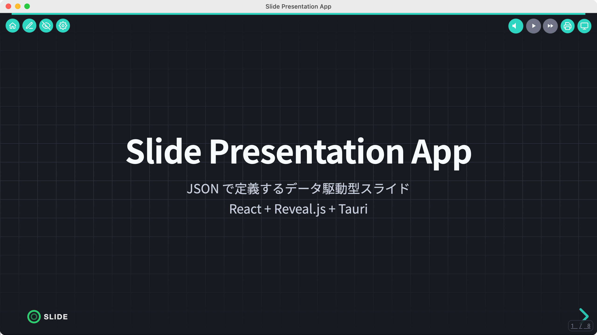

### 手動再生

スピーカーアイコンをクリックすると現在のスライドの音声が再生されます。もう一度クリックすると停止します。`voice` が定義
されていないスライドではアイコンは表示されません。

### 自動再生

自動再生ボタン（▶）が ON のとき、`voice` が定義された各スライドに移動するたびに音声が自動的に再生されます。

### 自動スライドショー

自動スライドショーボタン（▶▶）が ON のとき、音声の再生が終わると自動的に次のスライドへ進みます。最後のスライドでは
自動送りしません。自動再生と組み合わせると、全スライドを通した完全自動のプレゼンテーションが可能になります。

## キーボードショートカット

どの画面でも `?` を押すとアプリ内に一覧を表示できます（**設定 → キーボードショートカット → 表示** からも同じ一覧を
開けます）。プレゼンビューア・編集モード・発表者ビューのすべてのキーを掲載しています。

実際のキーバインドと常に一致させるため、一覧は README ではなくアプリ内に置いています。

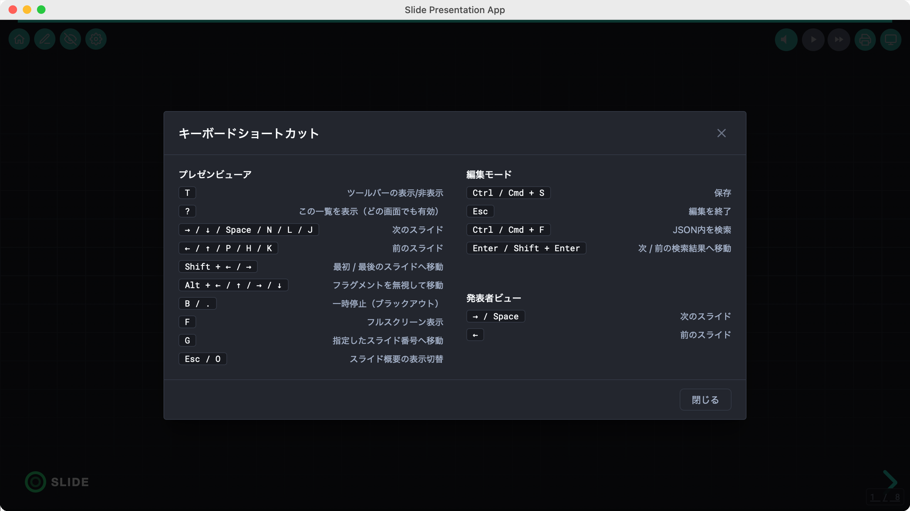

## スライドパッケージ

スライド内容（slides.json + 画像・音声・テーマ・フォントなど）を 1 つの `.spkg` パッケージにまとめて配布できます。

パッケージの作り方は 2 通りあります。アプリだけで完結させるなら [編集モード](#編集モード) の **.spkg 書き出し** を使い、
CLI で自動化するなら [CONTRIBUTING.ja.md](CONTRIBUTING.ja.md) を参照してください。

配布した `.spkg` は、受け手が OS のファイルマネージャからそのままダブルクリックして開けます（[OS から `.spkg` を開く](#os-から-spkg-を開く)
を参照）。受け手の側にビルド環境は不要で、「このファイルをダブルクリックしてください」以上の説明がいりません。

### 同梱アドオン（ランタイムロード）

`.spkg`（または旧 `.tgz`）をデスクトップアプリで開くと、その `addons/` ディレクトリに同梱されたアドオンがランタイムで読み込まれ、
`{ "component": { "name": ... } }` から解決できるようになります。アドオンはパッケージ（owner）単位でスコープ管理される
ため、パッケージを切り替えると前のパッケージのアドオンがアンロードされ、名前の衝突を防ぎます。

> ⚠️ **セキュリティ: 信頼できる発行元のパッケージのみを開いてください。**
> 同梱アドオンは、**アプリと同じ権限**（サンドボックスなし）で動作する JavaScript です。悪意のあるパッケージはアプリが
> 公開するあらゆる機能に到達し得ます。そのため:
>
> - アドオンを含むパッケージを初めて開くと、確認ダイアログが表示されます。**アドオンは既定で無効**であり、明示的に有効
>   化した場合のみ読み込まれます。選択（許可 / 拒否）はパッケージ単位で記憶されます。
> - 拒否してもスライドは通常どおり開き、未解決のコンポーネントはプレースホルダにフォールバックします。
> - **設定 →「同梱アドオンを常に無効化する」** で同梱アドオンを完全に無効化でき、**「アドオンの許可履歴をリセット」** で
>   記憶された許可 / 拒否の判断をすべてリセットできます。
>
> パッケージの `addons/manifest.json` で宣言され、かつ `addons/` 配下にあるアドオンのみが読み込まれます。

## 開発

ソースからのビルド、カスタムコンポーネント（アドオン）の実装、CLI でのスライドパッケージ書き出しについては
[CONTRIBUTING.ja.md](CONTRIBUTING.ja.md) を参照してください。

## ライセンス

MIT
