# Slide Presentation App

**English** | [日本語](README.ja.md)

A slide presentation tool built with React + Reveal.js, packaged as a local desktop app with Tauri.
Define slide content and themes using JSON files and display them as presentations in a native window.

## What is Slide Presentation App

Slide Presentation App is a presentation authoring and viewing tool that takes a purely data-driven approach. Instead of
manually building slides with code or drag-and-drop editors, you define your entire presentation in a single JSON file
covering slide content, layouts, theming, speaker notes, and audio narration.

Because the format is structured and well-defined, AI models can produce complete presentations from a simple prompt,
modify individual slides precisely, or restyle an entire deck by adjusting a few configuration fields. This makes Slide
Presentation App particularly well-suited for AI-assisted workflows where an AI generates the first draft—without
needing to understand complex UI frameworks or component hierarchies—and humans refine the result.

Localization is also straightforward: translate the slide JSON and the same layouts and visuals are reproduced in every
language. Pair that with AI-generated text-to-speech for the translated speaker notes, and the built-in auto-play and
auto-slideshow features will run a fully automated, multi-language presentation without any manual intervention.
Translated decks can be distributed as slide packages for easy sharing across teams.

Under the hood, the app is built on React and Reveal.js, providing smooth transitions, a presenter view with speaker
notes, keyboard navigation, and a plugin system for custom components. The result is a polished presentation tool with
the simplicity and automation benefits of a data-driven approach.

## Screenshots

|                                                             |                                                         |
|:-----------------------------------------------------------:|:-------------------------------------------------------:|
|                          **Home**                           |                    **Presentation**                     |
|       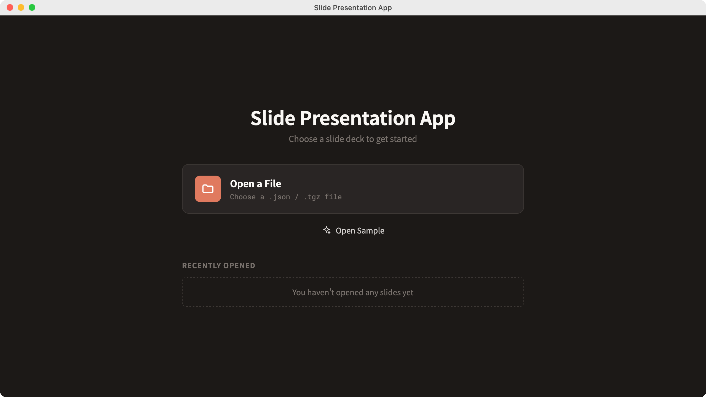        | 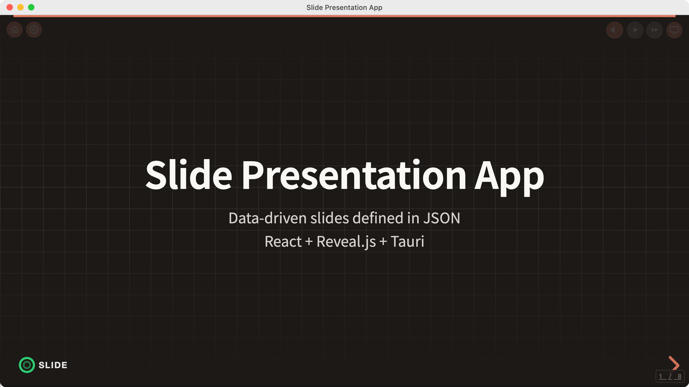 |
|                     **Presenter View**                      |                      **Settings**                       |
| 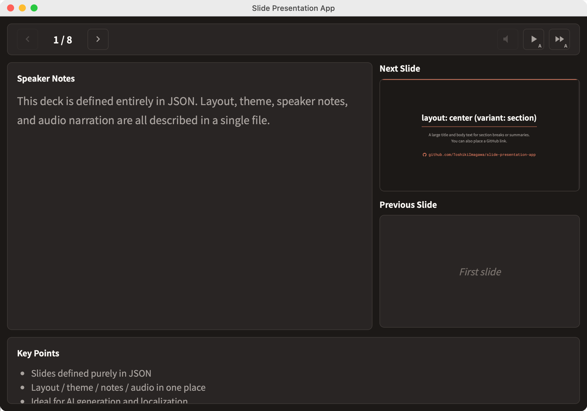 |     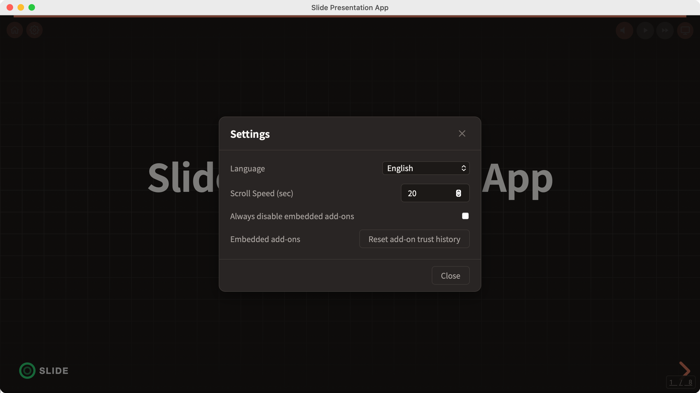     |

> These images are generated automatically — see [Screenshots & E2E](#screenshots--e2e).

## Setup

```bash
npm install
```

Running the app requires a Rust toolchain (`cargo`/`rustc`) for Tauri. See the
[Tauri prerequisites guide](https://v2.tauri.app/start/prerequisites/) if you don't have one yet.

## Commands

| Command                        | Description                                                                             |
|--------------------------------|-----------------------------------------------------------------------------------------|
| `npm run tauri:dev`            | Start the desktop app (Tauri + addon build + Vite HMR)                                  |
| `npm run tauri:build`          | Build the desktop app bundle                                                            |
| `npm run dev`                  | Start frontend-only dev server (addon build + Vite HMR)                                 |
| `npm run build`                | Frontend-only production build (addon build + output to `dist/`)                        |
| `npm run build:addons`         | Build addons only                                                                       |
| `npm run preview`              | Preview built files                                                                     |
| `npm run format`               | Format code with Prettier (`src/**/*.{ts,tsx,css}`)                                     |
| `npm run typecheck`            | TypeScript type check                                                                   |
| `npm run test`                 | Run tests (Vitest)                                                                      |
| `npm run test:watch`           | Run tests in watch mode                                                                 |
| `npm run export:slides`        | Export slide content as an npm package (.tgz)                                           |
| `npm run format:check`         | Check formatting with Prettier (no writes; used in CI)                                  |
| `npm run generate-icons`       | Regenerate `src-tauri/icons/` from `resources/icon.svg` (macOS only)                    |
| `npm run generate-screenshots` | Capture README screenshots with Playwright WebKit (macOS only; doubles as an e2e smoke) |
| `npm run screenshots:compare`  | Diff a real-app screenshot against a mock one (pixelmatch)                              |
| `npm run generate-docs`        | Render `README.md` / `CHANGELOG.md` to PDF under `docs/`                                |

## Home Screen

On launch, the app opens on a home screen where you choose what to present.

| Action              | Description                                                                                 |
|---------------------|---------------------------------------------------------------------------------------------|
| **Open a File**     | Pick a `slides.json` or a `.tgz` slide package from disk                                    |
| **Open Sample**     | Load the bundled sample deck (the built-in template guide when no `slides.json` is bundled) |
| **Recently Opened** | Re-open a recently used package; the list is persisted across launches                      |

While presenting, the **Home** button in the top-left toolbar returns to this screen.

## Opening a Local Slide Package

Besides the slide content bundled at build time (see [Slide Packages](#slide-packages) below), you can pick a
`slides.json` file, or a `.tgz` slide package produced by `npm run export:slides`, from disk at any time using the
**Open a File** button on the home screen. `.tgz` packages are extracted into the app's cache directory first. Any
`image/`, `voice/`, `theme/`, or `font/` relative references inside the slide data are resolved against the folder
the content lives in. The app remembers the last opened file and reloads it automatically on next launch.

## Defining Slides

Create `public/slides.json` to customize slide content.
If this file does not exist, the built-in template guide will be displayed.

### Basic Structure

```json
{
  "meta": {
    "title": "Presentation Title",
    "description": "Description",
    "author": "Author",
    "logo": {
      "src": "/my-logo.png",
      "width": 150,
      "height": 50
    }
  },
  "slides": [
    {
      "id": "slide-1",
      "layout": "center",
      "content": {
        "title": "Title Slide",
        "subtitle": "Subtitle"
      }
    }
  ]
}
```

### Logo Configuration

Customize the presentation logo via the `meta.logo` field.

| Field    | Type   | Default     | Description        |
|----------|--------|-------------|--------------------|
| `src`    | string | `/logo.png` | Path to logo image |
| `width`  | number | `120`       | Logo width (px)    |
| `height` | number | `40`        | Logo height (px)   |

If `meta.logo` is omitted, no logo will be displayed. If `width` and `height` are omitted, the defaults of `120` and`40`
are used respectively. The logo is shown in the bottom-left corner of every slide.

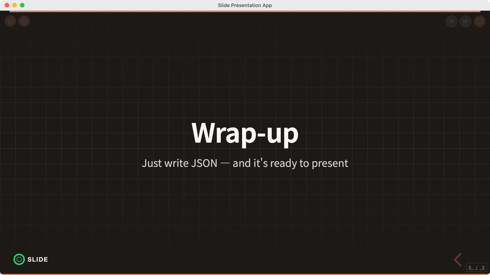

### Layouts

Each slide's `layout` field determines which layout is used.

| layout       | Use case                | Main fields                                  |
|--------------|-------------------------|----------------------------------------------|
| `center`     | Cover / title / summary | `title`, `subtitle`, `variant`               |
| `content`    | Content display         | `title`, `steps[]` / `tiles[]` / `component` |
| `two-column` | Two-column layout       | `title`, `left`, `right`                     |
| `bleed`      | Full-width two-column   | `title`, `commands[]`, `component`           |
| `custom`     | Custom component        | `component`                                  |

The `center` layout switches display based on the `variant` field.

| variant     | Description                                                  |
|-------------|--------------------------------------------------------------|
| (unset)     | TitleLayout (displays title and subtitle)                    |
| `"section"` | SectionLayout (summary display, uses `body`, `qrCode`, etc.) |

The `content` layout determines rendering based on child element fields.

| Field       | Renders          |
|-------------|------------------|
| `steps`     | Timeline         |
| `tiles`     | FeatureTileGrid  |
| `component` | Custom component |

#### Layout Examples

|                                                                   |                                                                  |
| :---------------------------------------------------------------: | :--------------------------------------------------------------: |
|                  `content` — Timeline (`steps`)                   |             `content` — FeatureTileGrid (`tiles`)                |
| 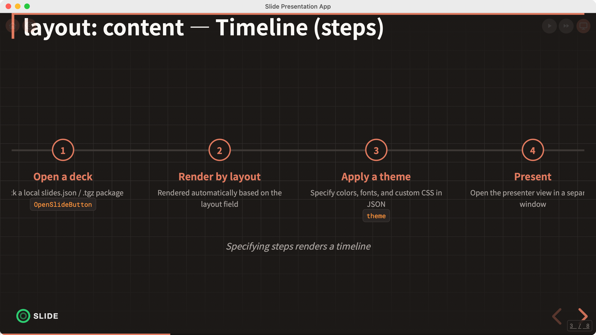 | 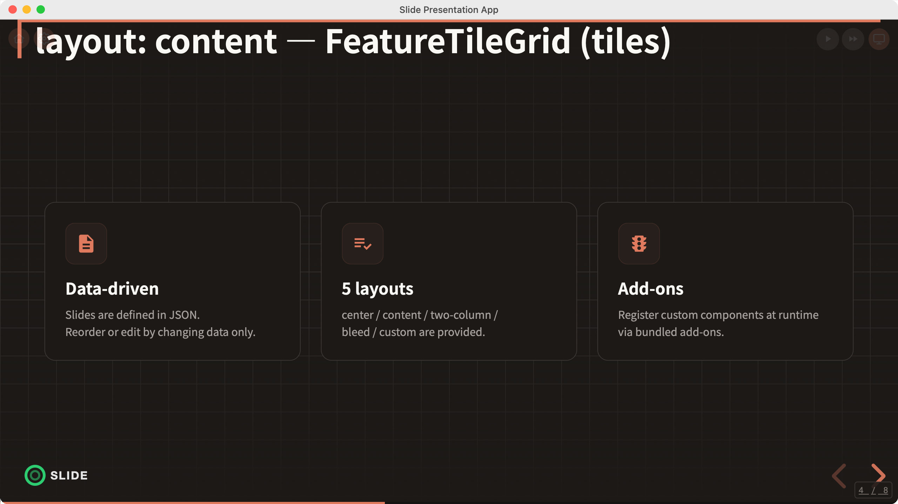 |
|                           `two-column`                            |                 `center` (`variant: "section"`)                  |
|    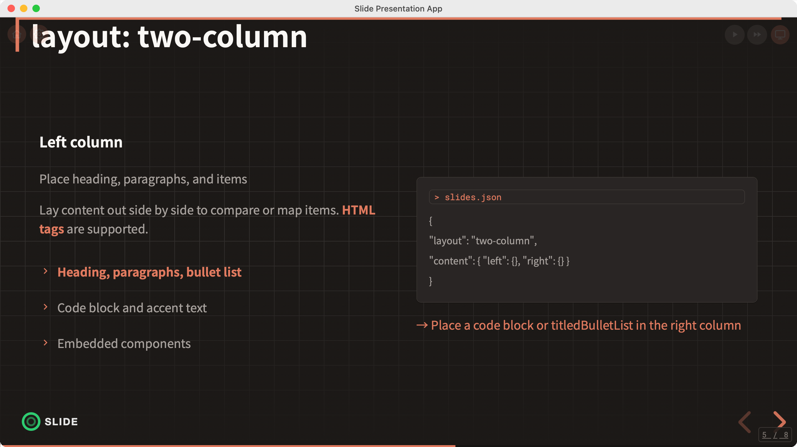     |       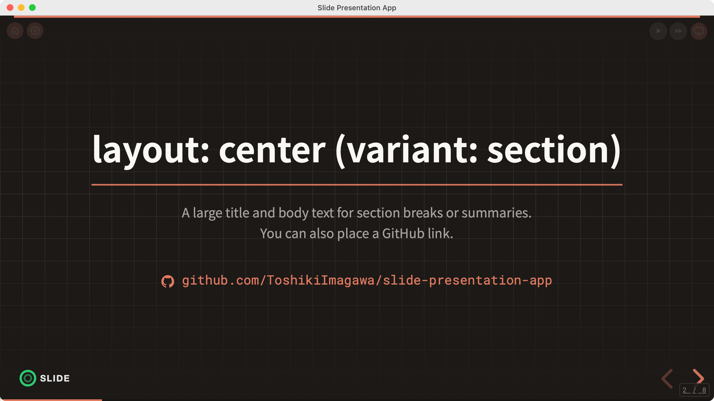|
|              `bleed` — full-width two-column                       |             `custom` — full-screen component                     |
|         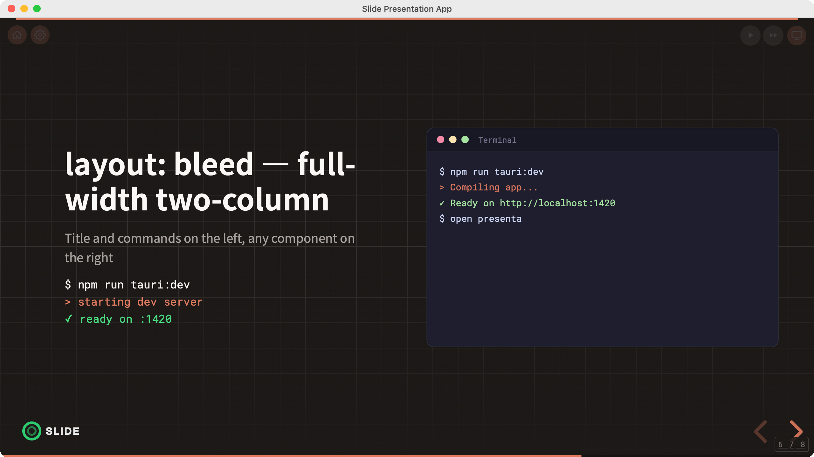          |        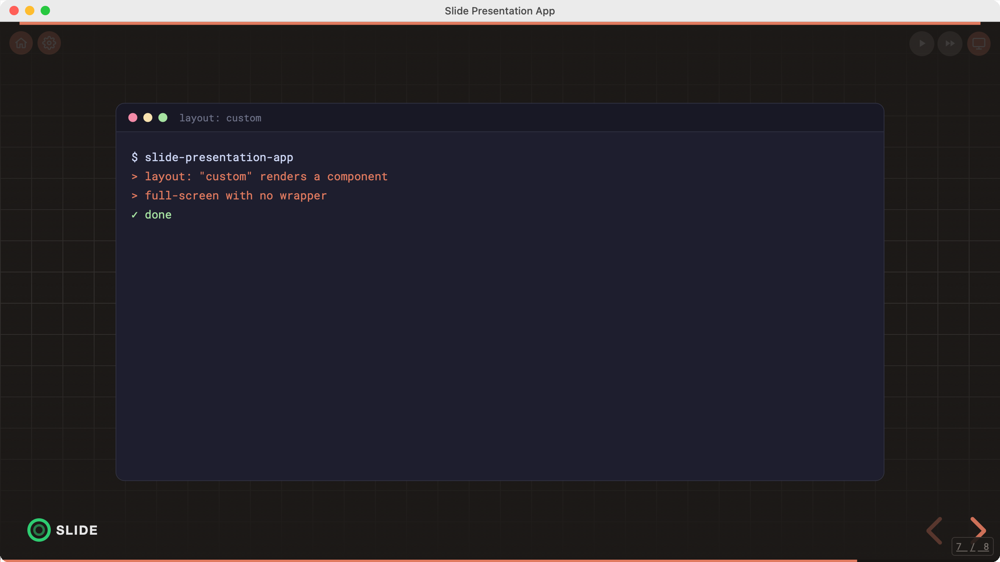        |

> The `center` cover/title layout is shown in the [Screenshots](#screenshots) section above.

### Two-Column Layout Details

The `left` / `right` fields accept the following:

```json
{
  "heading": "Heading",
  "headingDescription": "Supplementary text for the heading",
  "paragraphs": [
    "Paragraph text (HTML tags supported)"
  ],
  "items": [
    {
      "text": "Item name",
      "description": "Description",
      "emphasis": true
    }
  ],
  "codeBlock": {
    "header": "> Header",
    "items": [
      "Line 1",
      "Line 2"
    ]
  },
  "component": {
    "name": "ComponentName",
    "props": {}
  }
}
```

### Slide Meta

Add an optional `meta` field to each slide to control transitions and backgrounds.

```json
{
  "id": "slide-1",
  "layout": "center",
  "content": {
    "title": "Title"
  },
  "meta": {
    "transition": "fade",
    "backgroundColor": "#1a1a2e",
    "backgroundImage": "url(/background.jpg)",
    "notes": "Speaker notes (string format)"
  }
}
```

### Speaker Notes

Define speaker notes via the `meta.notes` field. Two formats are supported: string and object.

**String format (simple):**

```json
{
  "meta": {
    "notes": "Write your speaker notes here"
  }
}
```

**Object format (speaker notes + key point summary + voice):**

```json
{
  "meta": {
    "notes": {
      "speakerNotes": "Write your speaker notes and script here",
      "summary": [
        "Point 1: Key takeaway of this slide",
        "Point 2: What to convey to the audience"
      ],
      "voice": "/voice/slide-01.wav"
    }
  }
}
```

| Field          | Type     | Description                                |
|----------------|----------|--------------------------------------------|
| `speakerNotes` | string   | Speaker notes / script                     |
| `summary`      | string[] | Key point summary (bulleted list)          |
| `voice`        | string   | Path to audio file (relative to `public/`) |

Slides without `notes` will display an empty notes panel in the presenter view.

### Component References

Use registered components within slides.

```json
{
  "component": {
    "name": "TerminalAnimation",
    "props": {
      "logTextUrl": "/demo-log.txt"
    }
  }
}
```

Built-in component examples: `TerminalAnimation`, `CodeBlockPanel`, `BulletList`, `Timeline`, etc.

## Theming

Themes can be customized in two ways.

### Method 1: Define in slides.json

Add a `theme` field to `slides.json`.

```json
{
  "meta": {
    "title": "..."
  },
  "theme": {
    "colors": {
      "primary": "#6c63ff",
      "background": "#0a0a1a",
      "text": "#e0e0e0"
    },
    "fonts": {
      "heading": "'Noto Sans JP', sans-serif",
      "body": "'Noto Sans JP', sans-serif",
      "code": "'Fira Code', monospace",
      "baseFontSize": 24,
      "sources": [
        {
          "family": "MyFont",
          "src": "/fonts/MyFont.woff2"
        },
        {
          "family": "Fira Code",
          "url": "https://fonts.googleapis.com/css2?family=Fira+Code:wght@400;700&display=swap"
        }
      ]
    },
    "customCSS": ".reveal h1 { text-shadow: none; }"
  },
  "slides": []
}
```

#### Font Configuration Details

The following fields can be specified in `theme.fonts`.

| Field          | Type         | Default                               | Description                                                           |
|----------------|--------------|---------------------------------------|-----------------------------------------------------------------------|
| `heading`      | string       | `'Noto Sans JP', 'Inter', sans-serif` | Heading font                                                          |
| `body`         | string       | `'Noto Sans JP', 'Inter', sans-serif` | Body font                                                             |
| `code`         | string       | `'Roboto Mono', monospace`            | Code block font                                                       |
| `baseFontSize` | number       | `20`                                  | Base font size (px). All font sizes are automatically scaled by ratio |
| `sources`      | FontSource[] | —                                     | Array of font sources                                                 |

Changing `baseFontSize` causes all font sizes from H1 to Body2 to be automatically calculated based on the ratio from
the base value.

Load local or external fonts using `sources`.

```json
{
  "sources": [
    {
      "family": "MyFont",
      "src": "/fonts/MyFont.woff2"
    },
    {
      "family": "Fira Code",
      "url": "https://fonts.googleapis.com/css2?family=Fira+Code:wght@400;700&display=swap"
    }
  ]
}
```

| Field    | Type   | Description                                                        |
|----------|--------|--------------------------------------------------------------------|
| `family` | string | Font name                                                          |
| `src`    | string | Path to local font file (registered via `@font-face`)              |
| `url`    | string | External font URL (loaded via `<link>` tag, supports Google Fonts) |

### Method 2: Override colors only with theme-colors.json

Create `public/theme-colors.json` to override only color settings.
You can also specify a custom path via the `meta.themeColors` field instead of the default `/theme-colors.json`.

```json
{
  "meta": {
    "title": "Presentation Title",
    "themeColors": "/theme/custom-colors.json"
  }
}
```

```json
{
  "primary": "#6c63ff",
  "background": "#0a0a1a",
  "backgroundAlt": "#12122a",
  "backgroundGrid": "#1a1a3e",
  "textHeading": "#ffffff",
  "textBody": "#c8c8d0",
  "textSubtitle": "#a0a0b0",
  "textMuted": "#808090",
  "border": "#2a2a4a",
  "borderLight": "#1e1e3a",
  "codeText": "#e0e0e0",
  "success": "#4caf50"
}
```

## Internationalization (i18n)

Switch the UI display language. The initial language is auto-detected from browser settings and can be manually changed
from the settings window. The selected language is saved to `localStorage` and persists across sessions.

### Supported Languages

| Language Code | Language |
|---------------|----------|
| `en-US`       | English  |
| `ja-JP`       | Japanese |
| `fr-FR`       | French   |

### Settings Window

Click the gear icon (settings button) in the upper right corner to open the settings window and select a language. The
same language setting is applied to the presenter view.

### Language Resource Structure

Language resources are located in the `assets/locales/` directory.

```
assets/locales/
├── manifest.json    # List of files to load
├── en-US.json       # English resource
├── ja-JP.json       # Japanese resource
└── fr-FR.json       # French resource
```

`manifest.json` specifies which language files to load.

```json
{
  "locales": [
    "en-US.json",
    "ja-JP.json",
    "fr-FR.json"
  ]
}
```

Each language resource has the following structure.

```json
{
  "languageCode": "en-US",
  "languageName": "English",
  "ui": {
    "settings": {
      "title": "Settings",
      "language": "Language",
      "close": "Close",
      "open": "Settings"
    },
    "presenterView": {
      "open": "Presenter View",
      "navPrev": "Previous slide (←)",
      "navNext": "Next slide (→ / Space)",
      "notesTitle": "Speaker Notes",
      "nextSlide": "Next Slide",
      "previousSlide": "Previous Slide"
    },
    "audio": {
      "play": "Play audio",
      "stop": "Stop audio"
    }
  }
}
```

Keys within `ui` support up to two levels of nesting (`section.key`).

## Presenter View

Click the "Presenter View" button in the upper right of the presentation screen to open the presenter view in a separate
window. UI labels in the presenter view follow the language setting described in the Internationalization section.


### Panel Layout

The presenter view consists of the following areas.

**Control Bar (top):**

| Position | Controls                          | Description                                           |
|----------|-----------------------------------|-------------------------------------------------------|
| Left     | Previous / Progress / Next        | Slide navigation and current position (e.g. `3 / 10`) |
| Right    | Play / Auto-play / Auto-slideshow | Audio controls (see the Audio Playback section)       |

**Main Area (center):**

```
┌──────────────────┬──────────────────┐
│                  │ Next Slide       │
│ Speaker Notes    │ Preview          │
│                  ├──────────────────┤
│                  │ Previous Slide   │
│                  │ Preview          │
└──────────────────┴──────────────────┘
```

| Panel          | Content                                                    |
|----------------|------------------------------------------------------------|
| Speaker Notes  | Current slide's `speakerNotes` (presenter notes)           |
| Next Slide     | Thumbnail preview of the next slide                        |
| Previous Slide | Thumbnail preview of the previous slide                    |
| Key Summary    | Current slide's `summary` (bulleted list, shown at bottom) |

On the first slide, the previous slide preview shows a boundary message (e.g. "This is the first slide"). On the last
slide, the next slide preview shows a boundary message (e.g. "This is the last slide"). These messages are translated
according to the language setting.

### Bidirectional Sync

The main window and presenter view are bidirectionally synced via Tauri events (`@tauri-apps/api/event`, event name
`presenter-view`). The presenter view runs as a separate native Tauri window.

- Navigating slides in the main window updates the presenter view in real time
- Navigating slides or controlling audio from the presenter view is reflected in the main window

### Keyboard Navigation

The following keyboard shortcuts are available in the presenter view.

| Key                         | Action         |
|-----------------------------|----------------|
| `←` (Left Arrow)            | Previous slide |
| `→` (Right Arrow) / `Space` | Next slide     |

## Audio Playback

Specify an audio file path in the `meta.notes.voice` field to enable per-slide audio playback. Place audio files under
`public/` (e.g. `public/voice/slide-01.wav`).

### Toolbar

On slides with a `voice` defined, the following buttons appear in the upper-right toolbar.

| Button         | Icon    | Function                                              |
|----------------|---------|-------------------------------------------------------|
| Play/Stop      | Speaker | Manually play/stop the current slide's audio          |
| Auto-play      | ▶       | Toggle auto-play audio on slide transition ON/OFF     |
| Auto-slideshow | ▶▶      | Toggle auto-advance to next slide on audio end ON/OFF |

The toolbar is displayed at reduced opacity by default and fully visible on hover. The same controls are available from
the presenter view's control bar.

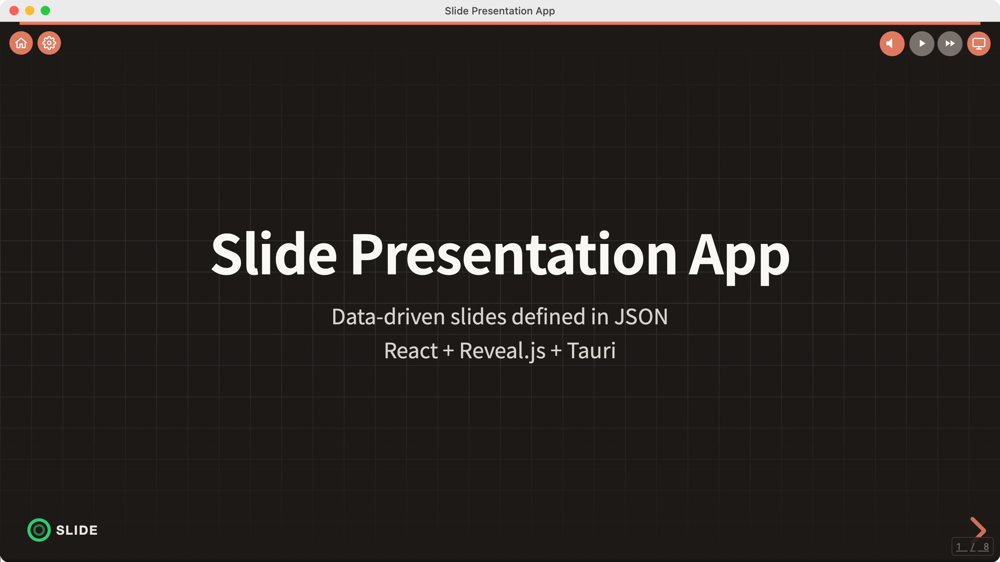

### Manual Playback

Click the speaker icon to play the current slide's audio. Click again to stop. The icon is not shown on slides without a
`voice` defined.

### Auto-Play

When the auto-play button (▶) is ON, audio is automatically played on each slide that has a `voice` defined whenever you
navigate to it.

### Auto-Slideshow

When the auto-slideshow button (▶▶) is ON, the presentation automatically advances to the next slide when audio playback
ends. It does not auto-advance on the last slide. Combined with auto-play, this enables a fully automated presentation
through all slides.

## Adding Addons

Add custom components as addons for use within slides.

### 1. Create the addon directory

```
addons/src/{addon-name}/
├── entry.ts         # Component registration
└── MyComponent.tsx  # Component implementation
```

### 2. Implement the component

```tsx
// addons/src/my-addon/MyComponent.tsx
const React = window.React;

export function MyComponent({ message }: { message: string }) {
  return React.createElement('div', null, message);
}
```

### 3. Register the component in the entry file

```ts
// addons/src/my-addon/entry.ts
import { MyComponent } from './MyComponent';

window.__ADDON_REGISTER__('my-addon', [
  { name: 'MyComponent', component: MyComponent },
]);
```

### 4. Build

```bash
npm run build:addons
```

### 5. Use in slides

```json
{
  "id": "custom-slide",
  "layout": "custom",
  "content": {
    "component": {
      "name": "MyComponent",
      "props": {
        "message": "Hello!"
      }
    }
  }
}
```

## Static Assets

Files placed in the `public/` directory are accessible at the root path after building.

| File                                  | URL                             |
|---------------------------------------|---------------------------------|
| `public/slides.json`                  | `/slides.json`                  |
| `public/theme-colors.json`            | `/theme-colors.json`            |
| `public/images/logo.png`              | `/images/logo.png`              |
| `public/voice/slide-01.wav`           | `/voice/slide-01.wav`           |
| `public/assets/locales/manifest.json` | `/assets/locales/manifest.json` |
| `public/assets/locales/en-US.json`    | `/assets/locales/en-US.json`    |

## Slide Packages

Export and distribute slide content (slides.json + images, audio, themes, fonts, etc.) as npm packages.

### Export (Create Package)

```bash
npm run export:slides -- --name my-presentation --slides slides.json
```

| Option      | Required | Description                                           |
|-------------|:--------:|-------------------------------------------------------|
| `--name`    |   Yes    | Package name (generated as `@slides/{name}`)          |
| `--slides`  |   Yes    | Slide JSON filename under `public/`                   |
| `--version` |          | Version (default: `1.0.0`)                            |
| `--addons`  |          | Bundle built add-ons (`addons/dist`) into the package |

This generates a `.tgz` file in `dist-slides/`. Asset paths referenced in slides.json (`image/`, `voice/`, `theme/`,
`font/`) are auto-detected and included in the package. When `--addons` is passed, the built add-ons are bundled under
`addons/` and are dynamically loaded after the package is opened (Tauri runtime only — see below).

### Embedded Add-ons (Runtime Loading)

When a `.tgz` is opened in the desktop app, any add-ons bundled under its `addons/` directory are loaded at runtime and
their components become resolvable from `{ "component": { "name": ... } }`. Add-ons are scoped per package (owner), so
switching between packages unloads the previous package's add-ons and prevents name collisions.

> ⚠️ **Security: only open packages from publishers you trust.**
> Embedded add-ons are JavaScript that runs with the **same privileges as the app** (no sandbox). A malicious package
> could reach any capability the app exposes. Therefore:
>
> - The first time you open a package that contains add-ons, a confirmation dialog appears. **Add-ons are disabled by
    > default** — they are only loaded if you explicitly enable them. Your choice (allow / deny) is remembered per
    package.
> - If you deny, the slides still open normally; unresolved components fall back to a placeholder.
> - You can turn off embedded add-ons entirely from **Settings → “Always disable embedded add-ons”**, and reset all
    > remembered allow/deny decisions with **“Reset add-on trust history.”**
>
> Only add-ons declared in the package's `addons/manifest.json` and located under `addons/` are ever loaded.

### Import (Use Package)

Specify a slide package via the `VITE_SLIDE_PACKAGE` environment variable. Both local paths and npm packages are
supported.

#### Use with local path (no npm install required)

Specify the `.tgz` file or extracted directory path in `.env.local`.

```bash
# Specify .tgz directly
VITE_SLIDE_PACKAGE=./dist-slides/slides-my-presentation-1.0.0.tgz

# Specify extracted directory
VITE_SLIDE_PACKAGE=./dist-slides/my-presentation
```

#### Use as npm package

```bash
# Install the .tgz
npm install ./dist-slides/slides-my-presentation-1.0.0.tgz

# Specify the package name in .env.local
VITE_SLIDE_PACKAGE=@slides/my-presentation
```

#### `VITE_SLIDE_PACKAGE` Value Reference

| Value                         | Behavior                                                |
|-------------------------------|---------------------------------------------------------|
| `./dist-slides/xxx-1.0.0.tgz` | Auto-extract .tgz for local use (no npm install)        |
| `./dist-slides/xxx/`          | Read directly from extracted directory (no npm install) |
| `@slides/xxx`                 | Read from npm package                                   |
| (unset)                       | Auto-detect `@slides/*` packages                        |

### Behavior

- If a file with the same name exists in `public/`, the `public/` file takes priority (package serves as fallback)
- During `npm run build`, package assets are copied to `dist/` (existing files are not overwritten)

## Screenshots & E2E

The screenshots in this README are produced by a Playwright (WebKit) script that also serves as an end-to-end smoke
test.

```bash
npm run generate-screenshots            # capture all scenarios
npm run generate-screenshots -- home    # capture a single scenario
```

- Runs the app via `vite --mode screenshot`, replacing the Tauri IPC layer with in-memory mocks (`src/__screenshot__/`)
  so the UI boots in a plain browser. A locale-specific fixture deck (`scripts/screenshot/fixtures/slides.{en,ja}.json`)
  is served as `/slides.json` based on the browser locale.
- Captures every scenario (`home`, `presentation`, `toolbar`, `settings`, `presenter-view`, the `layout-*` gallery, and
  `logo`) for both locales, compositing a macOS window frame. English shots go to `resources/screenshots/en/` and
  Japanese to `resources/screenshots/ja/`. If any scenario's wait fails, the run exits non-zero — so it doubles as an
  e2e smoke test.
- **macOS only** (Japanese fonts and WebKit rendering differ on Linux). CI runs it on a macOS runner via
  `.github/workflows/screenshots.yml` (manual dispatch) and commits any diff under `resources/screenshots/`.
- **Assertion-based E2E**: `npm run test:e2e` runs a Playwright Test suite (`e2e/*.spec.ts`) that reuses the same
  screenshot-mode server, IPC mocks, and fixtures, but adds explicit `expect()` assertions across the `en` and `ja`
  locales. Because it checks DOM text (not pixels), it runs headless on Linux in CI (`.github/workflows/ci.yml`). See
  [`e2e/README.md`](e2e/README.md).
- Real-Tauri-WebView acceptance testing (WebdriverIO + `tauri-driver`) has an optional scaffold under `e2e/`.

## License

MIT
