# Slide Presentation App

**English** | [日本語](README.ja.md)


A slide presentation tool built with React + Reveal.js, packaged as a local desktop app with Tauri.
Define slide content and themes using JSON files and display them as presentations in a native window.

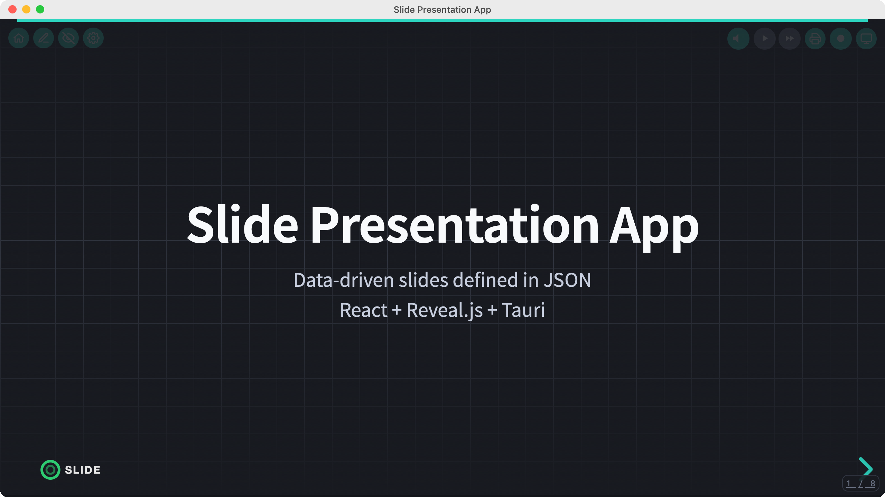

## What is Slide Presentation App

Slide Presentation App is a presentation authoring and viewing tool that takes a purely data-driven approach. Instead of
manually building slides with code or drag-and-drop editors, you define your entire presentation in a single JSON file
covering slide content, layouts, theming, speaker notes, and audio narration.

Because the format is structured and well-defined, AI models can produce complete presentations from a simple prompt,
modify individual slides precisely, or restyle an entire deck by adjusting a few configuration fields. This makes Slide
Presentation App particularly well-suited for AI-assisted workflows where an AI generates the first draft—without
needing to understand complex UI frameworks or component hierarchies—and humans refine the result.

Localization is also straightforward: translate the slide JSON and the same layouts and visuals are reproduced in every
language. Pair that with AI-generated text-to-speech for the translated speaker notes, and the built-in auto-play and
auto-slideshow features will run a fully automated, multi-language presentation without any manual intervention.
Translated decks can be distributed as slide packages for easy sharing across teams.

Under the hood, the app is built on React and Reveal.js, providing smooth transitions, a presenter view with speaker
notes, keyboard navigation, and a plugin system for custom components. The result is a polished presentation tool with
the simplicity and automation benefits of a data-driven approach.

## Download / Installation

Pre-built installers for each tagged release are published on the
[GitHub Releases](https://github.com/ToshikiImagawa/slide-presentation-app/releases) page.

| OS      | File                                         |
|---------|----------------------------------------------|
| macOS   | `.dmg`                                       |
| Windows | `.exe` (NSIS installer) or `.msi`            |
| Linux   | `.AppImage`, `.deb`, or `.rpm`               |

Download the file matching your OS from the latest release and run it.

### macOS Gatekeeper warning

This app is self-signed but not notarized by Apple. On macOS Sequoia (15) and later, Finder's right-click-to-open
Gatekeeper bypass has been removed, so Gatekeeper blocks the downloaded `.dmg` itself — not the app inside it — with
a message saying macOS cannot verify it's free of malware. This happens every time you download a new version, not
just once.

To open it, go to **System Settings → Privacy & Security**, scroll down to the blocked item, and click
**Open Anyway**, then confirm in the dialog. Alternatively, clear the quarantine attribute from the command line:

```bash
xattr -d com.apple.quarantine ~/Downloads/Slide.Presentation.App_*.dmg
```

If the installed app is still blocked (quarantine can propagate when the app is copied out of the `.dmg`), also run:

```bash
xattr -dr com.apple.quarantine "/Applications/Slide Presentation App.app"
```

> Files downloaded with `curl` do not receive the quarantine attribute, so this warning only appears for files
> downloaded through a browser.

### Keychain and password prompts

This app never uses the OS keychain or any secure credential store. The only thing it persists locally is the path
to the last opened slide file, saved as plain JSON in the app's data directory via `tauri-plugin-store` and
`tauri-plugin-fs`. You will never be asked for a keychain password when installing or launching the app — the
Gatekeeper flow above is the only approval you may need.

### Updating

On launch, the app checks for updates automatically and shows a dialog when a new version is available.
Choose "Install now and restart" to apply it immediately, or skip and update later by downloading the latest
installer from [Releases](https://github.com/ToshikiImagawa/slide-presentation-app/releases) and installing it
over the existing copy.

> **macOS note:** the app is not notarized yet, so an installed update may be blocked by Gatekeeper. If that
> happens, download the installer from Releases manually instead.

## Home Screen

On launch, the app opens on a home screen where you choose what to present.

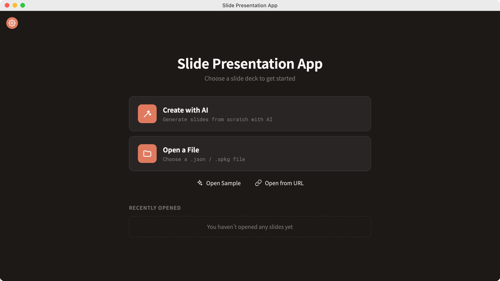

| Action                     | Description                                                                                 |
|----------------------------|---------------------------------------------------------------------------------------------|
| **Create with AI**         | Generate a deck from scratch with AI and continue straight into [edit mode](#edit-mode) (requires the generation setup described in [AI Generation](#ai-generation)) |
| **Open a File**            | Pick a `slides.json` or a `.spkg` slide package from disk (legacy `.tgz` also supported)     |
| **Open from a URL**        | Fetch a `.spkg` slide package over HTTPS and open it (the download is cached locally)        |
| **Open Sample**            | Open the distributed sample (template guide). Fetched from GitHub Releases and cached, so it opens offline afterwards (see [Distributed Sample](#distributed-sample)) |
| **Recently Opened**        | Re-open a recently used package; the list is persisted across launches                      |
| **Double-click a `.spkg`** | Open a package straight from your OS file manager — no need to launch the app first          |

While presenting, the **Home** button in the top-left toolbar returns to this screen.

## Opening a Local Slide Package

Besides the slide content bundled at build time (see [Slide Packages](#slide-packages) below), you can pick a
`slides.json` file, or a `.spkg` slide package produced by `npm run export:slides` (legacy `.tgz` packages exported by
older versions can still be opened), from disk at any time using the **Open a File** button on the home screen.
`.spkg`/`.tgz` packages are extracted into the app's cache directory first. Any
`image/`, `voice/`, `theme/`, or `font/` relative references inside the slide data are resolved against the folder
the content lives in. The app remembers the last opened file and reloads it automatically on next launch.

### Opening a `.spkg` from the OS

`.spkg` files are associated with the app on **macOS, Windows, and Linux**, so you can double-click one in Finder /
Explorer / your file manager — or right-click and choose to open it with this app — without launching the app first.
Everything described above applies unchanged: the package is extracted into the cache directory, `image/`, `voice/`,
`theme/`, and `font/` relative references resolve the same way, embedded add-ons go through the same trust prompt, and
the file is recorded as the last opened one so the next launch reloads it automatically.

- If the app is **not running**, it launches and goes straight to the presentation, skipping the home screen.
- If the app is **already running**, the existing window is reused — no second window is opened.
- If you are **in edit mode with unsaved changes**, a confirmation dialog appears first so nothing is discarded
  silently.

Only `.spkg` is associated. Legacy `.tgz` packages can still be opened from the home screen, but they are not
registered with the OS (`.tgz` is a generic tar+gzip extension that belongs to your archiver).

## Distributed Sample

The template guide behind **Open Sample** is not bundled into the app. It is distributed as a `.spkg` package
attached to GitHub Releases and fetched at runtime, so sample updates are decoupled from app releases and its
assets (audio in particular) are not shipped to every user.

Sources are tried in this order:

| # | Source | Notes |
|---|---|---|
| 1 | A `slides.json` bundled at build time | When bundled via `VITE_SLIDE_PACKAGE`, or when running the dev server (which serves `samples/`) |
| 2 | `releases/download/v{version}/template-guide-{locale}.spkg` | The sample matching the running app version. Its contents never change, so the extraction is cached and **it opens offline from the second time on** |
| 3 | `releases/latest/download/template-guide-{locale}.spkg` | Fallback when 2 does not exist (e.g. a local build of an unreleased version) |

If none of them can be reached, a single slide asking you to check your network connection is shown. App startup is
unaffected — the sample is only fetched when you press the button.

Samples ship for `ja` / `en` / `fr`; languages without a sample fall back to English. The locale-to-package mapping
lives in `samples/manifest.json` as the single source of truth, read by both the app and the build. To add a locale,
drop in `samples/template-guide/slides.{locale}.json` and add one line to `packages`.

### Pointing at your own sample

| Environment variable | Effect |
|---|---|
| `VITE_SAMPLE_PACKAGE_URL` | Overrides the source URL (https only). Useful for verifying an unreleased version, or distributing your own sample |
| `VITE_SAMPLE_SOURCE=remote` | Ignores the bundled `slides.json` and always fetches remotely (to exercise the remote path) |

## Edit Mode

Beyond viewing, you can author and package slides directly inside the app. Click the **Edit** button in the top-left
toolbar (next to **Home**) to switch from view to edit mode; **Exit editing** returns to the presentation.

The editor puts the metadata form and preview on top and a full-width `slides.json` editor below:

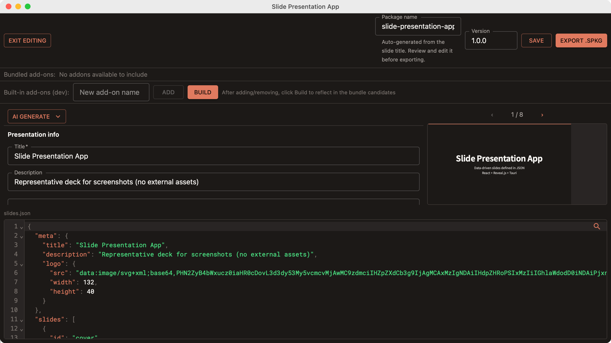

The screenshot above includes the **Built-in add-ons (dev)** panel, which only appears in development builds (never in a distributed build).

- **Form** — Edit confirmed fields (title, description, author, theme colors, custom CSS). Updates are partial, so any
  unknown or free-form fields are preserved untouched.
- **`slides.json` editor** — Edit the raw JSON directly, with line numbers, JSON syntax highlighting, and search /
  replace (`Ctrl`/`Cmd` + `F`). The form and the JSON editor share a single source of truth.
- **Live preview** — Rendered by the same renderer as the actual presentation (not a re-implementation); theme edits
  are reflected live. While the JSON has a syntax or schema error, the preview is hidden and save/export are disabled
  until the error is fixed.

### Saving and Exporting

| Action          | Description                                                                                                                        |
|-----------------|------------------------------------------------------------------------------------------------------------------------------------|
| **Save**        | Write the edited `slides.json` to a location you choose (relative asset paths are preserved)                                        |
| **Export .spkg** | Produce a `.spkg` package (name / version from the toolbar inputs); referenced assets are bundled and it round-trips with **Open a File** |

Filesystem writes happen only while edit mode is active and are performed at the Rust boundary — the web layer is never
granted write permission (least privilege).

### Addon Detachment

Package-bundled addons contain executable code, so addon control is separated into three layers:

| Layer                   | Where                                                                                   | What it controls                                                                                                                                            |
|-------------------------|-----------------------------------------------------------------------------------------|-------------------------------------------------------------------------------------------------------------------------------------------------------------|
| **Runtime trust**       | Confirmation prompt on open + **Settings → Per-package add-on trust**                    | Allow / deny loading a package's bundled addons, per package (default: denied). The global **Always disable embedded add-ons** toggle takes precedence.      |
| **Export selection**    | Edit mode **Bundled add-ons** checkboxes (and `npm run export:slides --addons a,b`)      | Choose which addons to include when exporting a `.spkg`. The choices union package add-ons with dev built-in add-ons; the list stays visible (with an empty-state note) even when none are available. |
| **Built-in add/remove** | Edit mode **Built-in add-ons (dev)** panel (development builds only)                     | Scaffold or remove `addons/src/<name>/entry.ts` (delete asks for confirmation — it is permanent and outside git), then click **Build** in the panel to rebuild from the app (runs `npm run build:addons`) so the addon appears in the bundle candidates. |

### AI Generation

The **AI Generate** panel in edit mode creates slides (`slides.json`) from a prompt. Generated slides flow into the
editor's single source of truth — and from there into preview, manual editing, saving, and exporting — only after you
confirm them in a diff dialog. Two generation methods are available:

| Method                         | Prerequisite                                                           | Billing / online dependency                                                        |
|--------------------------------|------------------------------------------------------------------------|------------------------------------------------------------------------------------|
| **Built-in (Vertex AI)**       | A GCP project (Vertex AI) with project / region / model set, plus `gcloud auth application-default login` | Requires an online connection and incurs usage-based charges on your GCP project |
| **External (Claude Code CLI)** | The local `claude` command is installed                                | Follows your Claude plan and terms (no separate API key needed)                    |

- **GCP setup** — In the built-in panel, set the GCP **project ID / region / model** and **Save**, then click **GCP login**
  (`gcloud auth application-default login`) once to create the ADC credentials. The access token is obtained from the ADC
  at the Rust boundary (refreshed and cached for 55 minutes) and is never exposed to the web layer. Networking and token
  handling are all confined to the Rust boundary (least privilege).
- **Pre-gate** — The generate button is disabled when the built-in Vertex settings are incomplete or the external `claude`
  binary is not found, with a hint to the setup path.
- **Auto-repair loop** — Each candidate is validated on import; if invalid, it is regenerated up to 3 times with the
  validation errors attached. On reaching the limit, the candidate with the fewest validation errors is applied so you
  can fix it manually.
- **Diff confirmation & formatting** — Generated slides are not applied immediately: a dialog previews the structural
  changes (added / changed / removed slides and meta changes) so you **Apply** or **Cancel** — Cancel leaves the editor
  untouched. On apply the JSON is normalized to 2-space indentation for readability.
- **Progress and cancellation** — Progress is shown during generation, and **Cancel** stops an in-flight run. On failure,
  cancellation, or offline, the editor content is preserved and you can safely fall back to manual editing.
- **Check appearance and fix** — Next to **Generate**, this button runs the same visual checks used by the
  sample/reference-deck CI (overflow, safe-area intrusion, decoration overlap, collapsed fill items, internal clipping)
  across every slide. Only if issues are found, it asks the AI to fix them through the same auto-repair loop above —
  instructing wording/structure adjustments only, never layout code changes. The result is shown in the same diff
  confirmation dialog.

Generation, GCP settings/login, and networking are enabled only while in edit mode with generation active (never reached in
view or live presentation).

## Defining Slides

Create `public/slides.json` to customize slide content.
If this file does not exist, **Open Sample** fetches the [distributed sample](#distributed-sample) (template guide) instead.

### Basic Structure

```json
{
  "meta": {
    "title": "Presentation Title",
    "description": "Description",
    "author": "Author",
    "logo": {
      "src": "/my-logo.png",
      "width": 150,
      "height": 50
    }
  },
  "slides": [
    {
      "id": "slide-1",
      "layout": "center",
      "content": {
        "title": "Title Slide",
        "subtitle": "Subtitle"
      }
    }
  ]
}
```

### Logo Configuration

Customize the presentation logo via the `meta.logo` field.

| Field    | Type   | Default        | Description                                     |
|----------|--------|----------------|--------------------------------------------------|
| `src`    | string | `/logo.png`    | Path to logo image                               |
| `width`  | number | `120`          | Logo width (px)                                  |
| `height` | number | `40`           | Logo height (px)                                 |
| `anchor` | string | `bottom-left`  | One of 9 positions (e.g. `top-right`, `center`)  |
| `offset` | object | `{x:30,y:-20}` | Pixel offset `{ x, y }` from the anchor          |
| `only`   | object | -              | Restrict which slides the logo is drawn on       |

If `meta.logo` is omitted, no logo will be displayed. If `width` and `height` are omitted, the defaults of `120` and`40`
are used respectively. By default the logo is shown in the bottom-left corner of every slide; set `anchor`/`offset` to
place it elsewhere. Note that the default `offset` is tuned for `bottom-left`, so when using another `anchor` you
should specify `offset` explicitly (otherwise it may end up off-screen).

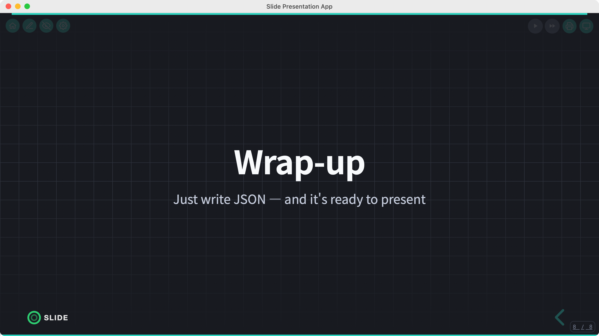

### Confidential/Watermark

Place a watermark such as "CONFIDENTIAL" or "DRAFT" across the whole deck via the `meta.confidential` field.

| Field      | Type   | Default        | Description                                          |
|------------|--------|----------------|-------------------------------------------------------|
| `text`     | string | (required)     | Watermark text                                       |
| `anchor`   | string | `top-right`    | One of 9 positions (e.g. `bottom-left`, `center`)     |
| `offset`   | object | `{x:-30,y:20}` | Pixel offset `{ x, y }` from the anchor               |
| `fontSize` | number | -              | Font size (px)                                        |
| `color`    | string | -              | Text color                                            |
| `opacity`  | number | `1`            | Opacity (0-1); use around `0.1`-`0.2` for a watermark |
| `rotate`   | number | `0`            | Rotation angle (deg, clockwise); e.g. `-30` for a diagonal watermark |
| `only`     | object | -              | Restrict which slides the watermark is drawn on       |

If `meta.confidential` is omitted, no watermark is displayed. `text` is the only required field. The default position
is the top-right corner — deliberately different from the logo's bottom-left default — so that a logo and a watermark
placed together with no explicit position don't overlap. Note that the default `offset` is tuned for `top-right`, so
when using another `anchor` (e.g. `bottom-left`) you should specify `offset` explicitly (otherwise it may end up
off-screen).

Both `meta.logo` and `meta.confidential` can be overridden per slide via `slides[].meta.logo` /
`slides[].meta.confidential`. Unspecified fields inherit the top-level setting, and `{ "hidden": true }` hides the
logo/watermark on that slide only.

### Layouts

Each slide's `layout` field determines which layout is used.

| layout       | Use case                | Main fields                                  |
|--------------|-------------------------|----------------------------------------------|
| `center`     | Cover / title / summary | `title`, `subtitle`, `variant`               |
| `content`    | Content display         | `title`, `steps[]` / `tiles[]` / `component` |
| `two-column` | Two-column layout       | `title`, `left`, `right`                     |
| `bleed`      | Full-width two-column   | `title`, `commands[]`, `component`           |
| `custom`     | Custom component        | `component`                                  |

The `center` layout switches display based on the `variant` field.

| variant     | Description                                                  |
|-------------|--------------------------------------------------------------|
| (unset)     | TitleLayout (displays title and subtitle)                    |
| `"section"` | SectionLayout (summary display, uses `body`, `qrCode`, etc.) |

The `content` layout determines rendering based on child element fields.

| Field       | Renders          |
|-------------|------------------|
| `steps`     | Timeline         |
| `tiles`     | FeatureTileGrid  |
| `component` | Custom component |

#### Layout Examples

|                                                                   |                                                                  |
| :---------------------------------------------------------------: | :--------------------------------------------------------------: |
|                  `content` — Timeline (`steps`)                   |             `content` — FeatureTileGrid (`tiles`)                |
| 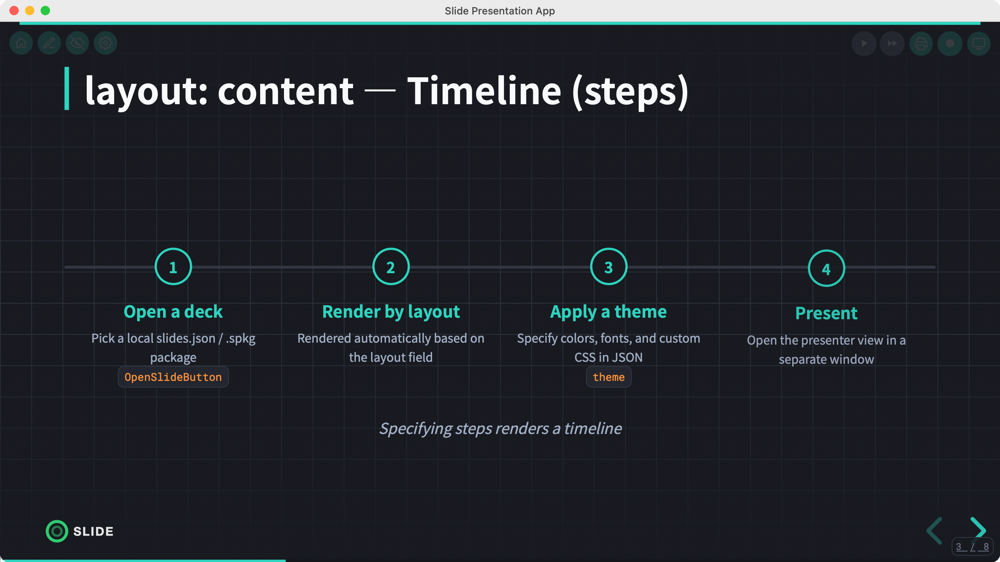 | 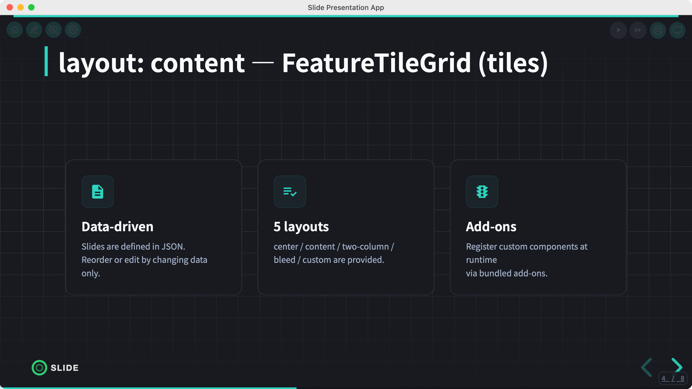 |
|                           `two-column`                            |                 `center` (`variant: "section"`)                  |
|    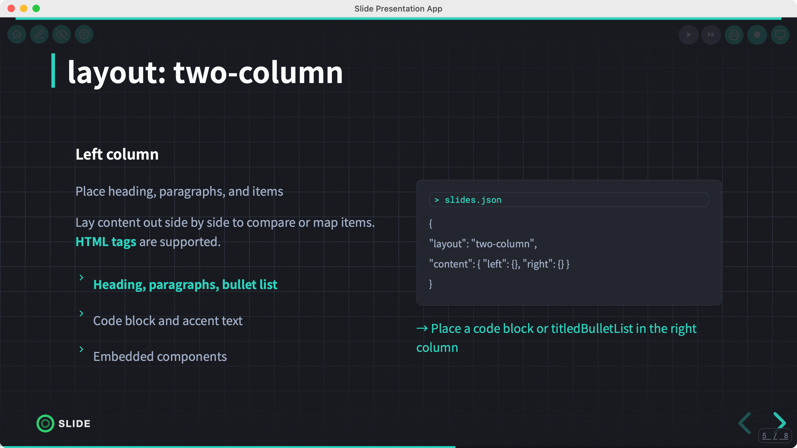     |       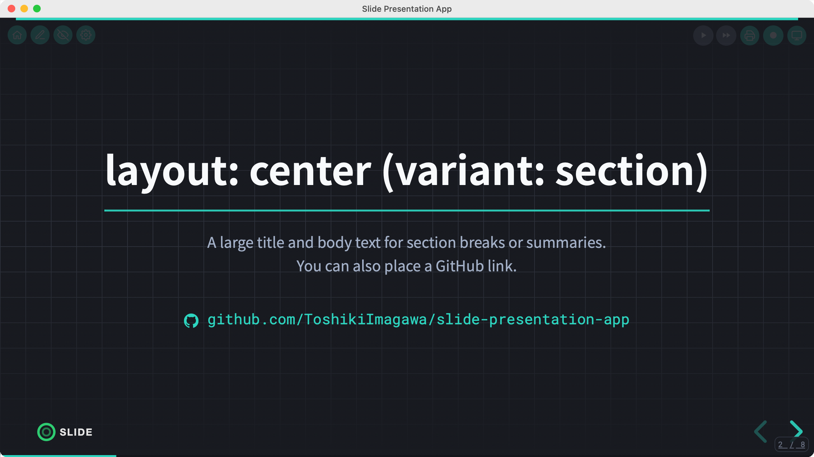|
|              `bleed` — full-width two-column                       |             `custom` — full-screen component                     |
|         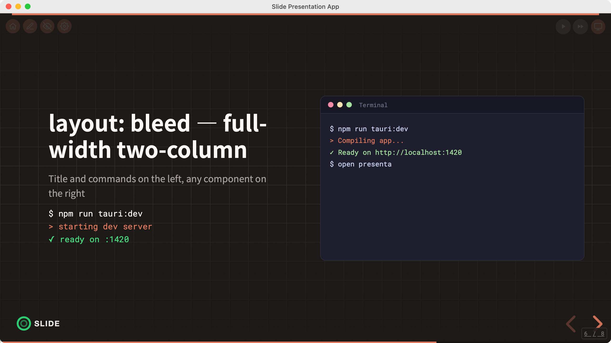          |        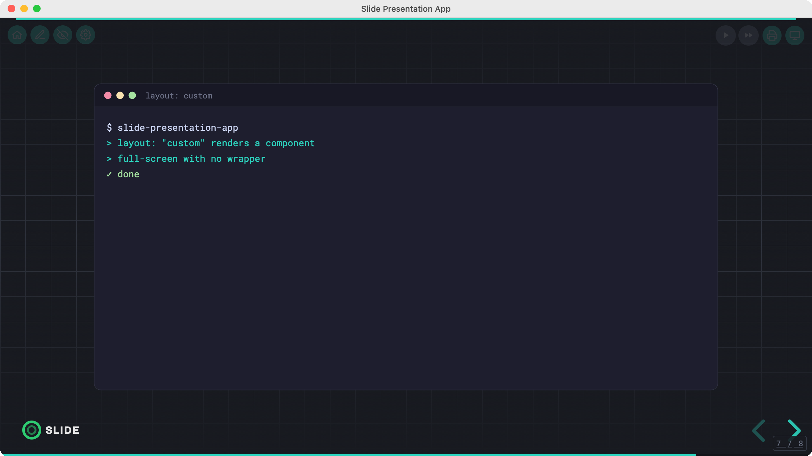        |

> The hero image at the top of this README is an example of the `center` cover/title layout.

### Two-Column Layout Details

The `left` / `right` fields accept the following:

```json
{
  "heading": "Heading",
  "headingDescription": "Supplementary text for the heading",
  "paragraphs": [
    "Paragraph text (HTML tags supported)"
  ],
  "items": [
    {
      "text": "Item name",
      "description": "Description",
      "emphasis": true
    }
  ],
  "codeBlock": {
    "header": "> Header",
    "items": [
      "Line 1",
      "Line 2"
    ]
  },
  "component": {
    "name": "ComponentName",
    "props": {}
  }
}
```

### Slide Meta

Add an optional `meta` field to each slide to control transitions and backgrounds.

```json
{
  "id": "slide-1",
  "layout": "center",
  "content": {
    "title": "Title"
  },
  "meta": {
    "transition": "fade",
    "backgroundColor": "#1a1a2e",
    "backgroundImage": "url(/background.jpg)",
    "notes": "Speaker notes (string format)"
  }
}
```

### Speaker Notes

Define speaker notes via the `meta.notes` field. Two formats are supported: string and object.

**String format (simple):**

```json
{
  "meta": {
    "notes": "Write your speaker notes here"
  }
}
```

**Object format (speaker notes + key point summary + voice):**

```json
{
  "meta": {
    "notes": {
      "speakerNotes": "Write your speaker notes and script here",
      "summary": [
        "Point 1: Key takeaway of this slide",
        "Point 2: What to convey to the audience"
      ],
      "voice": "/voice/slide-01.wav"
    }
  }
}
```

| Field          | Type     | Description                                |
|----------------|----------|--------------------------------------------|
| `speakerNotes` | string   | Speaker notes / script                     |
| `summary`      | string[] | Key point summary (bulleted list)          |
| `voice`        | string   | Path to audio file (relative to `public/`) |

Slides without `notes` will display an empty notes panel in the presenter view.

### Component References

Use registered components within slides.

```json
{
  "component": {
    "name": "TerminalAnimation",
    "props": {
      "logTextUrl": "/demo-log.txt"
    }
  }
}
```

Built-in component examples: `TerminalAnimation`, `CodeBlockPanel`, `BulletList`, `Timeline`, etc.

## Theming

Themes can be customized in two ways.

### Method 1: Define in slides.json

Add a `theme` field to `slides.json`.

```json
{
  "meta": {
    "title": "..."
  },
  "theme": {
    "colors": {
      "primary": "#6c63ff",
      "accent": "#ff6584",
      "background": "#0a0a1a",
      "text": "#e0e0e0"
    },
    "fonts": {
      "heading": "'Noto Sans JP', sans-serif",
      "body": "'Noto Sans JP', sans-serif",
      "code": "'Fira Code', monospace",
      "baseFontSize": 24,
      "sources": [
        {
          "family": "MyFont",
          "src": "/fonts/MyFont.woff2"
        },
        {
          "family": "Fira Code",
          "url": "https://fonts.googleapis.com/css2?family=Fira+Code:wght@400;700&display=swap"
        }
      ]
    },
    "customCSS": ".reveal h1 { text-shadow: none; }"
  },
  "slides": []
}
```

`theme.colors` accepts the same 12 keys as `theme-colors.json` below (`background`, `backgroundAlt`, `backgroundGrid`,
`textHeading`, `textBody`, `textSubtitle`, `textMuted`, `border`, `borderLight`, `codeText`, `success`) plus `primary`
and `accent`. `primary` and `accent` are applied independently (`--theme-primary` / `--theme-accent`), so both colors
can be used in the same slide.

#### Font Configuration Details

The following fields can be specified in `theme.fonts`.

| Field             | Type                       | Default                               | Description                                                              |
|-------------------|----------------------------|----------------------------------------|---------------------------------------------------------------------------|
| `heading`         | string \| FontFamilySpec   | `'Noto Sans JP', 'Inter', sans-serif` | Heading font                                                              |
| `body`            | string \| FontFamilySpec   | `'Noto Sans JP', 'Inter', sans-serif` | Body font                                                                 |
| `code`            | string \| FontFamilySpec   | `'Roboto Mono', monospace`            | Code block font                                                          |
| `baseFontSize`    | number                     | `20`                                  | Base font size (px). All font sizes are automatically scaled by ratio    |
| `fontSizeRatios`  | Record<string, number>     | see table below                       | Overrides the type scale ratio table. Keys can be overridden or added   |
| `sources`         | FontSource[]                | —                                     | Array of font sources                                                    |

Changing `baseFontSize` causes every step in `fontSizeRatios` (7 steps, H1 through Body2, by default) to be
automatically calculated based on the ratio from the base value.

`heading`/`body`/`code` accept either a plain string (single font name) or an object (`FontFamilySpec`) for
mixing Latin and Japanese typefaces and specifying a weight.

| Field     | Type   | Description                                                                                  |
|-----------|--------|------------------------------------------------------------------------------------------------|
| `latin`   | string | Font name for Latin characters                                                                 |
| `ea`      | string | Font name for East Asian characters. Used for characters not covered by `latin` (kanji, kana, etc.) |
| `weight`  | string | font-weight (e.g. `'400'`, `'700'`, `'normal'`, `'bold'`). Defaults to 700 for heading, 400 for body |

```json
{
  "fonts": {
    "heading": { "latin": "Poppins", "ea": "Noto Sans JP", "weight": "700" },
    "body": { "latin": "Inter", "ea": "Noto Sans JP" }
  }
}
```

`fontSizeRatios` overrides or adds ratios for the type scale (relative to `body1` = 1.0). Adding a key that isn't
in the defaults adds a new step to the type scale (e.g. a small step for captions or footnotes).

```json
{
  "fonts": {
    "fontSizeRatios": { "h1": 4.0, "caption": 0.6 }
  }
}
```

Load local or external fonts using `sources`.

```json
{
  "sources": [
    {
      "family": "MyFont",
      "src": "/fonts/MyFont.woff2"
    },
    {
      "family": "Fira Code",
      "url": "https://fonts.googleapis.com/css2?family=Fira+Code:wght@400;700&display=swap"
    }
  ]
}
```

| Field       | Type   | Description                                                          |
|-------------|--------|------------------------------------------------------------------------|
| `family`    | string | Font name                                                              |
| `src`       | string | Path to local font file (registered via `@font-face`)                  |
| `url`       | string | External font URL (loaded via `<link>` tag, supports Google Fonts)     |
| `weight`    | string | `font-weight` (e.g. `'400'`, `'700'`, `'bold'`). Defaults to `'normal'` |
| `style`     | string | `font-style` (e.g. `'normal'`, `'italic'`). Defaults to `'normal'`     |
| `format`    | string | Font format hint for `src` (e.g. `'woff2'`)                            |
| `localName` | string | Locally installed font name (referenced via `local()`)                 |

### Method 2: Override colors only with theme-colors.json

Create `public/theme-colors.json` to override only color settings.
You can also specify a custom path via the `meta.themeColors` field instead of the default `/theme-colors.json`.

```json
{
  "meta": {
    "title": "Presentation Title",
    "themeColors": "/theme/custom-colors.json"
  }
}
```

```json
{
  "primary": "#6c63ff",
  "background": "#0a0a1a",
  "backgroundAlt": "#12122a",
  "backgroundGrid": "#1a1a3e",
  "textHeading": "#ffffff",
  "textBody": "#c8c8d0",
  "textSubtitle": "#a0a0b0",
  "textMuted": "#808090",
  "border": "#2a2a4a",
  "borderLight": "#1e1e3a",
  "codeText": "#e0e0e0",
  "success": "#4caf50"
}
```

## Internationalization (i18n)

Switch the UI display language. The initial language is auto-detected from browser settings and can be manually changed
from the settings window. The selected language is saved to `localStorage` and persists across sessions.

### Supported Languages

| Language Code | Language |
|---------------|----------|
| `en-US`       | English  |
| `ja-JP`       | Japanese |
| `fr-FR`       | French   |

### Settings Window

Click the gear icon (settings button) in the upper left corner to open the settings window and select a language. It is
available on the home screen, during a presentation, and in edit mode, so you can switch languages right after the
first launch without opening a deck. The same language setting is applied to the presenter view.

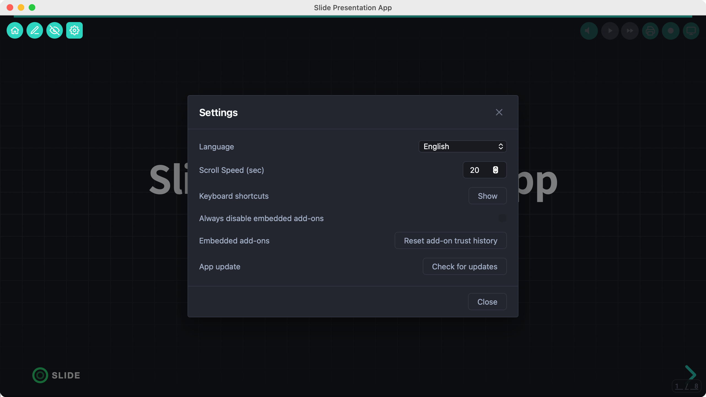

Besides the language, the settings window lets you set the auto-slideshow **Scroll Speed (sec)**, **Show** the keyboard
shortcut list, and control embedded add-ons (**Always disable embedded add-ons** and **Reset add-on trust history**).
**Scroll Speed (sec)** only applies while presenting, so it is hidden when you open the settings from the home screen.

### Language Resource Structure

Language resources are located in the `assets/locales/` directory.

```
assets/locales/
├── manifest.json    # List of files to load
├── en-US.json       # English resource
├── ja-JP.json       # Japanese resource
└── fr-FR.json       # French resource
```

`manifest.json` specifies which language files to load.

```json
{
  "locales": [
    "en-US.json",
    "ja-JP.json",
    "fr-FR.json"
  ]
}
```

Each language resource has the following structure.

```json
{
  "languageCode": "en-US",
  "languageName": "English",
  "ui": {
    "settings": {
      "title": "Settings",
      "language": "Language",
      "close": "Close",
      "open": "Settings"
    },
    "presenterView": {
      "open": "Presenter View",
      "navPrev": "Previous slide (←)",
      "navNext": "Next slide (→ / Space)",
      "notesTitle": "Speaker Notes",
      "nextSlide": "Next Slide",
      "previousSlide": "Previous Slide"
    },
    "audio": {
      "play": "Play audio",
      "stop": "Stop audio"
    }
  }
}
```

Keys within `ui` support up to two levels of nesting (`section.key`).

## Presenter View

Click the "Presenter View" button in the upper right of the presentation screen to open the presenter view in a separate
window. UI labels in the presenter view follow the language setting described in the Internationalization section.

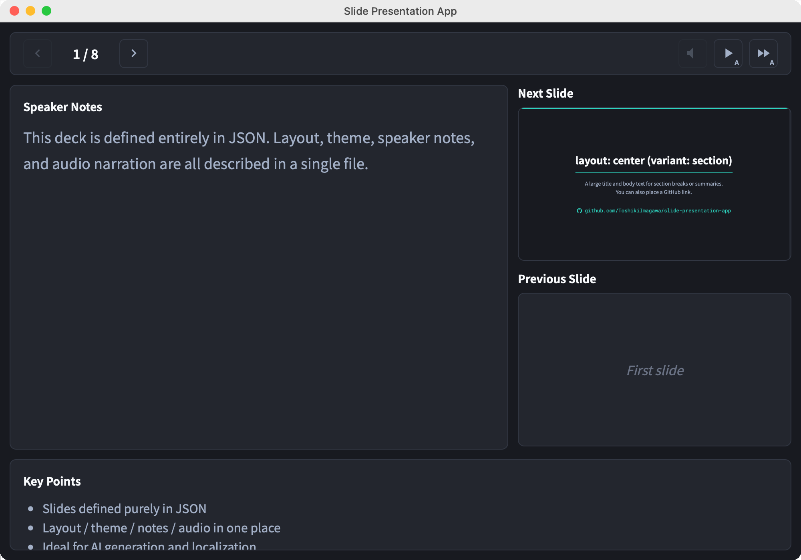

### Panel Layout

The presenter view consists of the following areas.

**Control Bar (top):**

| Position | Controls                          | Description                                           |
|----------|-----------------------------------|-------------------------------------------------------|
| Left     | Previous / Progress / Next        | Slide navigation and current position (e.g. `3 / 10`) |
| Right    | Play / Auto-play / Auto-slideshow | Audio controls (see the Audio Playback section)       |

**Main Area (center):**

| Panel          | Content                                                    |
|----------------|------------------------------------------------------------|
| Speaker Notes  | Current slide's `speakerNotes` (presenter notes)           |
| Next Slide     | Thumbnail preview of the next slide                        |
| Previous Slide | Thumbnail preview of the previous slide                    |
| Key Summary    | Current slide's `summary` (bulleted list, shown at bottom) |

On the first slide, the previous slide preview shows a boundary message (e.g. "This is the first slide"). On the last
slide, the next slide preview shows a boundary message (e.g. "This is the last slide"). These messages are translated
according to the language setting.

### Bidirectional Sync

The main window and presenter view are bidirectionally synced via Tauri events (`@tauri-apps/api/event`, event name
`presenter-view`). The presenter view runs as a separate native Tauri window.

- Navigating slides in the main window updates the presenter view in real time
- Navigating slides or controlling audio from the presenter view is reflected in the main window

The presenter view has its own navigation keys. Press `?` to see them — see [Keyboard Shortcuts](#keyboard-shortcuts).

## Audio Playback

Specify an audio file path in the `meta.notes.voice` field to enable per-slide audio playback. Place audio files under
`public/` (e.g. `public/voice/slide-01.wav`).

### Toolbar

On slides with a `voice` defined, the following buttons appear in the upper-right toolbar.

| Button              | Icon    | Function                                                    |
|---------------------|---------|--------------------------------------------------------------|
| Play/Pause/Resume    | Speaker | Manually play, pause, and resume the current slide's audio  |
| Auto-play            | ▶       | Toggle auto-play audio on slide transition ON/OFF            |
| Auto-slideshow        | ▶▶      | Toggle auto-advance to next slide on audio end ON/OFF        |

The toolbar is displayed at reduced opacity by default and fully visible on hover. The same controls are available from
the presenter view's control bar.

To get the toolbar out of the way entirely, use the **Hide toolbar** button in the top-left toolbar or press `T`. While
hidden, the button itself is not clickable either, so press `T` again to bring the toolbar back.

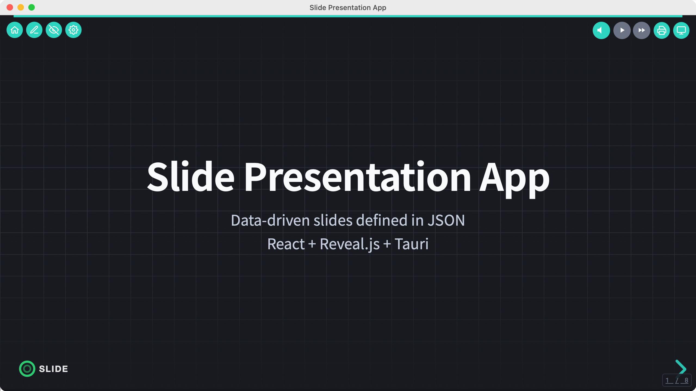

### Manual Playback

Click the speaker icon to play the current slide's audio. Click again to pause it, and click once more to resume. The
icon is not shown on slides without a `voice` defined.

### Auto-Play

When the auto-play button (▶) is ON, audio is automatically played on each slide that has a `voice` defined whenever you
navigate to it.

### Auto-Slideshow

When the auto-slideshow button (▶▶) is ON, the presentation automatically advances to the next slide when audio playback
ends. It does not auto-advance on the last slide. Combined with auto-play, this enables a fully automated presentation
through all slides.

## Export to PDF

Click the **Save as PDF** button in the top-right toolbar to export the current deck as a PDF, one page per slide.
Pick a destination in the native save dialog; while the export is running, the button shows a busy state and is
disabled.

## Recording

Click the record button in the top-right toolbar (next to **Save as PDF**) to record the screen/window you choose to
share together with the current slide's speaker-note voice playback, and save the result as a video file.

- Clicking it opens the OS screen/window sharing picker; recording starts once a selection is made. Canceling the
  picker leaves the button in its original state.
- While recording, the button's appearance changes to indicate that recording is in progress. It works alongside
  auto-play and auto-slideshow, so an unattended, fully automated presentation can be recorded end to end.
- Click the button again to stop; a native save dialog lets you choose where to write the video file (`.mp4`,
  falling back to `.webm` on WebViews that don't support MP4 recording).
- If screen sharing is lost or an error occurs mid-recording, the app safely stops recording and offers to save
  whatever was captured, without interrupting the presentation itself.

> **macOS note:** screen recording requires the **Screen Recording** permission under **System Settings → Privacy &
> Security**. The app's `Info.plist` declares camera/microphone usage descriptions solely to satisfy WKWebView's
> requirement for exposing `navigator.mediaDevices` (including `getDisplayMedia`) — the app itself never accesses
> the camera or microphone.

## Keyboard Shortcuts

Press `?` on any screen to show the full list inside the app — the same list opens from
**Settings → Keyboard shortcuts → Show**. It covers the presentation viewer, edit mode, and the presenter view.

The list lives in the app rather than in this README so that it always matches the actual key bindings.

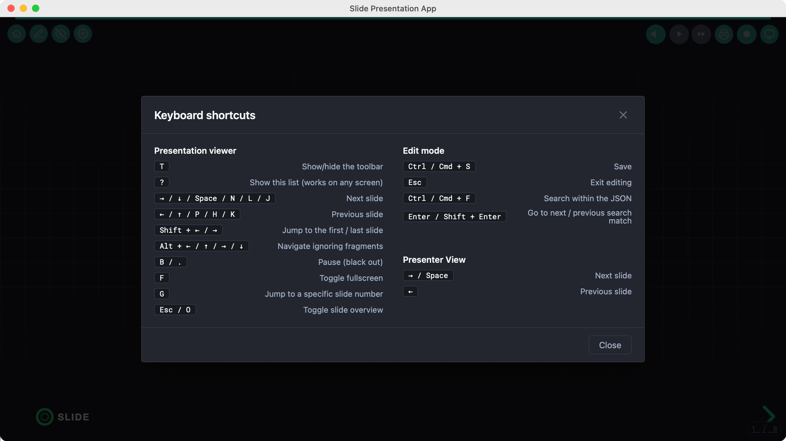

## Slide Packages

Slide content (slides.json plus images, audio, themes, fonts, and so on) can be bundled into a single `.spkg` package
for distribution.

There are two ways to produce one: use **Export .spkg** in [edit mode](#edit-mode) to stay entirely within the app, or
see [CONTRIBUTING.md](CONTRIBUTING.md) to automate it from the CLI.

A distributed `.spkg` can be opened by the recipient with a plain double-click from their OS file manager — see
[Opening a `.spkg` from the OS](#opening-a-spkg-from-the-os). The recipient needs no build environment, and no
instructions beyond "double-click this file."

### Embedded Add-ons (Runtime Loading)

When a `.spkg` (or legacy `.tgz`) is opened in the desktop app, any add-ons bundled under its `addons/` directory are loaded at runtime and
their components become resolvable from `{ "component": { "name": ... } }`. Add-ons are scoped per package (owner), so
switching between packages unloads the previous package's add-ons and prevents name collisions.

> ⚠️ **Security: only open packages from publishers you trust.**
> Embedded add-ons are JavaScript that runs with the **same privileges as the app** (no sandbox). A malicious package
> could reach any capability the app exposes. Therefore:
>
> - The first time you open a package that contains add-ons, a confirmation dialog appears. **Add-ons are disabled by
    > default** — they are only loaded if you explicitly enable them. Your choice (allow / deny) is remembered per
    package.
> - If you deny, the slides still open normally; unresolved components fall back to a placeholder.
> - You can turn off embedded add-ons entirely from **Settings → “Always disable embedded add-ons”**, and reset all
    > remembered allow/deny decisions with **“Reset add-on trust history.”**
>
> Only add-ons declared in the package's `addons/manifest.json` and located under `addons/` are ever loaded. <!-- doc-check-ignore -->

## Development

For building from source, implementing custom components (add-ons), and exporting slide packages from the CLI, see
[CONTRIBUTING.md](CONTRIBUTING.md).

## License

MIT
